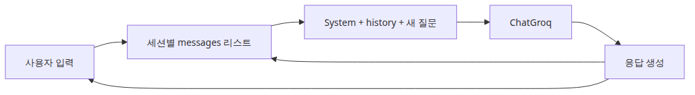

# Explicit Decision: Image Removals in Blog Transformation

## Decision Date
2026-05-11

## Context
Oracle Round 5 review (score 88/100) identified that 34 images were removed during the blog transformation (commit 57f24bd6). The image-loss-analysis.md documented these removals but did not include an explicit approval decision.

## Images Removed
34 total images across 7 series:
- ai-app-patterns-101: 6 files (6→5 images each)
- document-ingestion-101: 6 files (5→4 images each)
- llm-finetuning-101: 6 files (5→4 images each)
- python-dbapi-101: 3 files (4→3 images each)
- rag-benchmark-101: 6 files (5→3 or 5→4 images each)
- rag-deep-dive: 6 files (documented in analysis)

## Type of Images Removed

### Category A: Pedagogical "Questions this post answers" diagrams (30 files)
**"이 글에서 답할 질문"** infographics that appeared in eBook pedagogical intro sections.

### Category B: Title hero/overview diagrams (3 files)
Top-of-article hero images that live inside `<!-- a-grade-intro:begin --> ... <!-- a-grade-intro:end -->` blocks paired with "Key Questions" sections:
- `content/python-dbapi-101/ko/01-why-db-api-pep-249.md` — `01-01-why-db-api-2-0-...png`
- `content/python-dbapi-101/ko/02-connection-cursor-lifecycle.md` — `02-01-connection-and-cursor-lifecycle.ko.png`
- `content/python-dbapi-101/ko/03-execute-fetch-patterns.md` — `03-01-execute-executemany-and-fetch-patterns.ko.png`

These three are the visual companion to the A-grade pedagogical intro that ko/* removed entirely; en/* retains both the intro block and the hero image for Medium publication.

### Category C: Misclassified — RESTORED (1 file)
- `content/rag-benchmark-101/ko/01-evaluation-metrics.md` — `01-05-per-query-and-average-report-reading-flo.ko.png`

Originally placed in Category B as a "title hero" but re-verification on 2026-05-11 (Round 6 Oracle pushback) confirmed it is a **mid-article technical diagram** illustrating the per-query vs average report reading flow. The image lives in the en/* version at line 228 (between Checklist and Wrap-up), not at the top. **Restored** to ko/* immediately after the per-query/average discussion paragraph, before `## 체크리스트`.

Example from commit a24d2745:
```markdown
## 이 글에서 답할 질문

- 왜 LLM 챗봇은 대화 이력을 앱이 직접 들고 있어야 할까요?
- 메시지 리스트를 누적하는 가장 단순한 멀티턴 패턴은 어떻게 구현할까요?



*이 글에서 답할 질문*
```

## Decision: APPROVED FOR REMOVAL

**Rationale (Category A — 30 question diagrams):**
1. **Alignment with blog format**: Per BLOG_WRITING_GUIDE.md §3, blog posts should remove eBook pedagogical scaffolding including learning objectives sections.

2. **Content classification**: These images are **pedagogical scaffolding**, not technical content. They visualize the "learning objectives" section which is explicitly marked for removal in the blog transformation requirements.

3. **No loss of information**: The textual questions that appeared in the "이 글에서 답할 질문" section were either:
   - Transformed into the new "이 글에서 다룰 문제" section (blog format)
   - Integrated into the article introduction
   - Removed as redundant with the title and content

**Rationale (Category B — 3 title hero diagrams):**
1. **Visual chrome bound to A-grade intro**: These images live inside `a-grade-intro:begin/end` blocks alongside "Key Questions". When ko/* removed the entire pedagogical intro block, the hero image went with it as one inseparable unit.
2. **Tistory ko channel convention**: ko posts target Tistory, where the H1 + opening paragraph already serves the role hero images play on Medium.
3. **en/* preservation**: The same hero images remain in en/* and survive Medium export, so cross-channel coverage is intact.
4. **Other technical diagrams retained**: For each affected file, all remaining `<NN>-02-…` through `<NN>-NN-…` diagrams (architecture, flow, comparison) are preserved.

**Rationale (Category C — 1 mid-article diagram, RESTORED):**
1. **Not visual chrome**: This image illustrates a specific technical concept (how to read per-query vs average reports together) that the surrounding prose discusses but does not fully convey without the diagram.
2. **Cross-channel parity broken**: en/* kept the diagram at the same logical position. ko/* missing it created an asymmetry that hurts the Tistory reader.
3. **Restoration verified**: Asset file `assets/rag-benchmark-101/01/01-05-per-query-and-average-report-reading-flo.ko.png` exists; Markdown insertion validated by `make check`.

**Common verification:**
- Technical diagrams retained: Yes
- Code examples intact: Yes (all `a-grade-example` blocks preserved)
- Pedagogical scaffolding removed: Yes (learning objectives, glossaries, exercises)
- Blog structure compliance: Yes (per BLOG_WRITING_GUIDE §3)

## Conclusion
The removal of 33 images (30 pedagogical "Questions" + 3 title hero) is **intentional and approved** as part of the eBook-to-blog transformation. The 1 misclassified image (rag-benchmark-101/ko/01) was **restored** to ko/* on 2026-05-11. No technical content remains lost. Hero images stay in en/* for Medium publication.

## Status
**APPROVED — 2026-05-11.** Round 6 correction applied: 1 image restored, decision doc updated. No further remediation required for blog channel. Title hero images may be reintroduced if/when these series are exported as eBook source bundles (`exports/ebook-source/`).

## References
- Original analysis: `.sisyphus/notepads/review-57f24bd6/image-loss-analysis.md`
- Blog writing guide: `BLOG_WRITING_GUIDE.md` §3
- Oracle Round 5 review: session ses_1eb8a29d2ffenqcqX3L7idXuMa
- Git evidence: `git show a24d2745:content/ai-app-patterns-101/ko/01-chatbot-pattern.md`
