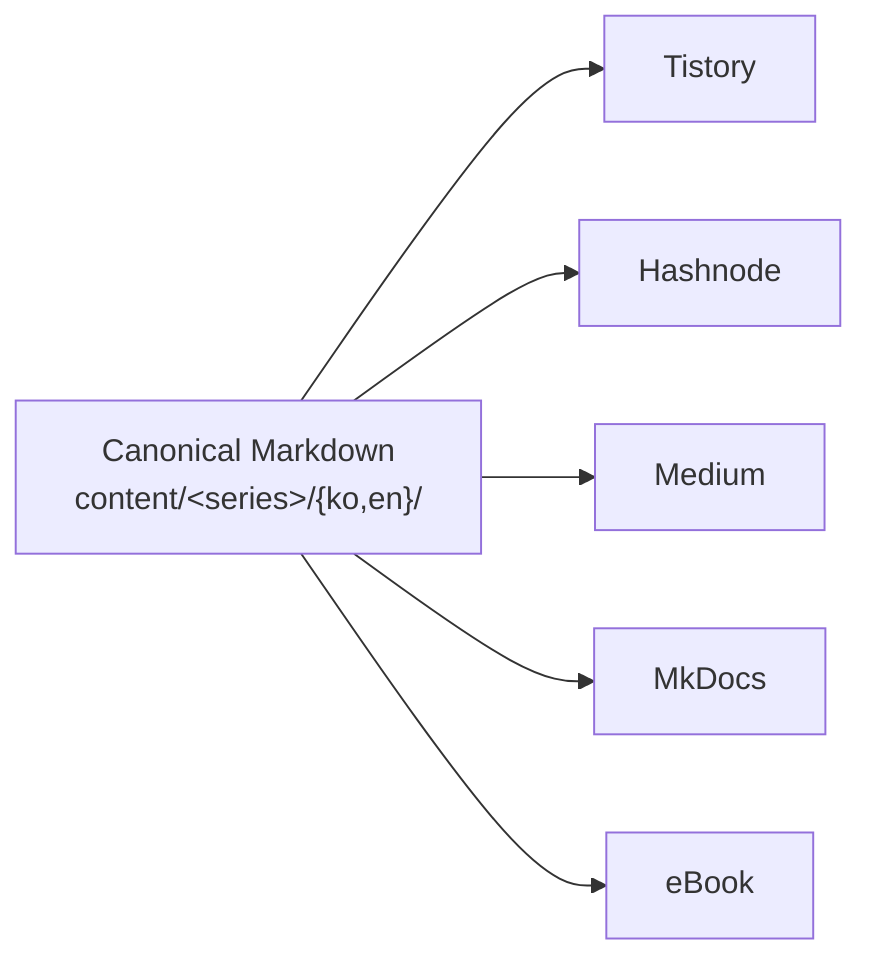
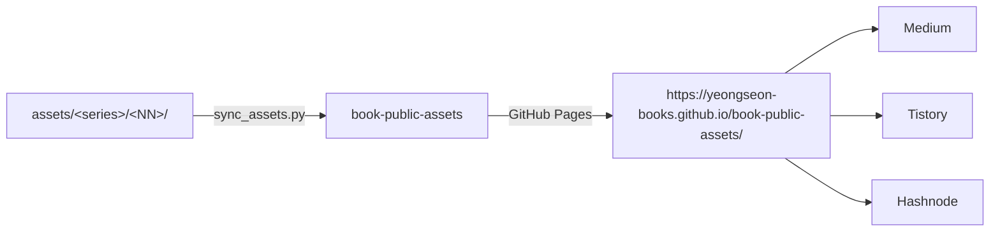

# Architecture

## Repository Role

`book-content`는 영선북스의 기술서, 웹북, 블로그 시리즈 원고를 관리하는 private canonical content repository이다.

발행 모델은 blog-first / book-later — 블로그 글을 먼저 쓰고, 쌓인 시리즈를 eBook으로 묶는다.

## Source of Truth

Canonical source는 `content/<series>/{ko,en}/`에 둔다.

- `ko/`: 한국어 원본
- `en/`: 영어 원본 또는 번역본
- `medium/`: Medium 발행용 생성 산출물 (`.sisyphus/medium/to-medium.py` 생성)

`medium/`은 직접 수정하지 않는다. 이미지는 canonical source의 public GitHub Pages URL을 그대로 통과시킨다(기본). `--asset-mode inline`은 base64 data URI로 내장하고, `--asset-mode local`은 상대 경로로 강제 변환한다.

## Repository Split

| Repository | Visibility | Purpose |
| --- | --- | --- |
| `yeongseon-books/book-content` | private | Canonical source, scripts, exports |
| `yeongseon-books/book-public-assets` | **public** | GitHub Pages로 호스팅하는 이미지 CDN |

Canonical source는 `book-public-assets`의 public URL(`{asset_base_url}/assets/...`)을 직접 참조한다. Tistory/Hashnode/Medium/MkDocs는 동일한 URL을 그대로 통과시키며, eBook exporter만 bundle을 self-contained로 만들기 위해 로컬 `assets/...` 경로로 역재작성한다. 상세는 [`ASSET_POLICY.md`](./ASSET_POLICY.md) 참조.

## Publication Pipelines

| Pipeline | Source | Output | Tool |
| --- | --- | --- | --- |
| Tistory | `ko/*.md` | `exports/tistory/` | `scripts/export_tistory.py` |
| Hashnode | `en/*.md` | Hashnode 직접 발행 | — |
| Medium | `en/*.md` | `content/<series>/medium/*.html` | `.sisyphus/medium/to-medium.py` |
| MkDocs | `{ko,en}/*.md` | `docs/` | `scripts/build_docs.py` + `mkdocs build` |
| eBook | `{ko,en}/*.md` | `exports/ebook-source/` | `scripts/export_ebook_source.py` |

## Output Directories

| Directory | Role |
| --- | --- |
| `docs/` | MkDocs 웹북 산출물 |
| `exports/tistory/` | Tistory 붙여넣기용 Markdown |
| `exports/medium/` | Medium 발행용 HTML 사본 (`export_medium.py` 복사) |
| `exports/ebook-source/` | private `mkdocs-ebook` 입력용 source bundle |
| `content/<series>/medium/` | Medium 브라우저 붙여넣기용 HTML (`to-medium.py` 생성) |

## Build Flow

1. 글은 `content/<series>/{ko,en}/`에 작성한다.
2. `make check`로 구조와 품질을 검증한다.
3. `scripts/build_docs.py`로 MkDocs용 `docs/`를 생성한다.
4. `scripts/export_tistory.py`로 Tistory용 Markdown을 생성한다.
5. `scripts/export_ebook_source.py`로 eBook source bundle을 생성한다.
6. Medium용 HTML은 `.sisyphus/medium/to-medium.py`로 생성한다.

## Script Ownership

| Location | Responsibility |
| --- | --- |
| `scripts/` | 검증(`check_*`, `lint_*`), 빌드(`build_*`), 내보내기(`export_*`), 동기화(`sync_*`, `gen_*`) |
| `.sisyphus/medium/` | Medium 전용 변환 (`to-medium.py`, `finalize-posts.py`, `mermaid-to-png.py`) |
| `.sisyphus/style/` | 한국어 문체 검사 (`check-ko.sh`) |
| `.sisyphus/skills/` | Agent skill 정의 |

장기적으로 `.sisyphus/medium/`의 publishing 로직은 `scripts/`로 통합할 계획이다.

## Asset Policy

- Generated PNG assets는 `assets/<series>/<episode>/`에 저장한다.
- 바이너리 자산은 불필요하게 반복 재생성하지 않는다.
- 저장소 크기가 합의된 임계치를 초과하면 Git LFS 또는 외부 호스팅으로 이전한다.
- Medium 발행은 private raw GitHub 이미지 URL에 의존하지 않는다.
- 외부 발행(블로그, Medium)의 이미지는 `book-public-assets` 를 경유한 public URL을 사용한다.
- 상세 정책은 [`ASSET_POLICY.md`](./ASSET_POLICY.md) 참조.

## Asset Flow

