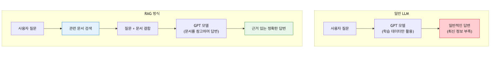
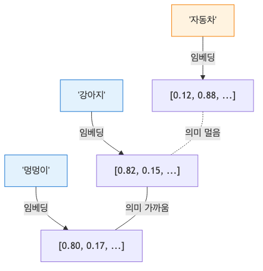
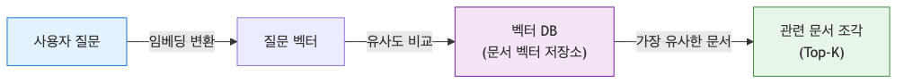
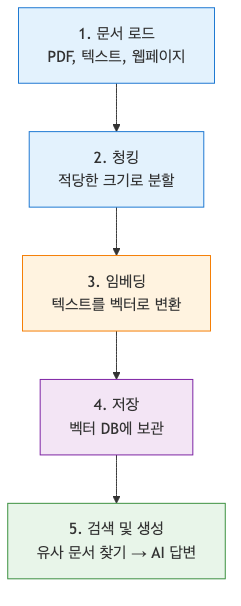
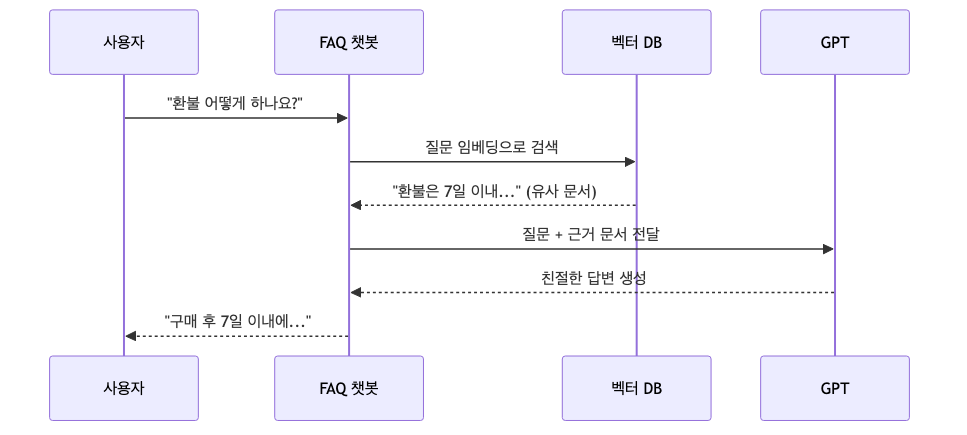

# RAG 입문 — 내 데이터로 답하는 AI 만들기

> AI 웹 개발 입문 시리즈 (4/7)

ChatGPT에게 우리 회사 매뉴얼이나 어제 나온 뉴스를 물어보면 "잘 모르겠습니다"라고 답합니다. 당연합니다. 그 정보들은 모델이 학습할 때 세상에 없었거나, 학습 데이터에 포함되지 않았기 때문입니다.

그런데 '학습'을 다시 시키지 않고도 AI에게 새로운 정보를 알려줄 방법이 있다면 어떨까요? "자, 여기 참고서가 있으니 이걸 읽고 내 질문에 답해줘"라고 부탁하는 방식입니다. 이것이 바로 **RAG(Retrieval-Augmented Generation, 검색 증강 생성)**의 핵심입니다.

---

## RAG가 뭔가요? (도서관 사서 비유)

RAG라는 용어는 거창해 보이지만, 사실 우리가 시험 공부를 하거나 업무를 처리하는 방식과 비슷합니다. 

여러분이 아주 똑똑한 대학생이라고 해봅시다. 머릿속에 지식은 많지만, 특정 회사의 내부 보안 규정까지 다 외울 수는 없습니다. 이때 누군가 규정에 대해 묻는다면 어떻게 할까요?

1. **검색 (Retrieval)**: 서재에서 관련 규정집을 찾아옵니다.
2. **증강 (Augmented)**: 질문과 함께 찾아낸 규정 내용을 펼쳐놓습니다.
3. **생성 (Generation)**: 규정집 내용을 바탕으로 답변을 정리해서 말해줍니다.

이 과정을 AI에게 시키는 것이 RAG입니다. AI 모델은 이미 말을 잘하는 법을 알고 있습니다. 우리는 단지 질문에 맞는 '참고서'만 제때 건네주면 됩니다.



---

## 왜 파인튜닝이 아니라 RAG인가요?

"AI에게 데이터를 가르치려면 재학습(Fine-tuning)을 해야 하는 것 아닌가요?"라는 질문을 자주 받습니다. 하지만 대부분의 비즈니스 사례에서는 RAG가 훨씬 유리합니다.

| 비교 항목 | 파인튜닝 (Fine-tuning) | RAG (검색 증강 생성) |
| :--- | :--- | :--- |
| **비용** | 매우 높음 (GPU 서버, 데이터 가공) | 낮음 (API 비용, 간단한 DB 운영) |
| **최신성** | 업데이트할 때마다 새로 학습해야 함 | 데이터만 바꾸면 즉시 반영됨 |
| **정확도** | 환각(Hallucination) 위험이 큼 | 근거 문서를 보고 답하므로 훨씬 정확함 |
| **난이도** | 전문 AI 엔지니어 필요 | 일반 웹 개발자도 충분히 가능 |

공무원 시험을 위해 전공 서적을 통째로 외우는 게 파인튜닝이라면, 오픈북 테스트를 보는 게 RAG입니다. 당연히 후자가 빠르고 정확하겠죠?

---

## 임베딩(Embedding)이란?

컴퓨터는 텍스트를 이해하지 못합니다. 숫자만 다룰 수 있죠. 그래서 우리는 텍스트를 숫자의 나열(벡터)로 바꿔줘야 합니다. 

단순히 글자 수로 바꾸는 게 아닙니다. **'의미'를 숫자로 변환**하는 겁니다. 예를 들어 '강아지'와 '멍멍이'는 글자는 다르지만 의미는 비슷합니다. 임베딩을 거치면 두 단어는 숫자로 표현했을 때 서로 아주 가까운 위치에 있게 됩니다.

"오늘 날씨 어때?"와 "밖이 많이 덥니?"라는 문장도 임베딩 공간에서는 이웃 사촌처럼 붙어 있게 됩니다. 이 수치화된 의미를 비교해서 우리는 질문과 가장 유사한 문서를 찾아낼 수 있습니다.



---

## 벡터 데이터베이스(Vector DB)

일반적인 DB는 '이름'이나 'ID'로 검색합니다. 하지만 RAG에서는 '의미'로 검색해야 합니다. 

"연말 정산 방법 알려줘"라고 물었을 때, 문서 제목에 그 단어가 없더라도 '세금 환급', '13월의 월급' 같은 관련 내용을 찾아내야 하니까요. 벡터 DB는 텍스트를 임베딩(숫자 벡터)으로 변환해서 저장하고, 질문이 들어오면 수학적으로 가장 '가까운' 위치에 있는 데이터들을 순식간에 찾아줍니다.



---

## RAG 파이프라인 5단계

RAG 시스템은 보통 다음 다섯 단계를 거쳐 구축됩니다.

1. **문서 로드 (Load)**: PDF, 텍스트 파일, 웹페이지 등에서 데이터를 가져옵니다.
2. **청킹 (Chunking)**: 너무 긴 문서는 AI가 한 번에 읽기 힘드므로, 적당한 크기(예: 500자)로 자릅니다.
3. **임베딩 (Embedding)**: 자른 텍스트들을 숫자로 변환합니다.
4. **저장 (Store)**: 변환된 숫자들을 벡터 DB에 저장합니다.
5. **검색 및 생성 (Query & Generate)**: 질문과 비슷한 문서를 찾아 프롬프트에 넣고 AI에게 답변을 요청합니다.



---

## 실습: 5분 만에 만드는 FAQ 챗봇

LangChain 같은 도구 없이, Python과 OpenAI API만으로 간단한 RAG를 직접 구현해봅시다. 원리를 이해하는 데 이보다 좋은 방법은 없습니다.

### 1. 환경 준비
```bash
pip install openai numpy
```

### 2. 코드 작성 (`simple_rag.py`)

```python
import os
import numpy as np
from openai import OpenAI

client = OpenAI(api_key="YOUR_API_KEY")

# 1. 문서 준비 (FAQ 데이터)
faq_data = [
    "저희 서비스의 영업시간은 평일 오전 9시부터 오후 6시까지입니다.",
    "환불은 구매 후 7일 이내에 고객센터를 통해 신청 가능합니다.",
    "프리미엄 요금제는 월 19,900원이며, 광고 제거와 무제한 저장 공간을 제공합니다.",
    "비밀번호를 잊으셨나요? 로그인 화면의 '비밀번호 찾기' 링크를 클릭하세요.",
    "신규 가입 시 3,000원 할인 쿠폰이 즉시 발급됩니다."
]

def get_embedding(text):
    """텍스트를 벡터로 변환하는 함수"""
    response = client.embeddings.create(
        input=text,
        model="text-embedding-3-small"
    )
    return response.data[0].embedding

# 2. 임베딩 생성 및 저장 (여기서는 메모리에 간단히 저장)
print("문서 임베딩을 생성 중입니다...")
embeddings = [get_embedding(doc) for doc in faq_data]

def search(query, top_k=1):
    """질문과 가장 유사한 문서를 찾는 함수"""
    query_vec = get_embedding(query)
    
    # 코사인 유사도 계산 (두 벡터 사이의 각도 계산)
    similarities = [np.dot(query_vec, doc_vec) for doc_vec in embeddings]
    
    # 가장 유사한 문서의 인덱스 찾기
    best_idx = np.argmax(similarities)
    return faq_data[best_idx]

# 3. 질문 및 답변 생성
user_query = "돈을 돌려받고 싶은데 어떻게 하나요?"
context = search(user_query)

print(f"\n질문: {user_query}")
print(f"찾은 근거: {context}")

prompt = f"""
당신은 친절한 고객지원 상담원입니다. 
제공된 [근거] 문장을 바탕으로 사용자의 [질문]에 답변하세요.
반드시 [근거]에 있는 내용만 사용하세요.

[근거]: {context}
[질문]: {user_query}
"""

response = client.chat.completions.create(
    model="gpt-4o-mini",
    messages=[{"role": "user", "content": prompt}]
)

print(f"\nAI 답변: {response.choices[0].message.content}")
```



---

## RAG의 한계와 주의점

RAG가 만능은 아닙니다. 실제 서비스를 만들 때는 다음 고민들이 따라옵니다.

- **청킹 전략**: 문장을 어디서 자르느냐에 따라 검색 품질이 달라집니다. 문맥이 끊기면 엉뚱한 답을 할 수 있습니다.
- **환각 가능성**: AI는 가끔 검색된 결과에 없는 내용을 지어내기도 합니다. 프롬프트에 "근거에 없는 내용은 모른다고 답해줘"라고 강하게 지시해야 합니다.
- **검색 품질**: 질문이 너무 짧거나 모호하면 엉뚱한 문서를 가져올 수 있습니다. 이를 해결하기 위해 검색 쿼리를 다시 쓰거나(Query Rewriting), 여러 번 검색하는 기법들이 필요합니다.

---

## 마무리하며

RAG는 이제 AI 웹 서비스의 표준이 되었습니다. 거창한 데이터셋 없이도 우리가 가진 텍스트 파일 몇 개만으로 똑똑한 챗봇을 만들 수 있으니까요.

다음 시간에는 이 RAG 시스템을 더 고도화해서, 수백 페이지의 PDF를 읽고 분석하는 서비스를 만드는 법을 알아보겠습니다.

---

<!-- toc:begin -->
## 시리즈 목차

- [AI API 첫 걸음 — OpenAI API로 첫 번째 요청 보내기](./01-hello-ai-api.md)
- [프롬프트 엔지니어링 기초 — AI에게 원하는 답을 얻는 기술](./02-prompt-engineering.md)
- [AI 챗봇 만들기 — Next.js와 Vercel AI SDK로 실시간 채팅 구현](./03-ai-chatbot.md)
- **RAG 입문 — 내 데이터로 답하는 AI 만들기 (현재 글)**
- AI 에이전트 첫걸음 — Tool Use로 똑똑한 AI 만들기 (예정)
- AI 웹 앱 배포하기: Vercel과 Azure에 올리고 운영하기 (예정)
- AI 앱의 평가와 개선, 품질을 측정하고 더 좋게 만드는 법 (예정)

<!-- toc:end -->

---

## 참고 자료
- [OpenAI Embeddings Guide](https://platform.openai.com/docs/guides/embeddings)
- [Vector Database란 무엇인가? (Pinecone Blog)](https://www.pinecone.io/learn/vector-database/)

Tags: AI, LLM, 웹 개발, Python, Tutorial
