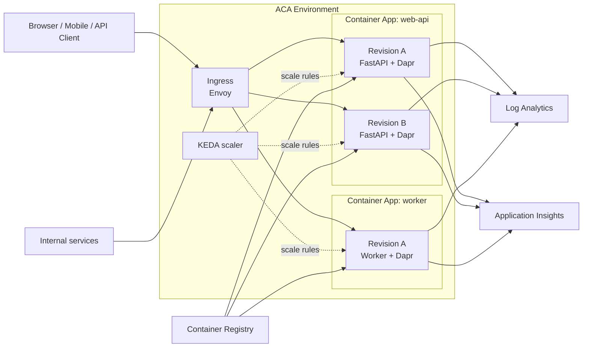
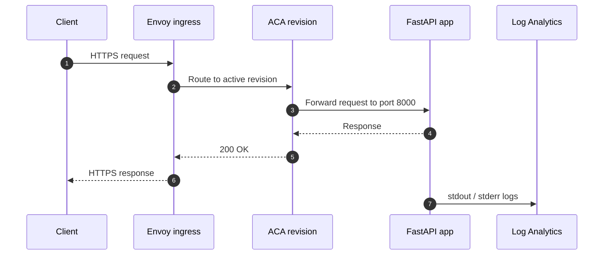

# Azure Container Apps란? — Kubernetes 없이 컨테이너 운영하기

> Azure Container Apps 101 시리즈 (1/7)

컨테이너는 만들 수 있습니다.
로컬에서도 잘 뜹니다.
문제는 그 다음입니다.
어디에 올릴지.
HTTPS는 누가 붙일지.
스케일링은 누가 할지.
로그와 추적은 어디서 볼지 정해야 합니다.
Azure Container Apps는 그 구간을 겨냥합니다.
컨테이너는 직접 가져가되 클러스터 운영은 직접 맡지 않는 모델입니다.

---

## 전체 그림 — Azure Container Apps 환경 한 장면

이 그림이 시리즈 전체의 지도입니다.
뒤의 화들은 각 박스를 하나씩 확대합니다.
클라이언트와 Ingress는 4화.
Environment·Container App·Revision은 2화.
첫 배포는 3화.
KEDA는 5화.
Dapr는 6화.
관측성은 7화입니다.

---

## 한 문장 정의

ACA는 관리형 서버리스 컨테이너 플랫폼입니다.
Microsoft가 관리하는 Kubernetes 계층 위에 KEDA와 Dapr와 Envoy를 활용하지만 사용자는 클러스터를 직접 보거나 제어하지 않습니다.

- 컨테이너 이미지가 배포 단위입니다.
- 유휴 시에는 줄고 조건이 맞으면 0까지 내려갈 수 있습니다.
- Ingress와 Revision과 관측성이 제품 안에 묶여 있습니다.

---

## 왜 ACA를 고르나

- HTTP API와 워커를 같은 플랫폼에서 운영
- 트래픽이 없을 때 비용 절감
- Revision 기반 Canary와 Blue-Green
- 필요할 때만 Dapr 사용

---

## 요청 하나의 흐름

가장 단순한 HTTP 요청 경로를 보면 플랫폼의 책임이 선명해집니다.

- 이미지 만들기
- 포트와 헬스 경로 맞추기
- 스케일 규칙 정하기
- 트래픽 전략 정하기
- 로그와 추적 남기기

---

## 어떤 시나리오에 맞나

- FastAPI 기반 API
- 트래픽이 들쭉날쭉한 워커
- 마이크로서비스 조합
- Canary와 Blue-Green이 필요한 서비스

---

## 실무 메모

- 운영 단위를 먼저 명확히 잡으면 ACA가 훨씬 단순하게 보입니다.
- Environment와 App와 Revision을 섞어 부르지 않는 습관이 중요합니다.
- 문제 해결 속도는 구조를 얼마나 정확히 나눠 보느냐에 크게 좌우됩니다.
- 플랫폼이 많은 것을 숨겨 주지만 경계를 이해해야 운영이 쉬워집니다.
- 배포와 스케일링과 관측성은 같은 흐름의 다른 면입니다.
- CLI 명령을 외우는 것보다 어떤 계층을 바꾸는지 이해하는 편이 오래 갑니다.
- 새 Revision을 만드는 변경과 앱 전체 정책을 바꾸는 변경을 구분해야 합니다.
- 로그와 메트릭은 항상 Revision과 함께 읽는 습관이 좋습니다.
- 비용과 안정성은 대개 replica 바닥값과 트래픽 패턴과 함께 움직입니다.
- 팀 규약으로 배포 절차를 고정하면 운영 리스크가 크게 줄어듭니다.

---

## 자주 하는 오해

- 플랫폼이 관리형이라고 해서 운영 판단이 사라지는 것은 아닙니다.
- 새 Revision 준비 실패를 자동 롤백과 같은 뜻으로 읽으면 안 됩니다.
- scale-to-zero는 모든 규칙이 같은 방식으로 제공하는 기능이 아닙니다.
- Dapr를 켠다고 설계 책임이 사라지는 것은 아닙니다.
- Environment와 App를 같은 뜻으로 쓰면 경계 설계가 흔들립니다.

---

## 운영 체크리스트

- Environment와 App와 Revision을 섞어 부르지 않는 습관이 중요합니다.
- 문제 해결 속도는 구조를 얼마나 정확히 나눠 보느냐에 크게 좌우됩니다.
- 플랫폼이 많은 것을 숨겨 주지만 경계를 이해해야 운영이 쉬워집니다.
- 배포와 스케일링과 관측성은 같은 흐름의 다른 면입니다.
- CLI 명령을 외우는 것보다 어떤 계층을 바꾸는지 이해하는 편이 오래 갑니다.
- 새 Revision을 만드는 변경과 앱 전체 정책을 바꾸는 변경을 구분해야 합니다.
- 로그와 메트릭은 항상 Revision과 함께 읽는 습관이 좋습니다.
- 비용과 안정성은 대개 replica 바닥값과 트래픽 패턴과 함께 움직입니다.
- 팀 규약으로 배포 절차를 고정하면 운영 리스크가 크게 줄어듭니다.
- 운영 단위를 먼저 명확히 잡으면 ACA가 훨씬 단순하게 보입니다.
- Environment와 App와 Revision을 섞어 부르지 않는 습관이 중요합니다.
- 문제 해결 속도는 구조를 얼마나 정확히 나눠 보느냐에 크게 좌우됩니다.
- 플랫폼이 많은 것을 숨겨 주지만 경계를 이해해야 운영이 쉬워집니다.
- 배포와 스케일링과 관측성은 같은 흐름의 다른 면입니다.
- CLI 명령을 외우는 것보다 어떤 계층을 바꾸는지 이해하는 편이 오래 갑니다.
- 새 Revision을 만드는 변경과 앱 전체 정책을 바꾸는 변경을 구분해야 합니다.
- 로그와 메트릭은 항상 Revision과 함께 읽는 습관이 좋습니다.
- 비용과 안정성은 대개 replica 바닥값과 트래픽 패턴과 함께 움직입니다.
- 팀 규약으로 배포 절차를 고정하면 운영 리스크가 크게 줄어듭니다.
- 운영 단위를 먼저 명확히 잡으면 ACA가 훨씬 단순하게 보입니다.
- Environment와 App와 Revision을 섞어 부르지 않는 습관이 중요합니다.
- 문제 해결 속도는 구조를 얼마나 정확히 나눠 보느냐에 크게 좌우됩니다.
- 플랫폼이 많은 것을 숨겨 주지만 경계를 이해해야 운영이 쉬워집니다.
- 배포와 스케일링과 관측성은 같은 흐름의 다른 면입니다.
- CLI 명령을 외우는 것보다 어떤 계층을 바꾸는지 이해하는 편이 오래 갑니다.
- 새 Revision을 만드는 변경과 앱 전체 정책을 바꾸는 변경을 구분해야 합니다.
- 로그와 메트릭은 항상 Revision과 함께 읽는 습관이 좋습니다.
- 비용과 안정성은 대개 replica 바닥값과 트래픽 패턴과 함께 움직입니다.
- 팀 규약으로 배포 절차를 고정하면 운영 리스크가 크게 줄어듭니다.
- 운영 단위를 먼저 명확히 잡으면 ACA가 훨씬 단순하게 보입니다.
- Environment와 App와 Revision을 섞어 부르지 않는 습관이 중요합니다.
- 문제 해결 속도는 구조를 얼마나 정확히 나눠 보느냐에 크게 좌우됩니다.
- 플랫폼이 많은 것을 숨겨 주지만 경계를 이해해야 운영이 쉬워집니다.
- 배포와 스케일링과 관측성은 같은 흐름의 다른 면입니다.
- CLI 명령을 외우는 것보다 어떤 계층을 바꾸는지 이해하는 편이 오래 갑니다.
- 새 Revision을 만드는 변경과 앱 전체 정책을 바꾸는 변경을 구분해야 합니다.
- 로그와 메트릭은 항상 Revision과 함께 읽는 습관이 좋습니다.
- 비용과 안정성은 대개 replica 바닥값과 트래픽 패턴과 함께 움직입니다.
- 팀 규약으로 배포 절차를 고정하면 운영 리스크가 크게 줄어듭니다.
- 운영 단위를 먼저 명확히 잡으면 ACA가 훨씬 단순하게 보입니다.
- Environment와 App와 Revision을 섞어 부르지 않는 습관이 중요합니다.
- 문제 해결 속도는 구조를 얼마나 정확히 나눠 보느냐에 크게 좌우됩니다.
- 플랫폼이 많은 것을 숨겨 주지만 경계를 이해해야 운영이 쉬워집니다.
- 배포와 스케일링과 관측성은 같은 흐름의 다른 면입니다.
- CLI 명령을 외우는 것보다 어떤 계층을 바꾸는지 이해하는 편이 오래 갑니다.
- 새 Revision을 만드는 변경과 앱 전체 정책을 바꾸는 변경을 구분해야 합니다.
- 로그와 메트릭은 항상 Revision과 함께 읽는 습관이 좋습니다.
- 비용과 안정성은 대개 replica 바닥값과 트래픽 패턴과 함께 움직입니다.
- 팀 규약으로 배포 절차를 고정하면 운영 리스크가 크게 줄어듭니다.
- 운영 단위를 먼저 명확히 잡으면 ACA가 훨씬 단순하게 보입니다.
- Environment와 App와 Revision을 섞어 부르지 않는 습관이 중요합니다.
- 문제 해결 속도는 구조를 얼마나 정확히 나눠 보느냐에 크게 좌우됩니다.
- 플랫폼이 많은 것을 숨겨 주지만 경계를 이해해야 운영이 쉬워집니다.
- 배포와 스케일링과 관측성은 같은 흐름의 다른 면입니다.
- CLI 명령을 외우는 것보다 어떤 계층을 바꾸는지 이해하는 편이 오래 갑니다.
- 새 Revision을 만드는 변경과 앱 전체 정책을 바꾸는 변경을 구분해야 합니다.
- 로그와 메트릭은 항상 Revision과 함께 읽는 습관이 좋습니다.
- 비용과 안정성은 대개 replica 바닥값과 트래픽 패턴과 함께 움직입니다.
- 팀 규약으로 배포 절차를 고정하면 운영 리스크가 크게 줄어듭니다.
- 운영 단위를 먼저 명확히 잡으면 ACA가 훨씬 단순하게 보입니다.
- Environment와 App와 Revision을 섞어 부르지 않는 습관이 중요합니다.
- 문제 해결 속도는 구조를 얼마나 정확히 나눠 보느냐에 크게 좌우됩니다.
- 플랫폼이 많은 것을 숨겨 주지만 경계를 이해해야 운영이 쉬워집니다.
- 배포와 스케일링과 관측성은 같은 흐름의 다른 면입니다.
- CLI 명령을 외우는 것보다 어떤 계층을 바꾸는지 이해하는 편이 오래 갑니다.
- 새 Revision을 만드는 변경과 앱 전체 정책을 바꾸는 변경을 구분해야 합니다.
- 로그와 메트릭은 항상 Revision과 함께 읽는 습관이 좋습니다.
- 비용과 안정성은 대개 replica 바닥값과 트래픽 패턴과 함께 움직입니다.
- 팀 규약으로 배포 절차를 고정하면 운영 리스크가 크게 줄어듭니다.
- 운영 단위를 먼저 명확히 잡으면 ACA가 훨씬 단순하게 보입니다.
- Environment와 App와 Revision을 섞어 부르지 않는 습관이 중요합니다.
- 문제 해결 속도는 구조를 얼마나 정확히 나눠 보느냐에 크게 좌우됩니다.
- 플랫폼이 많은 것을 숨겨 주지만 경계를 이해해야 운영이 쉬워집니다.
- 배포와 스케일링과 관측성은 같은 흐름의 다른 면입니다.
- CLI 명령을 외우는 것보다 어떤 계층을 바꾸는지 이해하는 편이 오래 갑니다.
- 새 Revision을 만드는 변경과 앱 전체 정책을 바꾸는 변경을 구분해야 합니다.
- 로그와 메트릭은 항상 Revision과 함께 읽는 습관이 좋습니다.

---

이 글은 Azure Container Apps 101 시리즈의 한 부분입니다.
앞의 글이 구조를 설명했다면 다음 글은 그 구조 위에서 배포와 운영 판단을 쌓습니다.
7편을 순서대로 읽으면 ACA를 기능 목록이 아니라 운영 모델로 이해하게 됩니다.

- 운영 체크리스트는 배포 직후 다시 보는 편이 좋습니다.

---

## 참고 자료

### 공식 문서
- [Azure Container Apps overview — Microsoft Learn](https://learn.microsoft.com/en-us/azure/container-apps/overview)
- [Azure Container Apps environments — Microsoft Learn](https://learn.microsoft.com/en-us/azure/container-apps/environment)
- [Update and deploy changes in Azure Container Apps — Microsoft Learn](https://learn.microsoft.com/en-us/azure/container-apps/revisions)
- [Ingress in Azure Container Apps — Microsoft Learn](https://learn.microsoft.com/en-us/azure/container-apps/ingress-overview)

### 관련 시리즈
- [Azure App Service 101](../../azure-app-service-101/ko/01-what-is-app-service.md)
- [Azure AKS 101](../../azure-aks-101/ko/01-what-is-aks.md)
- [Azure Functions 101](../../azure-functions-101/ko/01-what-is-azure-functions.md)
