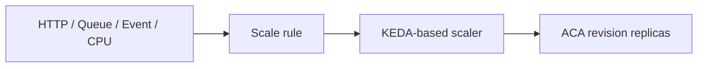

# 스케일링 — KEDA scaler와 0-to-N

> Azure Container Apps 101 시리즈 (5/7)

이번 글은 KEDA 기반 스케일링을 다룹니다.
HTTP 스케일 규칙.
CPU와 memory 규칙.
그리고 Service Bus 같은 custom scaler를 구분해서 봅니다.

---

## 스케일 경로 한 장

스케일 판단은 선언적입니다.
신호와 replica 범위를 정하면 플랫폼이 움직입니다.



---

## 규칙 세 부류

- HTTP
- CPU와 memory
- Custom KEDA scaler

---

## scale-to-zero

HTTP와 custom KEDA scaler는 0까지 내려갈 수 있습니다.
CPU와 memory 기반 스케일링은 문서 기준 0까지 내려가지 않습니다.

---

## HTTP 예시

```bash
az containerapp create   --name $APP_NAME   --resource-group $RG   --environment $ACA_ENV   --image $IMAGE   --ingress external   --target-port 8000   --min-replicas 0   --max-replicas 5   --scale-rule-name http-rule   --scale-rule-type http   --scale-rule-http-concurrency 100
```

---

## Service Bus 예시

```bash
az containerapp create   --name queue-worker   --resource-group $RG   --environment $ACA_ENV   --image $IMAGE   --min-replicas 0   --max-replicas 10   --secrets "sb-connection=<SERVICE_BUS_CONNECTION_STRING>"   --scale-rule-name servicebus-rule   --scale-rule-type azure-servicebus   --scale-rule-metadata "queueName=orders" "namespace=mybus.servicebus.windows.net" "messageCount=5"   --scale-rule-auth "connection=sb-connection"
```

---

## 실무 메모

- 운영 단위를 먼저 명확히 잡으면 ACA가 훨씬 단순하게 보입니다.
- Environment와 App와 Revision을 섞어 부르지 않는 습관이 중요합니다.
- 문제 해결 속도는 구조를 얼마나 정확히 나눠 보느냐에 크게 좌우됩니다.
- 플랫폼이 많은 것을 숨겨 주지만 경계를 이해해야 운영이 쉬워집니다.
- 배포와 스케일링과 관측성은 같은 흐름의 다른 면입니다.
- CLI 명령을 외우는 것보다 어떤 계층을 바꾸는지 이해하는 편이 오래 갑니다.
- 새 Revision을 만드는 변경과 앱 전체 정책을 바꾸는 변경을 구분해야 합니다.
- 로그와 메트릭은 항상 Revision과 함께 읽는 습관이 좋습니다.
- 비용과 안정성은 대개 replica 바닥값과 트래픽 패턴과 함께 움직입니다.
- 팀 규약으로 배포 절차를 고정하면 운영 리스크가 크게 줄어듭니다.

---

## 자주 하는 오해

- 플랫폼이 관리형이라고 해서 운영 판단이 사라지는 것은 아닙니다.
- 새 Revision 준비 실패를 자동 롤백과 같은 뜻으로 읽으면 안 됩니다.
- scale-to-zero는 모든 규칙이 같은 방식으로 제공하는 기능이 아닙니다.
- Dapr를 켠다고 설계 책임이 사라지는 것은 아닙니다.
- Environment와 App를 같은 뜻으로 쓰면 경계 설계가 흔들립니다.

---

## 운영 체크리스트

- 플랫폼이 많은 것을 숨겨 주지만 경계를 이해해야 운영이 쉬워집니다.
- 배포와 스케일링과 관측성은 같은 흐름의 다른 면입니다.
- CLI 명령을 외우는 것보다 어떤 계층을 바꾸는지 이해하는 편이 오래 갑니다.
- 새 Revision을 만드는 변경과 앱 전체 정책을 바꾸는 변경을 구분해야 합니다.
- 로그와 메트릭은 항상 Revision과 함께 읽는 습관이 좋습니다.
- 비용과 안정성은 대개 replica 바닥값과 트래픽 패턴과 함께 움직입니다.
- 팀 규약으로 배포 절차를 고정하면 운영 리스크가 크게 줄어듭니다.
- 운영 단위를 먼저 명확히 잡으면 ACA가 훨씬 단순하게 보입니다.
- Environment와 App와 Revision을 섞어 부르지 않는 습관이 중요합니다.
- 문제 해결 속도는 구조를 얼마나 정확히 나눠 보느냐에 크게 좌우됩니다.
- 플랫폼이 많은 것을 숨겨 주지만 경계를 이해해야 운영이 쉬워집니다.
- 배포와 스케일링과 관측성은 같은 흐름의 다른 면입니다.
- CLI 명령을 외우는 것보다 어떤 계층을 바꾸는지 이해하는 편이 오래 갑니다.
- 새 Revision을 만드는 변경과 앱 전체 정책을 바꾸는 변경을 구분해야 합니다.
- 로그와 메트릭은 항상 Revision과 함께 읽는 습관이 좋습니다.
- 비용과 안정성은 대개 replica 바닥값과 트래픽 패턴과 함께 움직입니다.
- 팀 규약으로 배포 절차를 고정하면 운영 리스크가 크게 줄어듭니다.
- 운영 단위를 먼저 명확히 잡으면 ACA가 훨씬 단순하게 보입니다.
- Environment와 App와 Revision을 섞어 부르지 않는 습관이 중요합니다.
- 문제 해결 속도는 구조를 얼마나 정확히 나눠 보느냐에 크게 좌우됩니다.
- 플랫폼이 많은 것을 숨겨 주지만 경계를 이해해야 운영이 쉬워집니다.
- 배포와 스케일링과 관측성은 같은 흐름의 다른 면입니다.
- CLI 명령을 외우는 것보다 어떤 계층을 바꾸는지 이해하는 편이 오래 갑니다.
- 새 Revision을 만드는 변경과 앱 전체 정책을 바꾸는 변경을 구분해야 합니다.
- 로그와 메트릭은 항상 Revision과 함께 읽는 습관이 좋습니다.
- 비용과 안정성은 대개 replica 바닥값과 트래픽 패턴과 함께 움직입니다.
- 팀 규약으로 배포 절차를 고정하면 운영 리스크가 크게 줄어듭니다.
- 운영 단위를 먼저 명확히 잡으면 ACA가 훨씬 단순하게 보입니다.
- Environment와 App와 Revision을 섞어 부르지 않는 습관이 중요합니다.
- 문제 해결 속도는 구조를 얼마나 정확히 나눠 보느냐에 크게 좌우됩니다.
- 플랫폼이 많은 것을 숨겨 주지만 경계를 이해해야 운영이 쉬워집니다.
- 배포와 스케일링과 관측성은 같은 흐름의 다른 면입니다.
- CLI 명령을 외우는 것보다 어떤 계층을 바꾸는지 이해하는 편이 오래 갑니다.
- 새 Revision을 만드는 변경과 앱 전체 정책을 바꾸는 변경을 구분해야 합니다.
- 로그와 메트릭은 항상 Revision과 함께 읽는 습관이 좋습니다.
- 비용과 안정성은 대개 replica 바닥값과 트래픽 패턴과 함께 움직입니다.
- 팀 규약으로 배포 절차를 고정하면 운영 리스크가 크게 줄어듭니다.
- 운영 단위를 먼저 명확히 잡으면 ACA가 훨씬 단순하게 보입니다.
- Environment와 App와 Revision을 섞어 부르지 않는 습관이 중요합니다.
- 문제 해결 속도는 구조를 얼마나 정확히 나눠 보느냐에 크게 좌우됩니다.
- 플랫폼이 많은 것을 숨겨 주지만 경계를 이해해야 운영이 쉬워집니다.
- 배포와 스케일링과 관측성은 같은 흐름의 다른 면입니다.
- CLI 명령을 외우는 것보다 어떤 계층을 바꾸는지 이해하는 편이 오래 갑니다.
- 새 Revision을 만드는 변경과 앱 전체 정책을 바꾸는 변경을 구분해야 합니다.
- 로그와 메트릭은 항상 Revision과 함께 읽는 습관이 좋습니다.
- 비용과 안정성은 대개 replica 바닥값과 트래픽 패턴과 함께 움직입니다.
- 팀 규약으로 배포 절차를 고정하면 운영 리스크가 크게 줄어듭니다.
- 운영 단위를 먼저 명확히 잡으면 ACA가 훨씬 단순하게 보입니다.
- Environment와 App와 Revision을 섞어 부르지 않는 습관이 중요합니다.
- 문제 해결 속도는 구조를 얼마나 정확히 나눠 보느냐에 크게 좌우됩니다.
- 플랫폼이 많은 것을 숨겨 주지만 경계를 이해해야 운영이 쉬워집니다.
- 배포와 스케일링과 관측성은 같은 흐름의 다른 면입니다.
- CLI 명령을 외우는 것보다 어떤 계층을 바꾸는지 이해하는 편이 오래 갑니다.
- 새 Revision을 만드는 변경과 앱 전체 정책을 바꾸는 변경을 구분해야 합니다.
- 로그와 메트릭은 항상 Revision과 함께 읽는 습관이 좋습니다.
- 비용과 안정성은 대개 replica 바닥값과 트래픽 패턴과 함께 움직입니다.
- 팀 규약으로 배포 절차를 고정하면 운영 리스크가 크게 줄어듭니다.
- 운영 단위를 먼저 명확히 잡으면 ACA가 훨씬 단순하게 보입니다.
- Environment와 App와 Revision을 섞어 부르지 않는 습관이 중요합니다.
- 문제 해결 속도는 구조를 얼마나 정확히 나눠 보느냐에 크게 좌우됩니다.
- 플랫폼이 많은 것을 숨겨 주지만 경계를 이해해야 운영이 쉬워집니다.
- 배포와 스케일링과 관측성은 같은 흐름의 다른 면입니다.
- CLI 명령을 외우는 것보다 어떤 계층을 바꾸는지 이해하는 편이 오래 갑니다.
- 새 Revision을 만드는 변경과 앱 전체 정책을 바꾸는 변경을 구분해야 합니다.
- 로그와 메트릭은 항상 Revision과 함께 읽는 습관이 좋습니다.
- 비용과 안정성은 대개 replica 바닥값과 트래픽 패턴과 함께 움직입니다.
- 팀 규약으로 배포 절차를 고정하면 운영 리스크가 크게 줄어듭니다.
- 운영 단위를 먼저 명확히 잡으면 ACA가 훨씬 단순하게 보입니다.
- Environment와 App와 Revision을 섞어 부르지 않는 습관이 중요합니다.
- 문제 해결 속도는 구조를 얼마나 정확히 나눠 보느냐에 크게 좌우됩니다.
- 플랫폼이 많은 것을 숨겨 주지만 경계를 이해해야 운영이 쉬워집니다.
- 배포와 스케일링과 관측성은 같은 흐름의 다른 면입니다.
- CLI 명령을 외우는 것보다 어떤 계층을 바꾸는지 이해하는 편이 오래 갑니다.
- 새 Revision을 만드는 변경과 앱 전체 정책을 바꾸는 변경을 구분해야 합니다.
- 로그와 메트릭은 항상 Revision과 함께 읽는 습관이 좋습니다.
- 비용과 안정성은 대개 replica 바닥값과 트래픽 패턴과 함께 움직입니다.
- 팀 규약으로 배포 절차를 고정하면 운영 리스크가 크게 줄어듭니다.
- 운영 단위를 먼저 명확히 잡으면 ACA가 훨씬 단순하게 보입니다.
- Environment와 App와 Revision을 섞어 부르지 않는 습관이 중요합니다.
- 문제 해결 속도는 구조를 얼마나 정확히 나눠 보느냐에 크게 좌우됩니다.
- 플랫폼이 많은 것을 숨겨 주지만 경계를 이해해야 운영이 쉬워집니다.
- 배포와 스케일링과 관측성은 같은 흐름의 다른 면입니다.
- CLI 명령을 외우는 것보다 어떤 계층을 바꾸는지 이해하는 편이 오래 갑니다.
- 새 Revision을 만드는 변경과 앱 전체 정책을 바꾸는 변경을 구분해야 합니다.
- 로그와 메트릭은 항상 Revision과 함께 읽는 습관이 좋습니다.
- 비용과 안정성은 대개 replica 바닥값과 트래픽 패턴과 함께 움직입니다.
- 팀 규약으로 배포 절차를 고정하면 운영 리스크가 크게 줄어듭니다.
- 운영 단위를 먼저 명확히 잡으면 ACA가 훨씬 단순하게 보입니다.
- Environment와 App와 Revision을 섞어 부르지 않는 습관이 중요합니다.
- 문제 해결 속도는 구조를 얼마나 정확히 나눠 보느냐에 크게 좌우됩니다.
- 플랫폼이 많은 것을 숨겨 주지만 경계를 이해해야 운영이 쉬워집니다.
- 배포와 스케일링과 관측성은 같은 흐름의 다른 면입니다.
- CLI 명령을 외우는 것보다 어떤 계층을 바꾸는지 이해하는 편이 오래 갑니다.
- 새 Revision을 만드는 변경과 앱 전체 정책을 바꾸는 변경을 구분해야 합니다.
- 로그와 메트릭은 항상 Revision과 함께 읽는 습관이 좋습니다.
- 비용과 안정성은 대개 replica 바닥값과 트래픽 패턴과 함께 움직입니다.
- 팀 규약으로 배포 절차를 고정하면 운영 리스크가 크게 줄어듭니다.
- 운영 단위를 먼저 명확히 잡으면 ACA가 훨씬 단순하게 보입니다.
- Environment와 App와 Revision을 섞어 부르지 않는 습관이 중요합니다.
- 문제 해결 속도는 구조를 얼마나 정확히 나눠 보느냐에 크게 좌우됩니다.
- 플랫폼이 많은 것을 숨겨 주지만 경계를 이해해야 운영이 쉬워집니다.
- 배포와 스케일링과 관측성은 같은 흐름의 다른 면입니다.
- CLI 명령을 외우는 것보다 어떤 계층을 바꾸는지 이해하는 편이 오래 갑니다.
- 새 Revision을 만드는 변경과 앱 전체 정책을 바꾸는 변경을 구분해야 합니다.
- 로그와 메트릭은 항상 Revision과 함께 읽는 습관이 좋습니다.
- 비용과 안정성은 대개 replica 바닥값과 트래픽 패턴과 함께 움직입니다.
- 팀 규약으로 배포 절차를 고정하면 운영 리스크가 크게 줄어듭니다.
- 운영 단위를 먼저 명확히 잡으면 ACA가 훨씬 단순하게 보입니다.
- Environment와 App와 Revision을 섞어 부르지 않는 습관이 중요합니다.
- 문제 해결 속도는 구조를 얼마나 정확히 나눠 보느냐에 크게 좌우됩니다.
- 플랫폼이 많은 것을 숨겨 주지만 경계를 이해해야 운영이 쉬워집니다.
- 배포와 스케일링과 관측성은 같은 흐름의 다른 면입니다.
- CLI 명령을 외우는 것보다 어떤 계층을 바꾸는지 이해하는 편이 오래 갑니다.
- 새 Revision을 만드는 변경과 앱 전체 정책을 바꾸는 변경을 구분해야 합니다.
- 로그와 메트릭은 항상 Revision과 함께 읽는 습관이 좋습니다.
- 비용과 안정성은 대개 replica 바닥값과 트래픽 패턴과 함께 움직입니다.
- 팀 규약으로 배포 절차를 고정하면 운영 리스크가 크게 줄어듭니다.
- 운영 단위를 먼저 명확히 잡으면 ACA가 훨씬 단순하게 보입니다.
- Environment와 App와 Revision을 섞어 부르지 않는 습관이 중요합니다.
- 문제 해결 속도는 구조를 얼마나 정확히 나눠 보느냐에 크게 좌우됩니다.
- 플랫폼이 많은 것을 숨겨 주지만 경계를 이해해야 운영이 쉬워집니다.
- 배포와 스케일링과 관측성은 같은 흐름의 다른 면입니다.
- CLI 명령을 외우는 것보다 어떤 계층을 바꾸는지 이해하는 편이 오래 갑니다.
- 새 Revision을 만드는 변경과 앱 전체 정책을 바꾸는 변경을 구분해야 합니다.
- 로그와 메트릭은 항상 Revision과 함께 읽는 습관이 좋습니다.
- 비용과 안정성은 대개 replica 바닥값과 트래픽 패턴과 함께 움직입니다.
- 팀 규약으로 배포 절차를 고정하면 운영 리스크가 크게 줄어듭니다.
- 운영 단위를 먼저 명확히 잡으면 ACA가 훨씬 단순하게 보입니다.
- Environment와 App와 Revision을 섞어 부르지 않는 습관이 중요합니다.
- 문제 해결 속도는 구조를 얼마나 정확히 나눠 보느냐에 크게 좌우됩니다.
- 플랫폼이 많은 것을 숨겨 주지만 경계를 이해해야 운영이 쉬워집니다.
- 배포와 스케일링과 관측성은 같은 흐름의 다른 면입니다.
- CLI 명령을 외우는 것보다 어떤 계층을 바꾸는지 이해하는 편이 오래 갑니다.
- 새 Revision을 만드는 변경과 앱 전체 정책을 바꾸는 변경을 구분해야 합니다.
- 로그와 메트릭은 항상 Revision과 함께 읽는 습관이 좋습니다.
- 비용과 안정성은 대개 replica 바닥값과 트래픽 패턴과 함께 움직입니다.
- 팀 규약으로 배포 절차를 고정하면 운영 리스크가 크게 줄어듭니다.
- 운영 단위를 먼저 명확히 잡으면 ACA가 훨씬 단순하게 보입니다.
- Environment와 App와 Revision을 섞어 부르지 않는 습관이 중요합니다.
- 문제 해결 속도는 구조를 얼마나 정확히 나눠 보느냐에 크게 좌우됩니다.
- 플랫폼이 많은 것을 숨겨 주지만 경계를 이해해야 운영이 쉬워집니다.
- 배포와 스케일링과 관측성은 같은 흐름의 다른 면입니다.
- CLI 명령을 외우는 것보다 어떤 계층을 바꾸는지 이해하는 편이 오래 갑니다.
- 새 Revision을 만드는 변경과 앱 전체 정책을 바꾸는 변경을 구분해야 합니다.
- 로그와 메트릭은 항상 Revision과 함께 읽는 습관이 좋습니다.

---

이 글은 Azure Container Apps 101 시리즈의 한 부분입니다.
앞의 글이 구조를 설명했다면 다음 글은 그 구조 위에서 배포와 운영 판단을 쌓습니다.
7편을 순서대로 읽으면 ACA를 기능 목록이 아니라 운영 모델로 이해하게 됩니다.

- 운영 체크리스트는 배포 직후 다시 보는 편이 좋습니다.

---

## 참고 자료

### 공식 문서
- [Scaling in Azure Container Apps — Microsoft Learn](https://learn.microsoft.com/en-us/azure/container-apps/scale-app)
- [Azure Container Apps overview — Microsoft Learn](https://learn.microsoft.com/en-us/azure/container-apps/overview)
- [KEDA scalers documentation](https://keda.sh/docs/scalers/)

### 관련 시리즈
- [Azure App Service 101](../../azure-app-service-101/ko/01-what-is-app-service.md)
- [Azure AKS 101](../../azure-aks-101/ko/01-what-is-aks.md)
- [Azure Functions 101](../../azure-functions-101/ko/01-what-is-azure-functions.md)
