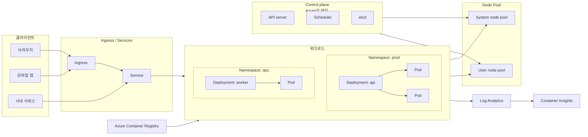
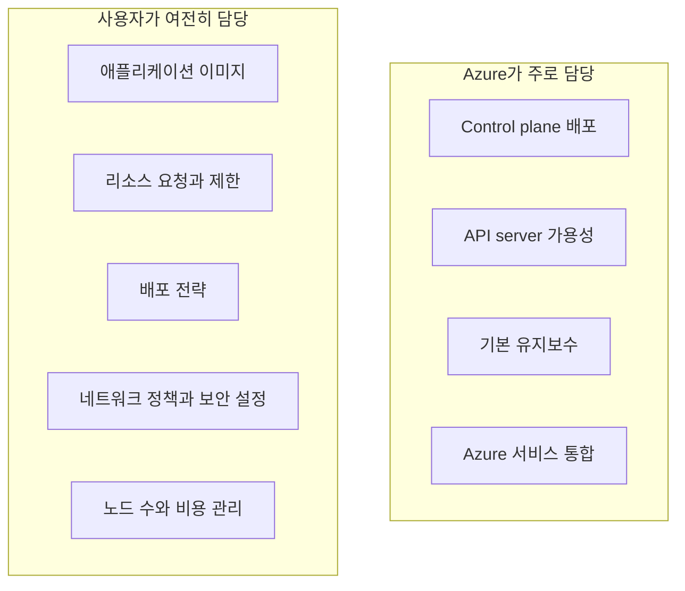

# Azure Kubernetes Service란? — 직접 운영하지 않아도 되는 Kubernetes

> Azure Kubernetes Service 101 시리즈 (1/7)

컨테이너를 몇 개 띄우는 일은 이제 어렵지 않습니다. 어려운 쪽은 그 다음입니다. 장애가 난 Pod를 다시 살리고, 트래픽이 늘면 복제본과 노드를 같이 늘리고, 외부 트래픽을 안전하게 받아 주고, 로그와 메트릭을 한 군데로 모으는 일입니다. Kubernetes는 이 문제를 풀기 위한 표준이지만, 직접 운영하면 학습비와 운영비가 같이 올라갑니다.

AKS는 그 부담을 줄이기 위해 나온 Azure의 관리형 Kubernetes입니다. 이번 1화는 AKS를 “그냥 Kubernetes를 Azure에서 쓰는 서비스”보다 조금 더 정확하게 이해하는 데 집중합니다. 무엇을 Azure가 대신 맡고, 무엇은 여전히 사용자가 책임지는지 먼저 선명하게 잡아 두어야 뒤의 아키텍처, 배포, 네트워킹, 스케일링 이야기가 흔들리지 않습니다.

---

## 전체 그림 — AKS 클러스터 한 장면

이 그림이 이번 시리즈 전체의 지도입니다.
뒤의 화들은 아래 상자 하나씩을 확대해서 보는 구조입니다.

이 시리즈는 2화에서 Control Plane과 Node Pool 경계를, 3화와 4화에서 Deployment·Pod·Service를, 5화에서 Ingress와 네트워킹을, 6화에서 스케일링을, 7화에서 모니터링과 운영을 각각 확대합니다.

---

## 한 문장 정의

AKS는 **Kubernetes Control Plane을 Azure가 관리하고, 사용자는 주로 Node Pool과 워크로드를 운영하는 서비스**입니다.

이 문장을 조금 풀면 다음과 같습니다.

- Kubernetes API server, scheduler, etcd 같은 Control Plane 구성 요소는 Azure가 배치하고 운영합니다.
- 사용자는 VM 노드가 들어 있는 Node Pool을 만들고, 그 위에 Pod와 Deployment와 Service를 올립니다.
- Azure는 업그레이드, 헬스 체크, 통합 모니터링, Azure 네트워크와의 연결 같은 주변 운영을 많이 덜어 줍니다.

AKS를 써도 Kubernetes가 사라지는 것은 아닙니다. `kubectl`, YAML, Ingress, HPA, Namespace 같은 개념은 그대로입니다. 바뀌는 것은 **클러스터 운영의 책임 경계**입니다.

---

## AKS가 “관리형”이라는 말의 정확한 뜻

관리형이라는 말은 마케팅 문구처럼 들리기 쉽지만, 실무에서는 꽤 구체적입니다.

AKS를 도입한다고 해서 “운영을 안 해도 된다”는 뜻은 아닙니다. 운영의 초점이 바뀝니다. 직접 etcd와 API server를 만지던 운영에서, **워크로드 배치와 비용, 네트워크, 릴리스, 관측성**을 설계하는 운영으로 이동합니다.

이 구분이 중요한 이유는 두 가지입니다.

첫째, 기대치를 맞출 수 있습니다. AKS는 앱 성능 문제를 자동으로 해결하지 않습니다. CPU 요청을 잘못 잡거나, 하나의 Service 뒤에 상태가 맞지 않는 Pod를 붙이거나, readiness probe를 빼먹으면 문제는 그대로 납니다.

둘째, 비용을 읽을 수 있습니다. AKS는 Control Plane 비용을 따로 청구하지 않고, 주로 애플리케이션을 돌리는 노드 VM과 관련 리소스 비용을 냅니다. 따라서 “클러스터를 하나 더 만들까”보다 “노드 풀을 어떻게 나눌까”, “스케일 정책을 어떻게 둘까”가 더 직접적인 비용 질문이 됩니다.

---

## 왜 Kubernetes를 직접 설치하지 않고 AKS를 쓰는가

Kubernetes를 직접 올리는 선택이 완전히 사라진 것은 아닙니다. 다만 일반적인 애플리케이션 팀에는 AKS 쪽이 더 현실적입니다.

| 항목 | 직접 운영 Kubernetes | AKS |
|---|---|---|
| Control Plane 구성 | 직접 설계·배포 | Azure 관리 |
| 업그레이드 부담 | 높음 | 낮음 |
| Azure 통합 | 직접 조립 | 기본 통합 경로 다수 |
| 시작 속도 | 느림 | 빠름 |
| 세밀한 제어 | 높음 | 일부 제약 |

AKS의 장점은 “쉽다”보다 **표준 Kubernetes를 유지하면서 Azure의 운영 자동화를 얻는다**는 데 있습니다. 덕분에 Helm 차트, Kubernetes 문서, 오픈소스 운영 패턴을 대부분 그대로 가져올 수 있습니다.

반대로 완전한 추상화는 아닙니다. 더 높은 수준의 추상화가 필요하고 클러스터를 직접 보고 싶지 않다면 Azure Container Apps가 더 맞을 수 있습니다. HTTP 앱을 VM 추상화에 가깝게 다루고 싶다면 Azure App Service가 더 단순할 수 있습니다.

---

## AKS에서 비용을 어디에 내는가

AKS를 처음 볼 때 가장 많이 묻는 질문이 이 부분입니다.

> AKS는 Control Plane을 Azure가 관리하며, Control Plane 자체는 무료입니다. 사용자는 주로 Node Pool의 VM과 디스크, 네트워크, 부가 서비스 비용을 냅니다.

이 말만 기억하면 큰 방향은 맞습니다. 다만 실제 청구서는 조금 더 넓습니다.

- Node Pool VM 비용
- OS 디스크와 데이터 디스크 비용
- Load Balancer, Public IP 같은 네트워크 리소스 비용
- Azure Container Registry 저장 비용
- Log Analytics, Container Insights, Managed Prometheus 같은 관측성 비용

즉 AKS는 “클러스터 사용료”보다 **클러스터를 이루는 주변 리소스 비용**을 읽어야 합니다. 6화에서 보는 HPA, Cluster Autoscaler, KEDA가 비용과 연결되는 이유도 여기에 있습니다.

---

## AKS를 구성하는 가장 중요한 두 축

시리즈 전체를 따라갈 때는 두 축만 붙잡으면 됩니다.

### 1) Control Plane

Control Plane은 클러스터의 두뇌입니다.

- 원하는 상태를 저장합니다.
- 스케줄러가 Pod를 어느 노드에 올릴지 결정합니다.
- API server가 모든 선언과 조회의 창구가 됩니다.

AKS에서는 이 영역을 Azure가 관리합니다.

### 2) Node Pool

Node Pool은 실제로 컨테이너가 돌아가는 VM 묶음입니다.

- System node pool은 CoreDNS, metrics-server 같은 시스템 Pod가 우선 배치되는 풀입니다.
- User node pool은 애플리케이션 워크로드를 올리기 위한 풀입니다.

이 경계는 2화에서 본격적으로 다룹니다. 초반에는 “Control Plane은 관리형, Node Pool은 내가 책임지는 실행 공간” 정도로 잡아 두면 충분합니다.

---

## 어떤 팀에게 AKS가 잘 맞는가

AKS는 다음 조건이 맞을 때 특히 설득력이 있습니다.

- 여러 서비스가 공통 배포 플랫폼을 공유해야 할 때
- 배포 전략, 서비스 디스커버리, 오토스케일, 롤링 업데이트를 표준 방식으로 가져가고 싶을 때
- Azure 네트워크, Azure Monitor, Azure Container Registry와 자연스럽게 붙이고 싶을 때
- 개발팀과 플랫폼팀이 Kubernetes라는 공통 언어를 쓰고 싶을 때

반대로 서비스 수가 적고, 팀이 Kubernetes 개념을 받아들일 준비가 전혀 안 되어 있고, HTTP 앱 두세 개를 빨리 운영하는 것이 목적이라면 App Service나 Container Apps가 더 경제적일 수 있습니다.

---

## Azure 안의 다른 선택지와 어떻게 다른가

AKS를 볼 때는 “컨테이너를 돌린다”는 공통점보다 **어디까지를 플랫폼이 추상화하느냐**를 같이 봐야 합니다.

- **Azure App Service**는 웹 앱 운영에 더 가깝고, 인스턴스와 런타임 관리가 더 많이 숨겨져 있습니다.
- **Azure Functions**는 이벤트 실행 모델이 중심이라, Pod와 Service를 직접 다루지 않습니다.
- **Azure Container Apps**는 컨테이너 중심이지만, 클러스터 자체를 의식하는 정도는 AKS보다 낮습니다.

AKS는 이 셋 중에서 가장 Kubernetes에 가깝습니다. 대신 그만큼 개념 표면적이 넓습니다. 이 시리즈를 101으로 나눈 이유도 여기에 있습니다. AKS는 기능을 하나씩 외우기보다, Control Plane·Node Pool·Pod·Service·Ingress·Autoscaler가 어떻게 연결되는지부터 잡아야 훨씬 덜 어렵습니다.

실무에서도 이 비교는 꽤 자주 등장합니다. 같은 FastAPI 앱이라도 App Service에서는 인스턴스와 설정 중심으로 운영하고, Functions에서는 이벤트와 실행 시간 중심으로 운영하며, AKS에서는 워크로드 객체와 네트워크와 스케일 정책 중심으로 운영합니다. 즉 플랫폼을 바꾸면 애플리케이션 코드보다 운영 언어가 더 크게 바뀌는 경우가 많습니다.

이 차이를 빨리 받아들일수록 AKS 학습 속도도 빨라집니다. Kubernetes를 쓴다는 것은 단순히 배포 명령이 바뀌는 것이 아니라, 애플리케이션을 바라보는 운영 좌표계가 바뀌는 일이기 때문입니다.

그래서 1화의 목표도 기능 나열보다 좌표계를 먼저 맞추는 데 있습니다.

---

## 처음부터 알아두면 좋은 오해 두 가지

### “AKS면 운영이 거의 없다”

아닙니다. Control Plane 운영이 많이 줄어드는 것이지, 애플리케이션 운영이 사라지는 것은 아닙니다. Node Pool 분리, 네트워크 설계, 자원 요청, 로그 보존, 알람, 업그레이드 계획은 여전히 필요합니다.

### “AKS면 무조건 마이크로서비스를 해야 한다”

그렇지도 않습니다. 단일 FastAPI 서비스 하나를 Deployment와 Service로 올리는 것부터 시작해도 됩니다. 오히려 작은 앱으로 시작해야 Pod, Service, Ingress, HPA가 어떻게 연결되는지 감이 빨리 옵니다.

---

## 다음 화로 넘어가기 전에

이번 글에서 가져갈 문장은 하나입니다.

> AKS는 Kubernetes를 숨기는 서비스가 아니라, Kubernetes의 어려운 운영면 일부를 Azure가 대신 맡아 주는 서비스입니다.

이 이해가 있으면 이후 내용이 훨씬 덜 추상적으로 보입니다. Pod와 Deployment는 결국 Node Pool 어디엔가 올라가고, Ingress는 그 워크로드 앞단을 정리하고, HPA와 Cluster Autoscaler는 각각 Pod 수와 Node 수를 조절하며, 모니터링은 이 모든 계층을 함께 봐야 합니다.

---

이 글은 Azure Kubernetes Service 101 시리즈의 1화입니다. 이번 화에서 AKS의 책임 경계를 먼저 잡았고, 2화에서는 클러스터 내부를 구성하는 Control Plane과 Node Pool을 더 구체적으로 봅니다. 그 뒤에는 첫 배포, 워크로드 표현 방식, 네트워킹, 스케일링, 운영 순서로 연결됩니다.

---

## 참고 자료

### 공식 문서
- [What is Azure Kubernetes Service (AKS)?](https://learn.microsoft.com/en-us/azure/aks/what-is-aks)
- [Deploy an Azure Kubernetes Service (AKS) Cluster Using Azure CLI](https://learn.microsoft.com/en-us/azure/aks/learn/quick-kubernetes-deploy-cli)
- [Use system node pools in Azure Kubernetes Service (AKS)](https://learn.microsoft.com/en-us/azure/aks/use-system-pools)
- [Kubernetes core concepts for Azure Kubernetes Service (AKS)](https://learn.microsoft.com/en-us/azure/aks/concepts-clusters-workloads)

### 관련 시리즈
- [Azure App Service 101](../../azure-app-service-101/ko/) — Kubernetes까지 필요하지 않은 웹 앱 운영 모델과 비교할 때
- [Azure Functions 101](../../azure-functions-101/ko/) — 서버리스와 관리형 Kubernetes의 책임 경계를 비교할 때
