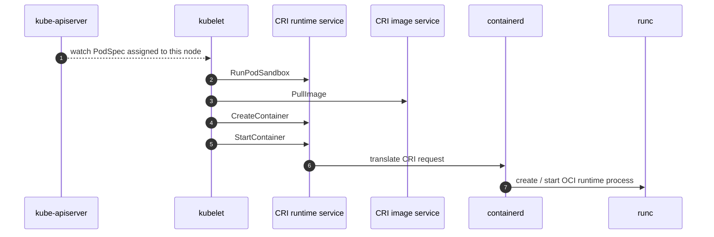
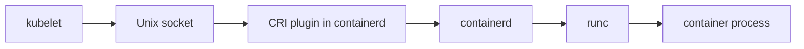
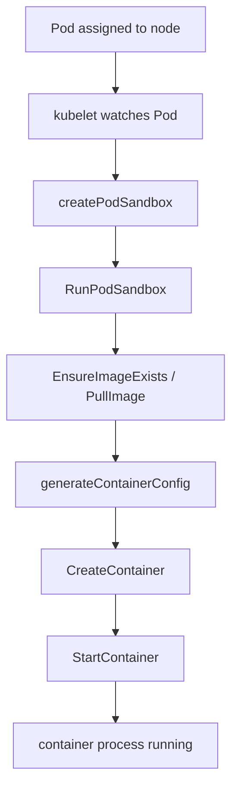

# kubelet and containerd — how a container actually starts on a node

> Azure Kubernetes Service Deep Dive series (2/6)

Part 1 framed the control plane as the layer that records desired state and placement.
This part covers the next step.
Who actually runs the workload.
The answer is the node-local pair of kubelet and the container runtime.
On AKS Linux nodes, that runtime is containerd.
Docker is not the main character here.

The path is straightforward.
Kubelet sees a PodSpec through the API server,
calls the CRI over a Unix socket,
containerd creates the sandbox and containers,
and `runc` finally spawns the real process.

---

## The execution path in one picture

---

## kubelet, CRI, and runtime

Kubelet is the node agent.
It watches the API server for Pods assigned to its node,
prepares the Pod environment,
and calls the CRI instead of implementing a runtime itself.
The CRI keeps Kubernetes decoupled from one specific engine implementation.
In AKS Linux,
that runtime endpoint is containerd.

The upstream API exposes both runtime and image operations.
`RunPodSandbox`,
`PullImage`,
`CreateContainer`,
and `StartContainer` are the most important names in the startup path.

---

## kubelet talks to a Unix socket

This is a local call chain.
The control plane does not execute here.
The node does.

---

## Why sandbox comes first

`createPodSandbox()` in `kuberuntime_sandbox.go` builds `PodSandboxConfig` and calls `RunPodSandbox` before any individual container is created.
That Pod-level shell carries shared network and namespace context.
The Pod IP concept belongs much more naturally to this layer than to a single container.

---

## Image pull, create, start

`startContainer()` in `kuberuntime_container.go` is explicit about the order.
Pull the image.
Generate config.
Create the container.
Start the container.
That order is what lets you separate scheduling problems from image pull problems and runtime start problems.

---

## Where `runc` enters

Kubelet never calls `runc` directly.
containerd drops from the CRI layer into the OCI runtime layer,
and that is where `runc` appears.
The effective chain is kubelet -> CRI -> containerd -> `runc` -> process.

---

## Startup path as control flow

---

## The point of this episode

> In AKS, node-side container startup is orchestrated by kubelet. Kubelet watches the API server for Pods assigned to its node, calls the CRI over a Unix socket, runs `RunPodSandbox` first, then requests `PullImage`, `CreateContainer`, and `StartContainer` in order. The actual process is created below containerd by the OCI runtime, typically `runc`.

---

## Where this fits in the series

This is part 2 of the Azure Kubernetes Service Deep Dive series.
Part 1 fixed the managed control-plane boundary; this part follows the exact opposite end of the system, the node-local execution path. Part 3 moves naturally from `RunPodSandbox` into networking and explains where the Pod IP is actually allocated.

---

## References

### Primary sources
- [CRI API — `api.proto` @ `v1.30.0`](https://github.com/kubernetes/kubernetes/blob/v1.30.0/staging/src/k8s.io/cri-api/pkg/apis/runtime/v1/api.proto)
- [`kuberuntime_manager.go` @ `v1.30.0`](https://github.com/kubernetes/kubernetes/blob/v1.30.0/pkg/kubelet/kuberuntime/kuberuntime_manager.go)
- [`kuberuntime_sandbox.go` @ `v1.30.0`](https://github.com/kubernetes/kubernetes/blob/v1.30.0/pkg/kubelet/kuberuntime/kuberuntime_sandbox.go)
- [`kuberuntime_container.go` @ `v1.30.0`](https://github.com/kubernetes/kubernetes/blob/v1.30.0/pkg/kubelet/kuberuntime/kuberuntime_container.go)

### Secondary sources
- [AKS core concepts](https://learn.microsoft.com/en-us/azure/aks/core-aks-concepts)
- [Kubernetes node components](https://kubernetes.io/docs/concepts/overview/components/#node-components)

### Related Series
- [Azure AKS 101](../../azure-aks-101/en/)
- [Azure Functions Deep Dive part 3 — one bidirectional RPC stream](../../azure-functions-deep-dive/en/03-grpc-event-stream.md)
