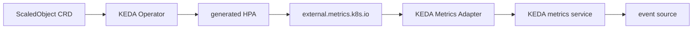
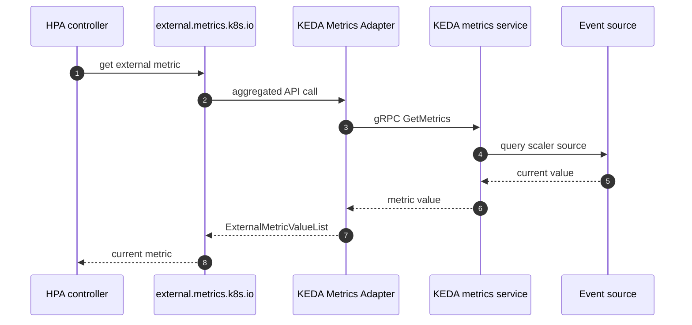
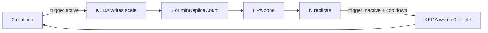

# KEDA internals — how a ScaledObject builds an HPA

> Azure Kubernetes Service Deep Dive series (6/6)

KEDA does not replace HPA.
It watches ScaledObjects,
creates HPAs,
feeds the external metrics path,
and directly handles the scale-to-zero boundary by writing replica counts itself.

---

## The KEDA structure

---

## ScaledObjectReconciler and the generated HPA

`scaledobject_controller.go` checks that the target exposes `/scale`,
ensures the right label exists,
and creates or updates the HPA.
A ScaledObject is the declaration.
The concrete autoscaling artifact inside Kubernetes remains an HPA.

---

## The external metrics path

`api_service.yaml` registers `v1beta1.external.metrics.k8s.io`.
`provider.go` shows the adapter reading the `scaledobject.keda.sh/name` selector and querying the metrics service over gRPC.

---

## The scale-to-zero boundary

`scale_scaledobjects.go` has separate `scaleToZeroOrIdle()` and `scaleFromZeroOrIdle()` paths.
That exists because HPA does not naturally control the below-`minReplicas` boundary.
KEDA directly updates `/scale` for the 0↔1 region,
while the generated HPA controls the 1↔N region.

---

## The point of this episode

> KEDA does not replace HPA. The Operator watches ScaledObjects and creates HPAs, the Metrics Adapter provides `external.metrics.k8s.io`, and HPA uses those metrics for autoscaling above one replica. The scale-to-zero boundary is handled directly by KEDA, which writes `replicas: 0` itself when triggers are inactive long enough.

---

## Where this fits in the series

This is the final part of the Azure Kubernetes Service Deep Dive series.
Because part 5 separated HPA from Cluster Autoscaler first, this episode can place KEDA more precisely: above HPA, not instead of it.

---

## References

### Primary sources
- [`scaledobject_controller.go` @ `v2.14.0`](https://github.com/kedacore/keda/blob/v2.14.0/controllers/keda/scaledobject_controller.go)
- [`provider.go` @ `v2.14.0`](https://github.com/kedacore/keda/blob/v2.14.0/pkg/provider/provider.go)
- [`scale_scaledobjects.go` @ `v2.14.0`](https://github.com/kedacore/keda/blob/v2.14.0/pkg/scaling/executor/scale_scaledobjects.go)
- [`api_service.yaml` @ `v2.14.0`](https://github.com/kedacore/keda/blob/v2.14.0/config/metrics-server/api_service.yaml)

### Secondary sources
- [KEDA scaling deployments and custom resources](https://keda.sh/docs/2.14/concepts/scaling-deployments/)
- [Horizontal Pod Autoscaling](https://kubernetes.io/docs/tasks/run-application/horizontal-pod-autoscale/)

### Related Series
- [Azure AKS 101](../../azure-aks-101/en/)
- [Azure Functions Deep Dive part 5 — reading control loops](../../azure-functions-deep-dive/en/05-scaling-internals.md)
