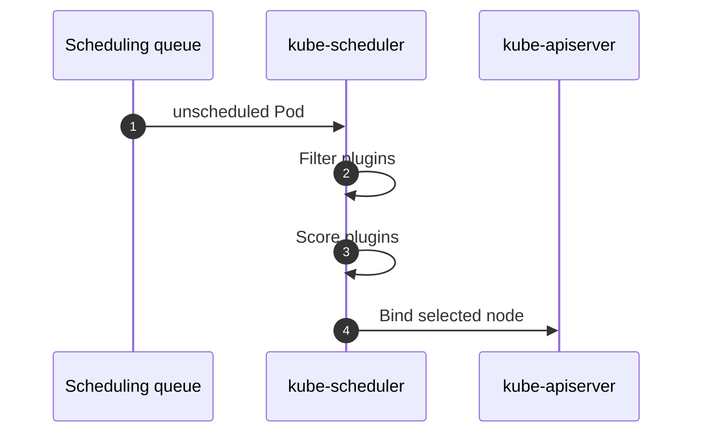
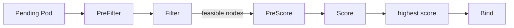

# Scheduler와 Pod 배치 — 어느 노드로 갈지 누가 정하는가

> Azure Kubernetes Service Deep Dive 시리즈 (4/6)

스케줄링은 단순한 잔여 CPU 계산이 아닙니다.
node affinity,
taint,
port,
volume,
topology spread까지 모두 얽힙니다.
업스트림 scheduler 코드는 이 판단을 정직하게 드러냅니다.
Filter로 안 되는 노드를 지우고,
Score로 남은 노드에 점수를 매기고,
Binding을 기록합니다.

---

## 스케줄링의 세 단계

---

## Filter와 Score

`ScheduleOne()`은 scheduling cycle과 binding cycle을 나눕니다.
Filter는 불가능한 노드를 지우고,
Score는 가능한 노드 중 더 나은 후보를 고릅니다.
기본 plugin 집합에는 `NodeResourcesFit`, `NodeAffinity`, `PodTopologySpread`, `InterPodAffinity` 같은 이름이 보입니다.

---

## Binding이 뜻하는 것

binding cycle은 선택한 노드를 API server에 기록하는 단계입니다.
이 write가 성공해야 kubelet이 후속 실행을 시작합니다.
즉 scheduler의 출력은 실행 중인 Pod가 아니라 `Pod -> Node` 결정입니다.

---

## 이번 화의 요점

> kube-scheduler는 Pod를 직접 실행하지 않습니다. 먼저 Filter plugin으로 불가능한 노드를 제거하고, Score plugin으로 남은 후보를 순위화한 뒤, 마지막에 Binding을 API server에 기록합니다. Pending Pod를 읽을 때 핵심은 후보가 아예 없는지, 아니면 후보는 있는데 점수 때문에 다른 노드가 선택되는지 구분하는 것입니다.

---

## 시리즈 안에서의 위치

이 글은 Azure Kubernetes Service Deep Dive 시리즈 4화입니다.
2화와 3화가 노드 실행과 네트워크를 다뤘다면 이번 화는 그보다 앞단의 placement 결정을 설명합니다. 다음 5화에서는 scheduler가 unschedulable로 남긴 Pod를 보고 HPA와 Cluster Autoscaler가 어떻게 반응하는지 봅니다.

---

## 참고 자료

### 1차 출처
- [`schedule_one.go` @ `v1.30.0`](https://github.com/kubernetes/kubernetes/blob/v1.30.0/pkg/scheduler/schedule_one.go)
- [`default_plugins.go` @ `v1.30.0`](https://github.com/kubernetes/kubernetes/blob/v1.30.0/pkg/scheduler/apis/config/v1/default_plugins.go)

### 2차 출처
- [Kubernetes scheduler](https://kubernetes.io/docs/concepts/scheduling-eviction/kube-scheduler/)
- [Assigning Pods to Nodes](https://kubernetes.io/docs/concepts/scheduling-eviction/assign-pod-node/)

### 관련 시리즈
- [Azure AKS 101](../../azure-aks-101/ko/)
- [Azure Functions Deep Dive 4화 — dispatcher와 invocation](../../azure-functions-deep-dive/ko/04-dispatcher-and-invocation.md)
