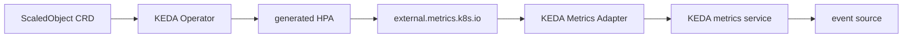
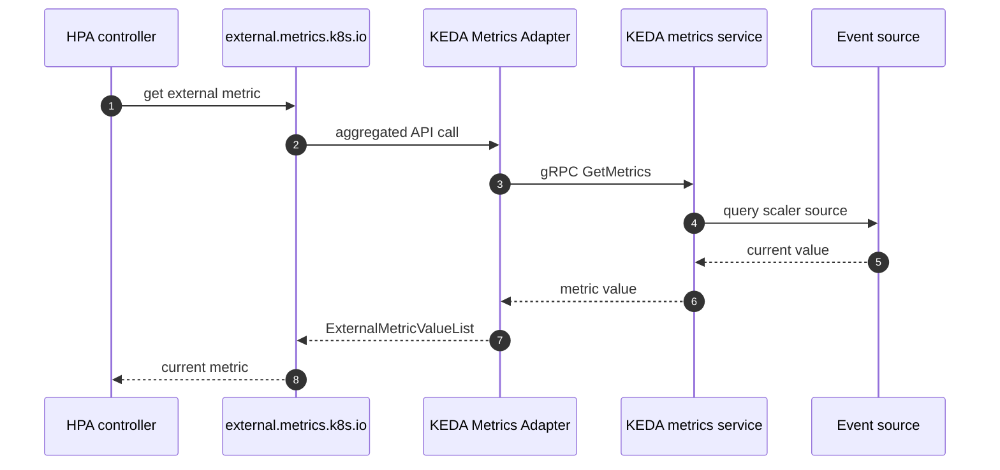
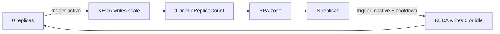

# KEDA 내부 — ScaledObject가 HPA를 만드는 방식

> Azure Kubernetes Service Deep Dive 시리즈 (6/6)

KEDA는 HPA를 대체하지 않습니다.
KEDA는 ScaledObject를 보고 HPA를 만들고,
external metrics 경로를 채우고,
scale-to-zero 경계에서는 HPA 바깥에서 직접 replica를 0으로 씁니다.

---

## KEDA의 큰 구조

---

## ScaledObjectReconciler와 generated HPA

`scaledobject_controller.go`는 대상 리소스가 `/scale` subresource를 노출하는지 확인하고,
라벨을 보장하고,
HPA를 만들거나 갱신합니다.
즉 ScaledObject는 선언이고,
실제 Kubernetes autoscaling 산출물은 HPA입니다.

---

## external metrics 경로

`api_service.yaml`은 `v1beta1.external.metrics.k8s.io`를 등록합니다.
`provider.go`는 adapter가 `scaledobject.keda.sh/name` selector를 읽고 metrics service에 gRPC로 metric을 질의하는 경로를 보여 줍니다.

---

## scale-to-zero 경계

`scale_scaledobjects.go`를 보면 `scaleToZeroOrIdle()`과 `scaleFromZeroOrIdle()` 경로가 별도로 있습니다.
이유는 HPA가 `minReplicas` 아래로 자연스럽게 내려가지 못하기 때문입니다.
따라서 0↔1 구간은 KEDA가 직접 `/scale`을 업데이트하고,
1↔N 구간은 generated HPA가 담당합니다.

---

## 이번 화의 요점

> KEDA는 HPA를 대체하지 않습니다. Operator가 ScaledObject를 감시해 HPA를 만들고, Metrics Adapter는 `external.metrics.k8s.io`를 제공하며, HPA는 그 metric을 사용해 1 이상 구간의 autoscaling을 수행합니다. scale-to-zero 경계는 HPA가 아니라 KEDA가 직접 `replicas: 0`을 써서 처리합니다.

---

## 시리즈 안에서의 위치

이 글은 Azure Kubernetes Service Deep Dive 시리즈 마지막 6화입니다.
5화에서 HPA와 Cluster Autoscaler를 분리해 두었기 때문에, 이번 화에서는 KEDA가 그 위에 정확히 어떤 층으로 올라타는지 더 분명하게 볼 수 있습니다.

---

## 참고 자료

### 1차 출처
- [`scaledobject_controller.go` @ `v2.14.0`](https://github.com/kedacore/keda/blob/v2.14.0/controllers/keda/scaledobject_controller.go)
- [`provider.go` @ `v2.14.0`](https://github.com/kedacore/keda/blob/v2.14.0/pkg/provider/provider.go)
- [`scale_scaledobjects.go` @ `v2.14.0`](https://github.com/kedacore/keda/blob/v2.14.0/pkg/scaling/executor/scale_scaledobjects.go)
- [`api_service.yaml` @ `v2.14.0`](https://github.com/kedacore/keda/blob/v2.14.0/config/metrics-server/api_service.yaml)

### 2차 출처
- [KEDA scaling deployments and custom resources](https://keda.sh/docs/2.14/concepts/scaling-deployments/)
- [Horizontal Pod Autoscaling](https://kubernetes.io/docs/tasks/run-application/horizontal-pod-autoscale/)

### 관련 시리즈
- [Azure AKS 101](../../azure-aks-101/ko/)
- [Azure Functions Deep Dive 5화 — control loop 읽는 법](../../azure-functions-deep-dive/ko/05-scaling-internals.md)
