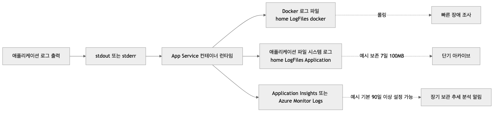
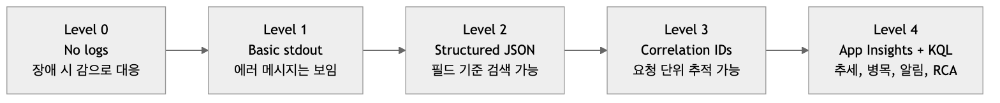
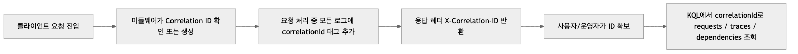

# 로그와 모니터링 기초: “앱이 느려요”에 답할 수 있는 상태 만들기

> Azure App Service 101 시리즈 (6/7)

월요일 오전 9시 07분. Slack이 시끄럽습니다.

> “앱이 느려요.”  
> “결제 페이지에서 가끔 멈춰요.”  
> “방금은 500도 한 번 났어요.”

이때 가장 위험한 상태는 장애 그 자체가 아니라 **아무것도 보이지 않는 상태**입니다. 요청이 어디서 느려졌는지, 앱이 무슨 예외를 냈는지, 같은 사용자의 재현 요청을 어떻게 묶어 볼지 모르면 대응은 감에 의존하게 됩니다.

이번 글의 목표는 단순합니다. **App Service 위의 애플리케이션을 “보이는 시스템”으로 바꾸는 것**입니다.  
파일 시스템 로그부터 시작해서, 실시간 로그 스트림을 보고, 구조화된 JSON 로그를 남기고, Correlation ID로 한 요청을 끝까지 추적하고, 마지막으로 Application Insights와 KQL로 “증상”을 “증거”로 바꾸는 흐름까지 연결하겠습니다.

---

## 먼저 큰 그림: App Service에서 로그는 어디로 가는가?

문제를 풀기 전에 로그의 목적지를 먼저 이해해야 합니다. 같은 `logger.info()`라도 **어디에 남느냐에 따라 쓸모가 완전히 달라지기 때문**입니다.



App Service에서 가장 먼저 기억할 포인트는 다음입니다.

- 앱이 `stdout/stderr`로 출력한 내용은 컨테이너 로그로 수집됨
- 단기 확인은 `/home/LogFiles` 아래 파일이 가장 빠름
- 장기 보관, 검색, 시계열 분석, 알림은 **Application Insights / Azure Monitor**가 담당함
- 파일 시스템 로그는 운영 중 즉시 확인에는 좋지만, **보존 기간과 용량이 제한적**임

| 목적지 | 주 용도 | 특징 |
|---|---|---|
| `stdout/stderr` | 앱이 남긴 원본 로그 | 가장 기본적인 출발점 |
| `/home/LogFiles/*_docker.log` | 배포 직후 확인, 크래시 조사 | 빠르지만 장기 분석용은 아님 |
| `/home/LogFiles/Application/` | 앱 로그 파일 보관 | 보존 기간/용량 제한 존재 |
| Application Insights | 요청/예외/trace/의존성 분석 | KQL, 대시보드, 알림, 장기 추적 가능 |

실무에서는 보통 이렇게 역할을 나눕니다.

- **지금 당장 앱이 왜 안 뜨는지** 본다 → Log stream, Kudu, `/home/LogFiles`
- **지난 3시간 동안 무엇이 점점 느려졌는지** 본다 → Application Insights
- **한 사용자의 한 요청에서 무슨 일이 있었는지** 본다 → 구조화 로그 + Correlation ID + KQL

---

## 관측 가능성은 한 번에 생기지 않는다

대부분의 팀은 처음부터 완성형 observability를 갖추지 못합니다. 보통 아래 단계로 올라갑니다.



이 글도 그 순서대로 갑니다.

1. **No logs** — 장애가 나도 재현만 반복
2. **Basic stdout** — 최소한 지금 무슨 에러인지 보이기 시작
3. **Structured JSON** — 검색과 필터링이 가능해짐
4. **Correlation IDs** — 요청 단위 추적 가능
5. **App Insights + KQL** — 추세, 패턴, 원인 분석 가능

중요한 건 “가장 화려한 도구”가 아니라 **가장 먼저 질문에 답할 수 있는 단계까지 올라가는 것**입니다.

---

## 1단계: 일단 로그가 남게 만들기

아무리 좋은 쿼리 언어가 있어도 앱이 `stdout/stderr`에 아무것도 쓰지 않으면 시작할 수 없습니다. App Service에서 가장 먼저 점검할 건 **로깅이 실제로 활성화되어 있는가**입니다.

### 파일시스템 로깅 활성화

```bash
az webapp log config \
    --resource-group $RG \
    --name $APP_NAME \
    --application-logging filesystem \
    --level information
```

Linux App Service에서는 보통 위처럼 애플리케이션 로그(`stdout/stderr`) 수집을 먼저 켭니다. `--web-server-logging filesystem`은 주로 Windows(IIS) 앱에서 쓰는 옵션입니다.

설정 확인은 다음 명령이 기본입니다.

```bash
az webapp log show \
    --resource-group $RG \
    --name $APP_NAME \
    --output json
```

예를 들어 아래처럼 보이면, 적어도 파일 시스템 로그 수집은 켜진 상태입니다.

```json
{
  "applicationLogs": {
    "fileSystem": {
      "level": "Information"
    }
  },
  "httpLogs": {
    "fileSystem": {
      "enabled": true,
      "retentionInDays": 7,
      "retentionInMb": 100
    }
  }
}
```

여기서 기억할 점은 두 가지입니다.

- **application logging**은 애플리케이션이 남기는 로그
- **web server logging**은 HTTP 요청 관련 로그

즉, “앱에서 예외를 던졌는지”와 “요청이 실제로 들어왔는지”를 분리해서 볼 수 있습니다.

---

## 2단계: 장애 순간에는 실시간 로그부터 본다

사용자가 “지금도 느리다”고 말하는데 30분 뒤에 로그를 꺼내 보면 이미 타이밍을 놓친 경우가 많습니다. 그래서 장애 초반에는 **실시간 로그 스트림**이 가장 빠릅니다.

```bash
az webapp log tail \
    --resource-group $RG \
    --name $APP_NAME
```

이 상태에서 실제로 요청을 한 번 보내 보세요. 예를 들어 `/checkout`에 요청을 보냈을 때 다음처럼 보이면 최소한 “앱은 요청을 받고 로그도 출력한다”는 사실이 확보됩니다.

```text
2026-04-10T00:14:21.310Z INFO checkout request started
2026-04-10T00:14:25.982Z ERROR database timeout while loading cart
```

이 단계에서 주로 푸는 질문은 이런 것들입니다.

- 배포 직후 앱이 뜨자마자 죽는가?
- 요청이 앱까지 도달하는가?
- 특정 엔드포인트에서 예외가 반복되는가?
- 느린 구간이 애플리케이션 내부인지, 외부 의존성인지 힌트가 있는가?

로그가 너무 시끄럽다면 JSON 로그나 특정 문자열만 골라서 볼 수 있습니다.

```bash
az webapp log tail \
    --resource-group $RG \
    --name $APP_NAME \
    | grep --line-buffered '"level"\|ERROR\|WARNING'
```

다만 이 단계는 어디까지나 **초기 대응용**입니다. 실시간 스트림은 편하지만, 과거 추세를 보거나 요청을 정교하게 묶어서 분석하기엔 한계가 있습니다.

---

## 3단계: 문자열 로그를 넘어서 구조화된 로깅으로 간다

운영 로그가 이런 식이면 사람은 읽을 수 있어도 시스템은 잘 못 읽습니다.

```text
Order created for user 123 on region koreacentral with total 150.00
```

반면 JSON 구조화 로그는 필요한 필드를 바로 뽑아낼 수 있습니다.

```json
{
  "timestamp": "2026-04-10T00:20:12.104Z",
  "level": "info",
  "message": "order_created",
  "orderId": "ORD-10452",
  "userId": "user-123",
  "region": "koreacentral",
  "totalAmount": 150.0
}
```

이 차이는 장애 때 극적으로 드러납니다. 문자열 로그에서는 “결제 실패 로그 좀 찾아줘”가 되고, 구조화 로그에서는 “지난 30분간 `orderId`, `userId`, `paymentProvider`, `durationMs` 기준으로 실패 케이스만 모아줘”가 됩니다.

### Python에서 JSON 로그 만들기

```python
import json
import logging
from datetime import datetime, timezone


class JsonFormatter(logging.Formatter):
    def format(self, record):
        payload = {
            "timestamp": datetime.now(timezone.utc).isoformat(),
            "level": record.levelname,
            "message": record.getMessage(),
            "logger": record.name,
        }

        if hasattr(record, "custom_dimensions"):
            payload.update(record.custom_dimensions)

        return json.dumps(payload, ensure_ascii=False)


handler = logging.StreamHandler()
handler.setFormatter(JsonFormatter())

logger = logging.getLogger("app")
logger.handlers = [handler]
logger.setLevel(logging.INFO)
```

사용은 이런 식입니다.

```python
logger.info(
    "checkout_completed",
    extra={
        "custom_dimensions": {
            "orderId": "ORD-10452",
            "userId": "user-123",
            "durationMs": 842,
            "paymentProvider": "stripe"
        }
    }
)
```

### 구조화 로깅에서 무엇을 남겨야 하나?

모든 필드를 다 남기는 것이 능사는 아닙니다. 대신 **나중에 조사 질문으로 다시 돌아올 필드**를 남겨야 합니다.

- `correlationId`: 한 요청 전체 추적
- `route` 또는 `endpoint`: 어느 API였는지
- `userId` 또는 익명화된 사용자 키: 특정 사용자 영향 범위 파악
- `durationMs`: 느린 요청 식별
- `dependency`: DB, Redis, 외부 API 등 병목 후보
- `resultCode` / `success`: 성공/실패 여부

반대로 **비밀번호, 토큰, 카드번호, 주민등록번호 같은 민감 정보는 로그에 남기면 안 됩니다.** 구조화 로그는 검색이 쉬운 만큼, 잘못 남긴 정보도 더 빨리 퍼집니다.

---

## 4단계: Correlation ID가 생기면 “한 요청의 이야기”가 보인다

운영에서 가장 자주 받는 질문 중 하나는 이것입니다.

> “사용자 한 명이 방금 실패했다고 하는데, 그 요청을 정확히 찾을 수 있나요?”

이 질문에 답하는 핵심이 **Correlation ID**입니다.



요청이 들어올 때 ID를 하나 만들고, 그 ID를 **모든 로그에 붙이고**, 응답 헤더로도 돌려주면 다음이 가능해집니다.

- 사용자가 고객 지원에 전달한 ID로 해당 요청의 전체 흐름 추적
- API gateway, 앱, 의존성 호출 로그를 같은 축으로 묶기
- “느렸다”는 증상을 개별 요청 기준으로 재구성

### Flask 예시: 요청마다 Correlation ID 주입

```python
import logging
import uuid
from flask import Flask, g, has_request_context, request

app = Flask(__name__)


@app.before_request
def assign_correlation_id():
    g.correlation_id = request.headers.get("X-Correlation-ID", str(uuid.uuid4()))


@app.after_request
def append_correlation_id(response):
    response.headers["X-Correlation-ID"] = g.correlation_id
    return response


class RequestContextFilter(logging.Filter):
    def filter(self, record):
        record.custom_dimensions = getattr(record, "custom_dimensions", {})

        if has_request_context():
            record.custom_dimensions.update({
                "correlationId": g.get("correlation_id"),
                "method": request.method,
                "path": request.path,
            })

        return True
```

로그 출력 예시는 이렇게 됩니다.

```json
{
  "timestamp": "2026-04-10T00:33:12.205Z",
  "level": "ERROR",
  "message": "payment_provider_timeout",
  "correlationId": "0b9b8537-0eb4-4bc4-93f4-7f7c3778ffef",
  "method": "POST",
  "path": "/checkout",
  "dependency": "stripe",
  "durationMs": 12041
}
```

이제 고객이 `X-Correlation-ID` 헤더 값을 전달하면, 운영자는 “어느 시각에 어떤 경로로 들어왔고 어떤 의존성에서 오래 걸렸는지”를 바로 재구성할 수 있습니다.

---

## 5단계: 파일 시스템 로그만으로는 부족하다

파일 시스템 로그는 빠르지만, 결국 이런 질문에서 막힙니다.

- 오늘 아침 9시부터 11시 사이에 에러율이 얼마나 올랐나?
- 느린 요청은 어느 엔드포인트에 몰려 있나?
- 특정 배포 이후 실패가 늘었나?
- 500 에러가 앱 코드 때문인가, 외부 의존성 때문인가?

이 시점부터는 **Application Insights**가 필요합니다. 핵심은 “로그 저장소 하나 더 추가”가 아니라, **요청(Requests), 예외(Exceptions), traces, dependencies를 함께 분석할 수 있게 되는 것**입니다.

### Application Insights 연결

```bash
az monitor app-insights component create \
    --resource-group $RG \
    --app $APP_NAME-insights \
    --location $LOCATION \
    --kind web
```

연결 문자열을 가져와 App Settings에 넣습니다.

```bash
APPINSIGHTS_CS=$(az monitor app-insights component show \
    --resource-group $RG \
    --app $APP_NAME-insights \
    --query connectionString \
    --output tsv)

az webapp config appsettings set \
    --resource-group $RG \
    --name $APP_NAME \
    --settings APPLICATIONINSIGHTS_CONNECTION_STRING=$APPINSIGHTS_CS
```

Python에서는 OpenTelemetry 기반 구성으로 시작하는 편이 무난합니다.

```bash
pip install azure-monitor-opentelemetry
```

```python
import os
from azure.monitor.opentelemetry import configure_azure_monitor


if os.environ.get("APPLICATIONINSIGHTS_CONNECTION_STRING"):
    configure_azure_monitor(
        connection_string=os.environ["APPLICATIONINSIGHTS_CONNECTION_STRING"]
    )
```

이 구성이 되면 최소한 다음 축을 함께 볼 수 있습니다.

- 들어온 요청 수와 응답 시간
- 실패한 요청과 예외
- 외부 의존성(DB, HTTP 호출) 지연
- 앱이 남긴 trace 로그

즉, “에러 하나 찾기”에서 “문제 패턴을 설명하기”로 넘어갑니다.

---

## 6단계: KQL은 운영자의 디버깅 언어다

KQL을 배우는 이유는 멋진 대시보드를 만들기 위해서가 아닙니다. **질문을 바로 쿼리로 바꿀 수 있기 때문**입니다. 아래 예시는 교과서용이 아니라, 실제로 자주 쓰는 운영 질문 기준으로 정리했습니다.

> 아래 예시는 Application Insights가 Azure Monitor Logs에 수집된 상황을 가정합니다. 환경에 따라 테이블/필드 이름이 약간 다를 수 있으니, 포털에서 실제 스키마를 함께 확인하세요.

### 질문 1) “지금 어떤 에러가 가장 많이 터지고 있지?”

장애 초반에는 개별 로그를 보는 것보다 **같은 에러가 얼마나 반복되는지**가 중요합니다.

```kql
AppTraces
| where TimeGenerated > ago(30m)
| where SeverityLevel >= 3
| summarize count() by Message
| order by count_ desc
```

이 쿼리는 “가장 시끄러운 에러 메시지”부터 보여 줍니다. Slack에 장애 제보가 폭주하는 순간, 보통 여기서 가장 먼저 중심 패턴이 보입니다.

### 질문 2) “느린 요청은 정확히 어느 API에서 발생하나?”

사용자가 “전체가 느리다”고 말해도 실제로는 특정 엔드포인트 하나가 평균을 망치고 있는 경우가 많습니다.

```kql
AppRequests
| where TimeGenerated > ago(1h)
| summarize
    requestCount = count(),
    p50 = percentile(DurationMs, 50),
    p95 = percentile(DurationMs, 95),
    p99 = percentile(DurationMs, 99)
  by Name
| order by p95 desc
```

평균보다 **p95/p99**를 보는 이유는, 사용자가 체감하는 “느림”은 대개 꼬리 지연(latency tail)에 숨어 있기 때문입니다.

### 질문 3) “500 에러가 특정 배포 이후 늘었나?”

배포 직후 장애 여부를 볼 때는 추세가 먼저입니다.

```kql
AppRequests
| where TimeGenerated > ago(6h)
| summarize
    total = count(),
    failed = countif(Success == false),
    failureRate = 100.0 * countif(Success == false) / count()
  by bin(TimeGenerated, 5m)
| render timechart
```

배포 시각 전후로 실패율 곡선이 꺾이는지 보면 “이번 릴리스가 원인 후보인가?”를 빠르게 좁힐 수 있습니다.

### 질문 4) “checkout이 느린데, DB 때문이야? 외부 API 때문이야?”

요청만 보면 느리다는 사실만 보이고, 원인은 안 보입니다. 그래서 dependency 데이터를 함께 봐야 합니다.

```kql
AppDependencies
| where TimeGenerated > ago(1h)
| summarize
    avgDurationMs = avg(DurationMs),
    p95DurationMs = percentile(DurationMs, 95),
    failures = countif(Success == false)
  by DependencyType, Target, Name
| order by p95DurationMs desc
```

이 쿼리는 “가장 느린 외부 의존성”을 위로 올려줍니다. 예를 들어 `POST api.stripe.com`의 p95가 급등했다면, 앱 코드가 아니라 외부 결제 API 쪽 병목일 가능성이 커집니다.

### 질문 5) “한 사용자가 겪은 그 요청 하나를 끝까지 따라가고 싶다”

이때 Correlation ID가 진가를 발휘합니다.

```kql
let targetCorrelationId = "0b9b8537-0eb4-4bc4-93f4-7f7c3778ffef";
AppTraces
| where TimeGenerated > ago(24h)
| extend correlationId = tostring(Properties["correlationId"])
| where correlationId == targetCorrelationId
| project TimeGenerated, SeverityLevel, Message, Properties
| order by TimeGenerated asc
```

이 쿼리의 장점은 간단합니다. 사용자가 전달한 헤더 값만 있으면, 해당 요청에 딸린 로그들을 **시간 순서대로 다시 읽을 수 있습니다.**

요청 데이터까지 함께 묶고 싶다면 이렇게 확장할 수 있습니다.

```kql
let targetCorrelationId = "0b9b8537-0eb4-4bc4-93f4-7f7c3778ffef";
union AppRequests, AppTraces, AppDependencies, AppExceptions
| where TimeGenerated > ago(24h)
| extend correlationId = tostring(Properties["correlationId"])
| where correlationId == targetCorrelationId
| order by TimeGenerated asc
```

### 질문 6) “문제가 특정 사용자/특정 경로에만 집중되나?”

구조화 로그에 `userId`, `path`, `resultCode` 같은 필드가 있으면 바로 분해할 수 있습니다.

```kql
AppTraces
| where TimeGenerated > ago(1h)
| extend userId = tostring(Properties["userId"])
| extend path = tostring(Properties["path"])
| where Message == "payment_provider_timeout"
| summarize failures = count() by path, userId
| order by failures desc
```

이런 쿼리는 “전체 장애”와 “특정 고객군 문제”를 구분하는 데 특히 유용합니다.

---

## 7단계: 알림은 “지표”보다 “행동 가능한 신호”에 걸어야 한다

모니터링을 시작하면 누구나 처음에는 알림을 많이 만들고 싶어집니다. 하지만 실무에서 중요한 건 **많은 알림이 아니라, 실제 대응으로 이어지는 알림**입니다.

예를 들어 이런 신호는 의미가 있습니다.

- HTTP 5xx가 5분 연속 증가
- 특정 엔드포인트의 p95 응답시간 급증
- `payment_provider_timeout` 같은 핵심 비즈니스 에러 급증
- 인스턴스 재시작 반복 또는 애플리케이션 크래시 반복

### 메트릭 기반 예시: 5xx 알림

```bash
APP_ID=$(az webapp show --resource-group $RG --name $APP_NAME --query id -o tsv)

az monitor metrics alert create \
    --resource-group $RG \
    --name "appservice-http5xx-spike" \
    --scopes "$APP_ID" \
    --condition "total Http5xx > 10" \
    --window-size 5m \
    --evaluation-frequency 1m
```

하지만 메트릭만으로는 “왜”를 설명하기 어렵습니다. 그래서 운영이 성숙해질수록 **KQL 기반 log alert**도 같이 고려하게 됩니다.

예를 들어 “지난 10분간 `payment_provider_timeout`이 20건 이상이면 알림” 같은 식입니다. 이런 조건은 단순 CPU보다 훨씬 행동 가능성이 높습니다.

알림 설계에서 자주 하는 실수는 다음입니다.

- 너무 민감해서 늘 울림
- 너무 둔감해서 장애 후에야 울림
- 팀이 실제로 대응하지 않는 지표에 걸어 둠

알림의 목적은 “시끄럽게 만들기”가 아니라 **사람이 바로 다음 행동을 할 수 있게 만들기**입니다.

---

## 파일 시스템에서 직접 로그를 확인해야 하는 순간도 있다

포털과 Application Insights가 있어도, 다음 상황에서는 여전히 `/home/LogFiles`가 가장 빠릅니다.

- 앱이 시작하자마자 죽어서 telemetry 초기화 전에 종료됨
- 배포 스크립트 문제인지 앱 문제인지 분리해야 함
- 컨테이너 시작 커맨드/의존성 설치 실패를 봐야 함

### Kudu에서 확인

Kudu에 접속하면 로그 파일을 바로 볼 수 있습니다.

```text
https://<app-name>.scm.azurewebsites.net
```

주로 보는 경로는 다음입니다.

```text
/home/LogFiles/
├── <hostname>_docker.log
├── Application/
│   └── <date>_<hostname>_default_docker.log
└── kudu/
    └── deployment/
```

### SSH에서 직접 보기

```bash
az webapp ssh --resource-group $RG --name $APP_NAME
```

접속 후에는 보통 이렇게 확인합니다.

```bash
tail -f /home/LogFiles/*_docker.log
```

### 로그 내려받기

```bash
az webapp log download \
    --resource-group $RG \
    --name $APP_NAME \
    --log-file ./logs.zip
```

이 단계는 “장기 운영 체계”라기보다 **초기 장애 대응용 현장 조사**에 가깝습니다.

---

## 로그 레벨은 정보량이 아니라 비용과 위험의 균형이다

운영 중 장애가 나면 `DEBUG`를 켜고 싶은 유혹이 큽니다. 필요할 때도 분명 있지만, **로그 레벨 증가는 곧 비용 증가와 민감 정보 노출 위험 증가**로 이어집니다.

| 레벨 | 언제 쓰나 | 운영 기본값 권장 |
|---|---|---|
| DEBUG | 개발/짧은 조사 세션 | 보통 비활성화 |
| INFO | 정상 요청 흐름, 핵심 비즈니스 이벤트 | 기본값 |
| WARNING | 비정상 조짐, 재시도 발생 | 활성화 권장 |
| ERROR | 요청 실패, 예외 | 반드시 활성화 |
| CRITICAL | 서비스 불능급 장애 | 반드시 활성화 |

일시적으로 레벨을 올릴 때는 바꾸는 것보다 **원복 시점을 같이 정하는 것**이 중요합니다.

```bash
az webapp config appsettings set \
    --resource-group $RG \
    --name $APP_NAME \
    --settings LOG_LEVEL=DEBUG
```

조사가 끝났다면 바로 원복합니다.

```bash
az webapp config appsettings set \
    --resource-group $RG \
    --name $APP_NAME \
    --settings LOG_LEVEL=INFO
```

그리고 DEBUG 로그를 설계할 때도 “토큰 전체 출력” 같은 습관은 금물입니다. **조사에 필요한 필드만 남기고, 민감 정보는 마스킹**해야 합니다.

---

## 월요일 오전 장애 대응 플레이북

지금까지 내용을 실제 운영 흐름으로 압축하면 이렇게 됩니다.

### 상황

- Slack: “앱이 느려요”
- 일부 사용자는 체크아웃 실패 제보
- 직전 1시간 안에 배포 한 번 있음

### 순서 1) 지금도 재현되는지 확인

- `az webapp log tail`로 실시간 로그 연결
- 실제 요청을 보내 응답 시간과 에러 로그 확인

### 순서 2) App Insights에서 폭을 파악

- `AppRequests`로 p95/p99 상승 여부 확인
- 실패율 timechart로 배포 시점과 비교

### 순서 3) 원인 후보를 줄임

- `AppDependencies`로 DB/외부 API 중 어느 쪽이 느린지 확인
- `AppExceptions`, `AppTraces`에서 반복 메시지 상위 확인

### 순서 4) 사용자 한 건을 끝까지 추적

- 응답 헤더의 `X-Correlation-ID` 확보
- KQL로 해당 요청의 trace/request/dependency를 시간 순서로 재구성

### 순서 5) 재발 방지 포인트 남김

- 다음에는 어떤 필드를 구조화 로그에 추가할지 정리
- 필요한 알림을 메트릭 기반 또는 KQL 기반으로 추가

즉, 좋은 모니터링은 “대시보드가 멋진 상태”가 아니라 **느리다 → 어디가 느린지 안다 → 같은 문제가 다시 나면 더 빨리 찾는다**로 이어지는 상태입니다.

---

## 정리

App Service에서 로그와 모니터링의 핵심은 도구 이름이 아니라 **문제 해결 순서**입니다.

- 파일 시스템 로그로 **지금 당장** 무슨 일이 일어나는지 본다
- 구조화된 JSON 로그로 **검색 가능한 증거**를 만든다
- Correlation ID로 **한 요청의 흐름**을 끝까지 추적한다
- Application Insights와 KQL로 **패턴, 추세, 병목**을 분석한다
- 알림은 시끄러운 지표가 아니라 **행동 가능한 신호**에 건다

이 상태가 되면 “앱이 느려요”라는 제보가 들어와도 막막하지 않습니다. 적어도 어디부터 봐야 하는지, 무엇을 묶어서 봐야 하는지, 다음에 어떤 로그를 더 남겨야 하는지가 보이기 시작합니다.

그리고 여기서 자연스럽게 다음 질문이 나옵니다.

> “원인을 찾았더니 트래픽이 진짜 늘어난 거라면, 이제 어떻게 확장해야 하지?”

다음 글인 **7편 Scaling 101**에서는 바로 그 질문을 다룹니다.  
언제 더 큰 인스턴스로 올려야 하는지(Scale Up), 언제 인스턴스를 여러 개로 늘려야 하는지(Scale Out), 그리고 Autoscale을 어떻게 안전하게 설계할지 이어서 보겠습니다.

---

## 시리즈 목차

1. Azure App Service란? - 플랫폼 아키텍처 이해하기
2. Request Lifecycle: 3am에 터진 502를 어디서부터 봐야 할까
3. Hosting Models: 어떤 플랜을 선택해야 할까?
4. 첫 번째 배포: 로컬에서 Azure까지 (Python/Flask)
5. Configuration 마스터하기: App Settings & 환경변수
6. **[현재 글] 로그와 모니터링 기초: “앱이 느려요”에 답할 수 있는 상태 만들기**
7. Scaling 101: 언제 Scale Up vs Scale Out?

---

## 참고 자료

- [Enable diagnostics logging for apps in Azure App Service (Microsoft Learn)](https://learn.microsoft.com/azure/app-service/troubleshoot-diagnostic-logs)
- [Monitor Azure App Service (Microsoft Learn)](https://learn.microsoft.com/azure/app-service/monitor-app-service)
- [Enable Azure Monitor OpenTelemetry for Python applications (Microsoft Learn)](https://learn.microsoft.com/azure/azure-monitor/app/opentelemetry-enable?tabs=python)
- [Application Insights telemetry data model (Microsoft Learn)](https://learn.microsoft.com/azure/azure-monitor/app/data-model-complete)
- [Kusto Query Language quick reference (Microsoft Learn)](https://learn.microsoft.com/azure/data-explorer/kql-quick-reference)

---
