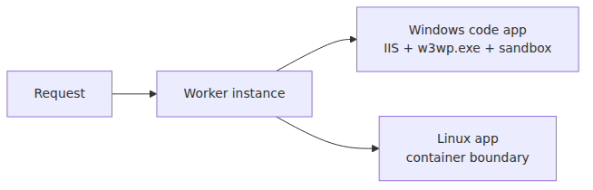
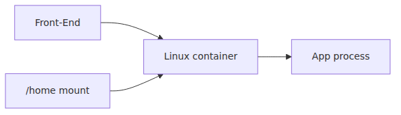
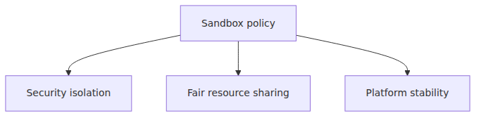

# Workers and the sandbox — where user code actually runs

> Azure App Service Deep Dive series (3/6)

Episode 2 stopped when the Front-End and ARR delivered a request to a worker.
This post asks the next question.

**Inside that worker,
where does user code actually run,
what is allowed,
and what is blocked?**

This matters less for theory than for failure analysis.
Deployment succeeds,
but one library fails.
Local IIS works,
but App Service does not.
Linux containers work,
but Windows code apps do not.
All of those symptoms start here.

---

## The two worker models that matter

“Worker” is one platform term.
The execution boundary under it differs by OS and hosting mode.

- **Windows code**: the app runs under IIS and inside the App Service sandbox.
- **Linux built-in or custom container**: the container is the core execution boundary.

Both provide isolation.
They do not provide the same constraints.

---

## Windows: `w3wp.exe` under the App Service sandbox

The Kudu sandbox wiki describes Windows App Service as running each app inside its own sandbox.
The key points are blunt.

- each app is isolated from others on the same machine
- the platform enforces limits for multi-tenancy
- those limits affect registry access, graphics APIs, and some networking behavior

The public sandbox material is especially explicit about two constraints.

- registry writes are blocked
- most Win32k-based APIs,
  which means most User32/GDI32 calls,
  are heavily restricted

That single diagram explains the starting point for “why does this PDF or imaging library fail only on Windows App Service?”

---

## Why GDI and the registry show up so often

The OS functionality article and the sandbox wiki line up on the same pattern.

### Registry

Locally hosted server software often assumes it can write to the registry.
That assumption breaks in the Windows App Service sandbox.

### GDI / User32

Most web workloads do not need the Windows UI subsystem.
But some PDF,
image,
font,
and browser-automation libraries still depend on it.

That is why the same failure families keep repeating.

- HTML-to-PDF libraries fail
- custom font rendering behaves oddly
- Selenium or PhantomJS paths break
- `System.Drawing`-based code fails

This is not mysterious platform behavior.
It is the expected result of a sandbox that is intentionally narrowed for multi-tenant web workloads.

---

## Linux: the container is the execution boundary

On Linux App Service,
the public model is much simpler.
The app runs in a container.

Whether you use a built-in image or a custom image,
the operational boundary to care about is this one:

- the process is inside the container
- readiness affects when traffic starts
- persistent storage depends on `/home` mount behavior

On Linux,
you should not talk about the exact same registry or GDI restrictions as Windows.
The public docs do not frame it that way.
The primary concerns are the container startup contract,
port binding,
storage mounting,
and startup time limits.

---

## When `WEBSITES_ENABLE_APP_SERVICE_STORAGE` changes what a worker means

For Linux custom containers,
one setting changes the meaning of `/home` dramatically.

- with `true`, persistent shared storage is mounted
- with `false`, the filesystem behaves much closer to ephemeral container-local state

That gives you two very different operational pictures.

If you miss this distinction,
you eventually see one of the usual surprises.

- uploaded files disappear after restart
- scale-out instances do not see expected content
- the SCM view of files and the app's view of files appear inconsistent

---

## Process boundaries inside the worker

When debugging a worker issue,
ask “what boundary is my code inside?” before asking “what is wrong with my code?”

### Windows code apps

- IIS owns process lifecycle
- sandbox restrictions apply directly
- some OS-dependent libraries can fail by design

### Linux apps

- the container entrypoint and startup command own lifecycle
- readiness pings determine when organic traffic can enter
- port configuration and startup timeout are common failure causes

That is why the same service name,
App Service,
still produces different first diagnostic questions depending on hosting mode.

---

## The sandbox is a security feature and a fairness feature

It is easy to read “sandbox” as only a security concept.
That is only half right.

In App Service,
the sandbox is also a quality-of-service mechanism.
Multiple customer apps share worker infrastructure.
The platform needs limits so that one app cannot consume or expose shared components in ways that harm others.

That makes the restrictions easier to reason about.

- registry writes blocked
- graphics subsystem access narrowed
- some local communication patterns constrained

These are not arbitrary inconveniences.
They are part of the contract that makes multi-tenant web hosting viable.

---

## A cleaner classification for “works locally, fails in App Service”

### Windows-heavy failure pattern

- libraries that assume COM or registry customization
- PDF and imaging libraries with GDI dependencies
- code that expects desktop fonts or desktop components

### Linux-heavy failure pattern

- port binding mismatch
- startup time limit exceeded
- misunderstanding `/home` persistence
- weak entrypoint or readiness design

Make this split first,
and you can usually tell whether the failure is an app bug,
a worker contract mismatch,
or a sandbox limitation.

---

## When to consider Windows containers or another hosting path

Some workloads simply do not fit the Windows code sandbox well.

- hard dependency on GDI calls
- mandatory registry or OS customization
- heavy install-time assumptions

In those cases,
Windows containers,
or a different hosting model entirely,
may fit better.
The important move is not to keep guessing.
First check whether the limitation is already documented in the public App Service sandbox material.

---

## Episode 3 wrap

The core idea here is that the worker is not an abstract instance count.
It is a real execution boundary.

> On Windows App Service, user code runs under IIS and inside the App Service sandbox, where registry writes and most User32/GDI32 calls are restricted. On Linux App Service, the core boundary is the container, and the dominant concerns are startup contract, readiness, and `/home` storage semantics. The same App Service label therefore leads to different first-principles debugging paths on Windows and Linux.

Episode 4 now follows how code gets into that worker.
We will trace Kudu,
Oryx,
artifact placement,
and why run-from-package changes the meaning of `wwwroot`.

---

## Where this fits in the series

Episode 2 delivered requests to the worker, and this post explained the execution boundary inside that worker.
The next post follows deployment into that boundary and connects Kudu, Oryx, build automation, and file placement under `/home/site/wwwroot`.

---

## References

### Primary sources
- [Azure Web App sandbox](https://github.com/projectkudu/kudu/wiki/Azure-Web-App-sandbox/843a564005d4f1028c5e171cf37d35da731f0572)

### Secondary sources
- [Operating system functionality in Azure App Service](https://learn.microsoft.com/azure/app-service/operating-system-functionality)
- [Configure a custom container for Azure App Service](https://learn.microsoft.com/azure/app-service/configure-custom-container)
- [Environment variables and app settings reference](https://learn.microsoft.com/azure/app-service/reference-app-settings)

### Related Series
- [Azure App Service 101 — Hosting Models](../../azure-app-service-101/en/03-hosting-models.md)
- [Azure Functions Deep Dive — Worker Process](../../azure-functions-deep-dive/en/02-worker-process.md)
