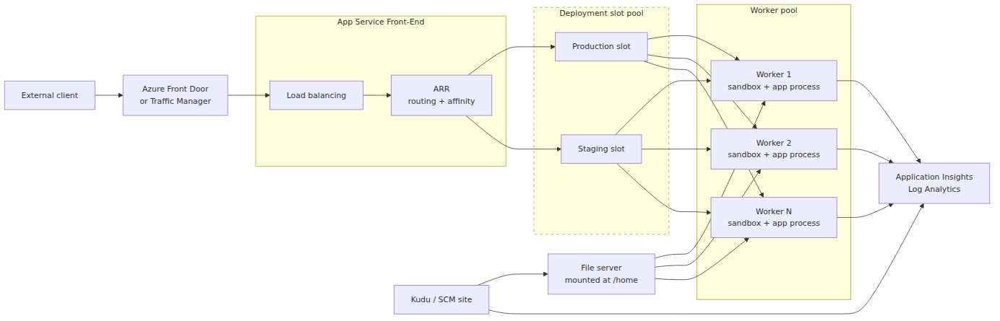
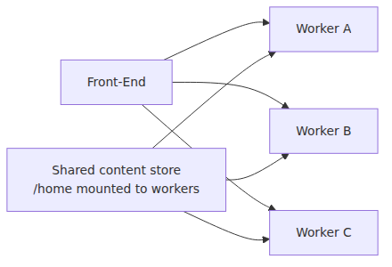
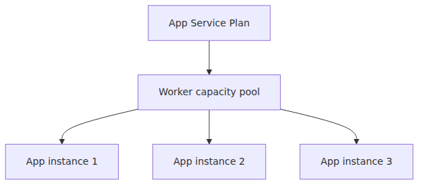
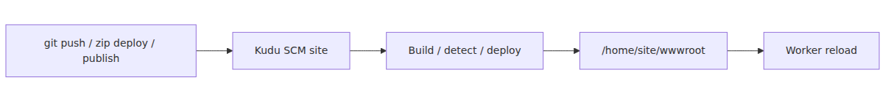
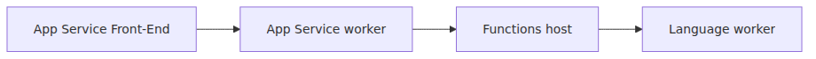

# App Service 플랫폼 아키텍처 — Front-End·Worker·File Server

> Azure App Service Deep Dive 시리즈 (1/6)

App Service 101에서는 Management Plane, Runtime Plane, SCM Plane이라는 운영 관점을 먼저 잡았습니다.
이번 심화 시리즈는 그중 Runtime Plane과 SCM Plane의 실제 바닥면을 더 가까이 봅니다.
요청이 어디로 들어오고,
어디에서 사용자 코드가 돌고,
배포된 파일이 어디에 놓이며,
스케일링과 워밍업이 어떤 경로로 연결되는지,
박스를 나눠서 끝까지 따라갑니다.

여기서 한 가지를 먼저 분명히 해둘 필요가 있습니다.
**Azure Functions도 이 App Service 인프라 위에서 동작합니다.**
Functions Deep Dive 시리즈가 함수 호스트 프로세스와 gRPC 채널을 확대했다면,
이번 시리즈는 그 호스트가 올라타는 App Service 기판을 확대합니다.
즉,
Functions Deep Dive가 프로세스 안쪽을 봤다면,
이번 글은 그 프로세스를 받치는 플랫폼 자체를 봅니다.

---

## 전체 그림 — App Service 한 인스턴스가 받는 요청

이 그림이 이번 시리즈의 지도입니다.
뒤의 다섯 편은 여기 있는 박스를 하나씩 확대하는 구조입니다.
먼저 위치를 잡아 두면 세부 동작을 읽을 때 길을 잃지 않습니다.

왼쪽의 외부 클라이언트와 글로벌 진입점은 101에서 다룬 요청 진입부입니다.
가운데의 Front-End와 ARR은 2화에서,
오른쪽의 Worker와 샌드박스는 3화에서,
옆의 Kudu와 파일 배치 경로는 4화에서,
Worker pool이 늘어나는 과정은 5화에서,
첫 요청이 비싸지는 이유와 warm-up 신호는 6화에서 확대합니다.

---

## App Service를 박스 세 개로 보면 부족한 이유

101에서의 3-Plane 모델은 운영 판단에 좋았습니다.
하지만 플랫폼 내부를 보려면 조금 더 물리적인 그림이 필요합니다.

이번 시리즈에서는 App Service를 다음 다섯 박스로 봅니다.

1. Front-End
2. ARR 기반 라우팅
3. Worker 인스턴스
4. 공유 파일 서버
5. Kudu 배포 엔진

이 다섯 박스를 함께 봐야 다음 질문이 한 줄로 이어집니다.

- 왜 어떤 요청은 같은 워커로 계속 붙는가
- 왜 여러 인스턴스가 `/home` 아래 같은 파일을 보는가
- 왜 배포는 끝났는데 첫 요청은 느릴 수 있는가
- 왜 Kudu에서 보이는 성공이 곧바로 앱 응답 성공과 같지 않은가

---

## 표준 아키텍처 — Front-End, Worker, shared storage

Microsoft가 공개적으로 반복 설명하는 App Service의 표준 아키텍처는 비교적 단순합니다.

- **Front-End machines**: HTTP/HTTPS 진입점입니다.
- **Worker machines**: 실제 사용자 앱을 실행합니다.
- **shared storage**: 모든 워커가 같은 앱 파일을 보게 합니다.

특히 Windows 로컬 캐시 문서는 이 shared content store가 여러 VM 인스턴스에 공유된다고 분명히 설명합니다.
즉,
멀티 인스턴스 App Service는 각 워커가 제각기 다른 코드 복사본을 들고 있는 구조가 아니라,
공유된 앱 콘텐츠를 같은 기준점으로 본다고 이해하는 편이 맞습니다.

여기서 중요한 건 속도가 아니라 성질입니다.
이 스토리지는
공유되고,
재시작 뒤에도 남고,
모든 워커가 같은 경로로 보게 됩니다.
그래서 `/home/site/wwwroot`에 배포된 결과가 scale-out 뒤에도 워커마다 달라지지 않습니다.

---

## Front-End는 단순한 네트워크 홉이 아닙니다

App Service Front-End는 단순 TCP 전달기가 아닙니다.
요청을 받아서 어느 앱으로 보낼지 정하고,
어느 워커로 보낼지 고르고,
필요하면 affinity 쿠키를 사용해 같은 사용자를 같은 워커에 오래 붙입니다.

이 글에서는 세부 구현을 추측하지 않습니다.
Microsoft가 공개한 범위에서만 정리하면 다음 정도가 확실합니다.

- Front-End는 App Service의 공개 진입점입니다.
- ARR이 여기서 동작합니다.
- ARR Affinity 쿠키는 같은 세션의 요청을 같은 워커에 계속 붙이는 데 쓰입니다.

이 특성 때문에 App Service는 기본적으로 stateless 앱에 더 잘 맞습니다.
세션을 프로세스 메모리에 붙잡고 있으면,
scale-in,
worker 교체,
affinity 해제,
orchestrated restart 때 문제가 드러납니다.

---

## Worker는 “인스턴스 수”라는 숫자의 실체입니다

포털에서 인스턴스를 3개로 늘린다는 말은,
Worker pool 안에서 여러분 앱을 처리할 worker capacity가 세 개의 실행 단위로 확보된다는 뜻입니다.

다만 worker를 이해할 때 자주 생기는 오해가 있습니다.
“앱 하나 = VM 하나”가 아닙니다.

실제로는 다음이 더 가깝습니다.

- App Service Plan이 worker capacity를 가집니다.
- 각 앱은 그 capacity 위에 배치됩니다.
- scale-out은 앱의 실행 인스턴스를 여러 worker에 늘립니다.

이때 사용자 코드가 실제로 돌고 있는 자리가 worker입니다.
Windows 코드 앱이면 IIS 아래의 `w3wp.exe` 계열 프로세스가 그 핵심이고,
Linux 앱이면 컨테이너가 그 핵심입니다.
이 차이는 3화에서 자세히 봅니다.

---

## 파일 서버는 배포 결과의 공통 기반입니다

App Service를 VM처럼 생각하면,
배포가 각 서버 로컬 디스크에 복사된다고 상상하기 쉽습니다.
하지만 App Service의 공용 문서는 오히려 반대 그림을 보여 줍니다.

shared content store가 있고,
여러 인스턴스가 그것을 봅니다.

Linux 기준으로 독자가 가장 자주 보는 경로는 이렇습니다.

- `/home/site/wwwroot` — 앱 코드 배치 위치
- `/home/LogFiles` — 로그 위치
- `/home/data` — 패키지와 부가 데이터가 놓일 수 있는 위치

run-from-package를 켜면 여기서도 성질이 조금 달라집니다.
ZIP이 풀려서 `wwwroot`에 복사되는 대신,
패키지 자체가 mount된 읽기 전용 `wwwroot`가 됩니다.
이 차이는 4화에서 다시 다룹니다.

---

## Kudu는 배포를 실행하는 buddy site입니다

Kudu를 이해할 때 가장 중요한 표현은 “별도 출입구”보다 한 단계 더 구체적인 말입니다.
Kudu는 앱의 **SCM buddy site** 입니다.

Kudu 아키텍처 위키는 Kudu를 실사이트 옆에 붙은 single-tenant 서비스로 설명합니다.
이 buddy site는 실제 사이트의 파일에 접근해 배포와 진단을 수행합니다.

즉,
Kudu는 단순한 로그 뷰어가 아닙니다.
배포 엔진이고,
ZipDeploy와 publish API의 실행 주체이며,
Windows App Service 배포 자동화의 공개 소스 코드 창구입니다.

Kudu가 건드리는 건 결국 파일 배치와 앱 재기동 경로입니다.
그래서 배포 문제를 읽을 때는 Kudu 로그를 보고,
런타임 문제를 읽을 때는 앱 로그와 플랫폼 신호를 같이 봐야 합니다.

---

## Functions와 App Service의 경계선

Functions Deep Dive를 이미 읽은 독자라면 이런 질문이 생깁니다.

“그럼 Functions host는 이 그림에서 어디에 있나?”

답은 worker 안입니다.

- App Service substrate가 worker와 파일 시스템과 네트워크 진입점을 제공합니다.
- 그 위에서 Functions host가 뜹니다.
- 다시 그 host가 language worker와 gRPC 채널을 엽니다.

그래서 두 시리즈는 경쟁 관계가 아닙니다.
Functions 시리즈는 App Service 위에서 돌아가는 특정 런타임의 내부를 본 것이고,
이번 시리즈는 그 런타임을 떠받치는 범용 웹 플랫폼을 보는 것입니다.

---

## 이 구조에서 운영 문제가 생기는 지점

아키텍처를 박스로 나누면 장애도 박스별로 나눌 수 있습니다.

### Front-End 쪽 냄새

- 특정 사용자만 같은 인스턴스에 붙는 문제
- affinity가 남아 부하가 고르게 안 퍼지는 문제
- 워커가 준비되기 전 트래픽이 들어가는 문제

### Worker 쪽 냄새

- 앱 프로세스 시작 실패
- 샌드박스 제약으로 특정 라이브러리 실패
- 컨테이너 준비 지연

### File Server 쪽 냄새

- 배포는 성공했는데 기대 파일이 안 보이는 문제
- 공유 경로를 로컬 디스크처럼 써서 생기는 잠금·성능 문제

### Kudu 쪽 냄새

- 배포 감지 성공 vs 런타임 실패 분리
- Oryx 빌드는 성공했지만 startup contract는 실패하는 문제

이렇게 잘라 두면 “App Service가 이상하다”는 추상적인 문장이,
어느 박스부터 확인할지 정해진 체크리스트로 바뀝니다.

---

## 왜 이 심화 시리즈에서 closed-source를 추측하지 않는가

App Service는 전부 오픈소스가 아닙니다.
특히 Front-End와 worker allocation의 세부 구현은 공개 저장소로 전부 확인할 수 없습니다.

그래서 이번 시리즈의 원칙은 단순합니다.

- 공개된 Learn 문서로 확인되는 내용은 Learn으로 말합니다.
- 공개 저장소가 있는 Kudu와 Oryx는 태그 고정 GitHub 링크로 말합니다.
- 공개되지 않은 내부 스케줄러 세부 구현은 추측하지 않습니다.

이 원칙이 중요한 이유는,
심화 글이 디테일을 늘리는 순간 가장 쉽게 망가지는 부분이 바로 “그럴듯하지만 비공개인 내부 구현을 상상하는 것”이기 때문입니다.

---

## 이번 화 정리

이번 1화의 핵심은 App Service를 한 장의 지도로 보는 것입니다.

> 클라이언트 요청은 App Service Front-End로 들어오고, ARR이 적절한 worker로 보냅니다. worker는 사용자 코드를 실행하고, 여러 worker는 `/home` 아래의 공유 스토리지를 함께 봅니다. Kudu는 옆의 SCM buddy site로서 배포를 실행하고, 결과 파일을 그 공유 스토리지에 배치합니다. Azure Functions도 이 같은 substrate 위에서 동작하며, Functions Deep Dive는 그 위의 host 프로세스를 본 것이고 이번 시리즈는 그 아래의 App Service 자체를 봅니다.

다음 2화에서는 이 그림의 왼쪽 가운데를 확대합니다.
Front-End와 ARR이 어떻게 요청을 워커에 보내는지,
그리고 왜 ARR Affinity를 끄는 것이 stateless 앱에 자주 권장되는지 이어서 다룹니다.

---

## 이 시리즈에서의 위치

이 글은 App Service Deep Dive의 입구로서, 뒤의 다섯 편이 확대할 박스를 한 번에 배치합니다.
2화는 Front-End와 ARR, 3화는 worker와 sandbox, 4화는 Kudu와 배포, 5화는 scale-out 경로, 6화는 cold start와 warm-up으로 이어집니다.

---

<!-- toc:begin -->
## 시리즈 목차

- **App Service 플랫폼 아키텍처 — Front-End·Worker·File Server (현재 글)**
- Front-End과 ARR — 요청은 어떻게 워커에 도달하는가 (예정)
- Worker 인스턴스와 샌드박스 — 사용자 코드를 어디에 가두는가 (예정)
- 배포와 Kudu — 빌드·동기화·릴리스의 안쪽 (예정)
- 스케일링 내부 동작 — Scale Out 결정과 워커 추가 경로 (예정)
- 콜드 스타트와 Warmup — 첫 요청이 비싼 이유 (예정)

<!-- toc:end -->

---

## 참고 자료

### 1차 출처
- [Kudu architecture](https://github.com/projectkudu/kudu/wiki/Kudu-architecture/863125fba81e8b30950676bf495c7b7d74c00b92)
- [PushDeploymentController.cs @ S62](https://github.com/projectkudu/kudu/blob/S62/Kudu.Services/Deployment/PushDeploymentController.cs)
- [NinjectServices.cs @ S62](https://github.com/projectkudu/kudu/blob/S62/Kudu.Services.Web/App_Start/NinjectServices.cs)
- [Oryx README @ 20240408.1](https://github.com/microsoft/Oryx/blob/20240408.1/README.md)
- [Oryx BuildScriptGenerator directory @ 20240408.1](https://github.com/microsoft/Oryx/tree/20240408.1/src/BuildScriptGenerator)

### 2차 출처
- [Overview of Azure App Service](https://learn.microsoft.com/azure/app-service/overview)
- [Local Cache in Azure App Service](https://learn.microsoft.com/azure/app-service/overview-local-cache)
- [Run your app in Azure App Service directly from a ZIP package](https://learn.microsoft.com/azure/app-service/deploy-run-package)
- [Kudu service overview](https://learn.microsoft.com/azure/app-service/resources-kudu)

### 관련 시리즈
- [Azure App Service 101](../../azure-app-service-101/ko/01-what-is-app-service.md)
- [Azure Functions Deep Dive](../../azure-functions-deep-dive/ko/01-host-bootstrap.md)

Tags: Azure, App Service, Distributed Systems, Platform Engineering
