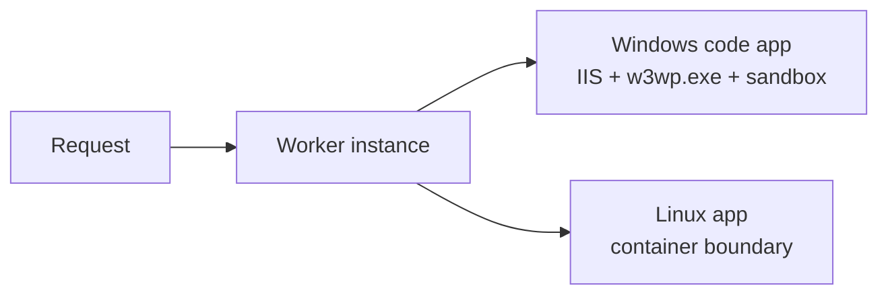
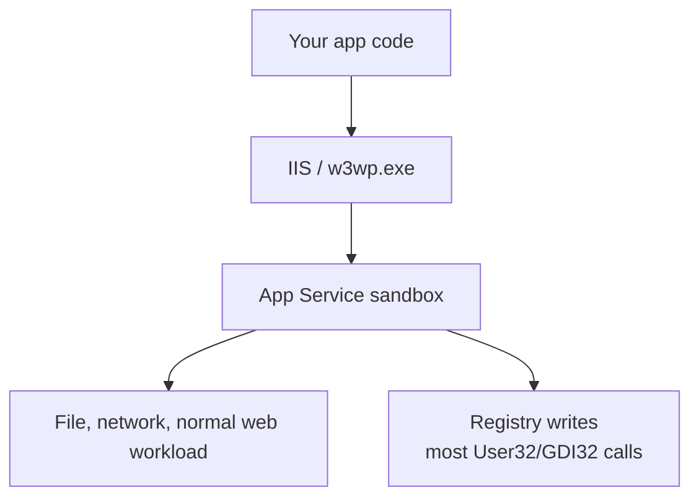
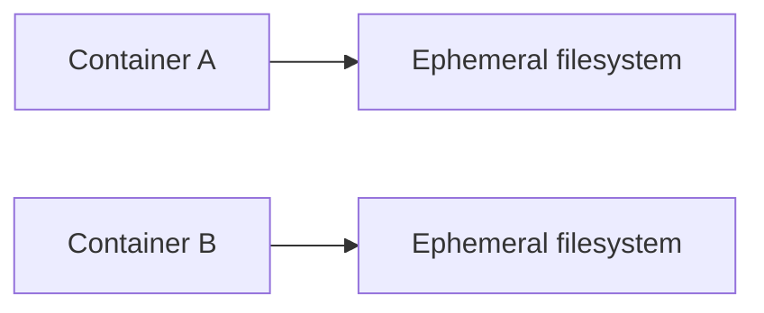
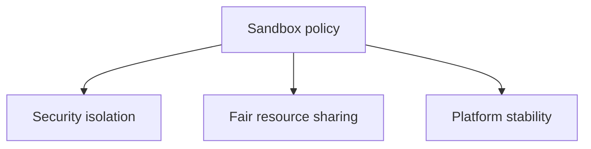

# Worker 인스턴스와 샌드박스 — 사용자 코드를 어디에 가두는가

> Azure App Service Deep Dive 시리즈 (3/6)

2화에서는 Front-End와 ARR이 요청을 특정 worker로 보낸다는 데서 멈췄습니다.
이번 화는 그다음 질문입니다.

**그 worker 안에서 사용자 코드는 정확히 어디서 돌고,
무엇이 허용되고,
무엇이 막히는가.**

이 질문은 이론보다 장애에서 더 중요합니다.
배포는 성공했는데 특정 라이브러리만 실패하거나,
로컬 Windows IIS에서는 되는데 App Service에서는 안 되거나,
Linux 컨테이너에서는 되는데 Windows 코드 앱에서는 막히는 이유가 바로 여기 있습니다.

---

## 큰 그림 — worker의 두 얼굴



App Service의 worker는 하나의 이름이지만,
운영자가 보는 실제 실행 경계는 OS와 호스팅 모드에 따라 다릅니다.

- **Windows code**: IIS 아래에서 앱 프로세스가 돌고, App Service sandbox 제약을 받습니다.
- **Linux built-in / custom container**: 컨테이너가 핵심 실행 경계입니다.

둘 다 isolation이 있지만,
제약의 모양은 같지 않습니다.

---

## Windows: `w3wp.exe`와 App Service sandbox

Kudu의 sandbox 위키는 Windows App Service를 “각 앱이 자기 sandbox 안에서 실행되는 모델”로 설명합니다.
핵심 요지는 단순합니다.

- 각 앱은 다른 앱과 격리됩니다.
- multi-tenant 환경에서 최소 자원 보장을 위해 제약이 걸립니다.
- 그 제약이 registry, graphics, networking 일부에 영향을 줍니다.

Kudu sandbox 문서는 특히 이렇게 말합니다.

- registry write는 허용되지 않습니다.
- `HKEY_CURRENT_USER`를 포함해 writable hive를 가정할 수 없습니다.
- Win32k 기반 API 대부분,
즉 User32/GDI32 계열 호출이 크게 제한됩니다.



이 한 그림이 Windows App Service에서 “왜 PDF 변환기 하나가 유독 안 되지?”라는 질문의 시작점입니다.

---

## 왜 GDI와 registry가 자주 문제를 만드는가

운영체제 기능 문서와 sandbox 위키를 함께 읽으면 패턴이 보입니다.

### registry

로컬 서버에서는 설치형 소프트웨어가 registry write를 당연하게 가정하는 경우가 많습니다.
App Service Windows sandbox에서는 이 가정이 깨집니다.

### GDI / User32

웹 앱은 보통 UI subsystem이 필요 없습니다.
하지만 일부 PDF,
이미지,
폰트,
브라우저 자동화 라이브러리는 여전히 그 API에 기대고 있습니다.

그래서 다음과 같은 증상이 반복됩니다.

- HTML to PDF 라이브러리 일부 실패
- custom font 렌더링 이상
- Selenium/PhantomJS 계열 문제
- `System.Drawing` 기반 코드 실패

이건 “Azure가 이상하다”가 아니라,
web workload를 위해 의도적으로 좁힌 Windows sandbox의 결과입니다.

---

## Linux: container가 실행 경계다

Linux App Service에서는 공개 문서가 훨씬 간단한 멘탈 모델을 줍니다.
앱은 컨테이너 안에서 실행됩니다.

Built-in runtime을 쓰든,
custom container를 쓰든,
운영자가 봐야 할 핵심은 이겁니다.

- 프로세스는 컨테이너 안에 있습니다.
- readiness는 warm-up ping과 startup timeout에 영향을 받습니다.
- persistent storage는 `/home` mount 여부에 영향을 받습니다.

```mermaid
flowchart LR
    FE[Front-End] --> C[Linux container]
    C --> APP[App process]
    HOME[/home mount] --> C
```

Linux에서는 Windows sandbox와 똑같은 registry/GDI 제약을 이야기할 수 없습니다.
공개 문서도 그렇게 말하지 않습니다.
대신 container startup contract,
port binding,
storage mount,
startup time limit이 더 중요한 축입니다.

---

## `WEBSITES_ENABLE_APP_SERVICE_STORAGE`가 worker 의미를 바꾸는 순간

Linux custom container에서는 `/home`의 성질이 설정 하나로 크게 달라집니다.

- `true`이면 persistent shared storage가 mount됩니다.
- `false`이면 컨테이너와 함께 사라지는 ephemeral 영역에 가깝게 동작합니다.

그래서 같은 앱이라도 다음 두 그림은 운영 의미가 다릅니다.

```mermaid
flowchart LR
    C1[Container A] --> H1[/home shared storage]
    C2[Container B] --> H1
```



이 차이를 모르면 scale-out 뒤 업로드 파일이 보이지 않는다거나,
재시작 후 생성 파일이 사라진다거나,
SCM에서 본 파일과 앱이 본 파일이 다르다고 느끼는 일이 생깁니다.

---

## worker에서의 프로세스 경계

worker 내부를 디버깅할 때는 “내 코드”보다 먼저 “내 코드가 어느 경계 안에 있나”를 물어야 합니다.

### Windows code

- IIS가 프로세스 생명주기를 잡습니다.
- sandbox 제약이 직접 적용됩니다.
- 일부 OS API 의존 라이브러리가 깨질 수 있습니다.

### Linux app

- 컨테이너 entrypoint와 startup command가 생명주기를 잡습니다.
- readiness ping이 organic traffic 진입 시점을 좌우합니다.
- 포트와 startup timeout이 실패 원인으로 자주 등장합니다.

이 차이가 있기 때문에 같은 “App Service”라도 문제 해결 첫 질문이 달라집니다.

---

## sandbox는 보안 이야기이면서 동시에 품질 이야기다

sandbox를 보통 보안 기능으로만 읽기 쉽습니다.
맞는 말이지만 절반만 맞습니다.

App Service sandbox는 동시에 품질 보장 장치입니다.
multi-tenant worker에서 앱끼리 서로 자원을 잡아먹지 못하게 막아야 하기 때문입니다.



이 관점으로 보면 제한이 더 자연스럽습니다.

- registry write 차단
- graphics subsystem 호출 제한
- 특정 local communication 제약

이 제약은 불편을 주기 위해 있는 것이 아니라,
다른 고객 앱과 같은 machine에서 공존하기 위한 계약입니다.

---

## “로컬에서는 되는데 App Service에서는 안 된다”의 정석적인 분류

### Windows에서 특히 자주 보이는 경우

- 설치형 COM/registry 전제 라이브러리
- GDI 의존 PDF/이미지 라이브러리
- local machine에 특정 font나 desktop component가 있어야 하는 코드

### Linux에서 특히 자주 보이는 경우

- 포트 바인딩 불일치
- startup time limit 초과
- `/home` 영속성 오해
- entrypoint와 health endpoint 설계 미흡

이 분류를 먼저 해 두면,
문제를 코드 버그로 볼지,
worker contract 위반으로 볼지,
sandbox 제약으로 볼지 빠르게 갈립니다.

---

## 언제 Windows container나 다른 호스팅 경로를 검토해야 하는가

App Service Windows code sandbox가 맞지 않는 워크로드도 있습니다.

- 반드시 GDI 호출이 필요한 경우
- registry/OS customization이 필요한 경우
- 설치형 의존성이 강한 경우

이때는 Windows container,
혹은 App Service 밖의 다른 호스팅 모델이 더 맞을 수 있습니다.
중요한 건 “왜 안 되지?”를 오래 붙드는 게 아니라,
현재 제약이 공개 문서에 이미 적혀 있는 종류인지 먼저 확인하는 것입니다.

---

## 3화 정리

이번 화의 핵심은 worker가 추상적 개념이 아니라,
실제 실행 경계라는 점입니다.

> Windows App Service에서는 사용자 코드가 IIS와 App Service sandbox 안에서 실행되며 registry write와 많은 User32/GDI32 호출이 제한됩니다. Linux App Service에서는 container가 핵심 경계이고, startup contract와 `/home` storage mount가 더 중요한 변수입니다. 그래서 같은 App Service라도 Windows는 sandbox 제약을, Linux는 container readiness와 storage semantics를 먼저 봐야 합니다.

다음 4화에서는 이 worker에 코드가 도달하는 경로를 봅니다.
Kudu가 어떻게 배포를 받고,
어떻게 빌드와 sync를 실행하고,
왜 run-from-package는 `wwwroot`의 의미를 바꾸는지 이어서 다룹니다.

---

## 이 시리즈에서의 위치

2화가 요청을 worker까지 데려왔다면 이번 글은 그 worker 안쪽의 실행 경계를 설명합니다.
다음 글에서는 Kudu와 Oryx를 따라가며, 코드가 실제로 `/home/site/wwwroot`에 놓이는 배포 경로를 내부 관점에서 연결합니다.

---

## 참고 자료

### 1차 출처
- [Azure Web App sandbox](https://github.com/projectkudu/kudu/wiki/Azure-Web-App-sandbox/843a564005d4f1028c5e171cf37d35da731f0572)

### 2차 출처
- [Operating system functionality in Azure App Service](https://learn.microsoft.com/azure/app-service/operating-system-functionality)
- [Configure a custom container for Azure App Service](https://learn.microsoft.com/azure/app-service/configure-custom-container)
- [Environment variables and app settings reference](https://learn.microsoft.com/azure/app-service/reference-app-settings)

### 관련 시리즈
- [Azure App Service 101 — Hosting Models](../../azure-app-service-101/ko/03-hosting-models.md)
- [Azure Functions Deep Dive — Worker Process](../../azure-functions-deep-dive/ko/02-worker-process.md)
