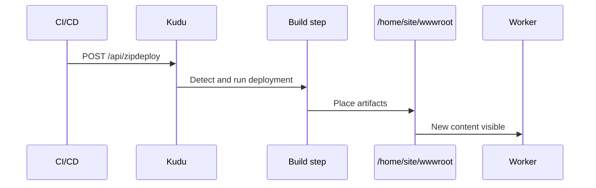
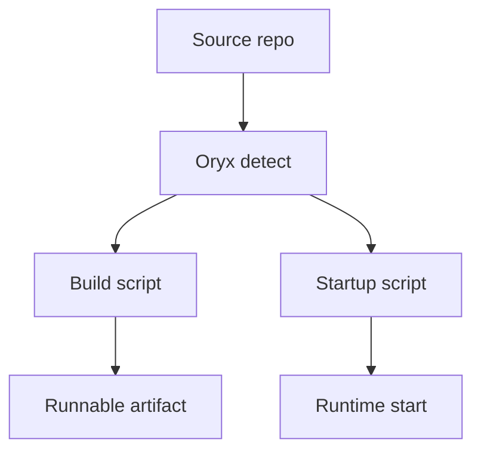
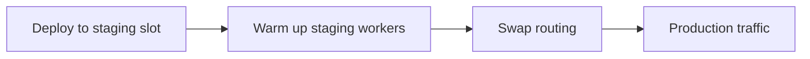

# 배포와 Kudu — 빌드·동기화·릴리스의 안쪽

> Azure App Service Deep Dive 시리즈 (4/6)

App Service에 코드를 올린다는 말은 너무 넓습니다.
실제로는 누군가가 아티팩트를 받고,
필요하면 빌드를 하고,
결과를 배치하고,
worker가 새 코드를 보게 만들어야 합니다.

Windows App Service에서 그 중심에 있는 공개 엔진이 **Kudu**입니다.
Linux code app에서는 빌드 단계에 **Oryx**가 강하게 연결됩니다.

이번 화는 그 배포 경로를 한 번에 봅니다.

---

## 큰 그림 — 배포 파이프라인

```mermaid
flowchart LR
    SRC[git push / zip / publish] --> KUDU[Kudu SCM site]
    KUDU --> DETECT[Detect build strategy]
    DETECT --> BUILD[deploy.cmd / deploy.sh / Oryx build]
    BUILD --> PLACE[/home/site/wwwroot<br/>or mounted package]
    PLACE --> RELOAD[Worker reload / restart]
```

이 흐름을 기준으로 보면 배포 문제는 네 가지로 나뉩니다.

1. 업로드 실패
2. 빌드 실패
3. 파일 배치 실패
4. 배치는 됐지만 런타임 기동 실패

Kudu를 이해하는 이유는 이 네 단계를 서로 분리해서 읽기 위해서입니다.

---

## Kudu는 무엇을 공개하고 있는가

Kudu는 App Service의 SCM 사이트입니다.
Learn 문서도 Kudu를 배포와 진단을 담당하는 companion service로 설명합니다.

실제로 공개 코드에서 보이는 중요한 단서는 두 가지입니다.

- `PushDeploymentController.cs` — ZipDeploy와 publish 계열 엔드포인트
- `NinjectServices.cs` — 라우트 등록과 서비스 wiring

특히 `NinjectServices.cs`에는 다음 라우트가 보입니다.

- `zipdeploy`
- `publish`
- `vfs`
- `deployments`

즉 Kudu는 추상적 배포 개념이 아니라,
실제로 요청을 받는 SCM API 집합입니다.

---

## ZipDeploy가 의미하는 것

Kudu 공개 코드에서 `ZipPushDeploy` 메서드 이름은 아주 직접적입니다.
zip artifact를 받아 deployment info로 만들고,
배포 흐름으로 넘깁니다.



여기서 중요한 점은 ZipDeploy 자체가 항상 “압축 해제 후 바로 실행”과 같지 않다는 것입니다.
앱 설정과 배포 모드에 따라 build automation 여부와 최종 배치 방식이 달라집니다.

---

## Windows code app의 고전 경로

전통적인 Kudu 경로에서는 대체로 이런 그림이 성립합니다.

1. Git push 또는 zipdeploy 도착
2. Kudu가 사이트 유형과 설정을 확인
3. 필요하면 deployment script 실행
4. 결과물을 `wwwroot`에 동기화
5. worker가 새 파일을 보게 됨

Kudu wiki와 Learn이 오래 설명해 온 모델이 바로 이것입니다.

여기서 deploy script는 자동 생성될 수 있고,
사용자 지정 스크립트일 수도 있습니다.
이 계열이 `deploy.cmd`나 `deploy.sh`라는 이름으로 자주 등장하는 이유가 여기에 있습니다.

---

## Linux code app에서 Oryx가 끼어드는 자리

Oryx README는 자신을 source repo를 runnable artifact로 바꾸는 build system이라고 설명합니다.
또한 코드베이스를 분석해 build script와 startup script를 생성한다고 분명히 적습니다.

이 문장을 App Service 문맥으로 번역하면 이렇습니다.

- Kudu 또는 App Service build service가 Oryx를 호출합니다.
- Oryx가 언어와 파일을 감지합니다.
- 의존성 설치와 빌드 스크립트를 생성합니다.
- Python이면 WSGI server 계열 startup script까지 생성할 수 있습니다.



그래서 Linux App Service에서 “배포는 성공했는데 startup command가 이상하다”는 문제는,
순수 Kudu만의 문제가 아니라 Oryx가 만든 산출물과 runtime contract를 함께 봐야 풀립니다.

---

## `SCM_DO_BUILD_DURING_DEPLOYMENT`가 바꾸는 것

Learn 문서는 zip deployment가 기본적으로는 ready-to-run package를 전제로 한다고 설명합니다.
그리고 Git deployment와 같은 build automation을 원하면 `SCM_DO_BUILD_DURING_DEPLOYMENT=true`를 켜라고 말합니다.

이 설정이 중요한 이유는 배포 실패의 성격을 바꾸기 때문입니다.

- 끄면: “준비된 아티팩트를 그냥 배치”에 가깝습니다.
- 켜면: “서버 쪽 빌드와 의존성 복원”이 추가됩니다.

즉,
같은 zipdeploy라도 build step이 있느냐 없느냐가 다릅니다.

---

## run-from-package는 `wwwroot`를 읽기 전용 mount로 바꾼다

run-from-package 문서는 가장 중요한 문장을 아주 분명하게 적습니다.

**ZIP 내용이 `wwwroot`로 복사되는 것이 아니라,
ZIP 패키지 자체가 읽기 전용 `wwwroot`로 mount됩니다.**

```mermaid
flowchart LR
    ZIP[ZIP package] --> PKG[/home/data/SitePackages]
    PKG --> MOUNT[Mounted read-only wwwroot]
    MOUNT --> W[Worker runtime]
```

이 모드의 장점은 분명합니다.

- 파일 잠금 충돌 감소
- 배포 원자성 향상
- 파일 복사 시간 감소

대신 의미가 달라집니다.

- `wwwroot`를 수정 가능한 작업 디렉터리로 보면 안 됩니다.
- 런타임 중 파일 생성 위치를 따로 생각해야 합니다.
- WebJobs 같은 부가 구성은 경로 영향을 다시 확인해야 합니다.

---

## slot 배포는 왜 안전한가

slot을 쓰면 배포는 production URL 밖에서 먼저 끝납니다.



핵심은 코드 배치보다 라우팅 전환입니다.
새 코드가 staging slot worker에서 이미 올라와 있고,
필요한 warm-up까지 끝난 뒤 production 트래픽이 넘어가므로,
사용자가 cold start를 덜 보게 됩니다.

이 때문에 Kudu 배포와 worker warm-up을 하나의 이야기로 읽어야 합니다.

---

## Kudu 성공과 런타임 성공은 다르다

실전에서 자주 나오는 함정이 이겁니다.

“Kudu deployment history는 success인데,
앱은 502가 난다.”

이건 모순이 아닙니다.

Kudu 성공은 보통 이런 뜻입니다.

- artifact를 받았다
- 빌드 또는 복사를 마쳤다
- 대상 경로에 파일을 배치했다

반면 런타임 성공은 별도 질문입니다.

- 앱 프로세스가 제대로 떴는가
- 올바른 포트에 바인딩했는가
- warm-up 경로가 준비 완료를 반환하는가
- dependency가 기동 시점에 정상인가

그래서 배포와 런타임을 같은 로그에서 찾으려 하면 시간이 길어집니다.

---

## 4화 정리

이번 화의 핵심을 한 문단으로 줄이면 이렇습니다.

> App Service 배포는 Kudu SCM 사이트가 artifact를 받고, 필요하면 build automation을 실행하고, 결과를 `wwwroot` 또는 mounted package 형태로 worker가 보는 경로에 배치하는 과정입니다. Linux code app에서는 Oryx가 detect-build-startup 단계를 담당할 수 있습니다. run-from-package를 켜면 `wwwroot`는 ZIP이 풀린 폴더가 아니라 읽기 전용 mount가 됩니다. Kudu success는 배포 success일 뿐, 앱 startup success와는 별개입니다.

다음 5화에서는 이 worker 수 자체가 어떻게 늘어나는지 봅니다.
Azure Monitor autoscale의 결정이 어떻게 App Service Plan과 worker allocation으로 이어지는지,
scale up과 scale out이 무엇을 실제로 바꾸는지 이어서 다룹니다.

---

## 이 시리즈에서의 위치

앞선 글들이 요청 경로와 worker 실행 경계를 설명했다면 이번 글은 코드가 그 worker에 도달하는 배포 경로를 설명합니다.
다음 글에서는 이 앱 인스턴스 수가 실제로 늘어나는 control-plane 경로를 따라가며, scale-out 결정이 어떻게 새 worker로 이어지는지 정리합니다.

---

## 참고 자료

### 1차 출처
- [PushDeploymentController.cs @ S62](https://github.com/projectkudu/kudu/blob/S62/Kudu.Services/Deployment/PushDeploymentController.cs)
- [NinjectServices.cs @ S62](https://github.com/projectkudu/kudu/blob/S62/Kudu.Services.Web/App_Start/NinjectServices.cs)
- [Oryx README @ 20240408.1](https://github.com/microsoft/Oryx/blob/20240408.1/README.md)
- [Oryx BuildScriptGeneratorCli directory @ 20240408.1](https://github.com/microsoft/Oryx/tree/20240408.1/src/BuildScriptGeneratorCli)
- [Oryx startupscriptgenerator directory @ 20240408.1](https://github.com/microsoft/Oryx/tree/20240408.1/src/startupscriptgenerator/src)

### 2차 출처
- [Kudu service overview](https://learn.microsoft.com/azure/app-service/resources-kudu)
- [Deploy files to Azure App Service](https://learn.microsoft.com/azure/app-service/deploy-zip)
- [Run your app directly from a ZIP package](https://learn.microsoft.com/azure/app-service/deploy-run-package)
- [Deployment slots in Azure App Service](https://learn.microsoft.com/azure/app-service/deploy-staging-slots)

### 관련 시리즈
- [Azure App Service 101 — 첫 번째 배포](../../azure-app-service-101/ko/04-first-deploy.md)
- [Azure Functions Deep Dive](../../azure-functions-deep-dive/ko/03-grpc-event-stream.md)
