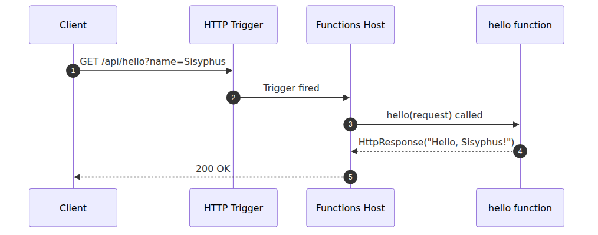
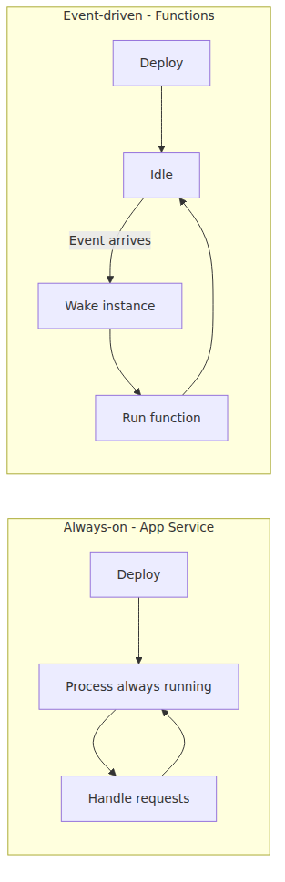
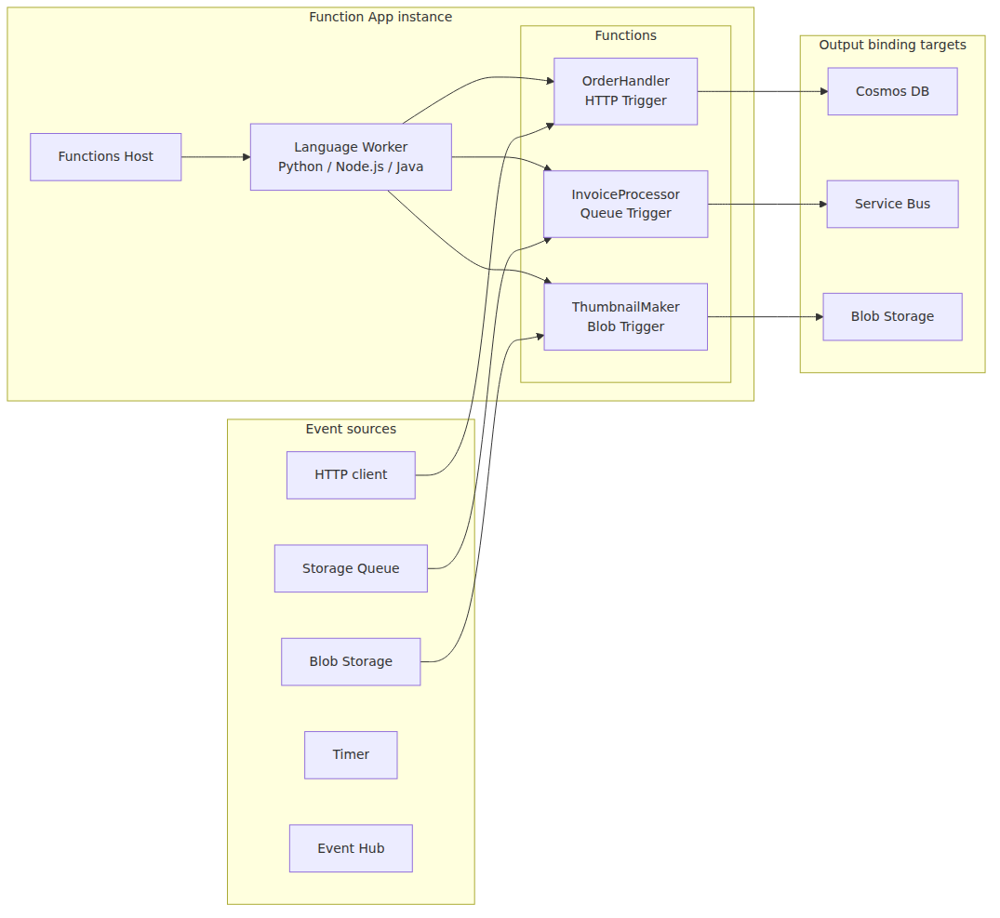

<!-- tags: Azure, Azure Functions, Serverless, Cloud -->
# What Is Azure Functions? — A World Where Events Call Your Code

> Azure Functions 101 series (1/7)

When developers first hear the word "serverless," the reaction is usually one of two things: "What do you mean there's no server?" or "The cloud is still running servers under the hood — isn't that the same thing?" Both reactions are half right and half wrong. There are servers. Serverless is just a model that **lets you stop caring about them**. Azure Functions is Azure's answer to that model.

This series is a seven-part introductory guide for developers who are picking up Azure Functions for the first time. Part 1 starts with the most basic question: **what exactly is Azure Functions, and why does this model matter?** Once you have the right mental model, the later discussions about triggers, bindings, scaling, and deployment land much more easily.

---

## A One-Sentence Definition — "An event arrives, my function runs, and then it's gone"

Here's Azure Functions in a single line:

> When an event happens, the small function wired to that event is invoked and runs; once the work is done, the instance is reclaimed.

Almost every property of the platform is packed into that sentence. Just three words to anchor on:

- **Event** — an HTTP request, a queue message, a file upload, a timer, a database change — anything that "wakes the function up."
- **Function** — the code you write. Usually a few dozen lines, single responsibility.
- **Gone** — instances may not be running at all when idle, and they scale up and down with traffic.

If a traditional web app is a restaurant that keeps its doors open from morning to night waiting for customers, Functions is closer to a **catering chef who shows up the moment you press the call button**. When there are no customers, the chef is busy doing something else in a back room and only arrives once the bell rings.

---

## Start With the Smallest Example — Hello, Function

A short snippet of code beats a long explanation. Here is the simplest possible function that returns a greeting when an HTTP request comes in, using the Azure Functions Python v2 programming model.

```python
import azure.functions as func

app = func.FunctionApp(http_auth_level=func.AuthLevel.ANONYMOUS)

@app.function_name(name="hello")
@app.route(route="hello", methods=["GET"])
def hello(request: func.HttpRequest) -> func.HttpResponse:
    name = request.params.get("name", "world")
    return func.HttpResponse(f"Hello, {name}!")
```

Short, but the heart of Azure Functions is all in there.

- `@app.route(...)` — a declaration that **this function is bound to an HTTP trigger**.
- `def hello(...)` — the body that runs when the trigger fires.
- `func.HttpResponse(...)` — that's how you send the result back.

There's no code to start a server, open a port, or configure a router. **You only describe "when to wake up" and "what to do."** Everything else is the Functions Host's job.

The simplest picture of what happens between a request coming in and the response going out looks like this:


Everything that comes later in this series is essentially the process of refining this picture. What happens when the trigger isn't HTTP (Part 2), how the Host and the function body are separated (Part 3), and how instances are added when one isn't enough (Parts 5 and 6) are each their own next post.

---

## How Is This Different From a Traditional Web App?

If you've ever deployed a web app to App Service or a VM, the following comparison will land fastest.

| Aspect | Always-on (App Service / VM) | Event-driven (Functions) |
|---|---|---|
| Deployment unit | The whole application | Per function (grouped in a Function App) |
| Run time | Always running | Only when an event arrives |
| Scaling unit | Number of instances (VMs) | Concurrent function executions |
| Billing model | Per hour (instance uptime) | Execution time + invocation count (or hybrid) |

The key difference is **what you're being billed by the unit of**. App Service charges you for "time the instance is up." Functions (especially the Consumption family) charges you for "how long the function actually ran and how many times." That's why it's overwhelmingly cheap when traffic is light. Conversely, if traffic is consistently high, App Service can come out cheaper. We'll dig into this trade-off properly in Part 5, "Choosing a Plan."

The lifecycle difference becomes clearer side by side.


The "idle → wake → run → idle again" cycle on the right is the essence of serverless. That "wake" segment is the source of what you'll soon hear called a **cold start**. Part 6 covers it in detail.

---

## The Four Core Concepts of Azure Functions

Four words run through this entire series. In Part 1, just learn the names; from Part 2 onward we'll go deep on each one.

- **Trigger** — the kind of event that wakes a function. HTTP requests, timers, queue messages, Blob uploads, Event Hub, Service Bus, Cosmos DB change feed, and so on. **Each function is bound to exactly one trigger.**
- **Binding** — a mechanism that "declaratively" connects a function's input and output to external resources. Wire up Cosmos DB as an output binding, for example, and just returning an object from your function is enough to save it to the DB. Less boilerplate.
- **Host** — the runtime process that actually loads functions, listens for triggers, and invokes your function code. It's open source; the code lives in the [`Azure/azure-functions-host`](https://github.com/Azure/azure-functions-host) repo.
- **Function App** — the unit of deployment, billing, and scaling. Functions are grouped into a Function App, but execution happens **per instance**. When a Function App scales out, Azure creates multiple instances, and **each instance gets its own Host**. For Node.js, Python, and Java, your function code does not run inside that Host process; it runs in a separate **language worker process**.

Here are those four concepts on a single diagram:


Two things matter in this picture: **(1) the Host is a per-instance runtime, while your code runs in a worker process for non-.NET languages, and (2) triggers and bindings are the interface between your functions and the outside world.** That combination is what makes Functions work as an event-driven platform.

If you want to go deeper, the companion series **Azure Functions Deep Dive** walks through how the Host starts functions and how it works with multiple language runtimes.

---

## Where Does It Shine?

Abstract talk only goes so far. Here are five patterns where Functions shows up most often in practice.

- **Event processing pipelines** — Ingest IoT telemetry from Event Hub, transform it, and load it into a database. Overwhelmingly efficient when traffic is uneven across hours of the day.
- **Scheduled jobs** — A nightly settlement batch at 3 AM. No need to run a separate cron server.
- **File processing** — A user uploads an image to Blob Storage, and a thumbnail is automatically generated and stored in another container. Both input and output are handled entirely by bindings.
- **Lightweight HTTP APIs / webhooks** — Receiving and processing webhooks from third-party SaaS, or standing up a microservice or two cheaply.
- **Async queue consumers** — Instead of a worker process running 24/7, a Queue Trigger wakes up only when there are messages to process.

The common thread is "**when there's work, it has to be processed quickly, but normally traffic is low or unpredictable.**" Keeping always-on instances running for that kind of workload is plain wasteful.

---

## When It's a Bad Fit

Functions isn't a silver bullet. Three things to verify before you adopt it:

- **Long-running work** — The default function execution timeout is between 5 and 30 minutes, depending on the plan. If a single run takes an hour, break it up with Durable Functions or look at other compute (Container Apps, Batch, etc.).
- **Very steady, high load** — If traffic is uniformly high 24/7, App Service or containers may be cheaper for the same throughput. Pay-per-use shines when traffic is uneven.
- **Ultra-low-latency APIs where cold starts are unacceptable** — If hundreds of milliseconds added to the first call is a non-starter for the business, you should use the Always Ready option on Premium / Flex Consumption or look at a different model. (Part 6 covers this trade-off.)

It's not "serverless because serverless is cool." It's a tool you reach for **when the workload's characteristics and the cost model line up.**

---

## Coming Up Next

This post focused on getting the mental model right. One-line summary:

> Azure Functions = when an **event (Trigger)** arrives, the **Host** wakes a **function** to run it, and **bindings** connect it to the outside world. The unit is the **Function App**.

The next post dives into the leftmost part of that picture: **triggers and bindings**. What triggers exist, how much code input/output bindings actually save you in practice, and "why bindings look like magic but are really just a contract" — all on the table.

---

This is part 1 of the Azure Functions 101 series. With the mental model in place, part 2 moves into triggers and bindings, and part 3 explains the Host and Worker split behind execution. The later posts cover deployment, plan selection, scaling and cold starts, and day-2 operations.

---

<!-- toc:begin -->
## In this series

- **What Is Azure Functions? — A World Where Events Call Your Code (current)**
- [Triggers and Bindings — Everything About Function I/O](./02-triggers-and-bindings.md)
- [Host and Worker — Who Actually Runs Your Functions?](./03-host-and-worker.md)
- [Deploy a Function App — From Localhost to Azure](./04-first-deploy.md)
- [Which Plan Should You Pick? — Consumption / Flex / Premium / Dedicated](./05-choosing-a-plan.md)
- [Scaling and Cold Starts — When Serverless Feels Fast and When It Doesn’t](./06-scaling-and-cold-start.md)
- [Monitoring and Operations Fundamentals](./07-monitoring-and-ops.md)

<!-- toc:end -->

---

## References

**Official Docs**
- [Azure Functions overview — Microsoft Learn](https://learn.microsoft.com/en-us/azure/azure-functions/functions-overview)
- [Azure Functions best practices — Microsoft Learn](https://learn.microsoft.com/en-us/azure/azure-functions/functions-best-practices)
- [Azure Functions triggers and bindings concepts](https://learn.microsoft.com/en-us/azure/azure-functions/functions-triggers-bindings)

**Source Code**
- [`Azure/azure-functions-host`](https://github.com/Azure/azure-functions-host) — the Functions Host itself

**Related Series**
- [Azure Functions Deep Dive](../../azure-functions-deep-dive/en/) — if you want the code-level version of the Host/Worker story
