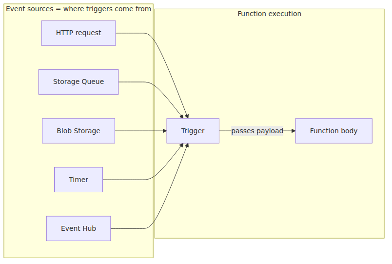
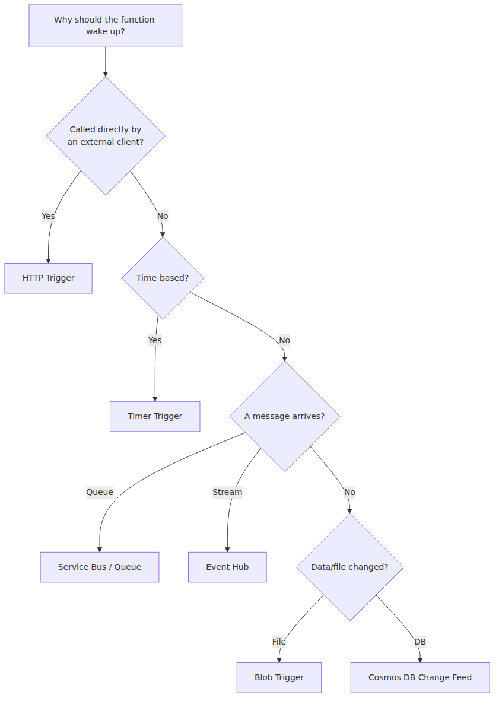
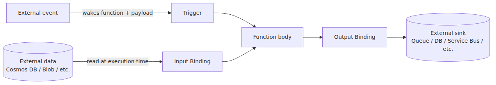

# Triggers and Bindings — Everything About Function I/O

> Azure Functions 101 series (2/7)

In part 1, I said “every function is wired to exactly one trigger,” and “bindings are a declarative way to connect inputs and outputs.” Those two sentences are why Functions code can be so short. But for newcomers, the line between “what’s a trigger,” “what’s a binding,” and “where exactly does the magic start and end” tends to stay blurry.

This post draws that line clearly. We’ll cover the main trigger types, the difference between input and output bindings, and what bindings really are once you strip away the “magic.” By the end, picking a trigger for a new function should feel mechanical.

---

## A trigger is the “cause” that wakes a function up

Let’s nail the definition first. **A trigger is the external event that causes a function to run.** An incoming HTTP request, a message landing in a queue, a file being uploaded to Blob storage, the top of every hour — those are all triggers.

The rules are simple:

- A function has **exactly one trigger**.
- A trigger both wakes the function and **decides the function’s input payload**. With an HTTP trigger you get the request object; with a Queue trigger you get the message body; with a Timer trigger you get schedule info.

The point worth holding onto: a trigger decides both *when* and *with what*. Visually:


---

## Trigger catalog — the ones you’ll actually use

The full list is in the official docs, but in practice 90%+ of real-world work falls into the table below.

| Category | Trigger | Typical use case |
|---|---|---|
| **HTTP / Webhook** | HTTP, Event Grid | REST APIs, receiving webhooks from external SaaS |
| **Schedule** | Timer | Settlement batches, periodic cleanup jobs |
| **Storage** | Blob, Queue | Post-processing uploaded files, async work queues |
| **Messaging** | Service Bus, Event Hub, Kafka | Async messaging between microservices, telemetry ingestion |
| **Database** | Cosmos DB Change Feed, SQL | Reacting to data changes (CDC pattern) |

When you design a new function, the question is always the same: **“What should cause this function to wake up?”** The answer is your trigger.


---

## Bindings = a declarative wire for function I/O

This is where Functions really shines. In a regular web app, “save to Cosmos DB” usually means: instantiate a client, attach credentials, grab a container handle, call `upsert`, handle errors. The boilerplate ends up longer than the actual function body.

Bindings collapse all of that into a declaration that says “send this function’s output to this Cosmos DB container.” In the Azure Functions Python v2 model, it looks like this:

```python
import json
import azure.functions as func

app = func.FunctionApp()


@app.function_name(name="process_order")
@app.queue_trigger(arg_name="msg", queue_name="orders-incoming", connection="StorageConnection")
@app.cosmos_db_output(
    arg_name="invoice_out",
    database_name="orders",
    container_name="invoices",
    connection="CosmosConnection",
)
def process_order(msg: func.QueueMessage, invoice_out: func.Out[func.Document]) -> None:
    queue_item = msg.get_json()
    invoice = build_invoice(queue_item)  # your business logic
    invoice_out.set(func.Document.from_json(json.dumps(invoice)))
```

Plain English version of what this function does:

> “When a message arrives on the queue (`queue_trigger`), turn it into an invoice and write the result into the `invoices` container in Cosmos DB (`cosmos_db_output`).”

The plumbing — connection management, auth, retries — is handled by **the Functions Host on your behalf**. All you declared was *where it should go*.

---

## Input bindings vs. output bindings

Bindings split into two directions:

- **Input binding** — reads external data at execution time and hands it to the function
- **Output binding** — takes what the function returns and sends it outward

One common misconception worth clearing up: **a trigger is not the same as an input binding.**

- **Trigger** = “the event that wakes the function + the payload of that event”
- **Input binding** = “additional external data the function reads after it’s already awake”

For example, you might have a function that says: “When an HTTP request comes in (trigger), look up the user record in Cosmos DB by `user_id` from the request (input binding), then respond.” Trigger is HTTP; input binding is Cosmos DB.

The three pieces in one diagram:


The function sits in the middle, and it talks to the outside world through three lanes: trigger, input, output. **Bindings are simply the declarative expression of those three lanes.**

---

## Why bindings look like “magic” — and what they actually are

“There’s no DB client anywhere — how does it save?” It feels uncanny at first, but there’s no actual magic underneath.

Each binding ships with an **extension** package. The Cosmos DB output binding, for example, lives in `Microsoft.Azure.WebJobs.Extensions.CosmosDB`. The extension does three things:

1. At function registration time, it tells the Host “this function’s output goes to Cosmos DB.”
2. Right after the function runs, when the Host signals “the function returned something,” the extension’s handler is invoked.
3. The handler instantiates the actual Cosmos DB client and writes the data.

In other words, **the extension already wrote the code you would have written**. It’s not magic — it’s delegation. So keep two things in mind:

- What bindings handle automatically: connection, auth, serialization, basic retries.
- What bindings *don’t* handle automatically: business validation, partial-failure policy, transaction boundaries.

When you need complex transactions or careful error handling, sometimes it’s better to skip the output binding and use a client directly. The one-line trap to remember as a beginner: **bindings reduce boilerplate; they don’t replace your domain logic.**

---

## Five combinations you’ll see all the time

Keeping a small playbook of common trigger/binding combinations speeds up new function design.

| Pattern | Trigger | Input binding | Output binding | Common use case |
|---|---|---|---|---|
| **API + DB read** | HTTP | Cosmos DB | — | Simple lookup API |
| **API + DB write** | HTTP | — | Cosmos DB | Receiving and storing webhooks |
| **Queue → DB** | Queue | — | Cosmos DB | Async order processing |
| **File → thumbnail** | Blob | — | Blob | Image post-processing |
| **DB change → notify** | Cosmos Change Feed | — | Service Bus | CDC-driven event publishing |

These five alone cover roughly 80% of the functions you’ll write while getting started.

---

## Two pitfalls worth knowing up front

**1) An output binding failure can be tracked separately from the function’s success/failure.**
The function body can succeed while the output binding fails to write to the DB. In that case the function is logged as failed, and depending on the trigger’s retry policy it gets re-invoked. So you need to care about **idempotency**: processing the same message twice should produce the same result.

**2) A binding’s `connection` is a *config key name*, not a literal connection string.**
When you write `connection: 'StorageConnection'`, it means “use the value of the `StorageConnection` environment variable as the connection string.” You don’t hardcode connection strings in code. In production this gets swapped out for Key Vault or Managed Identity (more in the operations posts starting from part 5).

---

## Coming up next

So far we’ve covered the *outer interface* of a function: how triggers wake it up and how bindings declaratively handle I/O. Next time we go one layer deeper: **“So who actually runs the function code, how, and inside which process?”**

The answer is two words: **Host and Worker**. That’s where Functions’ support for Node.js, Python, Java, and .NET starts to make sense.

---

This is part 2 of the Azure Functions 101 series. Part 1 established the mental model; this post defines the trigger and binding surface you work with every day. Part 3 then moves under the covers and explains the Host/Worker execution model.

---

## References

**Official Docs**
- [Azure Functions triggers and bindings concepts](https://learn.microsoft.com/en-us/azure/azure-functions/functions-triggers-bindings)
- [Trigger and binding examples](https://learn.microsoft.com/en-us/azure/azure-functions/functions-bindings-example)
- [Register Azure Functions binding extensions](https://learn.microsoft.com/en-us/azure/azure-functions/functions-bindings-register)

**Source Code**
- [`Azure/azure-functions-host`](https://github.com/Azure/azure-functions-host)
- [`Azure/azure-webjobs-sdk-extensions`](https://github.com/Azure/azure-webjobs-sdk-extensions) — home of binding extensions

**Related Series**
- [Azure Functions Deep Dive](../../azure-functions-deep-dive/en/) — for the code-level view of how the Host and binding extensions behave
