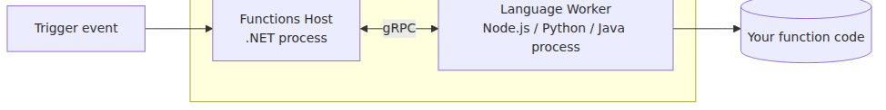
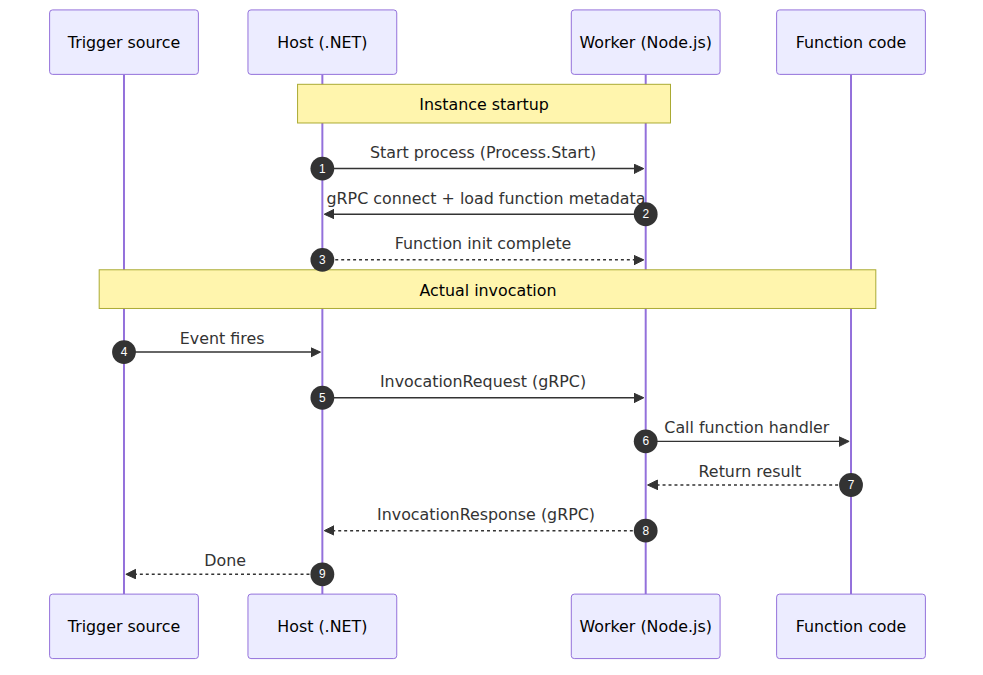
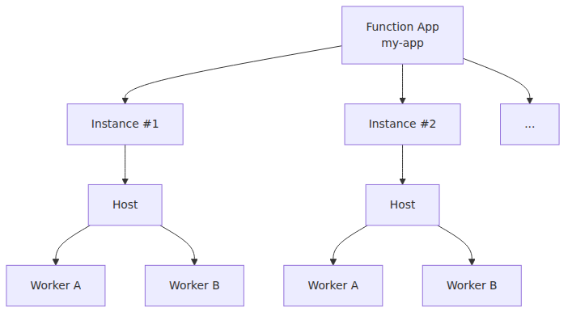

<!-- tags: Azure, Azure Functions, Serverless, Cloud -->
# Host and Worker — Who Actually Runs Your Functions?

> Azure Functions 101 series (3/7)

Over the last two posts, we built up a mental model: triggers wake your function, and bindings wire up its inputs and outputs. But there's still one big question we haven't answered. **Who actually runs the Node.js, Python, or Java code you wrote?**

The Azure Functions Host is written in .NET. Yet we happily write functions in Python, Node.js, and Java. **How does code in another language end up running inside a .NET host?** That's what this post is about.

Here’s the one-line answer up front:

> Functions runs the **Host process (.NET)** and a **Worker process (in your language)** as two separate processes, and they talk to each other over **gRPC**.

Let’s unpack that line with diagrams.

---

## The big picture — two processes

A traditional web framework usually does everything inside a single process. Loading code, handling HTTP, calling the database, building the response — all in one chunk.

Functions is different. **At a minimum, two processes are involved** in running your function.

- **Host process** — the .NET runtime. Handles trigger detection, scale signals, logging, and binding resolution.
- **Worker process** — a separate process running your language (Node.js, Python, Java, etc.). **This is where your function code actually executes.**

This split is the single most important design decision in Functions. So why was it done this way?

---

## Why split them — how one host works with multiple runtimes

If Host and Worker lived in the same process, the Host would have to embed every language runtime directly: V8, CPython, the JVM, and everything around them. That is a messy architecture. Each runtime brings its own GC, memory model, and dependency story, and packing them into one process is an invitation to conflict.

Splitting them makes the answer simple.

- The Host **doesn't get involved in actually executing the function.** It only decides when to run it, what input to pass in, and what output to expect back.
- The Worker **runs on its language's standard runtime, unmodified.** A Node.js Worker is just a regular Node.js process. A Python Worker is just a regular Python process.
- The two sides only ever talk through a **language-neutral protocol (gRPC + Protobuf).**

Adding a new language becomes “implement a Worker for that language and make it speak the protocol.” The Host-side process management lives in [`azure-functions-host`](https://github.com/Azure/azure-functions-host), while per-language `worker.config.json` files live in the language worker repositories. Those config files tell the platform which executable to launch and with which arguments.

> Note: the .NET in-process model runs inside the Host process itself. It is the historical exception. For new projects, the isolated worker model is the safer default.

---

## What happens inside a single instance

Here's a sequence diagram of one Function App instance handling traffic.

Two things to remember from this flow:

1. **The Host never calls your function code directly.** It just sends a gRPC request that says, "Hey Worker, run this function with this input."
2. **The Worker never receives trigger events directly.** The Host receives them, massages them, and hands them off to the Worker.

These two facts matter operationally, too. If your function falls into an infinite loop and the Worker stops responding, the Host can simply restart the Worker — the Host itself stays healthy. Conversely, if there's a problem with trigger infrastructure (say, a Service Bus connection issue), it'll show up in Host logs while Worker logs stay clean. **This split helps you decide where to look when things break.**

---

## Function App, Host, Worker — the hierarchy of three terms

Three similar-sounding words, easy to mix up at first. Here's how they line up:

| Term | What it is | Unit |
|---|---|---|
| **Function App** | The unit of deployment, billing, and scaling. A container concept that groups multiple functions | The Azure resource you actually see |
| **Host** | The .NET runtime process running on a Function App instance | One per instance |
| **Worker** | The language runtime process the Host spawns | One or more per instance (tunable via `FUNCTIONS_WORKER_PROCESS_COUNT`) |

When a Function App scales out, the number of instances grows, and each instance gets its own Host and Workers. **Instances don't share memory.** That clever "let me cache this in a global variable for speed" trick only works within a single instance — on every other instance, that cache is empty. We'll come back to this in part 6 on scaling.

---

## How many concurrent invocations can a single instance handle?

"If there's only one Worker process, do invocations get processed one at a time?" — fair question, and the answer is "it depends on the language model."

- **Single-threaded event-loop languages like Node.js and Python**: a single Worker can juggle many invocations concurrently using async I/O. The catch is that CPU-bound work blocks every other invocation. Concurrency limits are tuned via `host.json`.
- **Multi-threaded languages like .NET and Java**: a single Worker handles invocations concurrently across multiple threads.
- Either way, **you can also spin up multiple Worker processes to increase concurrency.** Set the `FUNCTIONS_WORKER_PROCESS_COUNT` environment variable, and you'll have several Workers running inside one instance.

This is a third axis sitting between "scale up" and "scale out." On top of **growing the number of instances (scale out)**, you can also **grow the number of Workers per instance** to push concurrency further.

---

## How to verify any of this — the architecture is open source

None of the above is speculative. The Functions Host is open source at [`Azure/azure-functions-host`](https://github.com/Azure/azure-functions-host), and the protocol contract between Host and Worker is published separately at [`Azure/azure-functions-language-worker-protobuf`](https://github.com/Azure/azure-functions-language-worker-protobuf). Every core claim in this post is traceable to code.

The companion series, **Azure Functions Deep Dive**, walks through that code directly to answer questions like:

- How does the Host actually launch a Worker process? (Following it all the way down to `Process.Start`)
- What does the gRPC EventStream handshake look like, exactly?
- When a trigger fires, how does the Dispatcher pick a Worker, and how does an InvocationRequest get built?
- What does the code behind Placeholder mode (the trick that reduces cold starts) look like?

If you finish this 101 series and want to go deeper, that's where to head next.

---

## Up next

That wraps up the "structure of Functions" portion of the series. The next post gets your hands on the keyboard. We'll cover **the shortest possible path from creating a function locally to deploying it to Azure** — the Functions Core Tools, the VS Code extension, and the one-liner that ends with `func azure functionapp publish`.

---

This is part 3 of the Azure Functions 101 series. Parts 1 and 2 covered the mental model, triggers, and bindings; this post explains the execution boundary between the Host and the Worker. The next posts build on that model with local development, deployment, plan selection, scaling, and operations.

---

<!-- toc:begin -->
## In this series

- [What Is Azure Functions? — A World Where Events Call Your Code](./01-what-is-azure-functions.md)
- [Triggers and Bindings — Everything About Function I/O](./02-triggers-and-bindings.md)
- **Host and Worker — Who Actually Runs Your Functions? (current)**
- Deploy a Function App — From Localhost to Azure (upcoming)
- Which Plan Should You Pick? — Consumption / Flex / Premium / Dedicated (upcoming)
- Scaling and Cold Starts — When Serverless Feels Fast and When It Doesn’t (upcoming)
- Monitoring and Operations Fundamentals (upcoming)

<!-- toc:end -->

---

## References

**Official Docs**
- [Azure Functions runtime versions overview](https://learn.microsoft.com/en-us/azure/azure-functions/functions-versions)
- [Use multiple worker processes (`FUNCTIONS_WORKER_PROCESS_COUNT`)](https://learn.microsoft.com/en-us/azure/azure-functions/functions-app-settings)
- [.NET isolated worker model](https://learn.microsoft.com/en-us/azure/azure-functions/dotnet-isolated-process-guide)

**Source Code**
- [`Azure/azure-functions-host`](https://github.com/Azure/azure-functions-host) — the Host itself
- [`Azure/azure-functions-language-worker-protobuf`](https://github.com/Azure/azure-functions-language-worker-protobuf) — the Host/Worker protocol contract
- [`Azure/azure-functions-nodejs-worker`](https://github.com/Azure/azure-functions-nodejs-worker)
- [`Azure/azure-functions-python-worker`](https://github.com/Azure/azure-functions-python-worker)
- [`Azure/azure-functions-java-worker`](https://github.com/Azure/azure-functions-java-worker)

**Related Series**
- [Azure Functions Deep Dive](../../azure-functions-deep-dive/en/) — a deeper series that traces the Host/Worker split at the code level
