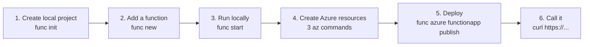
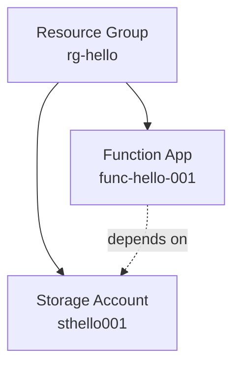
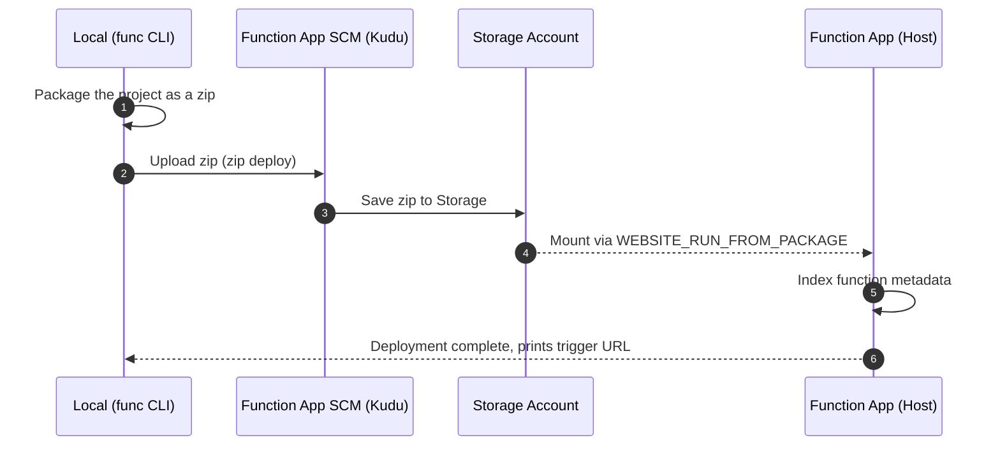

# Your First Function Deployment — From Localhost to Azure

> Azure Functions 101 series (4/7)

The first three posts were all concepts. Time to get our hands dirty. This post has exactly one goal: show you **the shortest path from writing a function locally, deploying it to Azure, and getting back a URL the internet can call**.

By the end, you'll have:

- A local environment where you can run functions like `npm test`
- A real Function App running on Azure
- An HTTPS URL (callable from anywhere on the internet)
- An intuition for what "redeploy" actually means

We'll use Node.js. If you prefer Python or .NET, the broad strokes are the same.

---

## Tooling — three things, that's it

You need exactly three tools to get to deployment.

| Tool | Role | Install |
|---|---|---|
| **Azure Functions Core Tools** | Run functions locally + the deploy command (`func`) | `npm i -g azure-functions-core-tools@4` |
| **Azure CLI** | Create and manage Azure resources from the command line | OS-specific install ([official docs](https://learn.microsoft.com/en-us/cli/azure/install-azure-cli)) |
| **Node.js 20+** | The Worker runtime | nvm or the official installer |

Many people use the "Azure Functions" extension for VS Code, but this post sticks to **the CLI only**. The reason is simple: once you've done it end-to-end on the CLI, it becomes obvious what the IDE is automating for you. Going the other direction is much harder.

After installation, sanity-check the versions:

```bash
func --version       # 4.x
az --version         # 2.x
node --version       # v20+
```

---

## The whole flow on one page

Sketching out the journey ahead of time keeps you from getting lost.



---

## 1. Create the project

Start in an empty folder.

```bash
mkdir hello-functions && cd hello-functions
func init . --worker-runtime node --language javascript --model V4
```

One command scaffolds the whole project. The three files that matter:

- `host.json` — Host configuration (extension version, logging, concurrency, etc.)
- `local.settings.json` — Environment variables for local runs (don't commit this)
- `package.json` — A perfectly ordinary npm project

`local.settings.json` plays the same role as **App Settings** in production. Locally, the runtime reads from this file; on Azure, it reads from the App Settings on your Azure resource. The key insight: **your code stays the same when going from local to production**.

---

## 2. Add a function

Add the simplest possible HTTP-triggered function.

```bash
func new --template "HTTP trigger" --name hello --authlevel anonymous
```

This generates a single file: `src/functions/hello.js`. Look inside and it'll feel familiar from Part 1.

```javascript
const { app } = require('@azure/functions');

app.http('hello', {
    methods: ['GET', 'POST'],
    authLevel: 'anonymous',
    handler: async (request, context) => {
        context.log(`Http function processed request for url "${request.url}"`);
        const name = request.query.get('name')
            || (await request.text())
            || 'world';
        return { body: `Hello, ${name}!` };
    }
});
```

We'll ship it as is.

---

## 3. Run it locally

```bash
npm install
func start
```

If you see this line near the bottom of the output, you're in business:

```
Functions:
        hello: [GET,POST] http://localhost:7071/api/hello
```

Hit it from another terminal:

```bash
curl "http://localhost:7071/api/hello?name=Sisyphus"
# Hello, Sisyphus!
```

At this moment, `func start` is running **a miniature Functions Host on your machine**. The Host and Worker we discussed in Part 3 are both running for real, with a live gRPC channel between them. In other words: the same architecture as production, on your laptop.

---

## 4. Create Azure resources

Now for the cloud side. Three resources are required to host a function on Azure.

| Resource | Role |
|---|---|
| **Resource Group** | A folder that groups related resources |
| **Storage Account** | The Functions Host's state/lock/queue store. **Required.** |
| **Function App** | The compute resource that holds your functions |



> 💡 The Storage Account is infrastructure storage that Functions uses "for its own bookkeeping": function code, trigger leases, invocation log metadata, Timer trigger schedule state, and so on. You should not store business data here (use a separate Storage Account for that).

Three commands. Names have to be globally unique, so adjust as needed.

```bash
RG=rg-hello
LOC=koreacentral
SA=sthello$RANDOM
APP=func-hello-$RANDOM

# 1) Resource Group
az group create --name $RG --location $LOC

# 2) Storage Account (Standard LRS is fine)
az storage account create \
    --name $SA --resource-group $RG \
    --location $LOC --sku Standard_LRS

# 3) Function App (Consumption plan, Node 20)
az functionapp create \
    --name $APP --resource-group $RG \
    --storage-account $SA \
    --consumption-plan-location $LOC \
    --runtime node --runtime-version 20 --functions-version 4
```

Once the last command finishes, you'll see the Function App in the Azure portal. The function code itself is still empty at this point.

> 📝 We'll cover this in Part 5, but the `--consumption-plan-location` slot can also be used for Premium, Flex Consumption, or App Service Plans. For an intro, we'll stick with the simplest option: Consumption.

---

## 5. Deploy

Deployment is one line.

```bash
func azure functionapp publish $APP
```

Here's what's actually happening under the hood:



At the end you'll see something like:

```
Functions in func-hello-xxxxx:
    hello - [httpTrigger]
        Invoke url: https://func-hello-xxxxx.azurewebsites.net/api/hello
```

That URL is your address on the internet.

---

## 6. Call it from the internet

```bash
curl "https://func-hello-xxxxx.azurewebsites.net/api/hello?name=Sisyphus"
# Hello, Sisyphus!
```

That's the shortest path from "zero to one." Run the same command (`func azure functionapp publish $APP`) again and it redeploys.

---

## Five things worth knowing before you go to production

The flow above is **the shortest demo path**. To take this to production, you'll want to fill in these five gaps. They're topics for later in this series and a separate operations series.

1. **App Settings = environment variables** — Values in `local.settings.json` move to production via `az functionapp config appsettings set`. For secrets, use Key Vault references.
2. **Authentication** — `authLevel: 'anonymous'` is for demos. In real systems you put `function` keys, AAD authentication, or API Management in front.
3. **CI/CD** — `func ... publish` is fine for a local demo. Production runs the same command from GitHub Actions / Azure DevOps, or codifies the infrastructure with ARM/Bicep.
4. **Logs and monitoring** — Provision an Application Insights instance alongside and connect it; you'll get invocation logs, exceptions, and performance metrics in one place (Part 7).
5. **Plan choice** — Consumption is great for getting started, but it's not the right answer for every workload (Parts 5 and 6).

---

## 3 spots where people get stuck

- **Storage Account name collision** — Storage names must be globally unique. Patterns like `sthello$RANDOM` are a good way to dodge collisions.
- **`func` doesn't behave** — Core Tools v4 is the current major version. If you have v3 or older installed, `func` does different things. Check `func --version` first.
- **Deployment succeeded but the URL returns 404** — The most common cause is a function indexing failure. Check the boot logs in the portal under Function App → Log stream — that's where the clues are. Missing modules (forgot `npm install`) is a frequent culprit.

---

## Next up

Now that we've got something deployed, the real question becomes "**which plan should it run on?**" We started with Consumption, but in real services you'll be picking between Flex Consumption, Premium, and Dedicated (App Service Plan). The next post lays out the differences between all four plans in one place.

---

## Series index

| # | Title |
|---|---|
| 1 | [What is Azure Functions? — A world where events call functions](./01-what-is-azure-functions.md) |
| 2 | [Triggers and Bindings — Everything about function I/O](./02-triggers-and-bindings.md) |
| 3 | [Host and Worker — Who actually runs the function?](./03-host-and-worker.md) |
| 4 | **Your First Function Deployment — From Localhost to Azure** ← you are here |
| 5 | The four plans — Consumption / Flex Consumption / Premium / Dedicated |
| 6 | Scaling and cold starts — the two faces of serverless |
| 7 | Monitoring and operations basics |

---

## References

**Official docs**
- [Azure Functions Core Tools](https://learn.microsoft.com/en-us/azure/azure-functions/functions-run-local)
- [`az functionapp` CLI reference](https://learn.microsoft.com/en-us/cli/azure/functionapp)
- [Run from package deployment](https://learn.microsoft.com/en-us/azure/azure-functions/run-functions-from-deployment-package)
- [Continuous deployment for Azure Functions](https://learn.microsoft.com/en-us/azure/azure-functions/functions-continuous-deployment)
