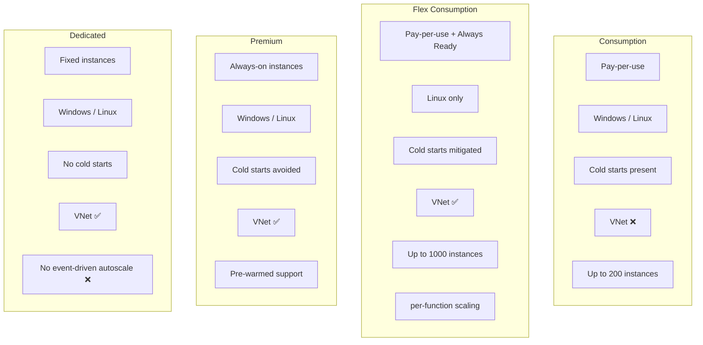
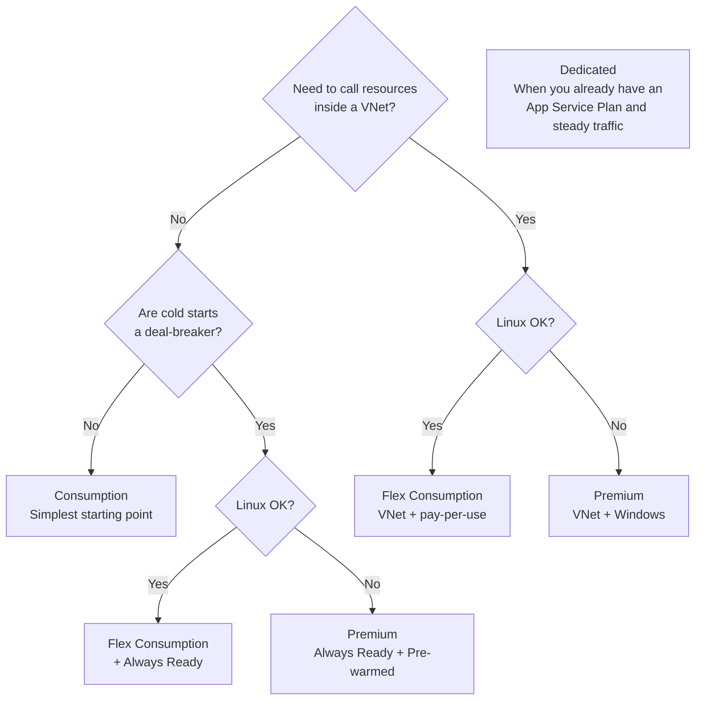

# The Four Plans — Consumption / Flex Consumption / Premium / Dedicated

> Azure Functions 101 series (5/7)

In Part 4, we shipped our first function on the Consumption plan. That was the simplest path to "just get it running," but for production you have to consciously pick one of four hosting plans: **Consumption / Flex Consumption / Premium / Dedicated (App Service Plan).** Skip this decision and you'll either bleed money, get burned by cold starts, or rebuild everything because VNet integration isn't available on the plan you chose.

The goal of this post is simple: by the end, you should know **what each plan adds, what it takes away, and which one fits your workload**. There's a decision tree at the bottom.

---

## One-line definitions — the four plans

Let's lock down the terminology first.

| Plan | One-line definition |
|---|---|
| **Consumption** | The simplest pay-per-use plan. Zero traffic = zero cost. Cold starts included. |
| **Flex Consumption** | The next-gen pay-per-use plan that fixes Consumption's biggest pain points (cold starts, no VNet, fixed instance memory). **Linux only**, GA in 2024. |
| **Premium** | A premium plan that avoids cold starts via Always Ready / Pre-warmed instances. VNet supported. Always-on, so you always pay. |
| **Dedicated (App Service Plan)** | Functions sharing infrastructure with other App Service apps. **No event-driven autoscale** — you write your own metric-based rules. |

If your mental shortcut is "Functions = autoscale," the starting point of this post is that **that autoscale behaves differently across all four plans**.

---

## Big picture — what's actually different

Let's unpack those boxes by category.

---

## Comparison table — everything on one screen

| Feature | Consumption | Flex Consumption | Premium | Dedicated |
|---|---|---|---|---|
| **Pay-per-use** | ✅ | ✅ + Always Ready hours billed | ❌ (instance-hour billing) | ❌ (App Service Plan SKU) |
| **Cost when traffic is 0** | 0 | Only Always Ready minutes | Minimum instance cost | Always charged |
| **Cold starts** | Yes | Avoidable via Always Ready | Avoided (Always Ready / Pre-warmed) | None (already running) |
| **OS** | Windows / Linux | Linux only | Windows / Linux | Windows / Linux |
| **VNet integration** | ❌ | ✅ | ✅ | ✅ |
| **Max instances** | 200 | 1000 | 100 | Depends on App Service Plan |
| **Event-driven autoscale** | ✅ | ✅ (target-based) | ✅ (target-based) | ❌ (write metric rules yourself) |
| **Per-function scaling** | ❌ | ✅ | ❌ | ❌ |
| **Instance memory** | 1.5 GB fixed | 512 / 2048 / 4096 MB selectable | Various SKUs | App Service Plan SKU |
| **Deployment slots** | Limited | ❌ (replaced by rolling updates) | ✅ | ✅ |
| **Warmup trigger** | ❌ | ✅ (Always Ready based) | ✅ | ✅ |

> Sources: Microsoft Learn — [Flex Consumption plan](https://learn.microsoft.com/en-us/azure/azure-functions/flex-consumption-plan), [Function scale and hosting options](https://learn.microsoft.com/en-us/azure/azure-functions/functions-scale), [Event-driven scaling](https://learn.microsoft.com/en-us/azure/azure-functions/event-driven-scaling), [Target-based scaling](https://learn.microsoft.com/en-us/azure/azure-functions/functions-target-based-scaling). Instance limits and memory options reflect official docs at time of writing and may change.

This table is half the post. The other half is "how do you actually use it to make a decision."

---

## Consumption — the simplest starting point

Still the right answer in the majority of scenarios. If your traffic is bursty, you're not calling resources inside a VNet, and you can tolerate a light cold start, Consumption is plenty.

**Pick it when:**

- Traffic swings between 0 and N
- You only call public internet resources (no VPN/VNet)
- A few hundred extra ms on the first call is acceptable
- You need Windows (Flex is Linux only)

**Weaknesses:**

- Cold starts
- No VNet integration
- Fixed 1.5 GB instance memory (hard to load large ML models)
- Capped at 200 instances

---

## Flex Consumption — Microsoft's "recommended" new pay-per-use plan

A relatively new plan that went GA in 2024, and Microsoft explicitly calls it [the recommended serverless hosting plan for Azure Functions](https://learn.microsoft.com/en-us/azure/azure-functions/flex-consumption-plan). It **fixes nearly every weakness of Consumption**.

**Key differentiators:**

- **VNet integration** — the limitation that hurt the most on Consumption is gone.
- **Selectable instance memory** — pick 512 / 2048 / 4096 MB to match the workload. Makes patterns like "load the ML model into the instance" actually viable.
- **Always Ready instances** — for call paths where cold starts are fatal, you can configure "keep at least N warm at all times" (default is 0).
- **Per-function scaling** — HTTP, blob, and durable functions scale independently. A traffic spike on one function has less spillover on the others.
- **Up to 1000 instances** — 5x Consumption.
- **Azure Files mounts** — large binaries, ML models, and shared data can be mounted instead of bundled into the deployment package.

**Weaknesses:**

- **Linux only** — Windows workloads can't migrate
- **No deployment slots** — teams that relied on slot swaps need to switch to rolling updates
- **No in-place migration from other plans** — moving to Flex means creating a new function app
- **30-second in-app initialization timeout** — if startup takes longer than 30 seconds, you'll get a `System.TimeoutException` (currently not tunable)
- **No support for the C# in-process model** — you have to migrate to the isolated worker model

**Pick it when:**

- You need to call resources inside a VNet (Cosmos DB private endpoint, Key Vault, etc.)
- You want to reduce cold starts but can't justify Premium's always-on cost
- You're starting on Linux or willing to move there
- You want to size instance memory to your workload
- It's a new project — Flex is effectively the default first candidate

---

## Premium — the head-on solution to cold starts

Premium **keeps instances permanently warm**. Always Ready guarantees "N instances are always up," and Pre-warmed maintains "extra warmed instances ready for scale-out."

**Pick it when:**

- Cold starts are a hard business no-go (low-latency APIs)
- You need VNet integration *and* Windows (Flex is Linux only)
- Traffic is high and steady enough that the always-on cost isn't a burden
- You need fine-grained warming control like Pre-warmed

**Weaknesses:**

- You pay the minimum instance cost even at zero traffic
- The most expensive option in the "pay-per-use family"
- For new scenarios, Flex Consumption is often the better deal (if you're on Linux)

---

## Dedicated (App Service Plan) — putting Functions on "regular PaaS"

The name is confusing, but the model is straightforward: **run Functions on top of a regular App Service Plan**, sharing infrastructure with other web apps.

**Pick it when:**

- You already have an App Service Plan running and stacking Functions on it is cheaper
- Traffic is consistently high and "always-on instances" works out cheaper
- You don't need event-driven autoscale

**The one weakness that matters most:**

- **Event-driven autoscale doesn't work.** You don't get the "watch the queue length and add instances" behavior that Consumption / Flex / Premium give you. You have to write your own metric-based autoscale rules on the App Service Plan.

People who don't know this often pick Dedicated on intuition ("it feels more stable") and then watch their queues back up during a traffic spike because the instances never scale out. **The plans that actually behave the way "Functions" implies are Consumption / Flex / Premium.**

---

## Decision tree

Three questions, in order, will resolve most cases.

Dedicated is intentionally absent from the main path. It's a plan you only pick when you can **explicitly afford to give up event-driven autoscale**.

---

## Recommendation for new projects — one paragraph

Three lines:

1. **For Linux + new projects, make Flex Consumption the first candidate.** It's Microsoft's official recommendation and resolves nearly every Consumption pain point.
2. **If you're on Windows, or cold starts are absolutely unacceptable, go Premium.**
3. **For the simplest demos, experiments, and PoCs, use Consumption.** When traffic is zero, your bill is genuinely zero.

Only pick Dedicated if you're already operating an App Service Plan or you've explicitly decided to run Functions like a regular PaaS app.

---

## Coming up next

Once you've picked a plan, the next question is: **so when traffic shows up, how exactly do instances scale, and why is that first call slow?** Part 6 puts the scaling decision models (event-driven / target-based / metric-based) and the anatomy of the cold start on a single screen, and walks through five practical patterns for cutting cold starts.

If you're curious about what's happening under the hood, Parts 5 and 6 of the deep-dive series take you through the Scale Controller's source code and the specialization logic in Placeholder mode.

---

## Series index

| # | Title |
|---|---|
| 1 | [What is Azure Functions? — A world where events call functions](./01-what-is-azure-functions.md) |
| 2 | [Triggers and Bindings — Everything about function I/O](./02-triggers-and-bindings.md) |
| 3 | [Host and Worker — Who actually runs your function](./03-host-and-worker.md) |
| 4 | [Deploying your first function — From local to Azure](./04-first-deploy.md) |
| 5 | **The Four Plans — Consumption / Flex Consumption / Premium / Dedicated** ← this post |
| 6 | [Scaling and cold starts — The two faces of serverless](./06-scaling-and-cold-start.md) |
| 7 | [Monitoring and operations basics](./07-monitoring-and-ops.md) |

---

## References

**Official docs**
- [Azure Functions Flex Consumption plan hosting](https://learn.microsoft.com/en-us/azure/azure-functions/flex-consumption-plan)
- [Function scale and hosting options](https://learn.microsoft.com/en-us/azure/azure-functions/functions-scale)
- [Event-driven scaling in Azure Functions](https://learn.microsoft.com/en-us/azure/azure-functions/event-driven-scaling)
- [Target-based scaling](https://learn.microsoft.com/en-us/azure/azure-functions/functions-target-based-scaling)
- [Azure Functions Premium plan](https://learn.microsoft.com/en-us/azure/azure-functions/functions-premium-plan)
- [Dedicated hosting plans for Azure Functions](https://learn.microsoft.com/en-us/azure/azure-functions/dedicated-plan)
- [Migrate from Consumption to Flex Consumption](https://learn.microsoft.com/en-us/azure/azure-functions/migration/migrate-plan-consumption-to-flex)

**Further reading**
- [SIOS Tech Lab — Azure Functions 概要とプラン別スケーリング](https://tech-lab.sios.jp/archives/35541)
