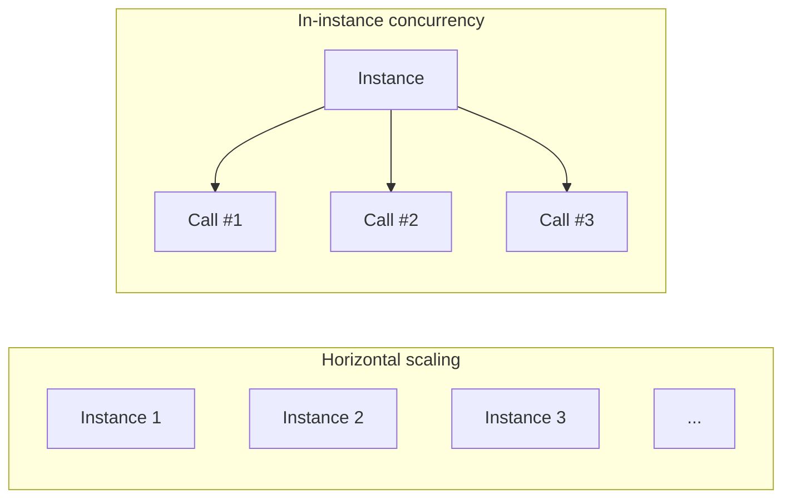
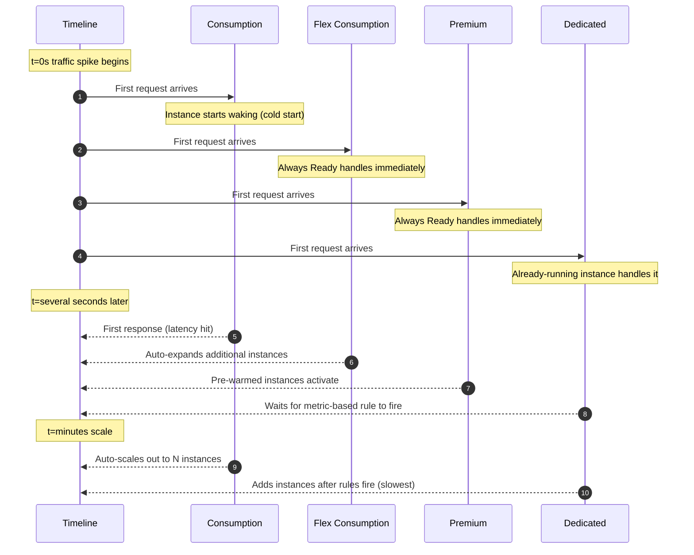
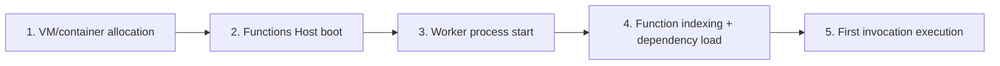
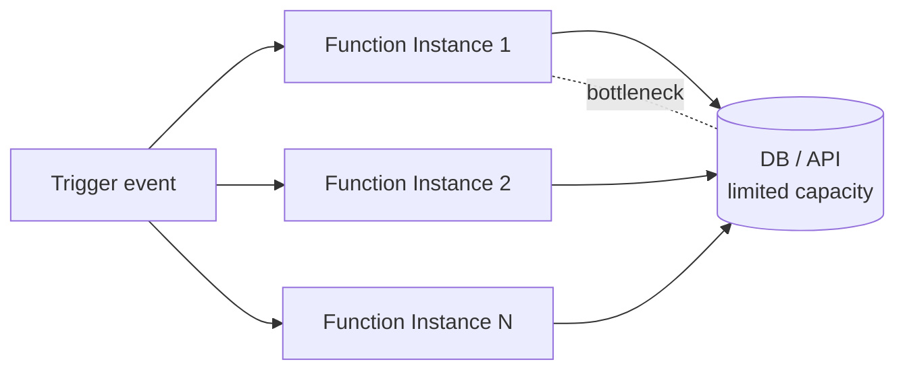

# Scaling and Cold Starts — The Two Faces of Serverless

> Azure Functions 101 series (6/7)

When serverless gets pitched in a single line, the line is usually: “it scales automatically, and you only pay for what you use.” That’s true. But there’s almost always an asterisk after that sentence, and the asterisk hides two stories. **(1) How does it actually scale**, and **(2) cold starts can make the first call slow**. Those two stories are the “two faces of serverless.”

This post takes the table of four plans from Part 5 and redraws it from an **operational perspective**. How does each plan react when traffic suddenly 10x’s? Why do cold starts happen and how do you shrink them? And what are the real-world patterns for making the first request after a deploy fast?

---

## The Two Axes of “Scaling” — Instances vs. Concurrency

First, separate the words. Inside the single word “scaling,” there are actually two axes.

- **Horizontal scaling (scale out)** — Increase the number of instances. If traffic grows N×, instances grow roughly N×.
- **In-instance concurrency** — How many functions a single instance runs simultaneously.



Plans differ in **which of these two axes they handle, and how**.

| Plan | Who decides horizontal scaling | In-instance concurrency |
|---|---|---|
| Consumption | Platform, automatic (event-driven) | Automatic, hard for the user to control |
| Flex Consumption | Platform, automatic (target-based) | **User sets per-instance concurrency directly** |
| Premium | Platform, automatic + Always Ready/Pre-warmed | User tunes via host.json |
| Dedicated (App Service Plan) | User, via metric-based rules | Tuned via host.json |

This table is the heart of the post. **“Automatic scaling” in Functions means different things on different plans.** Consumption truly goes 0→N automatically; Dedicated is a model where “you set up the autoscale rules yourself.”

---

## A Traffic Spike Scenario — How the Four Plans React

Comparing in words doesn’t land. Let me draw, on a timeline, how the four plans react differently to the same stimulus. The stimulus: “traffic is 0 until t=0, and at t=0 RPS suddenly jumps to 100.”



In summary, here are the four key differences.

- **Consumption**: First request = cold start. But scales 0→N very quickly.
- **Flex Consumption**: Always Ready handles the first request, target-based scaling expands fast.
- **Premium**: Always Ready + Pre-warmed avoid cold starts; the most expensive in this family.
- **Dedicated**: No cold start at all (it’s always running). But it’s the slowest to react automatically to a spike, or fully manual.

---

## What Exactly Is a Cold Start?

If you’re going to use the term “cold start” responsibly, you need a definition.

> **Cold start = the time it takes for a brand-new instance to go from 0 to 1 ready to serve a function.**

If you decompose where that time goes, it looks like this:



Here’s what shrinks or grows the time at each step.

| Step | Time driver | Typical mitigation |
|---|---|---|
| 1 | Near zero if the platform pre-spins placeholder instances | (Platform’s job — see deep-dive Part 6) |
| 2 | Host itself is fast | Generally nothing to tweak |
| 3 | Worker startup time (Java/.NET tend to be heavier than Node/Python) | Language choice, isolated vs in-proc |
| 4 | **The size of your code’s dependencies** | Trim dependencies, lazy import |
| 5 | The cost of the first invocation itself | Warmup trigger, ping traffic |

One important fact here. **More than half of cold-start time is often decided at step 4.** Before you upgrade to a more expensive plan, trimming dependencies should always come first.

---

## Practical Patterns to Reduce Cold Starts

There’s something to do at the planning stage, the code stage, and the operations stage.

**Planning stage**

- If cold starts are business-critical, look at Premium or Flex Consumption + Always Ready from the start.
- If they’re not, Consumption + “cold-start-friendly code patterns” is often enough.

**Code stage**

- **Dependency diet** — Don’t import a giant SDK whole just to use one line of it. Prefer tree-shaking or decomposed packages (use only the modules you need from `@azure/cosmos` instead of the whole thing).
- **Lazy import / lazy init** — Don’t do heavy work (DB connections, large file reads) at module load time. Initialize lazily inside the first invocation and cache.
- **Global cache** — Module-scope variables in Functions survive across calls inside the same Worker. Things like a DB client or JWKS keys should be created once at module scope and reused.

```javascript
// Good: module-scope cache + lazy initialization
let cachedClient;

function getClient() {
    if (!cachedClient) {
        cachedClient = createCosmosClient();   // created only on the first call
    }
    return cachedClient;
}

app.http('hello', {
    handler: async (request, context) => {
        const client = getClient();
        // ...
    }
});
```

**Operations stage**

- **Warmup trigger** — A trigger that runs once whenever an instance is added on Premium/Dedicated. Put cache warming and similar work here. (Not available on Consumption.)
- **Always Ready instances** — On Premium / Flex Consumption, configure “keep at least N instances on by default.” N=1 means the first request is always served warm.

---

## Be Deliberate About Concurrency

“Scale-out is automatic, so I don’t need to think about concurrency” is a common trap. In practice, you need to understand concurrency for two reasons.

**1) Downstream dependencies have limits**

DB connection pools, the RPS limits of an external API — these don’t grow with your scale-out. If your function scales to 100 instances but the DB pool is 10, 99 instances end up waiting for connections. **A function’s scale can’t exceed its downstream capacity.** That fact gets forgotten a lot.



There are usually two responses.

- **Cap function concurrency** — Use settings like `extensions.queues.batchSize` in host.json to limit per-trigger throughput.
- **Isolate downstreams** — Put a queue like Service Bus in front to absorb backpressure, and consume slowly at the downstream’s pace.

**2) Concurrent execution within the same instance**

As we saw in Part 3, multiple invocations can run simultaneously inside a single Worker (depending on language and configuration). That means **module-scope variables are shared across concurrent calls.** Code that stuffs “the user currently being processed” into a global is dangerous for exactly this reason.

---

## How Cost Relates to Scaling

Talking about scaling without cost is half a story. One line each.

- **Consumption**: Execution time × memory + execution count. Zero traffic = zero cost.
- **Flex Consumption**: Similar to above + hourly billing for Always Ready instances.
- **Premium**: Time instances are running (multiplied by horizontal scale). Even at low traffic, you pay for the minimum instance.
- **Dedicated**: Number of App Service Plan instances × SKU hourly rate. Flat regardless of traffic.

Remember that “automatic scale-out is great, but cost scales automatically too.” A traffic spike is a cost spike. **Always be deliberate about setting the maximum scale-out limit** — that’s an operational baseline.

---

## Coming in Part 7

Talking about scaling only matters if you can **see** “how many instances is this function running on right now, and how is it behaving.” The next post covers monitoring and operational basics, centered on Application Insights. Where to view invocation count, failure rate, and cold-start frequency, and how to wire up alerts.

If you’re curious about the **internal mechanics** of cold starts and scaling (Scale Controller, Placeholder, Specialization), head to Parts 5 and 6 of the deep-dive series. Those follow the code directly.

---

## Series TOC

| # | Title |
|---|---|
| 1 | [What is Azure Functions? — A world where events call your functions](./01-what-is-azure-functions.md) |
| 2 | [Triggers and Bindings — Everything about function I/O](./02-triggers-and-bindings.md) |
| 3 | [Host and Worker — Who actually runs your function](./03-host-and-worker.md) |
| 4 | [Your first function deploy — From local to Azure](./04-first-deploy.md) |
| 5 | The four plans — Consumption / Flex Consumption / Premium / Dedicated |
| 6 | **Scaling and cold starts — The two faces of serverless** ← this post |
| 7 | Monitoring and operational basics |

---

## References

**Official docs**
- [Event-driven scaling in Azure Functions](https://learn.microsoft.com/en-us/azure/azure-functions/event-driven-scaling)
- [Target-based scaling](https://learn.microsoft.com/en-us/azure/azure-functions/functions-target-based-scaling)
- [Warmup trigger for Azure Functions](https://learn.microsoft.com/en-us/azure/azure-functions/functions-bindings-warmup)
- [Manage connections in Azure Functions](https://learn.microsoft.com/en-us/azure/azure-functions/manage-connections)
- [host.json reference](https://learn.microsoft.com/en-us/azure/azure-functions/functions-host-json)
