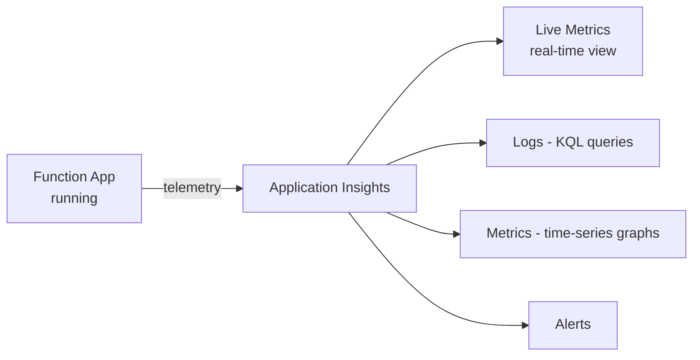
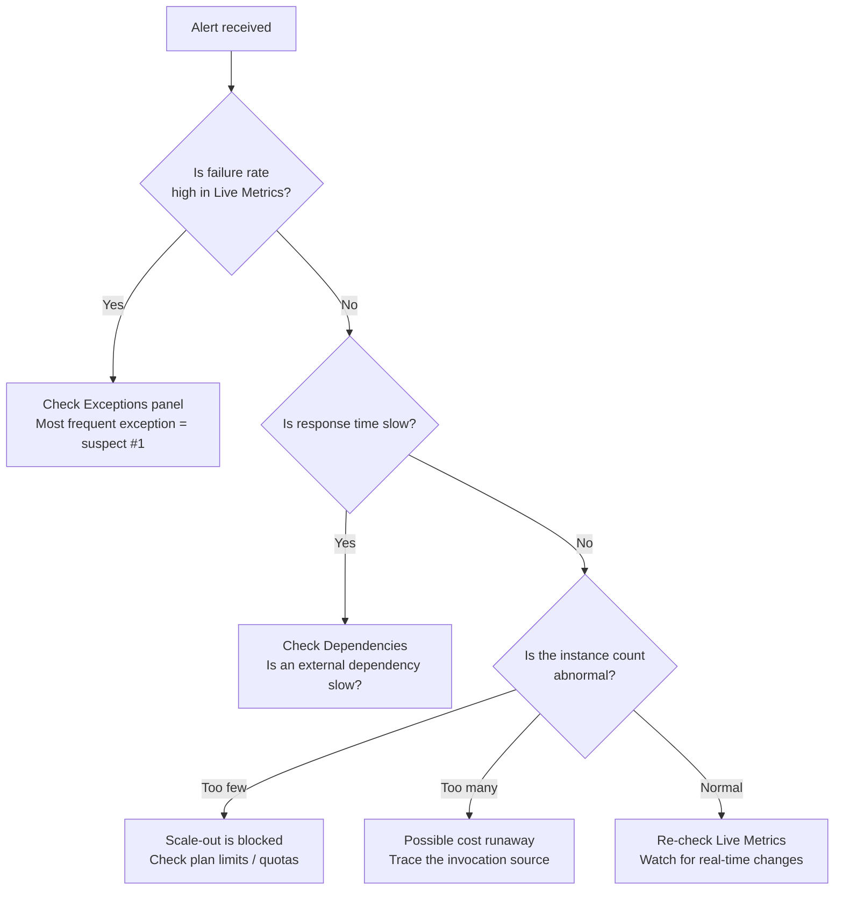

# Monitoring and Operations Fundamentals

> Azure Functions 101 series (7/7)

Across the previous six posts, we looked at how functions are built, what wakes them up, what environments they run in, and how they scale. This final post takes a different angle. Given a Function App that's already running, the question becomes: **as an operator, what should you watch, and what should you alert on?**

By the end of this post, you'll be able to:

- See invocation count, failure rate, response time, and exceptions on a single screen
- Measure cold start frequency
- Check "how many instances are running right now"
- Find where money is leaking
- Know which alerts to prioritize

---

## There's only one starting point — Application Insights

Ninety percent of Functions operations happens inside Application Insights (App Insights from here on). Function execution logs, exceptions, dependency calls, and custom metrics all flow into it. That makes wiring up App Insights when you create the Function App the single most important operational decision.

```bash
# 만들 때 연결하는 가장 단순한 방법
az monitor app-insights component create \
    --app ai-hello --location koreacentral --resource-group $RG

az functionapp config appsettings set \
    --name $APP --resource-group $RG \
    --settings APPLICATIONINSIGHTS_CONNECTION_STRING="<your-connection-string>"
```

Once it's connected, the following are collected automatically on every invocation:

- **Requests** — one invocation = one row
- **Exceptions** — exceptions thrown inside the function
- **Dependencies** — external systems the function called (HTTP, DB, Storage, etc.)
- **Traces** — logs you wrote with `context.log()`
- **Performance counters** — CPU, memory (per instance)

These five are the raw materials of operations.

---

## The first screen to open — Live Metrics

When you suspect something is wrong, the first place to open is **Application Insights → Live Metrics**. Almost in real time (down to the second), it shows:

- Requests per second
- Failure rate
- Response time distribution
- **Number of currently live servers (instances) and the CPU/memory of each**

You can see "how many instances the function is currently running on" at a glance. It's the fastest way to confirm whether the scale-out we discussed in post 6 actually happened.



---

## A 30-second KQL primer — five queries operators reach for

The real power of App Insights comes from **KQL (Kusto Query Language)**. The reason is simple: canned dashboards can't surface every pattern you care about. Here are five queries worth memorizing as a starter.

**1) Invocation count and failure rate over the last hour**

```kusto
requests
| where timestamp > ago(1h)
| summarize Total=count(), Failed=countif(success == false) by bin(timestamp, 1m)
| extend FailureRate = round(100.0 * Failed / Total, 2)
| order by timestamp desc
```

**2) Top 10 most frequent exceptions**

```kusto
exceptions
| where timestamp > ago(24h)
| summarize Count=count() by problemId, type
| top 10 by Count
```

**3) Top 10 slowest functions (by P95)**

```kusto
requests
| where timestamp > ago(24h)
| summarize p95=percentile(duration, 95), Count=count() by name
| top 10 by p95
```

**4) Estimating cold start frequency**

Functions doesn't expose cold starts as an explicit metric. Instead, you measure them indirectly through the trace log that says "the host re-indexed".

```kusto
traces
| where timestamp > ago(24h)
| where message has "Host started"
| summarize ColdStarts=count() by bin(timestamp, 1h)
| order by timestamp desc
```

**5) Downstream dependency failures**

```kusto
dependencies
| where timestamp > ago(1h) and success == false
| summarize Count=count() by target, type, resultCode
| order by Count desc
```

If you can reach for these five queries comfortably, you're already halfway to running Functions in production.

---

## What to alert on — a four-tier priority

With alerts, "accurate" matters more than "many". If you're new to operating this, I recommend starting with the following four-tier priority.

| Priority | Alert target | Threshold example | Why |
|---|---|---|---|
| **P0** | Spike in function failure rate | Failure rate > 5% over 5 minutes | Direct user impact |
| **P0** | Spike in response time | P95 is 3× the baseline | Not a failure, but heavy user impact |
| **P1** | Reaching the instance ceiling | Current instance count ≥ Max - 1 | About to lose ability to absorb more traffic |
| **P2** | Cost spike | Daily invocation count is 5× the baseline | Possible bug or attack |

Starting out, just the two P0s are enough. **The moment a noisy alert wakes you up unnecessarily, you start ignoring all alerts.** Add more slowly.

---

## How do you find the instance count?

There are three ways to see "how many instances are running right now":

1. **The Servers panel in Live Metrics** — most intuitive
2. **The `FunctionInstanceCount` metric** (Premium/Dedicated)
3. **The HostController's `/admin/host/scale/status` endpoint** — a diagnostic endpoint the Functions Host exposes to the external Scale Controller. You won't be staring at it day-to-day, but it's useful when investigating an incident.

In the Deep Dive series, post 5 walks through this endpoint at the code level.

---

## Watching cost deliberately

The last axis of operations is cost. The three most common patterns where money leaks in Functions are:

- **Infinite retries** — if a queue trigger keeps retrying forever after a failure, the same message gets re-invoked repeatedly and your invocation count explodes. **maxDeliveryCount + a dead-letter queue** is the basic safety net.
- **Timer firing too often** — the difference between "every minute" and "every 5 seconds" is a 12× invocation count. Check often whether you really need 5-second granularity.
- **Log floods** — `JSON.stringify`-ing a large object on every invocation and writing it to logs drives up App Insights ingestion cost. In production, lower the log level appropriately.

```bash
# 일일 호출 수 추세를 가장 빠르게 보는 명령
az monitor app-insights events show \
    --app ai-hello --resource-group $RG \
    --type requests --start-time -7d
```

---

## A "production is on fire" checklist

Finally, here's the order I follow when an alert wakes me up at 3am. Walk through it and you'll have the rough shape of the incident within the first five minutes.



---

## Closing the series

This wraps up the seven-post intro series. Here are the five sentences I hope you take with you.

1. **Azure Functions = a model where an event wakes a function and the function disappears when it's done.** Every design decision starts from this one line.
2. **Triggers and bindings are the "external interface" of a function.** They make your code shorter, but they don't replace your domain logic.
3. **Host and Worker are separate processes that talk over gRPC.** That's the secret to multi-language support, and the clue for where to look for logs in production.
4. **Choosing a plan is a trade-off between cost, cold starts, and concurrency.** "Serverless, so Consumption" is not always the right answer.
5. **Monitoring starts with "did you wire up Application Insights?"** Just five KQL queries in your back pocket make operations significantly smoother.

I also want to underline that serverless isn't a silver bullet. A tool only shines when it fits the workload. If you decide Functions doesn't fit, that's a perfectly reasonable conclusion. If this series gave you the material to reach that judgment a little faster, it's done its job.

---

## If you want to go deeper

If the internals piqued your curiosity, check out the **Azure Functions Deep Dive** series. If this series was the "user manual", that one is the "anatomical atlas". With the same seven-post structure, it leans on code and academic papers to answer questions like:

- When the Host boots, exactly which classes are called in what order?
- How is the Worker process spawned? How is multi-language support implemented in code?
- What does the gRPC EventStream handshake look like?
- Where in the code lives Placeholder Mode, the trick that reduces cold starts?
- How has academia analyzed this system? (Shahrad et al., USENIX ATC 2020, and others)

---

## Series table of contents

| # | Title |
|---|---|
| 1 | [What is Azure Functions? — A world where events call functions](./01-what-is-azure-functions.md) |
| 2 | [Triggers and bindings — Everything about function I/O](./02-triggers-and-bindings.md) |
| 3 | [Host and Worker — Who actually runs the function](./03-host-and-worker.md) |
| 4 | [Deploying your first function — From local to Azure](./04-first-deploy.md) |
| 5 | The four plans — Consumption / Flex Consumption / Premium / Dedicated |
| 6 | [Scaling and cold starts — The two faces of serverless](./06-scaling-and-cold-start.md) |
| 7 | **Monitoring and operations fundamentals** ← this post |

---

## References

**Official docs**
- [Monitor Azure Functions](https://learn.microsoft.com/en-us/azure/azure-functions/functions-monitoring)
- [Application Insights overview](https://learn.microsoft.com/en-us/azure/azure-monitor/app/app-insights-overview)
- [Kusto Query Language reference](https://learn.microsoft.com/en-us/azure/data-explorer/kusto/query/)
- [Configure monitoring for Azure Functions](https://learn.microsoft.com/en-us/azure/azure-functions/configure-monitoring)
