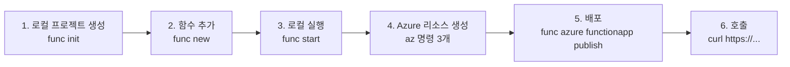
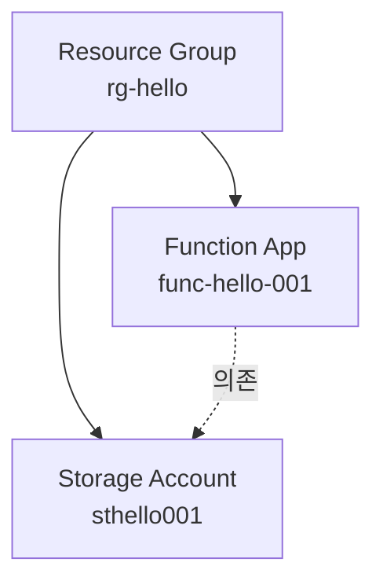
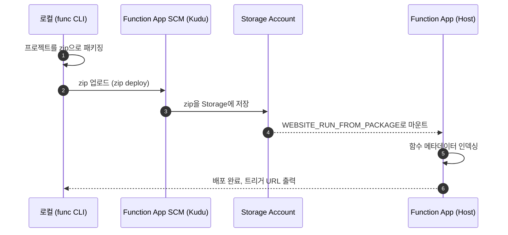

# 첫 번째 함수 배포 — 로컬에서 Azure까지

> Azure Functions 101 시리즈 (4/7)

지금까지 세 화는 개념이었습니다. 이제 손을 움직일 차례입니다. 이 글의 목표는 단 하나입니다. **로컬에서 함수를 만들어서, Azure에 배포해서, 인터넷에서 호출되는 URL을 받기까지 가장 짧은 경로**를 끝까지 보여드립니다.

이 글이 끝나면 여러분 앞에 다음이 남습니다.

- 로컬에서 `npm test`처럼 함수를 실행해 볼 수 있는 환경
- Azure에 떠 있는 진짜 Function App
- HTTPS URL 하나 (인터넷에서 호출 가능)
- “재배포”가 어떻게 되는지에 대한 감각

언어는 Node.js로 가겠습니다. Python이나 .NET을 쓰는 분도 큰 흐름은 동일합니다.

---

## 도구 셋팅 — 세 가지면 충분

배포까지 가는 데 필요한 도구는 셋입니다.

| 도구 | 역할 | 설치 |
|---|---|---|
| **Azure Functions Core Tools** | 로컬에서 함수를 실행 + 배포 명령(`func`) | `npm i -g azure-functions-core-tools@4` |
| **Azure CLI** | Azure 리소스를 명령줄로 만들고 관리 | OS별 설치 ([공식 문서](https://learn.microsoft.com/en-us/cli/azure/install-azure-cli)) |
| **Node.js 20+** | Worker 런타임 | nvm 또는 공식 설치 |

VS Code의 “Azure Functions” 확장을 쓰는 사람도 많지만, 이 글은 **CLI로만** 진행합니다. 이유는 명확합니다. CLI에서 한 번 끝까지 해 보면 IDE가 무엇을 자동화해 주는지가 명확하게 보입니다. 거꾸로는 어렵습니다.

설치가 끝나면 버전을 확인합니다.

```bash
func --version       # 4.x
az --version         # 2.x
node --version       # v20+
```

---

## 전체 흐름 한 장

이 글에서 할 일을 미리 그려 두면 길을 잃지 않습니다.



---

## 1. 프로젝트 만들기

빈 폴더에서 시작합니다.

```bash
mkdir hello-functions && cd hello-functions
func init . --worker-runtime node --language javascript --model V4
```

명령 하나로 프로젝트 골격이 잡힙니다. 핵심 파일은 셋입니다.

- `host.json` — Host 설정 (확장 버전, 로깅, 동시성 등)
- `local.settings.json` — 로컬 실행용 환경 변수 (커밋하면 안 됩니다)
- `package.json` — 평범한 npm 프로젝트

`local.settings.json`은 운영 환경의 **App Settings**와 같은 역할을 합니다. 로컬에서는 이 파일을 읽고, Azure에서는 Azure 리소스에 설정된 App Settings를 읽습니다. **로컬 → 운영 전환 시 코드는 그대로**라는 게 핵심입니다.

---

## 2. 함수 추가

가장 단순한 HTTP 트리거 함수를 추가합니다.

```bash
func new --template "HTTP trigger" --name hello --authlevel anonymous
```

생성되는 파일은 `src/functions/hello.js` 한 개. 안을 들여다보면 1화에서 본 것과 비슷합니다.

```javascript
const { app } = require('@azure/functions');

app.http('hello', {
    methods: ['GET', 'POST'],
    authLevel: 'anonymous',
    handler: async (request, context) => {
        context.log(`Http function processed request for url "${request.url}"`);
        const name = request.query.get('name')
            || (await request.text())
            || 'world';
        return { body: `Hello, ${name}!` };
    }
});
```

수정 없이 그대로 갑니다.

---

## 3. 로컬에서 실행

```bash
npm install
func start
```

출력 마지막에 다음 줄이 보이면 성공입니다.

```
Functions:
        hello: [GET,POST] http://localhost:7071/api/hello
```

다른 터미널에서 호출해 봅니다.

```bash
curl "http://localhost:7071/api/hello?name=Sisyphus"
# Hello, Sisyphus!
```

이 시점에서 `func start`는 **로컬에 미니 Functions Host를 띄운 상태**입니다. 3화에서 본 Host와 Worker가 진짜로 둘 다 떠 있고, 둘 사이에 gRPC 채널이 연결돼 있습니다. 즉 운영 환경과 같은 구조가 여러분의 노트북에서 돌아갑니다.

---

## 4. Azure 리소스 만들기

이제 클라우드 차례입니다. Azure에 함수를 띄우려면 세 개의 리소스가 필요합니다.

| 리소스 | 역할 |
|---|---|
| **Resource Group** | 모든 리소스를 묶는 폴더 |
| **Storage Account** | Functions Host의 상태/락/큐 저장소. **필수**. |
| **Function App** | 함수를 담는 컴퓨트 리소스 |



> 💡 Storage Account는 Functions가 “자기 동작용으로 쓰는” 인프라 저장소입니다. 함수 코드, 트리거 락, 호출 로그 메타데이터, Timer 트리거의 schedule 상태 등이 여기 저장됩니다. 비즈니스 데이터를 여기에 저장하지는 않습니다(별도 Storage를 따로 만드는 걸 권장).

명령은 다음 셋입니다. 이름은 전 세계 유일해야 하므로 적당히 바꾸세요.

```bash
RG=rg-hello
LOC=koreacentral
SA=sthello$RANDOM
APP=func-hello-$RANDOM

# 1) Resource Group
az group create --name $RG --location $LOC

# 2) Storage Account (Standard LRS면 충분)
az storage account create \
    --name $SA --resource-group $RG \
    --location $LOC --sku Standard_LRS

# 3) Function App (Consumption 플랜, Node 20)
az functionapp create \
    --name $APP --resource-group $RG \
    --storage-account $SA \
    --consumption-plan-location $LOC \
    --runtime node --runtime-version 20 --functions-version 4
```

마지막 명령이 끝나면 Azure 포털에서 Function App이 보입니다. 아직 함수 코드는 비어 있는 상태입니다.

> 📝 5화에서 다룰 거지만, `--consumption-plan-location` 자리에 Premium·Flex Consumption·App Service Plan을 지정할 수도 있습니다. 입문에서는 가장 단순한 Consumption으로 갑니다.

---

## 5. 배포

배포는 한 줄입니다.

```bash
func azure functionapp publish $APP
```

내부적으로 일어나는 일을 풀어 보면 다음과 같습니다.



마지막에 다음과 같은 출력이 나옵니다.

```
Functions in func-hello-xxxxx:
    hello - [httpTrigger]
        Invoke url: https://func-hello-xxxxx.azurewebsites.net/api/hello
```

이 URL이 여러분이 받은 인터넷 주소입니다.

---

## 6. 인터넷에서 호출

```bash
curl "https://func-hello-xxxxx.azurewebsites.net/api/hello?name=Sisyphus"
# Hello, Sisyphus!
```

여기까지가 “0에서 1로” 가는 가장 짧은 경로입니다. 같은 명령(`func azure functionapp publish $APP`)을 다시 실행하면 재배포됩니다.

---

## 운영 단계로 가기 전에 알아두면 좋은 다섯 가지

이 글의 흐름은 **가장 짧은 데모 경로**입니다. 운영에 들어가려면 다음 다섯 가지를 차근차근 채워 나가야 합니다. 이 시리즈의 후반부와 별도 운영 시리즈에서 다룰 주제이기도 합니다.

1. **App Settings = 환경 변수** — `local.settings.json`의 값들은 운영에서는 `az functionapp config appsettings set`으로 옮깁니다. 비밀값은 Key Vault 참조로.
2. **인증** — `authLevel: 'anonymous'`는 데모용입니다. 실제로는 `function` 키, AAD 인증, API Management 등을 앞에 둡니다.
3. **CI/CD** — `func ... publish`는 로컬 데모용입니다. 운영은 GitHub Actions / Azure DevOps에서 동일 명령을 실행하거나 ARM/Bicep으로 인프라를 코드화합니다.
4. **로그와 모니터링** — Application Insights를 함께 만들고 연결하면 호출 로그/예외/성능 지표를 한 곳에서 볼 수 있습니다(7화).
5. **플랜 선택** — Consumption은 시작하기엔 좋지만 모든 워크로드의 정답은 아닙니다(5·6화).

---

## 자주 막히는 지점 3가지

- **Storage Account 이름 충돌** — Storage 이름은 전 세계 유일해야 합니다. `sthello$RANDOM` 같은 패턴을 쓰면 충돌을 피하기 좋습니다.
- **`func` 명령이 동작하지 않음** — Core Tools는 v4가 최신입니다. v3 이하가 깔려 있으면 `func` 명령이 다른 동작을 합니다. `func --version`으로 먼저 확인.
- **배포는 됐는데 함수 URL이 404** — 함수 인덱싱 실패가 가장 흔한 원인입니다. 포털 → Function App → Log stream에서 부팅 로그를 보면 실마리가 보입니다. 모듈 누락(`npm install` 빠짐)이 자주 등장합니다.

---

## 다음 화에서

배포까지 됐으니 이제 “**어떤 플랜에서 돌릴 것인가**”가 진짜 질문입니다. Consumption으로 시작했지만, 실서비스에서는 Flex Consumption, Premium, Dedicated(App Service Plan) 중 하나를 골라야 합니다. 다음 글에서는 이 4가지 플랜의 차이를 한 번에 정리합니다.

---

## 시리즈 목차

| # | 제목 |
|---|---|
| 1 | [Azure Functions란? — 이벤트가 함수를 호출하는 세상](./01-what-is-azure-functions.md) |
| 2 | [트리거와 바인딩 — 함수 입출력의 모든 것](./02-triggers-and-bindings.md) |
| 3 | [Host와 Worker — 함수는 누가 실행하는가](./03-host-and-worker.md) |
| 4 | **첫 번째 함수 배포 — 로컬에서 Azure까지** ← 현재 글 |
| 5 | 4가지 플랜 — Consumption / Flex Consumption / Premium / Dedicated |
| 6 | 스케일링과 콜드 스타트 — 서버리스의 두 얼굴 |
| 7 | 모니터링과 운영 기초 |

---

## References

**공식 문서**
- [Azure Functions Core Tools](https://learn.microsoft.com/en-us/azure/azure-functions/functions-run-local)
- [`az functionapp` CLI reference](https://learn.microsoft.com/en-us/cli/azure/functionapp)
- [Run from package deployment](https://learn.microsoft.com/en-us/azure/azure-functions/run-functions-from-deployment-package)
- [Continuous deployment for Azure Functions](https://learn.microsoft.com/en-us/azure/azure-functions/functions-continuous-deployment)
