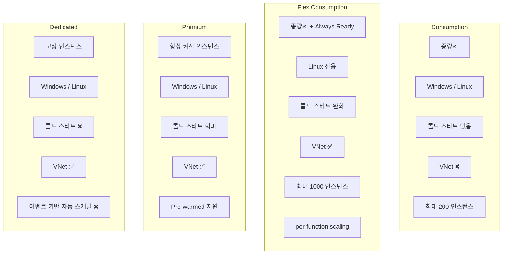
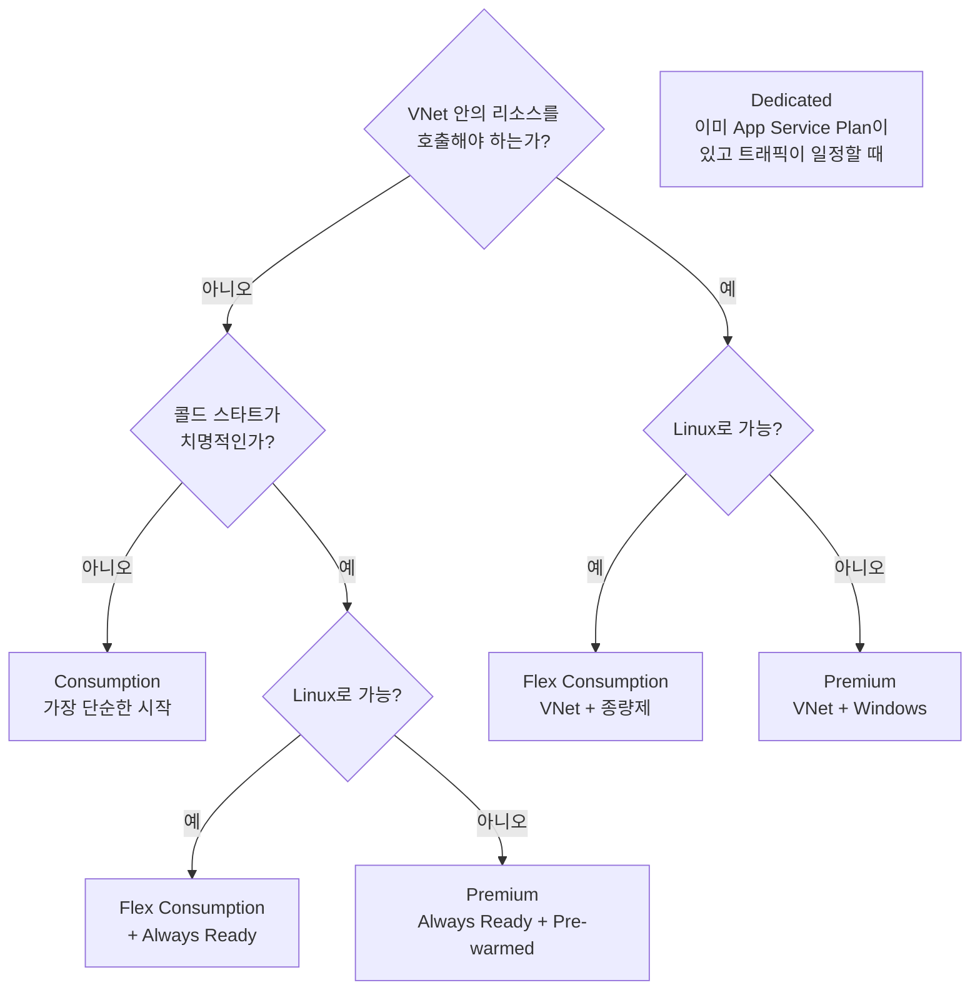

# 4가지 플랜 — Consumption / Flex Consumption / Premium / Dedicated

> Azure Functions 101 시리즈 (5/7)

4화에서 첫 함수를 Consumption 플랜에 띄웠습니다. 그건 “일단 돌려 보기”에 가장 단순한 선택이었지만, 실서비스에서는 4가지 호스팅 플랜 중 하나를 의식적으로 골라야 합니다. **Consumption / Flex Consumption / Premium / Dedicated(App Service Plan).** 이 4개의 차이를 모르면 비용이 새거나, 콜드 스타트로 서비스가 망가지거나, VNet 통합이 안 돼서 다시 만드는 일이 생깁니다.

이 글의 목표는 단순합니다. **각 플랜이 무엇을 더 주고 무엇을 빼는지, 그리고 여러분의 워크로드에서 어느 것을 골라야 하는지**가 명확해지는 것. 마지막에 의사결정 트리도 붙입니다.

---

## 한 줄 정의 — 4가지 플랜

먼저 헷갈리지 않게 한 줄씩 정의해 둡니다.

| 플랜 | 한 줄 정의 |
|---|---|
| **Consumption** | 가장 단순한 종량제. 트래픽 0이면 비용 0. 콜드 스타트 있음. |
| **Flex Consumption** | Consumption의 단점(콜드 스타트, VNet 미지원, 인스턴스 메모리 고정)을 해결한 차세대 종량제. **Linux 전용**, 2024년 GA. |
| **Premium** | Always Ready / Pre-warmed 인스턴스로 콜드 스타트를 회피하는 프리미엄 플랜. VNet 가능. 항상 떠 있어 비용 발생. |
| **Dedicated (App Service Plan)** | 다른 App Service와 인프라를 공유하는 모델. **이벤트 기반 자동 스케일 미지원**. 메트릭 기반으로 직접 룰을 짜야 함. |

“Functions = 자동 스케일”이라는 한 줄짜리 이미지가 있다면, **그 자동 스케일이 4가지 플랜에서 다 다르다**는 게 이 글의 출발점입니다.

---

## 큰 그림 — 무엇이 다른가

각 박스의 차이를 키워드별로 펼쳐 봅니다.

---

## 비교표 — 한 화면에 정리

| 항목 | Consumption | Flex Consumption | Premium | Dedicated |
|---|---|---|---|---|
| **종량제** | ✅ | ✅ + Always Ready 시간 과금 | ❌ (인스턴스 시간 과금) | ❌ (App Service Plan SKU) |
| **트래픽 0일 때 비용** | 0 | Always Ready 분만 발생 | 최소 인스턴스 비용 발생 | 항상 발생 |
| **콜드 스타트** | 있음 | Always Ready로 회피 가능 | 회피 (Always Ready / Pre-warmed) | 없음 (이미 떠 있음) |
| **OS** | Windows / Linux | Linux 전용 | Windows / Linux | Windows / Linux |
| **VNet 통합** | ❌ | ✅ | ✅ | ✅ |
| **최대 인스턴스 수** | 200 | 1000 | 100 | App Service Plan에 따름 |
| **이벤트 기반 자동 스케일** | ✅ | ✅ (target-based) | ✅ (target-based) | ❌ (메트릭 룰 직접) |
| **Per-function scaling** | ❌ | ✅ | ❌ | ❌ |
| **인스턴스 메모리** | 1.5 GB 고정 | 512 / 2048 / 4096 MB 선택 | 다양한 SKU | App Service Plan SKU |
| **배포 슬롯** | 제한적 | ❌ (rolling update로 대체) | ✅ | ✅ |
| **Warmup 트리거** | ❌ | ✅ (Always Ready 기반) | ✅ | ✅ |

> 출처: Microsoft Learn의 [Flex Consumption plan](https://learn.microsoft.com/en-us/azure/azure-functions/flex-consumption-plan), [Function scale and hosting options](https://learn.microsoft.com/en-us/azure/azure-functions/functions-scale), [Event-driven scaling](https://learn.microsoft.com/en-us/azure/azure-functions/event-driven-scaling), [Target-based scaling](https://learn.microsoft.com/en-us/azure/azure-functions/functions-target-based-scaling). 인스턴스 상한값과 메모리 옵션은 공식 문서 기준이며 시간이 지나면 갱신될 수 있습니다.

이 표 한 장이 이 글의 절반입니다. 나머지 절반은 “이 표를 어떻게 의사결정에 쓰는가”입니다.

---

## Consumption — 가장 단순한 시작점

여전히 가장 많은 시나리오에서 정답입니다. 트래픽이 들쭉날쭉하고, VNet 안 쪽 리소스를 호출하지 않고, 가벼운 콜드 스타트를 견딜 수 있다면 Consumption으로 충분합니다.

**선택 기준**

- 트래픽이 0과 N 사이를 오감
- 외부 인터넷 리소스만 호출 (VPN/VNet 안 씀)
- 첫 호출에 수백 ms 추가는 허용 가능
- Windows에서 돌려야 함 (Flex는 Linux 전용)

**약점**

- 콜드 스타트
- VNet 통합 불가
- 인스턴스 메모리가 1.5 GB로 고정 (대형 ML 모델 로드 어려움)
- 최대 200 인스턴스

---

## Flex Consumption — Microsoft가 “권장하는” 새 종량제

2024년 GA된 비교적 새로운 플랜이고, Microsoft가 [공식적으로 “the recommended serverless hosting plan for Azure Functions”](https://learn.microsoft.com/en-us/azure/azure-functions/flex-consumption-plan)라고 표현합니다. **Consumption의 거의 모든 약점을 해결한** 모델입니다.

**핵심 차별점**

- **VNet 통합** — Consumption에서 가장 아쉬웠던 한계가 해결됐습니다.
- **인스턴스 메모리 선택** — 512 / 2048 / 4096 MB 중에서 워크로드에 맞춰 고를 수 있습니다. ML 모델을 인스턴스에 로드해 두는 패턴이 가능해집니다.
- **Always Ready 인스턴스** — 콜드 스타트가 치명적인 호출 그룹에 “최소 N개는 항상 켜 둔다”를 설정할 수 있습니다. (기본값 0)
- **Per-function scaling** — HTTP, blob, durable이 각자 따로 스케일링됩니다. 한 함수의 트래픽 폭증이 다른 함수에 영향을 적게 줍니다.
- **최대 1000 인스턴스** — Consumption의 5배.
- **Azure Files 마운트** — 큰 바이너리, ML 모델, 공유 데이터를 배포 패키지에 묶지 않고 마운트할 수 있습니다.

**약점**

- **Linux 전용** — Windows 워크로드는 못 옴
- **배포 슬롯 미지원** — Slot Swap 기반 운영을 쓰던 팀은 패턴을 rolling update로 바꿔야 함
- **다른 플랜으로 in-place 마이그레이션 불가** — Flex로 가려면 새 함수 앱을 만들어야 함
- **인앱 초기화 30초 타임아웃** — 부팅에 30초 이상 걸리면 `System.TimeoutException` 발생 (현재로서는 조정 불가)
- **C# in-process 모델 미지원** — isolated worker 모델로 마이그레이션 필요

**선택 기준**

- VNet 안의 리소스(Cosmos DB private endpoint, Key Vault 등)를 호출해야 함
- 콜드 스타트를 줄이고 싶지만 Premium의 항상 켜진 비용은 부담
- Linux로 시작하거나 Linux로 옮길 의사가 있음
- 인스턴스 메모리를 워크로드에 맞춰 조정하고 싶음
- 새 프로젝트라면 사실상 첫 후보

---

## Premium — 콜드 스타트 회피의 정공법

Premium은 **항상 깨어 있는 인스턴스를 띄워 두는** 모델입니다. Always Ready로 “기본으로 N개는 켜 두기”를 보장하고, Pre-warmed로 “스케일아웃 시 미리 워밍된 여분”을 유지합니다.

**선택 기준**

- 콜드 스타트가 비즈니스적으로 절대 안 됨 (저지연 API)
- VNet 통합이 필요한 동시에 Windows를 써야 함 (Flex는 Linux만 지원)
- 트래픽이 일정 수준 이상으로 꾸준해서 “항상 켜 두는 비용”이 부담스럽지 않음
- Pre-warmed 같은 세밀한 워밍 제어가 필요

**약점**

- 트래픽 0일 때도 최소 인스턴스 비용 발생
- 같은 “종량제 패밀리”에서 가장 비쌈
- 새 시나리오에서는 Flex Consumption이 더 합리적인 경우가 많음 (Linux 워크로드라면)

---

## Dedicated (App Service Plan) — Functions를 “일반 PaaS”에 얹기

이름이 헷갈리지만 본질은 단순합니다. **Functions를 일반 App Service Plan에 얹어서 돌리는** 모델입니다. 다른 웹 앱과 인프라를 공유합니다.

**선택 기준**

- 이미 App Service Plan이 떠 있고, 거기에 Functions를 추가로 얹는 게 비용 효율적임
- 트래픽이 일관되게 높아서 “인스턴스를 항상 켜 두는” 모델이 더 쌈
- 이벤트 기반 자동 스케일이 필요 없음

**약점 (가장 중요한 한 줄)**

- **이벤트 기반 자동 스케일이 작동하지 않습니다.** Consumption/Flex/Premium처럼 “큐 길이 보고 인스턴스 자동 추가” 같은 동작은 일어나지 않습니다. App Service Plan의 메트릭 기반 자동 스케일 룰을 여러분이 직접 짜야 합니다.

이 사실을 모르고 “Dedicated가 더 안정적일 것 같다”는 직관으로 골랐다가 트래픽 폭증 때 인스턴스가 안 늘어나서 큐가 쌓이는 경우가 있습니다. **Functions답게 동작하는 플랜은 사실상 Consumption / Flex / Premium 셋입니다.**

---

## 의사결정 트리

세 가지 질문에 차례로 답하면 대부분의 경우 답이 나옵니다.

이 트리에 Dedicated가 “기본 경로”에서 빠진 게 의도적입니다. Dedicated는 **이벤트 기반 자동 스케일을 포기해도 되는** 특수한 경우에만 고르는 플랜이기 때문입니다.

---

## 새 프로젝트 시작 시 추천 — 한 단락 결론

세 줄로 정리합니다.

1. **Linux + 새 프로젝트라면 Flex Consumption을 첫 후보로** 두세요. Microsoft 공식 권장이고, Consumption의 거의 모든 약점을 해결합니다.
2. **Windows이거나 콜드 스타트가 절대 안 된다면 Premium**.
3. **가장 단순한 데모/실험/PoC는 Consumption**. 트래픽 0일 때 진짜로 0원입니다.

Dedicated는 “이미 App Service Plan을 운영 중”이거나 “Functions를 일반 PaaS처럼 운영하기로 명시적으로 결정”한 경우에만 고르세요.

---

## 다음 화에서

플랜을 골랐으면 다음은 “**그래서 트래픽이 들어오면 어떻게 인스턴스가 늘어나는가, 그리고 첫 호출은 왜 느린가**”입니다. 6화에서는 스케일링 결정 모델(이벤트 기반 / target-based / 메트릭 기반)과 콜드 스타트의 정체를 한 화면에 정리하고, 콜드 스타트를 줄이는 실무 패턴 5가지를 다룹니다.

내부 동작이 궁금하다면 심화편 5·6화로 가시면 됩니다. 거기서는 Scale Controller가 보는 코드, Placeholder 모드의 Specialization 로직을 직접 따라갑니다.

---

## 시리즈 목차

| # | 제목 |
|---|---|
| 1 | [Azure Functions란? — 이벤트가 함수를 호출하는 세상](./01-what-is-azure-functions.md) |
| 2 | [트리거와 바인딩 — 함수 입출력의 모든 것](./02-triggers-and-bindings.md) |
| 3 | [Host와 Worker — 함수는 누가 실행하는가](./03-host-and-worker.md) |
| 4 | [첫 번째 함수 배포 — 로컬에서 Azure까지](./04-first-deploy.md) |
| 5 | **4가지 플랜 — Consumption / Flex Consumption / Premium / Dedicated** ← 현재 글 |
| 6 | [스케일링과 콜드 스타트 — 서버리스의 두 얼굴](./06-scaling-and-cold-start.md) |
| 7 | [모니터링과 운영 기초](./07-monitoring-and-ops.md) |

---

## References

**공식 문서**
- [Azure Functions Flex Consumption plan hosting](https://learn.microsoft.com/en-us/azure/azure-functions/flex-consumption-plan)
- [Function scale and hosting options](https://learn.microsoft.com/en-us/azure/azure-functions/functions-scale)
- [Event-driven scaling in Azure Functions](https://learn.microsoft.com/en-us/azure/azure-functions/event-driven-scaling)
- [Target-based scaling](https://learn.microsoft.com/en-us/azure/azure-functions/functions-target-based-scaling)
- [Azure Functions Premium plan](https://learn.microsoft.com/en-us/azure/azure-functions/functions-premium-plan)
- [Dedicated hosting plans for Azure Functions](https://learn.microsoft.com/en-us/azure/azure-functions/dedicated-plan)
- [Migrate from Consumption to Flex Consumption](https://learn.microsoft.com/en-us/azure/azure-functions/migration/migrate-plan-consumption-to-flex)

**참고 글**
- [SIOS Tech Lab — Azure Functions 概要とプラン別スケーリング](https://tech-lab.sios.jp/archives/35541)
