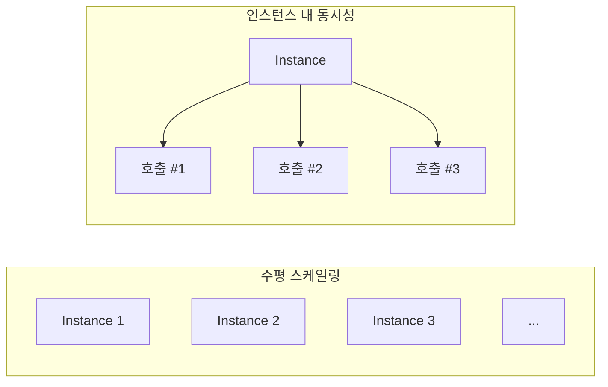
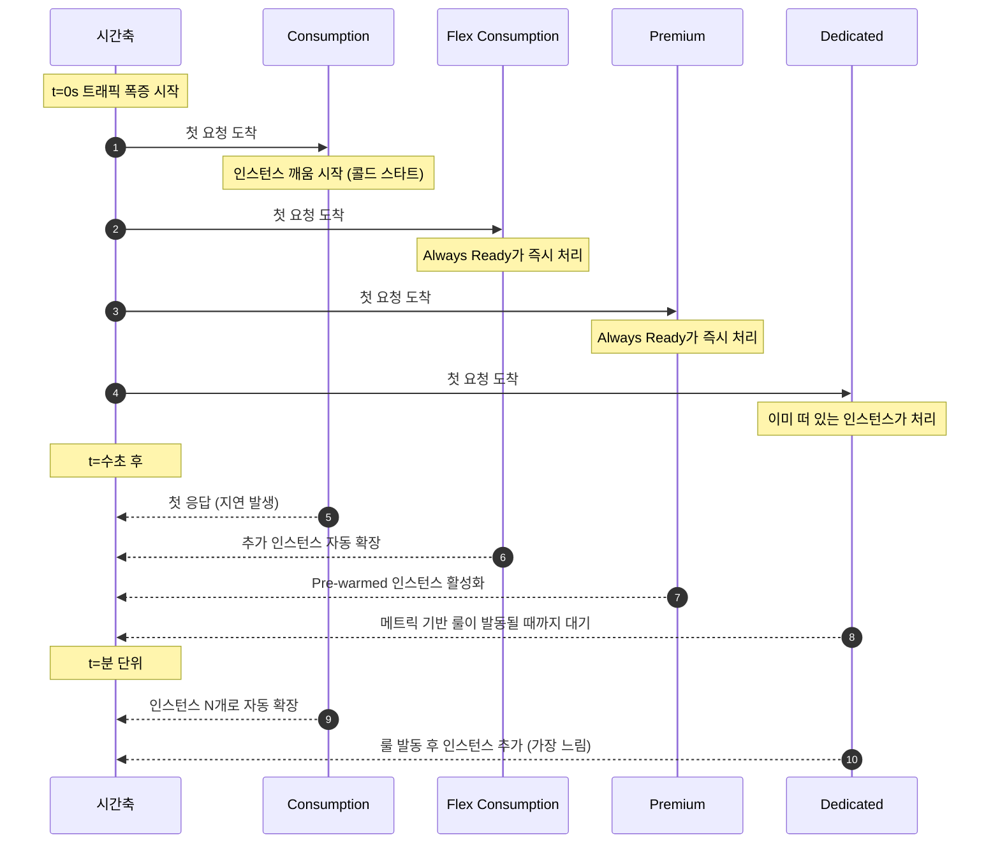
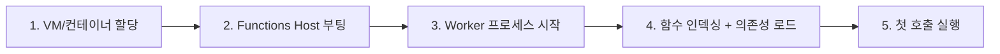
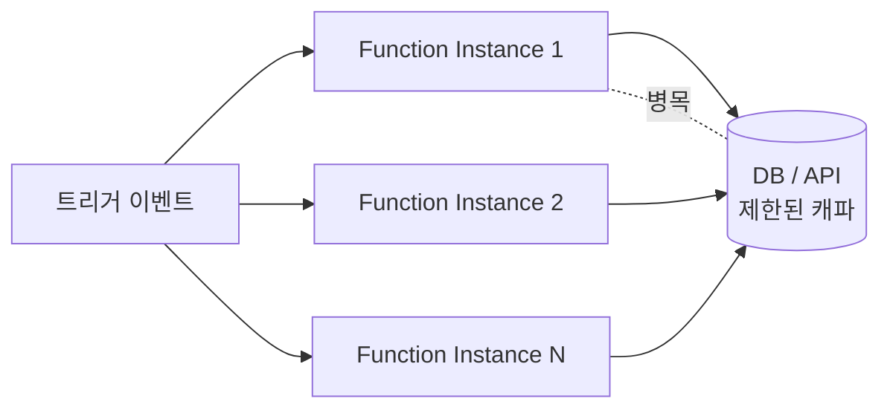

# 스케일링과 콜드 스타트 — 서버리스의 두 얼굴

> Azure Functions 101 시리즈 (6/7)

서버리스를 한 줄로 광고할 때 자주 등장하는 문장은 “자동으로 스케일링되고, 사용한 만큼만 낸다”입니다. 사실입니다. 그런데 그 문장 뒤에는 거의 항상 별표(*)가 붙어 있습니다. 별표 안에 적힌 이야기가 두 개입니다. **(1) 어떻게 스케일링되는가**, 그리고 **(2) 콜드 스타트 때문에 첫 호출이 느릴 수 있다**. 이 두 가지가 “서버리스의 두 얼굴”입니다.

이번 글은 5화에서 본 4가지 플랜의 표를 **운영 관점**으로 다시 그립니다. 트래픽이 갑자기 10배가 됐을 때 각 플랜이 어떻게 반응하는지, 콜드 스타트는 왜 생기고 어떻게 줄이는지, 그리고 배포 직후 첫 요청을 빠르게 만드는 실무 패턴을 정리합니다.

---

## “스케일링”의 두 축 — 인스턴스 vs 동시성

먼저 단어를 분리해야 합니다. 스케일링이라는 한 단어 안에는 사실 두 가지 축이 있습니다.

- **수평 스케일링(scale out)** — 인스턴스 수를 늘림. 트래픽이 N배 되면 인스턴스도 N배쯤.
- **인스턴스 내 동시성(in-instance concurrency)** — 한 인스턴스 안에서 함수를 몇 개나 동시에 실행하는가.



플랜별 차이는 **이 두 축 중 어느 쪽을 어떻게 다루는가**에서 갈립니다.

| 플랜 | 수평 스케일링 결정 주체 | 인스턴스 내 동시성 |
|---|---|---|
| Consumption | 플랫폼이 자동 (event-driven) | 자동, 사용자 제어 어려움 |
| Flex Consumption | 플랫폼이 자동 (target-based) | **사용자가 per-instance concurrency 직접 설정** |
| Premium | 플랫폼이 자동 + Always Ready/Pre-warmed | 사용자가 host.json으로 조정 |
| Dedicated (App Service Plan) | 사용자가 메트릭 기반 룰로 설정 | host.json으로 조정 |

이 표가 핵심입니다. **Functions의 “자동 스케일링”은 플랜에 따라 의미가 다릅니다.** Consumption은 진짜로 0~N까지 자동이지만, Dedicated는 “자동 스케일 규칙을 여러분이 직접 설정”하는 모델입니다.

---

## 트래픽 폭증 시나리오 — 4가지 플랜의 반응

말로 비교하면 안 와닿습니다. 같은 자극을 줬을 때 4가지 플랜이 어떻게 다르게 반응하는지를 시간축으로 그려보겠습니다. 자극은 “0초까지 트래픽 0, 0초에 갑자기 RPS가 100으로 치솟음”이라고 가정합니다.



요약하면 다음 4가지가 핵심 차이입니다.

- **Consumption**: 첫 요청 = 콜드 스타트. 단, 아주 빠르게 0→N으로 확장.
- **Flex Consumption**: Always Ready로 첫 요청 처리, target-based로 빠른 확장.
- **Premium**: Always Ready + Pre-warmed로 콜드 스타트 회피, 같은 패밀리에서 가장 비쌈.
- **Dedicated**: 콜드 스타트 자체가 없음(이미 떠 있음). 대신 트래픽 폭증에 자동 반응이 가장 느리거나, 아예 수동.

---

## 콜드 스타트가 정확히 무엇인가

“콜드 스타트”라는 단어를 책임 있게 쓰려면 정의가 필요합니다.

> **콜드 스타트 = 함수를 처리할 새 인스턴스가 0에서 1이 되는 데 걸리는 시간**

이 시간이 어디로 가는지 분해해 보면 다음과 같습니다.



각 단계에서 시간이 줄어들거나 늘어나는 요인은 다음과 같습니다.

| 단계 | 시간 결정 요인 | 대표적인 절감 방법 |
|---|---|---|
| 1 | 플랫폼이 placeholder 인스턴스를 미리 띄워두면 거의 0 | (플랫폼 책임 — 6장에서 심화편 6화 참고) |
| 2 | Host 자체는 빠름 | 일반적으로 손댈 곳 없음 |
| 3 | Worker 시작 시간 (Java/.NET이 Node/Python보다 무거운 편) | 언어 선택, isolated vs in-proc |
| 4 | **여러분의 코드 의존성 양** | 의존성 줄이기, lazy import |
| 5 | 첫 호출 자체 비용 | warmup trigger, ping 트래픽 |

여기서 중요한 사실 하나. **콜드 스타트 시간의 절반 이상은 4번에서 결정되는 경우가 많습니다.** 플랜을 비싼 걸로 바꾸기 전에 의존성을 줄이는 것이 항상 우선입니다.

---

## 콜드 스타트를 줄이는 실무 패턴

플래닝 단계에서, 코드 단계에서, 운영 단계에서 각각 할 수 있는 일이 있습니다.

**플래닝 단계**

- 콜드 스타트가 비즈니스적으로 치명적이라면 처음부터 Premium 또는 Flex Consumption + Always Ready를 검토합니다.
- 그렇지 않다면 Consumption + “콜드 스타트 절감 코드 패턴”으로 충분한 경우가 많습니다.

**코드 단계**

- **의존성 다이어트** — 거대한 SDK를 한 줄 쓰려고 통째로 import하지 마세요. tree-shake 또는 분해된 패키지(`@azure/cosmos` 대신 필요한 모듈만)를 우선합니다.
- **lazy import / lazy init** — 모듈 로드 시점에 무거운 작업(DB 연결, 큰 파일 읽기)을 하지 마세요. 첫 호출 안에서 늦게 초기화하고 캐시합니다.
- **글로벌 캐시** — Functions의 모듈 스코프 변수는 같은 Worker 안에서 살아남습니다. DB 클라이언트, JWKS 키 같은 건 모듈 스코프에 한 번 만들고 재사용합니다.

```javascript
// 좋은 예: 모듈 스코프 캐시 + lazy 초기화
let cachedClient;

function getClient() {
    if (!cachedClient) {
        cachedClient = createCosmosClient();   // 첫 호출에서만 만들어짐
    }
    return cachedClient;
}

app.http('hello', {
    handler: async (request, context) => {
        const client = getClient();
        // ...
    }
});
```

**운영 단계**

- **Warmup trigger** — Premium/Dedicated에서 인스턴스가 추가될 때 한 번 실행되는 트리거. 캐시 워밍 같은 작업을 여기에 올립니다. (Consumption에서는 사용 불가)
- **Always Ready 인스턴스** — Premium / Flex Consumption에서 “기본으로 N개는 항상 켜 두기”를 설정합니다. N=1이면 첫 요청은 항상 따뜻하게 받습니다.

---

## 동시성을 의식적으로 다루기

“스케일아웃이 자동이니까 동시성은 신경 안 써도 되겠지”는 흔한 함정입니다. 실제로는 다음 두 가지 때문에 동시성을 알아야 합니다.

**1) 다운스트림 의존성의 한계**

DB 커넥션 풀, 외부 API의 RPS 한도 같은 건 스케일아웃과 함께 늘어나지 않습니다. 인스턴스가 100개로 늘어났는데 DB 커넥션 풀이 10이면, 99개 인스턴스가 커넥션 대기 상태가 됩니다. **함수의 스케일은 다운스트림의 캐파시티를 넘지 못합니다.** 이 사실이 종종 잊힙니다.



대응책은 보통 두 가지입니다.

- **함수 동시성 제한** — host.json의 `extensions.queues.batchSize` 같은 설정으로 트리거당 처리량을 제한.
- **다운스트림 격리** — Service Bus 같은 큐로 백프레셔를 받고, 다운스트림 처리 속도에 맞춰 천천히 소비.

**2) 같은 인스턴스 안의 동시 실행**

3화에서 본 것처럼 한 Worker 안에서 여러 호출이 동시 실행될 수 있습니다(언어/설정에 따라). 이 말은 **모듈 스코프 변수가 동시 호출 사이에 공유된다**는 뜻입니다. 전역 변수에 “현재 처리 중인 사용자”를 박아두는 코드는 그래서 위험합니다.

---

## 비용 모델과 스케일링의 관계

비용을 빼고 스케일링을 이야기하면 반쪽입니다. 한 줄씩만 정리해 둡니다.

- **Consumption**: 실행 시간 × 메모리 + 실행 횟수. 트래픽 0이면 비용 0.
- **Flex Consumption**: 위와 비슷 + Always Ready 인스턴스에 대한 시간당 과금.
- **Premium**: 인스턴스를 띄워둔 시간 (수평 스케일된 만큼). 트래픽 적어도 최소 인스턴스 비용은 발생.
- **Dedicated**: App Service Plan의 인스턴스 수 × SKU 시간당 단가. 트래픽과 무관하게 일정.

“자동 스케일아웃은 좋지만 비용도 자동으로 늘어난다”는 점을 기억하세요. 트래픽 폭증이 곧 비용 폭증입니다. **상한(Maximum scale-out limit)을 반드시 의식적으로 설정**하는 게 운영 기본기입니다.

---

## 7화 예고

스케일링 이야기는 “이 함수가 지금 몇 개 인스턴스에서 어떻게 돌아가고 있는지”를 **볼 수 있어야** 의미가 있습니다. 다음 글에서는 Application Insights를 중심으로 한 모니터링과 운영 기초를 다룹니다. 호출 수, 실패율, 콜드 스타트 빈도, 이런 것들을 어디서 보고 어떻게 알람을 거는지가 주제입니다.

콜드 스타트와 스케일링의 **내부 메커니즘**(Scale Controller, Placeholder, Specialization)이 궁금하다면 심화편 5·6화로 가시면 됩니다. 거기서는 코드를 직접 따라갑니다.

---

## 시리즈 목차

| # | 제목 |
|---|---|
| 1 | [Azure Functions란? — 이벤트가 함수를 호출하는 세상](./01-what-is-azure-functions.md) |
| 2 | [트리거와 바인딩 — 함수 입출력의 모든 것](./02-triggers-and-bindings.md) |
| 3 | [Host와 Worker — 함수는 누가 실행하는가](./03-host-and-worker.md) |
| 4 | [첫 번째 함수 배포 — 로컬에서 Azure까지](./04-first-deploy.md) |
| 5 | 4가지 플랜 — Consumption / Flex Consumption / Premium / Dedicated |
| 6 | **스케일링과 콜드 스타트 — 서버리스의 두 얼굴** ← 현재 글 |
| 7 | 모니터링과 운영 기초 |

---

## References

**공식 문서**
- [Event-driven scaling in Azure Functions](https://learn.microsoft.com/en-us/azure/azure-functions/event-driven-scaling)
- [Target-based scaling](https://learn.microsoft.com/en-us/azure/azure-functions/functions-target-based-scaling)
- [Warmup trigger for Azure Functions](https://learn.microsoft.com/en-us/azure/azure-functions/functions-bindings-warmup)
- [Manage connections in Azure Functions](https://learn.microsoft.com/en-us/azure/azure-functions/manage-connections)
- [host.json reference](https://learn.microsoft.com/en-us/azure/azure-functions/functions-host-json)
