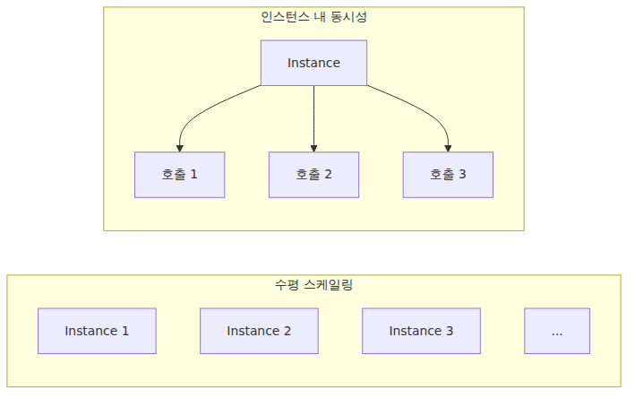
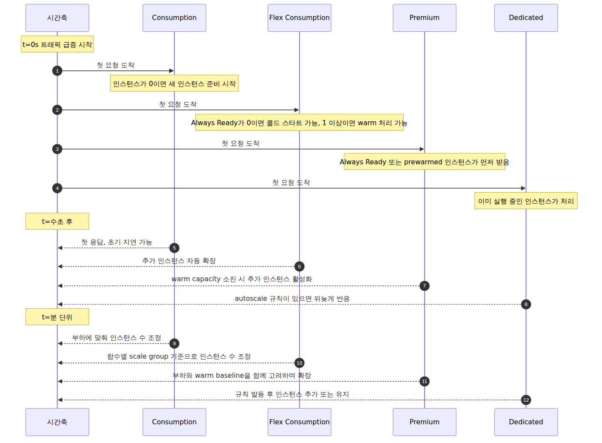
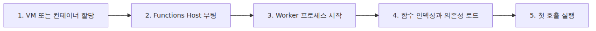
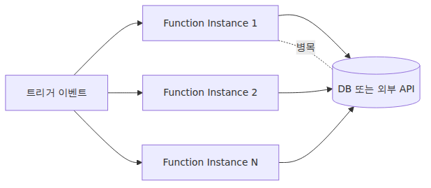

<!-- tags: Azure, Azure Functions, Serverless, Cloud -->
# 스케일링과 콜드 스타트 — 서버리스가 빨라지는 순간과 느려지는 순간

> Azure Functions 101 시리즈 (6/7)

서버리스 설명에는 늘 “자동으로 스케일링된다”는 문장이 붙습니다. 맞는 말이지만, 운영에서는 그 한 줄만으로 충분하지 않습니다. 어떤 신호를 보고 인스턴스를 늘리는지, 한 인스턴스가 동시에 몇 개 요청을 처리하는지, 그리고 0에서 다시 깨어날 때 왜 첫 요청이 느려지는지를 같이 봐야 합니다.

이번 글은 5화에서 정리한 플랜 선택을 운영 관점으로 다시 읽습니다. 트래픽이 갑자기 치솟을 때 Consumption, Flex Consumption, Premium, Dedicated가 각각 어떻게 반응하는지, 콜드 스타트는 어디서 생기는지, 줄이려면 무엇부터 손대야 하는지를 정리합니다.

---

## 스케일링은 두 축으로 봐야 합니다 — 인스턴스 수와 인스턴스 내 동시성

Azure Functions의 스케일링은 한 단어로 뭉뚱그리기 어렵습니다. 실제 운영에서는 최소한 두 축을 분리해서 봐야 합니다.

- **수평 스케일링(scale out)** — 인스턴스 수가 늘어나는가
- **인스턴스 내 동시성(in-instance concurrency)** — 한 인스턴스가 동시에 몇 개 호출을 처리하는가


플랜 차이는 이 두 축을 누가, 어떤 방식으로 다루느냐에서 갈립니다.

| 플랜 | 스케일아웃 방식 | 플랜에서 특히 봐야 할 점 |
|---|---|---|
| Consumption | 플랫폼이 자동으로 확장. 트리거 종류에 따라 event-driven 또는 target-based 판단이 적용됨 | 사용자는 인스턴스 개수를 직접 다루지 않음. 동시성도 런타임/트리거 설정 영향이 큼 |
| Flex Consumption | 플랫폼 자동 확장 기반은 같지만, **함수별 scale group**과 **인스턴스당 HTTP 동시성 설정**을 제공 | Flex의 차별점은 “더 똑똑한 자동 확장”보다 **함수 단위 격리와 동시성 제어**에 가까움 |
| Premium | 플랫폼 자동 확장 + warm capacity 활용 | Always Ready, prewarmed 인스턴스로 지연을 줄일 수 있음 |
| Dedicated (App Service Plan) | App Service autoscale 규칙을 사용자가 설정하거나 수동 운영 | scale to zero는 없고, 자동 반응성은 사용자가 만든 규칙 품질에 좌우됨 |

정리하면, target-based scaling은 Flex만의 전용 기능이 아닙니다. 여러 트리거 확장에서 더 넓게 쓰입니다. Flex를 따로 봐야 하는 이유는 함수별 scale group, 그리고 HTTP 트리거의 인스턴스당 동시성 제어를 제공한다는 점입니다.

---

## 트래픽이 갑자기 늘면 플랜별로 어떻게 반응할까

동일한 상황을 놓고 비교해야 차이가 분명해집니다. 아래 그림은 “평소에는 트래픽이 없다가 t=0에 HTTP 요청이 몰리기 시작한다”는 상황을 단순화한 것입니다.


운영 관점에서 보면 차이는 이렇게 정리할 수 있습니다.

- **Consumption**: scale to zero가 가능하므로 첫 요청에서 콜드 스타트가 가장 쉽게 드러납니다.
- **Flex Consumption**: 기본값에서는 Always Ready가 0일 수 있으므로 콜드 스타트가 완전히 사라지지 않습니다. 대신 함수별 스케일링과 HTTP 동시성 설정이 강점입니다.
- **Premium**: warm 인스턴스를 유지해 첫 요청 지연을 줄이기 좋습니다.
- **Dedicated**: 인스턴스가 계속 떠 있으니 일반적인 의미의 scale-to-zero 콜드 스타트는 없습니다. 다만 급격한 부하 증가에 대한 자동 반응은 autoscale 규칙에 달려 있습니다.

“Flex면 항상 따뜻하다”는 이해는 틀립니다. Flex도 Always Ready를 따로 잡지 않으면 0으로 내려갈 수 있고, 그 상태의 첫 요청은 콜드 스타트를 겪을 수 있습니다.

---

## 콜드 스타트는 정확히 어디에서 생길까

콜드 스타트는 단순히 “첫 요청이 느리다”는 현상 이름이 아닙니다. 새 인스턴스가 실제로 요청을 처리할 준비를 마칠 때까지의 여러 단계를 묶어 부르는 말입니다.

> **콜드 스타트 = 새 인스턴스가 할당되고, Host와 Worker가 올라오고, 함수가 준비된 뒤 첫 호출을 처리하기까지 걸리는 시간**

대개 다음 순서로 나뉩니다.


| 단계 | 시간이 늘어나는 주된 이유 | 줄이는 방법 |
|---|---|---|
| 1 | 새 실행 환경을 준비해야 함 | warm capacity, Always Ready, 플랫폼 최적화 활용 |
| 2 | Host 초기화 | 일반적으로 사용자가 직접 줄일 여지는 적음 |
| 3 | 언어 Worker 시작 비용 | 언어 선택, 런타임 초기화 비용 점검 |
| 4 | 애플리케이션 의존성, import, 초기화 코드 | 의존성 정리, lazy import, lazy init |
| 5 | 첫 호출 자체가 무거움 | 캐시 예열, warmup trigger, 요청 경량화 |

실무에서는 4단계 비중이 꽤 큽니다. 패키지가 크고 import 시점에 연결을 만들고 모델을 로드하면, 플랜을 바꾸기 전에 이미 애플리케이션이 콜드 스타트를 키우고 있는 셈입니다.

---

## 콜드 스타트를 줄일 때 먼저 손댈 것들

### 1) 플랜 관점

- 첫 요청 지연이 곧 매출 손실이나 SLA 위반으로 이어진다면 **Premium** 또는 **Flex Consumption + Always Ready**를 먼저 검토합니다.
- 간헐적 지연을 받아들일 수 있다면 Consumption이나 Flex 기본 구성으로도 충분한 경우가 많습니다.

### 2) 코드 관점

- **의존성 줄이기** — 큰 SDK를 통째로 가져오지 말고 필요한 기능만 씁니다.
- **초기화 시점 늦추기** — import 시점에 DB 연결, 대용량 파일 로드, 인증 메타데이터 다운로드를 하지 않습니다.
- **프로세스 재사용 활용** — 같은 Worker 안에서 재사용 가능한 클라이언트는 모듈 전역에 캐시합니다.

```python
import azure.functions as func

app = func.FunctionApp()
_client = None

def get_client():
    global _client
    if _client is None:
        _client = create_cosmos_client()
    return _client

@app.function_name(name="hello")
@app.route(route="hello")
def hello(req: func.HttpRequest) -> func.HttpResponse:
    client = get_client()
    return func.HttpResponse("ok")
```

이 패턴의 목적은 단순합니다. 첫 호출에서만 무거운 초기화를 하고, 같은 Worker가 살아 있는 동안은 다시 만들지 않는 것입니다.

### 3) 운영 관점

- **Warmup trigger** — Consumption을 제외한 플랜에서 사용할 수 있습니다. Flex, Premium, Dedicated에서 새 인스턴스가 준비될 때 캐시 예열 같은 작업을 넣을 수 있습니다.
- **Always Ready 인스턴스** — Flex와 Premium에서 “항상 켜 둘 최소 인스턴스 수”를 정합니다. 0이면 scale to zero가 가능하고, 1 이상이면 첫 요청 지연을 줄일 수 있습니다.

Warmup trigger와 Always Ready는 같은 기능이 아닙니다. Warmup trigger는 인스턴스가 추가될 때 실행되는 훅이고, Always Ready는 아예 warm 인스턴스를 유지하는 설정입니다.

---

## 동시성은 비용과 다운스트림 안정성을 같이 흔듭니다

자동 스케일링이 있다고 해서 동시성을 무시하면 운영이 불안정해집니다. 이유는 두 가지입니다.

### 1) 다운스트림 용량은 함수와 같이 늘어나지 않습니다

DB 커넥션 풀, 외부 API rate limit, Redis 연결 수는 Functions 인스턴스 수와 함께 자동으로 늘어나지 않습니다. 함수 앱이 빠르게 scale out되더라도, 뒤쪽 시스템이 받지 못하면 병목은 그대로 남습니다.


그래서 운영에서는 다음 둘을 같이 봅니다.

- 트리거별 배치 크기, prefetch, 동시 처리 수 제한
- 큐를 앞단에 두고 다운스트림 속도에 맞게 소비하는 구조

### 2) 한 인스턴스 안에서도 여러 호출이 동시에 실행될 수 있습니다

HTTP 동시성, 큐 배치, 언어 런타임 특성 때문에 같은 인스턴스와 같은 Worker에서 여러 호출이 겹칠 수 있습니다. 따라서 모듈 전역 상태를 쓸 때는 thread-safe 여부, 재진입성, 연결 재사용 방식을 같이 봐야 합니다.

Flex의 HTTP concurrency 설정이 중요한 이유도 여기에 있습니다. 인스턴스 수만 볼 것이 아니라, 한 인스턴스에 몇 요청을 밀어 넣을지까지 결정하기 때문입니다.

---

## 스케일링은 곧 비용 모델입니다

스케일링을 비용과 분리해서 보면 판단이 자주 어긋납니다.

- **Consumption**: 실행 시간, 메모리, 호출 수에 따라 비용이 붙습니다. 트래픽이 없으면 비용도 거의 없습니다.
- **Flex Consumption**: Consumption 계열 과금에 더해 Always Ready 인스턴스 비용을 따로 의식해야 합니다.
- **Premium**: 최소로 유지하는 warm 인스턴스부터 비용이 시작됩니다.
- **Dedicated**: App Service Plan 인스턴스를 계속 확보하므로 트래픽이 적어도 기본 비용이 고정됩니다.

운영에서는 “얼마나 빨리 늘어나는가”만큼 “어디까지 늘어나게 둘 것인가”도 중요합니다. 최대 인스턴스 수와 동시성 설정을 방치하면, 성능 문제 대신 비용 문제가 먼저 터질 수 있습니다.

---

## 다음 글과 심화편 연결

스케일링과 콜드 스타트는 보이지 않으면 관리할 수 없습니다. 다음 글에서는 Application Insights, 메트릭, KQL, 알람을 중심으로 “지금 몇 개 인스턴스가 돌고 있는가”, “실패율이 언제 튀는가”, “비용이 왜 늘었는가”를 어떻게 추적하는지 정리합니다.

콜드 스타트와 스케일링 내부 구현이 궁금하면 [Azure Functions Deep Dive 5화](../../azure-functions-deep-dive/ko/05-scaling-internals.md)와 [6화](../../azure-functions-deep-dive/ko/06-cold-start-placeholder.md)를 같이 보면 좋습니다. 101 시리즈가 운영 판단 기준을 잡는 글이라면, 심화편은 그 판단이 코드에서 어떻게 구현됐는지를 따라갑니다.

---

<!-- toc:begin -->
## 시리즈 목차

- [Azure Functions란? — 이벤트가 함수를 호출하는 세상](./01-what-is-azure-functions.md)
- [트리거와 바인딩 — 함수 입출력의 모든 것](./02-triggers-and-bindings.md)
- [Host와 Worker — 함수는 누가 실행하는가](./03-host-and-worker.md)
- [함수 하나 배포하기 — 로컬에서 Azure까지](./04-first-deploy.md)
- [어떤 플랜을 선택해야 할까 — Consumption / Flex / Premium / Dedicated](./05-choosing-a-plan.md)
- **스케일링과 콜드 스타트 — 서버리스가 빨라지는 순간과 느려지는 순간 (현재 글)**
- [모니터링과 운영 기초](./07-monitoring-and-ops.md)

<!-- toc:end -->

---

## 참고 자료

**공식 문서**
- [Azure Functions hosting options](https://learn.microsoft.com/en-us/azure/azure-functions/functions-scale)
- [Event-driven scaling in Azure Functions](https://learn.microsoft.com/en-us/azure/azure-functions/event-driven-scaling)
- [Target-based scaling](https://learn.microsoft.com/en-us/azure/azure-functions/functions-target-based-scaling)
- [Warmup trigger for Azure Functions](https://learn.microsoft.com/en-us/azure/azure-functions/functions-bindings-warmup)
- [Manage connections in Azure Functions](https://learn.microsoft.com/en-us/azure/azure-functions/manage-connections)

**관련 시리즈**
- [Azure Functions 101 5화 — 어떤 플랜을 선택해야 할까](./05-choosing-a-plan.md)
- [Azure Functions 101 7화 — 모니터링과 운영 기초](./07-monitoring-and-ops.md)
- [Azure Functions Deep Dive 5화 — 스케일링 내부 동작](../../azure-functions-deep-dive/ko/05-scaling-internals.md)
- [Azure Functions Deep Dive 6화 — 콜드 스타트와 Placeholder Mode](../../azure-functions-deep-dive/ko/06-cold-start-placeholder.md)
