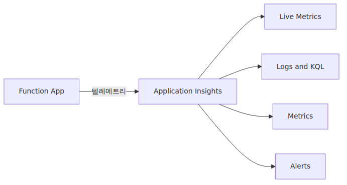
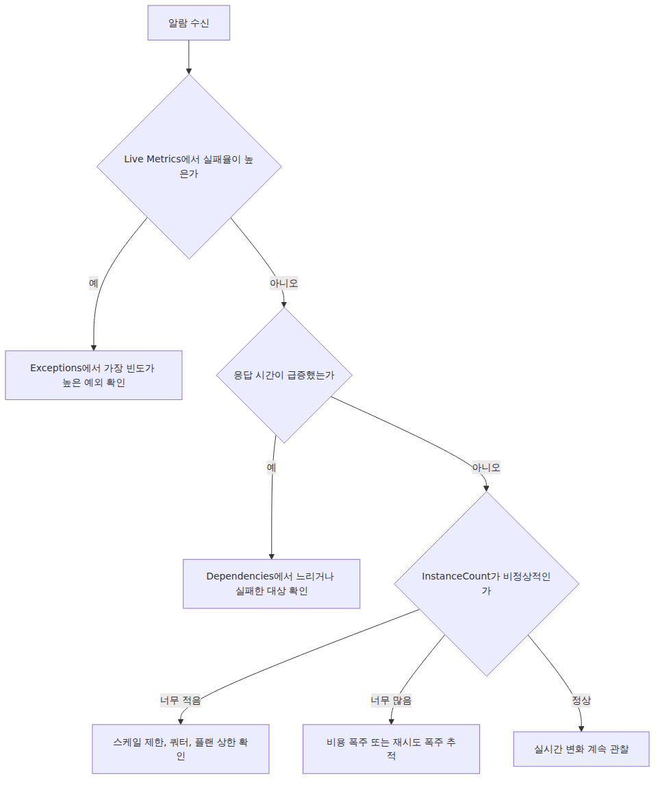

# 모니터링과 운영 기초

> Azure Functions 101 시리즈 (7/7)

함수 앱을 배포한 뒤부터는 질문이 달라집니다. 함수가 실행되느냐보다, 지금 실패율이 튀는지, 인스턴스 수가 왜 늘었는지, 외부 의존성이 병목인지, 비용이 어느 지점에서 새고 있는지를 계속 확인해야 합니다. 이 글은 Azure Functions를 운영할 때 가장 먼저 붙잡아야 할 화면, 메트릭, 쿼리, 알람 기준을 정리합니다.

이 글에서 다루는 범위는 네 가지입니다. 호출 수와 실패율을 보는 기본 화면, KQL로 장애 원인을 좁히는 최소 쿼리, 인스턴스 수와 비용 신호를 읽는 방법, 그리고 알람을 어디부터 거는지가 중심입니다.

---

## 시작점은 Application Insights입니다

Azure Functions 운영 데이터의 대부분은 Application Insights로 모입니다. 요청, 예외, 의존성 호출, 로그, 사용자 정의 메트릭을 한 자리에서 볼 수 있으니, Function App 생성 시점에 App Insights 연결을 빠뜨리지 않는 것이 가장 중요합니다.

```bash
# Function App 생성 후 가장 단순하게 연결하는 방법
az monitor app-insights component create \
    --app ai-hello --location koreacentral --resource-group $RG

az functionapp config appsettings set \
    --name $APP --resource-group $RG \
    --settings APPLICATIONINSIGHTS_CONNECTION_STRING="<your-connection-string>"
```

연결되면 보통 다음 항목을 운영 기본 재료로 씁니다.

- **Requests** — 함수 호출 기록
- **Exceptions** — 함수 내부 예외
- **Dependencies** — 함수가 호출한 HTTP, DB, Storage 같은 외부 시스템
- **Traces** — Python 코드에서 `logging.info()` 같은 방식으로 남긴 로그
- **Metrics / customMetrics** — 플랫폼 메트릭, 사용자 지정 메트릭, 일부 warm-up 관련 신호

주의할 점이 하나 있습니다. 문서에서 흔히 보이는 **Performance counters = CPU, 메모리 자동 수집**은 모든 환경에서 동일하지 않습니다. 특히 Linux에서는 자동 Performance Counters 수집이 지원되지 않으므로, Linux 전용인 Flex Consumption에서는 Windows 기반 예시처럼 CPU/메모리 카운터가 당연히 보인다고 가정하면 안 됩니다.

---

## 장애가 의심될 때 가장 먼저 여는 화면 — Live Metrics

실시간 상황을 볼 때는 **Application Insights → Live Metrics**가 가장 빠릅니다. 거의 초 단위로 요청량, 실패율, 응답 시간 변화, 현재 살아 있는 인스턴스 수를 확인할 수 있습니다.


Live Metrics는 “지금 무슨 일이 벌어지고 있는가”를 가장 빨리 보여줍니다. 다만 CPU/메모리 같은 인프라 성능 카운터는 플랜과 OS에 따라 표시 범위가 다를 수 있습니다. 인스턴스 수와 요청 흐름은 빠르게 확인하되, 세부 리소스 수치는 환경별 지원 여부를 같이 봐야 합니다.

---

## 운영자가 자주 쓰는 조회 패턴 다섯 가지

대시보드만으로는 패턴을 다 잡기 어렵습니다. App Insights Logs에서 쓰는 KQL과 Azure Monitor 메트릭 조회 방식을 같이 익혀 두면 분석 속도가 확 달라집니다.

**1) 최근 1시간 호출 수와 실패율**

```kusto
requests
| where timestamp > ago(1h)
| summarize Total=count(), Failed=countif(success == false) by bin(timestamp, 1m)
| extend FailureRate = round(100.0 * Failed / Total, 2)
| order by timestamp desc
```

**2) 가장 자주 발생한 예외 Top 10**

```kusto
exceptions
| where timestamp > ago(24h)
| summarize Count=count() by problemId, type
| top 10 by Count
```

**3) 가장 느린 함수 Top 10 (P95 기준)**

```kusto
requests
| where timestamp > ago(24h)
| summarize p95=percentile(duration, 95), Count=count() by name
| top 10 by p95
```

**4) 콜드 스타트는 직접 측정값이 아니라 간접 신호로 봅니다**

Azure Functions는 “cold start count”를 모든 플랜에서 곧바로 읽을 수 있는 단일 메트릭으로 내주지 않습니다. `Host started` 같은 로그는 배포, 재시작, scale-out, 호스트 재활성화가 섞일 수 있어서 그대로 콜드 스타트 횟수로 읽으면 위험합니다.

운영에서는 보통 다음 신호를 같이 봅니다.

- **`InstanceCount`** 메트릭 추세 — 인스턴스가 언제 늘고 줄었는지
- **`FunctionExecutionUnits`** 추세 — 실제 실행 부하가 언제 커졌는지
- **App Insights `customMetrics`의 warm-up 관련 신호** — Premium/Flex에서 환경에 따라 추가 warm-up 단서를 주는 경우가 있음

중요한 점은 이 값들이 **콜드 스타트의 직접 측정값이 아니라 휴리스틱**이라는 사실입니다. 인스턴스 증가와 실행 부하 변화를 겹쳐 보면 콜드 스타트 가능 구간을 추정할 수는 있지만, “정확히 몇 번 콜드 스타트가 발생했다”고 단정하는 용도로 쓰면 안 됩니다.

```bash
az monitor metrics list \
    --resource "/subscriptions/$SUB/resourceGroups/$RG/providers/Microsoft.Web/sites/$APP" \
    --metric "InstanceCount" "FunctionExecutionUnits" \
    --interval PT5M
```

**5) 다운스트림 의존성 실패**

```kusto
dependencies
| where timestamp > ago(1h) and success == false
| summarize Count=count() by target, type, resultCode
| order by Count desc
```

---

## 알람은 네 단계만 먼저 잡으면 됩니다

알람은 숫자보다 신뢰도가 중요합니다. 처음에는 다음 네 가지 우선순위면 충분합니다.

| 우선순위 | 알람 대상 | 임계값 예시 | 이유 |
|---|---|---|---|
| P0 | 함수 실패율 급증 | 5분 실패율 > 5% | 사용자 영향이 직접적 |
| P0 | 응답 시간 급증 | P95가 평시 대비 3배 | 실패 전 단계에서 사용자 체감 악화 |
| P1 | 인스턴스 상한 근접 | `InstanceCount`가 설정 상한 바로 아래 | 더 들어오는 부하를 못 받을 가능성 |
| P2 | 비용 급증 | 일일 호출 수가 평시 대비 5배 | 버그, 재시도 폭주, 비정상 트래픽 가능성 |

처음부터 세세한 알람을 많이 걸면 금방 무뎌집니다. P0 두 개를 먼저 안정적으로 운영하고, 그다음에 비용·용량 알람을 늘리는 편이 낫습니다.

---

## 인스턴스 수는 어디서 확인할까

현재 몇 개 인스턴스가 돌고 있는지 확인하는 경로는 셋입니다.

1. **Live Metrics의 Servers 패널** — 가장 즉각적입니다.
2. **Azure Monitor의 `InstanceCount` 메트릭** — 현재 이름은 `FunctionInstanceCount`가 아니라 **`InstanceCount`**이며, 포털에서는 *Automatic Scaling Instance Count*로 보입니다.
3. **`/admin/host/scale/status` 엔드포인트** — Host가 스케일 관련 진단 상태를 보여주는 진단용 엔드포인트입니다.

심화편 5화에서는 이 스케일 상태 엔드포인트와 관련 흐름을 코드 레벨에서 따라갑니다.

---

## 비용을 볼 때는 재시도 정책부터 나눠 봐야 합니다

운영 비용이 갑자기 늘어나는 원인은 대개 호출 폭증, 재시도 폭주, 로그 과다 중 하나입니다. 이때 큐 트리거는 종류별로 재시도 모델이 다르다는 점을 분리해서 봐야 합니다.

**Service Bus 트리거**

Service Bus는 `maxDeliveryCount`와 dead-letter queue 개념이 있습니다. 같은 메시지가 반복 실패하면 delivery count가 올라가고, 한도를 넘으면 DLQ로 보내는 방식이 기본 안전장치입니다. 실패 메시지가 무한히 메인 큐를 맴돌지 않게 이 구성을 먼저 확인합니다.

**Storage Queue 트리거**

Storage Queue는 Service Bus처럼 DLQ라는 용어를 쓰지 않습니다. 메시지는 dequeue count를 올리며 다시 나타나고, 한도를 넘기면 보통 **poison queue**로 이동합니다. 따라서 “queue trigger는 maxDeliveryCount와 dead-letter queue를 보면 된다”는 설명은 Storage Queue에는 맞지 않습니다.

그 밖에 자주 보는 비용 누수 패턴은 다음 둘입니다.

- **타이머 빈도 과다** — 5초마다 실행되는 타이머는 생각보다 빠르게 호출 수를 키웁니다.
- **로그 과다** — 큰 payload를 매 호출마다 남기면 App Insights 수집 비용이 커집니다.

```bash
# 일일 호출 수 추세를 빠르게 확인하는 CLI 예시
az monitor app-insights events show \
    --app ai-hello --resource-group $RG \
    --type requests --start-time -7d
```

---

## 새벽 장애 때는 이 순서로 보면 됩니다

알람이 울렸을 때 처음 5분에 윤곽을 잡는 순서는 대체로 비슷합니다.


실패율, 응답 시간, 인스턴스 수, 의존성 실패를 이 순서로 보면 원인을 넓게 헤매는 시간이 줄어듭니다.

---

## 시리즈를 마무리하며

Azure Functions 101 시리즈는 여기서 끝납니다. 이 시리즈 전체를 한 줄씩 다시 접으면, 이벤트가 함수를 깨우는 실행 모델, 트리거와 바인딩의 입출력 구조, Host와 Worker의 분리, 플랜 선택의 trade-off, 그리고 Application Insights 중심 운영으로 이어집니다. 지금 읽은 7화는 그중 마지막 단계인 운영 판단 기준을 정리하는 글입니다.

내부 구현이 더 궁금하면 [Azure Functions Deep Dive 5화](../../azure-functions-deep-dive/ko/05-scaling-internals.md)와 [6화](../../azure-functions-deep-dive/ko/06-cold-start-placeholder.md)를 이어서 보면 좋습니다. 101 시리즈가 실무 감각을 잡는 데 초점을 맞췄다면, 심화편은 Host 코드와 논문을 바탕으로 내부 동작을 해부합니다.

---

<!-- toc:begin -->
## 시리즈 목차

- [Azure Functions란? — 이벤트가 함수를 호출하는 세상](./01-what-is-azure-functions.md)
- [트리거와 바인딩 — 함수 입출력의 모든 것](./02-triggers-and-bindings.md)
- [Host와 Worker — 함수는 누가 실행하는가](./03-host-and-worker.md)
- [함수 하나 배포하기 — 로컬에서 Azure까지](./04-first-deploy.md)
- [어떤 플랜을 선택해야 할까 — Consumption / Flex / Premium / Dedicated](./05-choosing-a-plan.md)
- [스케일링과 콜드 스타트 — 서버리스가 빨라지는 순간과 느려지는 순간](./06-scaling-and-cold-start.md)
- **모니터링과 운영 기초 (현재 글)**

<!-- toc:end -->

---

## 참고 자료

**공식 문서**
- [Monitor Azure Functions](https://learn.microsoft.com/en-us/azure/azure-functions/functions-monitoring)
- [Application Insights overview](https://learn.microsoft.com/en-us/azure/azure-monitor/app/app-insights-overview)
- [Metrics supported for Microsoft.Web/sites](https://learn.microsoft.com/en-us/azure/azure-monitor/reference/supported-metrics/microsoft-web-sites-metrics)
- [Kusto Query Language reference](https://learn.microsoft.com/en-us/azure/data-explorer/kusto/query/)
- [Configure monitoring for Azure Functions](https://learn.microsoft.com/en-us/azure/azure-functions/configure-monitoring)

**관련 시리즈**
- [Azure Functions 101 6화 — 스케일링과 콜드 스타트](./06-scaling-and-cold-start.md)
- [Azure Functions Deep Dive 5화 — 스케일링 내부 동작](../../azure-functions-deep-dive/ko/05-scaling-internals.md)
- [Azure Functions Deep Dive 6화 — 콜드 스타트와 Placeholder Mode](../../azure-functions-deep-dive/ko/06-cold-start-placeholder.md)

Tags: Azure, Azure Functions, Serverless, Cloud
