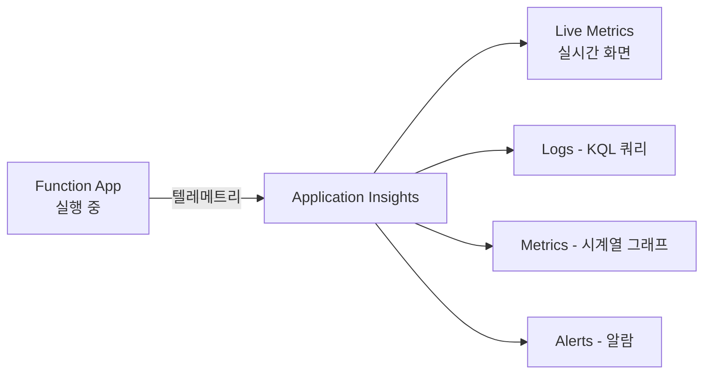
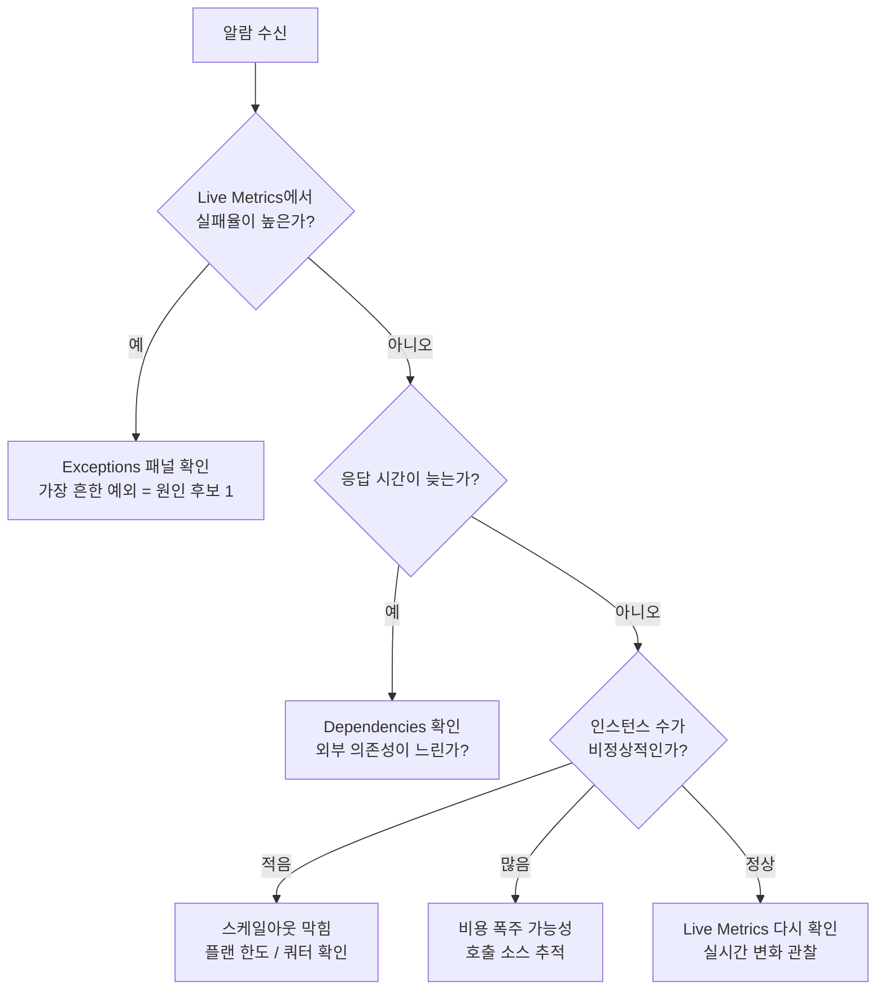

# 모니터링과 운영 기초

> Azure Functions 101 시리즈 (7/7)

지금까지 6화에 걸쳐 “함수가 어떻게 만들어지고, 무엇이 깨우고, 어떤 환경에서 실행되며, 어떻게 확장되는지”를 봤습니다. 마지막 화는 시점이 다릅니다. 이미 떠 있는 Function App에 대해, **운영자로서 무엇을 보고 무엇에 알람을 걸어야 하는가**가 주제입니다.

이 글이 끝나면 다음을 할 수 있습니다.

- 호출 수, 실패율, 응답 시간, 예외를 한 화면에서 본다
- 콜드 스타트 빈도를 측정한다
- “지금 인스턴스가 몇 개인가”를 확인한다
- 비용이 새는 곳을 찾는다
- 알람을 거는 우선순위를 안다

---

## 시작점은 단 하나 — Application Insights

Functions 운영의 90%는 Application Insights(이하 App Insights)에서 일어납니다. 함수 실행 로그, 예외, 의존성 호출, 사용자 정의 메트릭이 전부 여기로 모입니다. 따라서 Function App을 만들 때 App Insights 연결을 빼먹지 않는 게 가장 중요한 운영 결정입니다.

```bash
# 만들 때 연결하는 가장 단순한 방법
az monitor app-insights component create \
    --app ai-hello --location koreacentral --resource-group $RG

az functionapp config appsettings set \
    --name $APP --resource-group $RG \
    --settings APPLICATIONINSIGHTS_CONNECTION_STRING="<your-connection-string>"
```

연결되면 함수가 호출될 때마다 다음 항목이 자동 수집됩니다.

- **Requests** — 호출 1건 = 1행
- **Exceptions** — 함수 안에서 발생한 예외
- **Dependencies** — 함수가 호출한 외부 시스템(HTTP, DB, Storage 등)
- **Traces** — `context.log()`로 남긴 로그
- **Performance counters** — CPU, 메모리 (인스턴스 단위)

이 다섯이 운영의 재료입니다.

---

## 가장 먼저 보는 화면 — Live Metrics

장애가 의심될 때 가장 먼저 열어야 하는 화면은 **Application Insights → Live Metrics**입니다. 거의 실시간(초 단위)으로 다음을 보여줍니다.

- 초당 요청 수
- 실패율
- 응답 시간 분포
- **현재 살아 있는 서버(인스턴스) 수와 각각의 CPU/메모리**

“지금 몇 개 인스턴스에서 함수가 돌아가고 있는가”가 한 눈에 보입니다. 6화에서 이야기한 스케일아웃이 실제로 일어났는지 가장 빠르게 확인하는 방법입니다.



---

## KQL 30초 입문 — 운영자가 자주 쓰는 5가지 쿼리

App Insights의 진짜 힘은 **KQL(Kusto Query Language)** 에서 나옵니다. 정형화된 대시보드만으로는 안 보이는 패턴을 뽑을 수 있기 때문입니다. 입문자가 외워두면 좋은 5개를 남깁니다.

**1) 최근 1시간 호출 수와 실패율**

```kusto
requests
| where timestamp > ago(1h)
| summarize Total=count(), Failed=countif(success == false) by bin(timestamp, 1m)
| extend FailureRate = round(100.0 * Failed / Total, 2)
| order by timestamp desc
```

**2) 가장 자주 발생하는 예외 Top 10**

```kusto
exceptions
| where timestamp > ago(24h)
| summarize Count=count() by problemId, type
| top 10 by Count
```

**3) 가장 느린 함수 Top 10 (P95 기준)**

```kusto
requests
| where timestamp > ago(24h)
| summarize p95=percentile(duration, 95), Count=count() by name
| top 10 by p95
```

**4) 콜드 스타트 빈도 추정**

Functions는 콜드 스타트를 명시적인 메트릭으로 노출하지 않습니다. 대신 “호스트가 새로 인덱싱했다”는 로그(traces)로 간접 측정합니다.

```kusto
traces
| where timestamp > ago(24h)
| where message has "Host started"
| summarize ColdStarts=count() by bin(timestamp, 1h)
| order by timestamp desc
```

**5) 다운스트림 의존성 실패**

```kusto
dependencies
| where timestamp > ago(1h) and success == false
| summarize Count=count() by target, type, resultCode
| order by Count desc
```

이 다섯 쿼리만 자주 쓸 수 있어도 운영의 절반은 가능합니다.

---

## 무엇에 알람을 걸 것인가 — 우선순위 4단계

알람은 “많이”가 아니라 “정확히”가 중요합니다. 처음 운영을 시작한다면 다음 4단계 우선순위로 시작하는 걸 권합니다.

| 우선순위 | 알람 대상 | 임계값 예시 | 이유 |
|---|---|---|---|
| **P0** | 함수 실패율 급증 | 5분간 실패율 > 5% | 사용자에게 직접적 영향 |
| **P0** | 응답 시간 급증 | P95가 평소 대비 3배 | 실패는 아니지만 사용자 영향 큼 |
| **P1** | 인스턴스 상한 도달 | 현재 인스턴스 수 ≥ Max - 1 | 추가 트래픽 처리 불가 임박 |
| **P2** | 비용 급증 | 일일 호출 수가 평소 대비 5배 | 버그 또는 어택 가능성 |

처음에는 P0 둘만 걸어도 됩니다. **잘못 걸린 알람이 잠을 깨우면 알람 자체를 무시하게 됩니다.** 천천히 늘려가세요.

---

## 인스턴스 수를 어떻게 알까

“지금 몇 개 인스턴스에서 돌아가고 있는가”를 보는 방법은 셋입니다.

1. **Live Metrics의 Servers 패널** — 가장 직관적
2. **`FunctionInstanceCount` 메트릭** (Premium/Dedicated)
3. **HostController의 `/admin/host/scale/status` 엔드포인트** — Functions Host가 외부 Scale Controller에게 노출하는 진단용 엔드포인트. 운영용으로 매번 보지는 않지만, 문제 분석 시 유용합니다.

심화편 5화에서는 이 엔드포인트를 코드 레벨에서 따라갑니다.

---

## 비용을 의식적으로 보기

운영의 마지막 한 축은 비용입니다. Functions에서 비용이 새는 가장 흔한 패턴은 다음 셋입니다.

- **무한 재시도** — 큐 트리거가 처리 실패 후 무한 재시도하면, 같은 메시지가 반복 호출되어 호출 수가 폭증합니다. **maxDeliveryCount + 데드레터 큐**가 기본 안전장치입니다.
- **타이머 빈도가 너무 잦음** — “1분마다”와 “5초마다”의 차이는 12배 호출 수입니다. 정말 5초마다 필요한지 자주 점검합니다.
- **로그 폭주** — 함수 안에서 큰 객체를 매번 `JSON.stringify`해서 로그로 남기면 App Insights 인제스천 비용이 늘어납니다. 운영 환경에서는 로그 레벨을 적절히 낮춥니다.

```bash
# 일일 호출 수 추세를 가장 빠르게 보는 명령
az monitor app-insights events show \
    --app ai-hello --resource-group $RG \
    --type requests --start-time -7d
```

---

## “장애가 났다” 체크리스트

마지막으로, 알람이 울려서 새벽에 깼을 때 가장 먼저 보는 순서를 남깁니다. 이걸 그대로 따라가면 첫 5분 안에 윤곽이 잡힙니다.



---

## 시리즈를 마치며

이번 글로 입문 시리즈 7화를 마칩니다. 다음 다섯 문장이 여러분이 가져갔으면 하는 것입니다.

1. **Azure Functions = 이벤트가 함수를 깨우고, 끝나면 사라지는 모델.** 모든 설계는 이 한 줄에서 출발합니다.
2. **트리거와 바인딩은 “함수의 외부 인터페이스”** 입니다. 코드를 짧게 만들지만, 도메인 로직을 대신해 주지는 않습니다.
3. **Host와 Worker가 분리돼 있고, gRPC로 대화합니다.** 다국어 지원의 비결이자, 운영 시 로그를 어디서 볼지 결정하는 단서입니다.
4. **플랜 선택은 비용과 콜드 스타트와 동시성의 트레이드오프**입니다. “서버리스니까 Consumption”이 항상 정답은 아닙니다.
5. **모니터링은 “Application Insights에 붙였는가”에서 시작**합니다. KQL 5개 쿼리만 손에 익혀도 운영이 한결 수월합니다.

서버리스가 만능이 아니라는 점도 함께 강조하고 싶습니다. 도구는 워크로드 특성에 맞을 때만 빛납니다. Functions가 안 어울린다고 판단되면 그건 합리적인 결론입니다. 이 시리즈가 그 판단을 좀 더 빠르게 내릴 수 있는 재료가 됐다면 충분합니다.

---

## 더 깊이 들어가고 싶다면

내부 동작이 궁금해진 분은 **Azure Functions Deep Dive** 시리즈를 보세요. 이 시리즈가 “설명서”라면, 그쪽은 “해부학 도해”입니다. 같은 7화 구성으로, 코드와 논문을 동원해 다음 질문에 답합니다.

- Host가 부팅될 때 정확히 어떤 클래스가 어떤 순서로 호출되는가?
- Worker 프로세스는 어떻게 띄워지는가? 다국어 지원은 코드에서 어떻게 구현돼 있나?
- gRPC EventStream의 핸드셰이크는 어떻게 생겼는가?
- 콜드 스타트를 줄이는 Placeholder Mode는 코드 어디에 있는가?
- 학계는 이 시스템을 어떻게 분석했는가? (Shahrad et al., USENIX ATC 2020 등)

---

## 시리즈 목차

| # | 제목 |
|---|---|
| 1 | [Azure Functions란? — 이벤트가 함수를 호출하는 세상](./01-what-is-azure-functions.md) |
| 2 | [트리거와 바인딩 — 함수 입출력의 모든 것](./02-triggers-and-bindings.md) |
| 3 | [Host와 Worker — 함수는 누가 실행하는가](./03-host-and-worker.md) |
| 4 | [첫 번째 함수 배포 — 로컬에서 Azure까지](./04-first-deploy.md) |
| 5 | 4가지 플랜 — Consumption / Flex Consumption / Premium / Dedicated |
| 6 | [스케일링과 콜드 스타트 — 서버리스의 두 얼굴](./06-scaling-and-cold-start.md) |
| 7 | **모니터링과 운영 기초** ← 현재 글 |

---

## References

**공식 문서**
- [Monitor Azure Functions](https://learn.microsoft.com/en-us/azure/azure-functions/functions-monitoring)
- [Application Insights overview](https://learn.microsoft.com/en-us/azure/azure-monitor/app/app-insights-overview)
- [Kusto Query Language reference](https://learn.microsoft.com/en-us/azure/data-explorer/kusto/query/)
- [Configure monitoring for Azure Functions](https://learn.microsoft.com/en-us/azure/azure-functions/configure-monitoring)
