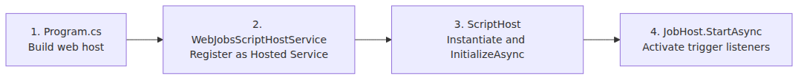
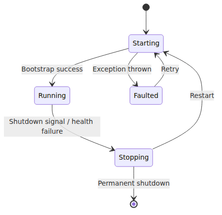

# Host Bootstrap — Following `WebJobsScriptHostService`

> Azure Functions Deep Dive series (1/6)

In episode 3 of the intro series, I wrote that Functions runs the Host process (.NET) and the Worker process (your language) separately, with gRPC between them. This series checks that sentence against the actual host code. It reads the [`Azure/azure-functions-host`](https://github.com/Azure/azure-functions-host) repo directly, one stage per post, from bootstrap through invocation, scaling, and cold starts.

This post focuses on one question: **what happens the moment a Function App instance powers on**. Everything is pinned to commit `5e59423`, and every host code citation uses that commit.

---

## The big picture — one Azure Functions host instance

This is the map for the rest of the series.
Each later part zooms into one box from this picture.
Get the layout in your head first; the code paths land more cleanly after that.

Part 1 covers host bootstrap, Part 2 zooms into the worker process, Part 3 into the gRPC channel, Part 4 into dispatcher and invocation, Part 5 into scaling, and Part 6 into placeholder mode and cold start.

---

## The big picture — host bootstrap in 4 stages

It looks complicated, but host bootstrap really compresses down to these four stages:

This post walks through each of these four boxes in order. After stage 4, **the function is ready to run the moment a trigger fires**.

---

## Stage 1: Enter `WebJobsScriptHostService`

The entry point is `Program.cs`, but the real protagonist of the Functions "host lifecycle" is an `IHostedService` named `WebJobsScriptHostService`. It sits on top of ASP.NET Core's standard hosting model, so its lifecycle is managed by `StartAsync` / `StopAsync` just like any other hosted service.

The key method is `StartAsync`. Inside it, the following happens:

- Wire up the host health monitor (`HostHealthMonitor`)
- Create a `ScriptHost` instance and call `InitializeAsync`
- Apply retry / restart policy on failure
- Publish bootstrap state events (Standby → Running transitions, etc.)

> Code location: [`WebJobsScriptHostService.cs` (commit `5e59423`)](https://github.com/Azure/azure-functions-host/blob/5e59423/src/WebJobs.Script.WebHost/WebJobsScriptHostService.cs)

One important design decision here. **`WebJobsScriptHostService` is not "the host itself."** It's a shell that "manages" the host lifecycle. The actual host is the `ScriptHost` inside. By separating the shell from the kernel, recovery becomes possible: when the host dies, the shell can spin up a new kernel and swap it in.

---

## Stage 2: `ScriptHost.InitializeAsync` — where bootstrap actually happens

Inside `ScriptHost.InitializeAsync`, called by `WebJobsScriptHostService`, the host does the work required to become a running function app.

The ordering matters. In `ScriptHost.StartAsyncCore()`, `InitializeAsync()` runs first and finishes before `base.StartAsyncCore()` runs. Trigger listener activation through `JobHost.StartAsync()` is therefore **after** initialization, not part of it. This post focuses on config loading and function indexing, leaves worker channel prep to episode 2, and picks up the invocation path in episode 4.

> Code location: [`ScriptHost.cs` (commit `5e59423`)](https://github.com/Azure/azure-functions-host/blob/5e59423/src/WebJobs.Script/Host/ScriptHost.cs)

---

## Stage 3: where and how `host.json` is read

`host.json` is the "single source of truth" for Functions. Concurrency, timeouts, logging, per-trigger options — they all live here. Let's follow how this file gets converted into an options tree in code.

The entry point is `HostJsonFileConfigurationSource`. This class reads host.json and pushes it into .NET's `IConfiguration` tree. A constants list called `WellKnownHostJsonProperties` defines the keys this file is "expected to know about." Some representative ones:

- `concurrency` — concurrent invocation limits
- `extensions.queues` — queue trigger options (batch size, polling interval, etc.)
- `extensions.http` — HTTP trigger routing / concurrency
- `functionTimeout` — timeout for a single invocation

> Code location: [`HostJsonFileConfigurationSource.cs`](https://github.com/Azure/azure-functions-host/blob/5e59423/src/WebJobs.Script/Config/HostJsonFileConfigurationSource.cs)

Values from `host.json` map straight to options objects. For example, `functionTimeout` flows into `ScriptJobHostOptions.FunctionTimeout` via `ScriptJobHostOptionsSetup.ConfigureFunctionTimeout`.

> Code location: [`ScriptJobHostOptionsSetup.cs`](https://github.com/Azure/azure-functions-host/blob/5e59423/src/WebJobs.Script/Config/ScriptJobHostOptionsSetup.cs)

This diagram is the path `host.json` takes into runtime options. **One key in the file → one node in IConfiguration → a Setup class → one field on an options object**. The mapping stays that direct.

Two things operators should know:

1. **Environment variables land in the same IConfiguration tree.** That means env vars can override values written in `host.json`. Example: the `AzureFunctionsJobHost__functionTimeout` env var beats `functionTimeout` in host.json.
2. **`FUNCTIONS_WORKER_PROCESS_COUNT`** — sets how many Worker processes to spin up inside a single instance. This option was introduced in [PR #4210](https://github.com/Azure/azure-functions-host/pull/4210), and it's the knob that directly controls the "in-instance concurrency" axis I covered in episode 6 of the intro series.

---

## Stage 4: function metadata indexing

After reading host.json, `ScriptHost` indexes "what functions does this app have." The result is a list of `FunctionMetadata`. Each entry contains:

- Function name
- Trigger type and trigger configuration
- Input/output binding list
- Code entry point (the handler the Worker will invoke)
- Language used

Why does this indexing matter? Because **this metadata is the foundation for every downstream behavior**.

- The Worker takes this list and registers "I know these functions" (via gRPC `WorkerInitRequest` / `FunctionLoadRequest`, covered in episode 3)
- Trigger listeners look at this list to decide "which queue to poll, which route to bind to" (episode 4)
- The Scale Controller looks at this list to decide "which trigger's metrics to collect" (episode 5)

In other words, **indexing is the stage that builds the Functions host's "function catalog."**

---

## The host health monitor

`WebJobsScriptHostService` periodically checks whether the host is alive. When it detects memory pressure, connection failures, or bootstrap timeouts, it restarts the host. This mechanism is the core of how "the Functions Host recovers itself."

- Host throws during bootstrap → retry
- Bootstrap takes too long → forced restart
- Memory/CPU thresholds exceeded → instance reclaim signal

This state machine is the root cause of the operational symptom "my function suddenly restarted." If you see frequent "Host started" log entries in App Insights, this state machine is probably cycling more often than you'd like.

---

## Episode 1 wrap — what's next

The flow this post traced, compressed into one paragraph:

> ASP.NET Core boots and starts an `IHostedService` named `WebJobsScriptHostService`. Inside it, a `ScriptHost` is created and `InitializeAsync` runs first, reading host.json and environment-backed options and indexing function metadata. Only after that does `JobHost.StartAsync` run and activate trigger listeners. The host health monitor watches the whole sequence and replaces the host when it fails.

The next episode targets one of the blind spots in that diagram: **what happens inside the box labeled "Worker channel prep" in `InitializeAsync`?** How do worker processes for other languages — Node.js, Python, Java — actually get launched? We'll follow it right up to the OS-level `Process.Start` call.

---

## Where this fits in the series

This is part 1 of the Azure Functions Deep Dive series. With host bootstrap in place, part 2 moves to the worker processes living beside the host, and parts 3 and 4 follow the gRPC channel and invocation path between them. The later parts cover scaling, placeholder mode, and cold-start mechanics.

---

<!-- toc:begin -->
## In this series

- **Host Bootstrap — Following `WebJobsScriptHostService` (current)**
- Worker Processes — How One Host Hosts Many Languages (upcoming)
- The gRPC Event Stream — What Do the Host and Worker Actually Exchange? (upcoming)
- Dispatcher and Invocation — How a Function Call Reaches the Worker (upcoming)
- Scaling Internals — Scale Controller, ScaleMonitor, and What Differs Across Plans (upcoming)
- Cold Start and Placeholder Mode — What Happens When a New Instance Is Born (upcoming)

<!-- toc:end -->

---

## References

### Primary sources (host code, commit `5e59423`)
- [`WebJobsScriptHostService.cs`](https://github.com/Azure/azure-functions-host/blob/5e59423/src/WebJobs.Script.WebHost/WebJobsScriptHostService.cs)
- [`ScriptHost.cs`](https://github.com/Azure/azure-functions-host/blob/5e59423/src/WebJobs.Script/Host/ScriptHost.cs)
- [`HostJsonFileConfigurationSource.cs`](https://github.com/Azure/azure-functions-host/blob/5e59423/src/WebJobs.Script/Config/HostJsonFileConfigurationSource.cs)
- [`ScriptJobHostOptionsSetup.cs`](https://github.com/Azure/azure-functions-host/blob/5e59423/src/WebJobs.Script/Config/ScriptJobHostOptionsSetup.cs)
- [PR #4210 — introducing `FUNCTIONS_WORKER_PROCESS_COUNT`](https://github.com/Azure/azure-functions-host/pull/4210)

### Secondary sources
- [host.json reference](https://learn.microsoft.com/en-us/azure/azure-functions/functions-host-json)
- [Azure Functions app settings reference](https://learn.microsoft.com/en-us/azure/azure-functions/functions-app-settings)

### Other parts in the series
- [Azure Functions 101 — intro series](../../azure-functions-101/en/) (especially episode 3, "Host and Worker")

Tags: Azure Functions, Serverless, Distributed Systems, gRPC
