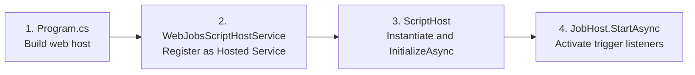
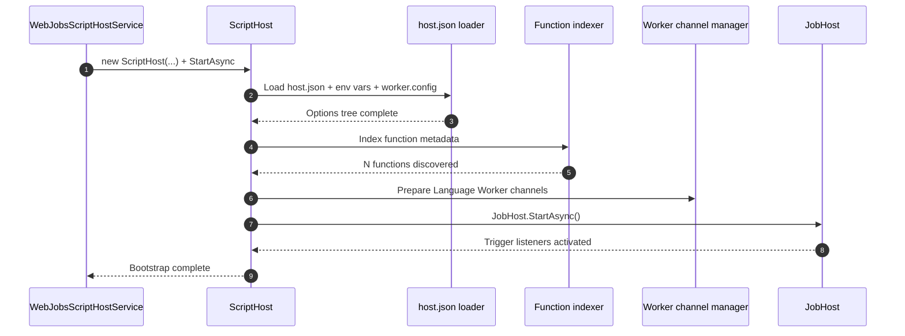
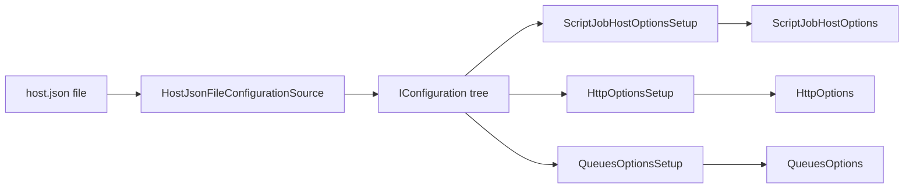
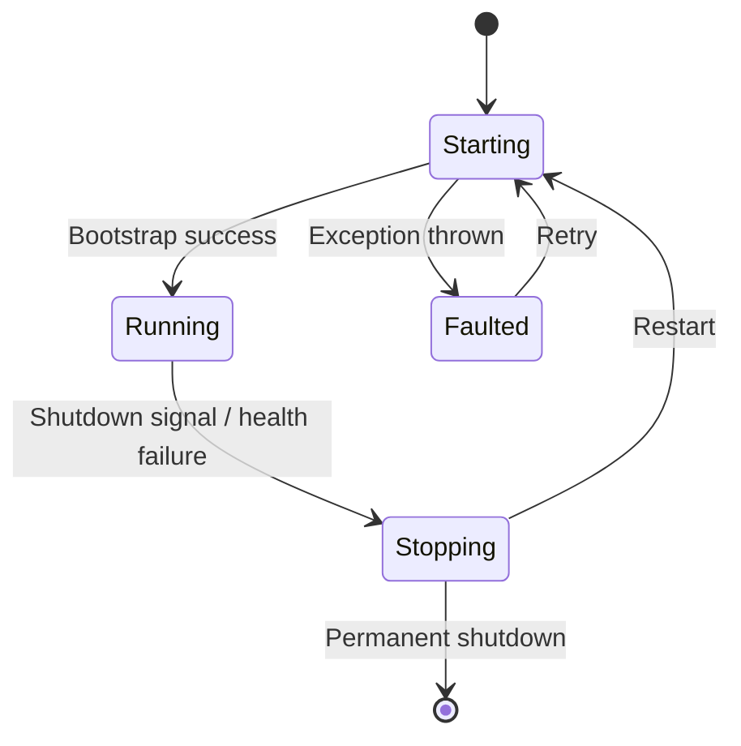

# Host Bootstrap — Following `WebJobsScriptHostService`

> Azure Functions Deep Dive series (1/7)

In episode 3 of the intro series, I wrote that "Functions runs the Host process (.NET) and the Worker process (your language) as separate processes that talk over gRPC." Time to actually verify that single sentence. This deep dive series reads the [`Azure/azure-functions-host`](https://github.com/Azure/azure-functions-host) repo directly, one stage per episode — from host bootstrap through function invocation, scaling, cold starts, and finally what academia has to say about it.

This post is the first step. The topic is exactly one thing: **what happens the moment a Function App instance powers on**. I've pinned everything to commit `5e59423`. Every code citation comes with a line-level permalink so you can click through and verify it yourself.

---

## The big picture — host bootstrap in 4 stages

It looks complicated, but host bootstrap really compresses down to these four stages:

This post walks through each of these four boxes in order. After stage 4, **the function is ready to run the moment a trigger fires**.

---

## Stage 1: Enter `WebJobsScriptHostService`

The entry point is `Program.cs`, but the real protagonist of the Functions "host lifecycle" is an `IHostedService` named `WebJobsScriptHostService`. It sits on top of ASP.NET Core's standard hosting model, so its lifecycle is managed by `StartAsync` / `StopAsync` just like any other hosted service.

The key method is `StartAsync`. Inside it, the following happens:

- Wire up the host health monitor (`HostHealthMonitor`)
- Create a `ScriptHost` instance and call `InitializeAsync`
- Apply retry / restart policy on failure
- Publish bootstrap state events (Standby → Running transitions, etc.)

> 📎 Code: [`WebJobsScriptHostService.cs` (commit `5e59423`)](https://github.com/Azure/azure-functions-host/blob/5e59423/src/WebJobs.Script.WebHost/WebJobsScriptHostService.cs)

One important design decision here. **`WebJobsScriptHostService` is not "the host itself."** It's a shell that "manages" the host lifecycle. The actual host is the `ScriptHost` inside. By separating the shell from the kernel, recovery becomes possible: when the host dies, the shell can spin up a new kernel and swap it in.

---

## Stage 2: `ScriptHost.InitializeAsync` — where bootstrap actually happens

Inside `ScriptHost.InitializeAsync`, called by `WebJobsScriptHostService`, every preparation needed for Functions to "behave like a function app" takes place. Let's break it down step by step.

Each step in this sequence is the topic of a future episode. This post focuses on stages 1 and 2 (config loading and function indexing), pushes Worker channel prep to episode 2, and JobHost to episode 4.

> 📎 Code: [`ScriptHost.cs` (commit `5e59423`)](https://github.com/Azure/azure-functions-host/blob/5e59423/src/WebJobs.Script/Host/ScriptHost.cs)

---

## Stage 3: where and how `host.json` is read

`host.json` is the "single source of truth" for Functions. Concurrency, timeouts, logging, per-trigger options — they all live here. Let's follow how this file gets converted into an options tree in code.

The entry point is `HostJsonFileConfigurationSource`. This class reads host.json and pushes it into .NET's `IConfiguration` tree. A constants list called `WellKnownHostJsonProperties` defines the keys this file is "expected to know about." Some representative ones:

- `concurrency` — concurrent invocation limits
- `extensions.queues` — queue trigger options (batch size, polling interval, etc.)
- `extensions.http` — HTTP trigger routing / concurrency
- `functionTimeout` — timeout for a single invocation

> 📎 Code: [`HostJsonFileConfigurationSource.cs`](https://github.com/Azure/azure-functions-host/blob/5e59423/src/WebJobs.Script/Configuration/HostJsonFileConfigurationSource.cs)

Values from `host.json` map straight to options objects. For example, `functionTimeout` flows into `ScriptJobHostOptions.FunctionTimeout` via `ScriptJobHostOptionsSetup.ConfigureFunctionTimeout`.

> 📎 Code: [`ScriptJobHostOptionsSetup.cs`](https://github.com/Azure/azure-functions-host/blob/5e59423/src/WebJobs.Script/Config/ScriptJobHostOptionsSetup.cs)

This diagram is the entire secret of `host.json`. **One key in the file → one node in IConfiguration → a Setup class → one field on an options object** — that clean 1:1 mapping holds all the way through.

Two things operators should know:

1. **Environment variables land in the same IConfiguration tree.** That means env vars can override values written in `host.json`. Example: the `AzureFunctionsJobHost__functionTimeout` env var beats `functionTimeout` in host.json.
2. **`FUNCTIONS_WORKER_PROCESS_COUNT`** — sets how many Worker processes to spin up inside a single instance. This option was introduced in [PR #4210](https://github.com/Azure/azure-functions-host/pull/4210), and it's the knob that directly controls the "in-instance concurrency" axis I covered in episode 6 of the intro series.

---

## Stage 4: function metadata indexing

After reading host.json, `ScriptHost` indexes "what functions does this app have." The result is a list of `FunctionMetadata`. Each entry contains:

- Function name
- Trigger type and trigger configuration
- Input/output binding list
- Code entry point (the handler the Worker will invoke)
- Language used

Why does this indexing matter? Because **this metadata is the foundation for every downstream behavior**.

- The Worker takes this list and registers "I know these functions" (via gRPC `WorkerInitRequest` / `FunctionLoadRequest`, covered in episode 3)
- Trigger listeners look at this list to decide "which queue to poll, which route to bind to" (episode 4)
- The Scale Controller looks at this list to decide "which trigger's metrics to collect" (episode 5)

In other words, **indexing is the stage that builds the Functions host's "function catalog."**

---

## The host health monitor

`WebJobsScriptHostService` periodically checks whether the host is alive. When it detects memory pressure, connection failures, or bootstrap timeouts, it restarts the host. This mechanism is the core of how "the Functions Host recovers itself."

- Host throws during bootstrap → retry
- Bootstrap takes too long → forced restart
- Memory/CPU thresholds exceeded → instance reclaim signal

This state machine is the root cause of the operational symptom "my function suddenly restarted." If you see frequent "Host started" log entries in App Insights, this state machine is probably cycling more often than you'd like.

---

## Episode 1 wrap — what's next

The flow this post traced, compressed into one paragraph:

> ASP.NET Core boots and starts an `IHostedService` called `WebJobsScriptHostService`. Inside it, a `ScriptHost` is created and `InitializeAsync` runs — reading options from host.json and env vars, indexing function metadata, then standing up the JobHost to activate trigger listeners. The host health monitor watches this whole process, and swaps the host out when something goes wrong.

The next episode targets one of the blind spots in that diagram: **what happens inside the box labeled "Worker channel prep" in `InitializeAsync`?** How do worker processes for other languages — Node.js, Python, Java — actually get launched? We'll follow it right up to the OS-level `Process.Start` call.

---

## Series table of contents

| # | Title |
|---|---|
| 1 | **Host Bootstrap — Following `WebJobsScriptHostService`** ← this post |
| 2 | The Worker Process — How is multi-language possible? |
| 3 | gRPC EventStream — The conversation protocol between Host and Worker |
| 4 | Function invocation in practice — Dispatcher and InvocationRequest |
| 5 | Inside per-plan scaling — what the Scale Controller sees |
| 6 | The war on cold starts — Placeholder Mode and Specialization |
| 7 | Azure Functions through an academic lens — what the papers say |

---

## References

**Source code (commit `5e59423`)**
- [`WebJobsScriptHostService.cs`](https://github.com/Azure/azure-functions-host/blob/5e59423/src/WebJobs.Script.WebHost/WebJobsScriptHostService.cs)
- [`ScriptHost.cs`](https://github.com/Azure/azure-functions-host/blob/5e59423/src/WebJobs.Script/Host/ScriptHost.cs)
- [`HostJsonFileConfigurationSource.cs`](https://github.com/Azure/azure-functions-host/blob/5e59423/src/WebJobs.Script/Configuration/HostJsonFileConfigurationSource.cs)
- [`ScriptJobHostOptionsSetup.cs`](https://github.com/Azure/azure-functions-host/blob/5e59423/src/WebJobs.Script/Config/ScriptJobHostOptionsSetup.cs)
- [PR #4210 — introducing `FUNCTIONS_WORKER_PROCESS_COUNT`](https://github.com/Azure/azure-functions-host/pull/4210)

**Official docs**
- [host.json reference](https://learn.microsoft.com/en-us/azure/azure-functions/functions-host-json)
- [Azure Functions app settings reference](https://learn.microsoft.com/en-us/azure/azure-functions/functions-app-settings)

**Related series**
- [Azure Functions 101 — intro series](../../azure-functions-101/ko/) (especially episode 3, "Host and Worker")
