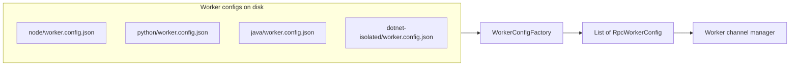
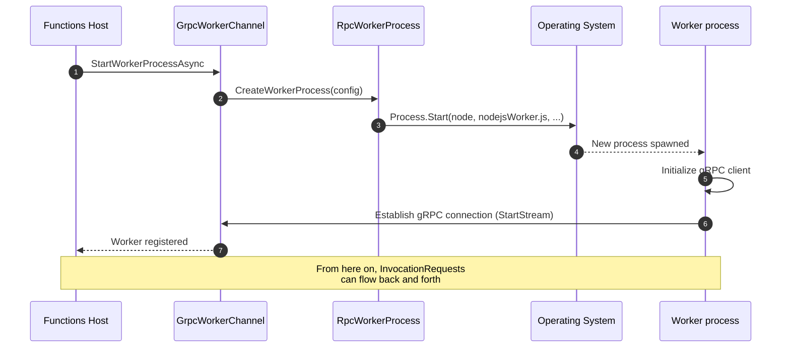
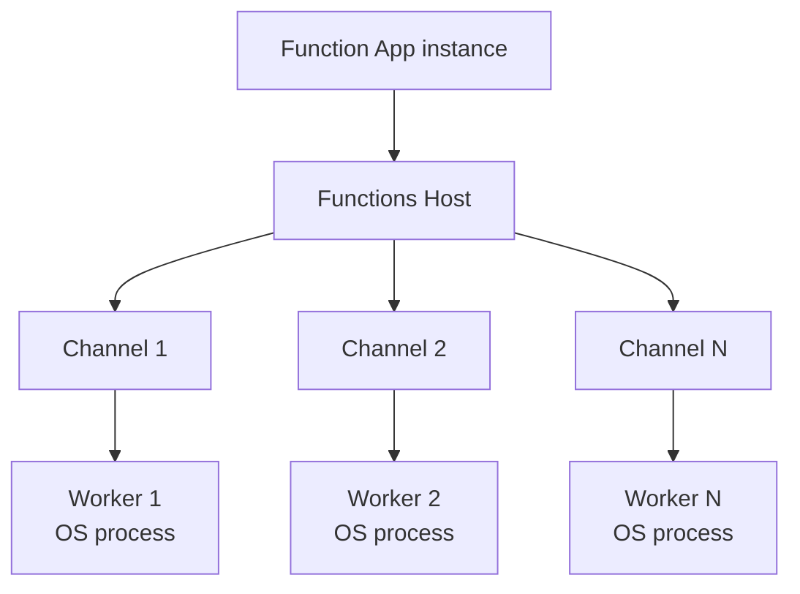
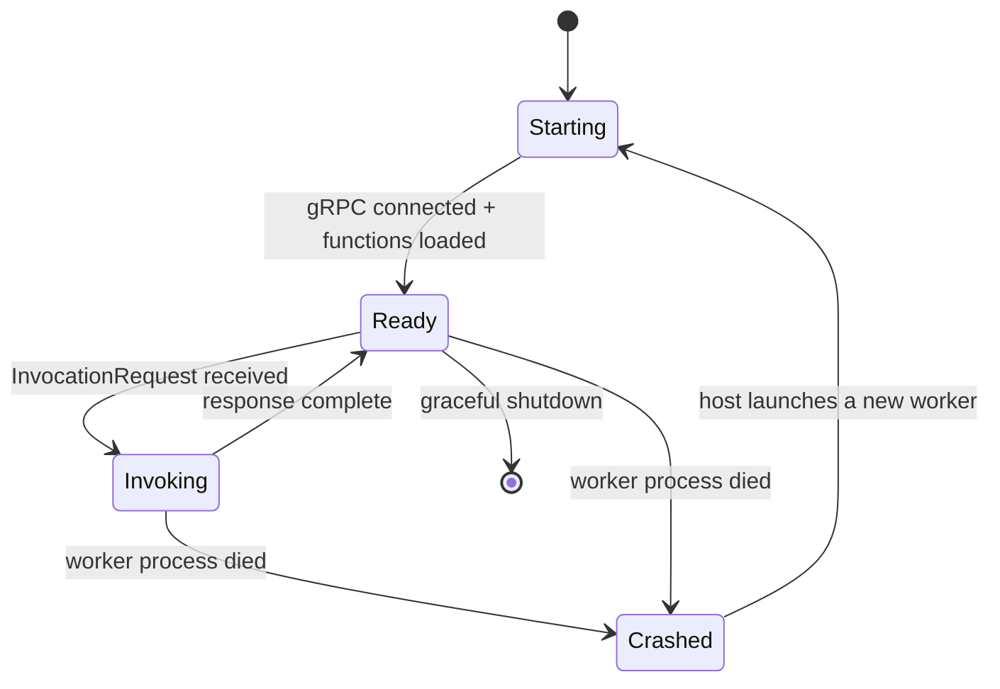

# The Worker Process — How Multi-Language Support Actually Works

> Azure Functions Deep Dive series (2/7)

At the end of part 1 I left a question hanging: *what exactly happens inside the “Worker channel preparation” box of `InitializeAsync`?* That is the topic for this installment. How does the Functions Host — written in .NET — launch and connect to Worker processes for Node.js, Python, Java, and PowerShell? We follow the trail **all the way down to the moment the OS-level `Process.Start` is called**.

The reference commit is the same as in part 1: `5e59423`.

---

## Starting point — `worker.config.json`

The secret to multi-language support is mundane. The Host does not hard-code “how to launch each language.” Instead it reads **a `worker.config.json` file that ships inside each language’s worker package** and follows it verbatim. In other words, adding a new language is not a matter of “patching the Host” — it is a matter of “adding a worker package.”

The Node.js worker’s configuration, for example, looks like this:

```json
{
  "description": {
    "language": "node",
    "extensions": [".js", ".mjs", ".cjs"],
    "defaultExecutablePath": "node",
    "defaultWorkerPath": "dist/src/nodejsWorker.js"
  }
}
```

> 📎 Source: [Node.js worker’s worker.config.json](https://github.com/Azure/azure-functions-host/blob/5e59423/src/WebJobs.Script.Grpc/workers/node/worker.config.json)

The Java worker’s configuration follows the same shape, in its own file:

> 📎 Source: [Java worker’s worker.config.json](https://github.com/Azure/azure-functions-host/blob/5e59423/src/WebJobs.Script.Grpc/workers/java/worker.config.json)

These files tell the Host three things:

- **Which executable to launch** (`node`, `java -jar ...`, `python`, etc.)
- **Which entry-point script to hand it** (`nodejsWorker.js`, `azure-functions-java-worker.jar`, etc.)
- **Which file extensions it owns** (`.js`, `.py`, `.java`, ...)

---

## One level up — `WorkerConfigFactory`

When the Host boots, the component that gathers every language’s `worker.config.json` and assembles a unified catalogue is `WorkerConfigFactory`. The output is a list of `RpcWorkerConfig` objects, each one carrying everything needed to “launch this language’s worker.”



The reason language-specific workers plug in “like plugins” is right there in the diagram. **The Host knows nothing about the workers themselves — it only knows their config files.**

---

## Launching the Worker process — `RpcWorkerProcess`

Once the configs are gathered, the next step is to launch an actual OS process. The class responsible is `RpcWorkerProcess`. Its `CreateWorkerProcess` method assembles the launch command by combining `defaultExecutablePath` and `defaultWorkerPath` from the worker.config.

> 📎 Source: [`RpcWorkerProcess.cs`](https://github.com/Azure/azure-functions-host/blob/5e59423/src/WebJobs.Script.Grpc/Channel/RpcWorkerProcess.cs)

The assembled command is then handed off to the `Start()` method on the abstract base class `WorkerProcess`. Three things happen there:

1. Spin up an OS process via `System.Diagnostics.Process`
2. **Intercept stdout/stderr and wire them into the Host’s logging pipeline**
3. Register a callback for when the process dies (the `Exited` event)

> 📎 Source: [`WorkerProcess.cs`](https://github.com/Azure/azure-functions-host/blob/5e59423/src/WebJobs.Script.Grpc/Channel/WorkerProcess.cs)

That stdout/stderr wiring matters operationally. **Every line a worker writes to standard output flows through the Host’s logging system into Application Insights.** A large fraction of the rows you see in the `traces` table — the one we toured in part 7 of the introductory series — are, in fact, lines the worker wrote to stdout. That is the answer to “how does a single `console.log` end up in cloud logs.”

---

## Worker lifecycle within a single instance

A running OS process does not mean the Worker is “ready.” Process boot and the gRPC handshake are separate stages. The sequence below is the full path a single Worker takes to reach the “ready” state inside one instance.



The `GrpcWorkerChannel` that appears here is “the Host-side handle that corresponds to one worker process.” When the worker dies, the channel is torn down with it, and the Host spins up a new worker along with a new channel.

> 📎 Source: [`GrpcWorkerChannel.cs`](https://github.com/Azure/azure-functions-host/blob/5e59423/src/WebJobs.Script.Grpc/Channel/GrpcWorkerChannel.cs)

---

## `FUNCTIONS_WORKER_PROCESS_COUNT` — multiple workers per instance

The default is 1. That is, a single Function App instance hosts a single Worker. But if you set the environment variable `FUNCTIONS_WORKER_PROCESS_COUNT` to N, that same instance will run N worker processes side by side.

This is meaningful in two cases:

- **Single-threaded, event-loop languages like Node.js / Python** — when a single worker is blocked on CPU work, no other invocation can squeeze in. Running multiple workers parallelizes execution at the OS multi-process level.
- **Multi-threaded languages like Java / .NET** — there is little reason to need extra workers, but you can still use the option when you want memory isolation or separate GCs.

The PR that introduced this option is [PR #4210](https://github.com/Azure/azure-functions-host/pull/4210); in code it shows up on the options tree as something like `WorkerConcurrencyOptions`. Actually creating and managing those N workers is the responsibility of the Worker channel manager (the parent of `RpcFunctionInvocationDispatcher` that we will meet in the next part).



---

## What happens when a worker dies

A worker process runs arbitrary user code. Which means it can always die: infinite loops, runaway memory, unhandled exceptions, the occasional unexplained OOM. The Host’s recovery strategy looks like this:

1. Detect the death via `WorkerProcess`’s `Exited` event
2. Tear down the corresponding worker channel (`GrpcWorkerChannel.Dispose`)
3. Launch a fresh worker process
4. Mark any in-flight `InvocationRequest`s as failed

Operationally, this isolation is the reason “a function may fail occasionally while the Host itself stays perfectly healthy.” The Host is designed around detecting and recovering from the death of **a child process** — not its own.



---

## Wrapping up part 2 — before the next installment

If I had to compress this part into a single paragraph, it would be this:

> Each language’s worker package drops a `worker.config.json` on disk. At boot, the Host gathers those configs into a catalogue (a list of `RpcWorkerConfig`). When it is time to launch a worker, `RpcWorkerProcess.CreateWorkerProcess` assembles the command from the config, and `WorkerProcess.Start` calls the OS-level `Process.Start` to spawn the actual process. stdout/stderr are wired into the Host’s logging pipeline. The worker then initializes its gRPC client and establishes a connection to the Host’s `GrpcWorkerChannel`.

By this point the worker is **running, connected to the Host, and ready to receive function metadata**. The next installment is about the true identity of that final “readiness” step. Exactly which protobuf messages do the Host and Worker exchange, and in what order? **We will open up `FunctionRpc.proto` and walk through the EventStream messages one by one.**

---

## Series table of contents

| # | Title |
|---|---|
| 1 | [Host bootstrap — following `WebJobsScriptHostService`](./01-host-bootstrap.md) |
| 2 | **The Worker process — how multi-language support actually works** ← current post |
| 3 | gRPC EventStream — the conversation protocol between Host and Worker |
| 4 | The mechanics of a function invocation — Dispatcher and InvocationRequest |
| 5 | Inside per-plan scaling — what the Scale Controller sees |
| 6 | The war on cold start — Placeholder Mode and Specialization |
| 7 | Azure Functions through an academic lens — what the papers say |

---

## References

**Source code (commit `5e59423`)**
- [Node.js worker.config.json](https://github.com/Azure/azure-functions-host/blob/5e59423/src/WebJobs.Script.Grpc/workers/node/worker.config.json)
- [Java worker.config.json](https://github.com/Azure/azure-functions-host/blob/5e59423/src/WebJobs.Script.Grpc/workers/java/worker.config.json)
- [`RpcWorkerProcess.cs`](https://github.com/Azure/azure-functions-host/blob/5e59423/src/WebJobs.Script.Grpc/Channel/RpcWorkerProcess.cs)
- [`WorkerProcess.cs`](https://github.com/Azure/azure-functions-host/blob/5e59423/src/WebJobs.Script.Grpc/Channel/WorkerProcess.cs)
- [`GrpcWorkerChannel.cs`](https://github.com/Azure/azure-functions-host/blob/5e59423/src/WebJobs.Script.Grpc/Channel/GrpcWorkerChannel.cs)
- [PR #4210 — `FUNCTIONS_WORKER_PROCESS_COUNT`](https://github.com/Azure/azure-functions-host/pull/4210)

**Related worker repos**
- [`Azure/azure-functions-nodejs-worker`](https://github.com/Azure/azure-functions-nodejs-worker)
- [`Azure/azure-functions-python-worker`](https://github.com/Azure/azure-functions-python-worker)
- [`Azure/azure-functions-java-worker`](https://github.com/Azure/azure-functions-java-worker)
