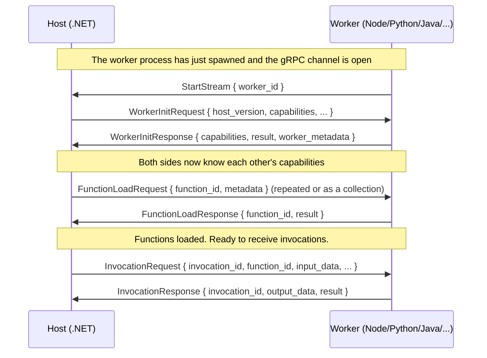
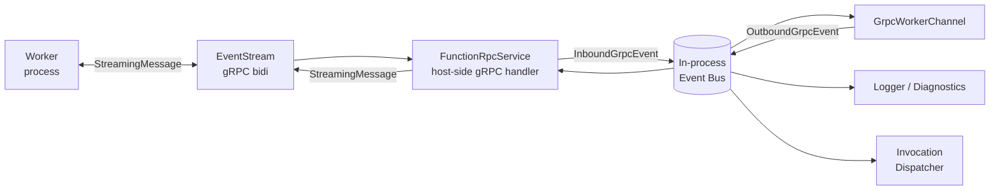

# The gRPC Event Stream — What Do the Host and Worker Actually Exchange?

> Azure Functions Deep Dive series (3/7)

In Part 2, we watched the worker process get spawned. When `RpcWorkerProcess.Start()` calls `Process.Start()`, an external process like Node, Python, or Java starts running. But on its own, that does nothing. **The host and the worker need a channel to talk over.**

That channel is a single **bidirectional gRPC stream**. In this post, we'll walk through what the stream looks like, what messages travel across it, and how the host receives and routes them — all in code.

> All code citations in this post are based on these two repositories:
> - Host: [`Azure/azure-functions-host` @ `5e59423`](https://github.com/Azure/azure-functions-host/tree/5e59423ba45491041d18224c3e72c168a4a5b7f7)
> - Protocol: [`Azure/azure-functions-language-worker-protobuf`](https://github.com/Azure/azure-functions-language-worker-protobuf) (included in the host repo as a git submodule)

---

## The big picture — one single stream

Let's start with the punchline. Host-worker communication in Azure Functions is **one gRPC service, one RPC**.

```protobuf
service FunctionRpc {
  rpc EventStream (stream StreamingMessage) returns (stream StreamingMessage) {}
}
```

One line. A single `EventStream`. Streaming on both sides. In other words, the host and worker **exchange messages freely over the same channel**. This is not a request-response RPC.

That single line carries a lot of weight. **Everything that can go inside `StreamingMessage`** is essentially the entire Functions protocol.

---

## `StreamingMessage` — the all-purpose message multiplexed via `oneof`

[`StreamingMessage` in `FunctionRpc.proto`](https://github.com/Azure/azure-functions-language-worker-protobuf/blob/main/src/proto/FunctionRpc.proto) looks like this:

```protobuf
message StreamingMessage {
  // Used to identify message between host and worker
  string request_id = 1;

  // Payload of the message
  oneof content {
    StartStream start_stream = 20;

    WorkerInitRequest worker_init_request = 17;
    WorkerInitResponse worker_init_response = 16;

    WorkerTerminate worker_terminate = 14;

    WorkerStatusRequest worker_status_request = 12;
    WorkerStatusResponse worker_status_response = 13;

    FileChangeEventRequest file_change_event_request = 6;
    WorkerActionResponse worker_action_response = 7;

    FunctionLoadRequest function_load_request = 8;
    FunctionLoadResponse function_load_response = 9;

    InvocationRequest invocation_request = 4;
    InvocationResponse invocation_response = 5;
    InvocationCancel invocation_cancel = 21;

    RpcLog rpc_log = 2;

    FunctionEnvironmentReloadRequest function_environment_reload_request = 25;
    FunctionEnvironmentReloadResponse function_environment_reload_response = 26;

    CloseSharedMemoryResourcesRequest close_shared_memory_resources_request = 27;
    CloseSharedMemoryResourcesResponse close_shared_memory_resources_response = 28;

    FunctionsMetadataRequest functions_metadata_request = 29;
    FunctionMetadataResponse function_metadata_response = 30;

    FunctionLoadRequestCollection function_load_request_collection = 31;
    FunctionLoadResponseCollection function_load_response_collection = 32;

    WorkerWarmupRequest worker_warmup_request = 33;
    WorkerWarmupResponse worker_warmup_response = 34;
  }
}
```

Two things matter here:

1. `request_id` — the ID the host and worker use to pair messages. It's critical for correlating asynchronous responses.
2. `oneof content` — only one payload is set at a time. In other words, **dozens of message types are multiplexed** over the same channel.

If we group them, the messages fall into roughly five categories:

| Group | Messages | Direction |
|---|---|---|
| **Lifecycle** | StartStream, WorkerInitRequest/Response, WorkerTerminate | Both ways |
| **Health checks** | WorkerStatusRequest/Response | Host → Worker |
| **Function loading** | FunctionLoadRequest/Response, FunctionsMetadataRequest, FunctionMetadataResponse | Host ↔ Worker |
| **Invocation** | InvocationRequest/Response, InvocationCancel | Host → Worker (response goes the other way) |
| **Operations** | RpcLog, FileChangeEventRequest, FunctionEnvironmentReloadRequest/Response, WorkerWarmupRequest/Response | Mixed |

This table is the entire Functions protocol in one view.

---

## The handshake — the moment a worker first speaks to the host

All of these messages matter, but if you understand **the very first handshake**, the rest follows naturally.

### Step 1 — the worker sends `StartStream`

Once the worker process finishes booting, it introduces itself to the host first.

```protobuf
message StartStream {
  // id of the worker
  string worker_id = 2;
}
```

The worker sends `StartStream` with its own `worker_id` to the host. This ID is the same one the host passed to the worker as an environment variable or command-line argument when it built the `RpcWorkerConfig` we saw in Part 2. In other words, **the worker is echoing back the ID the host previously handed it**. With that, the host confirms: "the gRPC client that just connected is indeed the worker I spawned."

### Step 2 — the host sends `WorkerInitRequest`

Once the worker's identity is confirmed, the host "initializes" the worker.

```protobuf
message WorkerInitRequest {
  // version of the host sending init request
  string host_version = 1;

  // A map of host supported features/capabilities
  map<string, string> capabilities = 2;

  // inform worker of supported categories and their levels
  map<string, RpcLog.Level> log_categories = 3;

  // Full path of worker.config.json location
  string worker_directory = 4;

  // base directory for function app
  string function_app_directory = 5;
}
```

The most important field here is `capabilities`. **The host advertises the features it supports** (e.g. shared memory data transfer, RPC HTTP body, raw HTTP body bytes, etc.). The worker reads it and learns: "here's what I can do with this particular host."

### Step 3 — the worker replies with `WorkerInitResponse`

```protobuf
message WorkerInitResponse {
  // A map of worker supported features/capabilities
  map<string, string> capabilities = 2;

  // Status of the response
  StatusResult result = 3;

  // Worker metadata captured for telemetry purposes
  WorkerMetadata worker_metadata = 4;
}
```

This time, **the worker advertises its own capabilities**. The host then communicates using the **intersection** of both sides' capabilities. (If the host supports shared memory but the worker doesn't, that message simply isn't used.) `WorkerMetadata` also rides along, carrying telemetry such as the runtime type, version, and bitness.

### Step 4 — the host loads functions via `FunctionLoadRequest`

Once the handshake is done, the host starts telling the worker about each function.

```protobuf
message FunctionLoadRequest {
  string function_id = 1;
  RpcFunctionMetadata metadata = 2;
  bool managed_dependency_enabled = 3;
}
```

The host sends one of these per function, or batches them in a single `FunctionLoadRequestCollection`. The worker replies to each with a `FunctionLoadResponse` reporting success or failure.

### All on one screen



This sequence is **the life of every worker**. The Node worker, the Python worker, the Java worker — all the same. The implementation details on the worker side differ per language, but **the protocol is uniform**.

---

## The host side — `FunctionRpcService` accepts the EventStream

The worker is the client; the host is the server. On the host side, the `EventStream` RPC is implemented in [`src/WebJobs.Script.Grpc/Server/FunctionRpcService.cs`](https://github.com/Azure/azure-functions-host/blob/5e59423ba45491041d18224c3e72c168a4a5b7f7/src/WebJobs.Script.Grpc/Server/FunctionRpcService.cs).

As the name suggests, it inherits from `FunctionRpc.FunctionRpcBase` (the base class auto-generated by `protoc` from `service FunctionRpc`) and overrides the `EventStream` method.

The `Server/` directory also contains the following files:

- [`AspNetCoreGrpcServer.cs`](https://github.com/Azure/azure-functions-host/blob/5e59423ba45491041d18224c3e72c168a4a5b7f7/src/WebJobs.Script.Grpc/Server/AspNetCoreGrpcServer.cs) — the entry point that brings up Kestrel + ASP.NET Core gRPC as a server inside the host
- [`AspNetCoreGrpcHostBuilder.cs`](https://github.com/Azure/azure-functions-host/blob/5e59423ba45491041d18224c3e72c168a4a5b7f7/src/WebJobs.Script.Grpc/Server/AspNetCoreGrpcHostBuilder.cs) — builds the IHost for the gRPC server
- [`Startup.cs`](https://github.com/Azure/azure-functions-host/blob/5e59423ba45491041d18224c3e72c168a4a5b7f7/src/WebJobs.Script.Grpc/Server/Startup.cs) — DI registration (the `MapGrpcService<FunctionRpcService>` pattern)

In other words, **an ASP.NET Core gRPC server is running inside the Functions host**, and worker processes connect to it as gRPC clients to call `EventStream`. It's localhost gRPC.

The address (endpoint and port) the server listens on is decided by the host and communicated to the worker via the environment variables/command-line arguments we saw in Part 2. That's why, if you read the worker code in any language, the very first entry point follows the same pattern: "create a gRPC client targeting the address the host gave us."

---

## `GrpcWorkerChannel` — the host's handle on a worker

Messages received by the server eventually need someone to **read and route** them. That "someone" on the host side is the worker handle object: **`GrpcWorkerChannel`**.

[`src/WebJobs.Script.Grpc/Channel/GrpcWorkerChannel.cs`](https://github.com/Azure/azure-functions-host/blob/5e59423ba45491041d18224c3e72c168a4a5b7f7/src/WebJobs.Script.Grpc/Channel/GrpcWorkerChannel.cs) is the object the host holds **one-per-worker-process**. Looking at the surrounding files in the same directory makes its role obvious:

| File | Role |
|---|---|
| `GrpcWorkerChannel.cs` | The handle that represents one worker. Holds SendStartStreamMessage, SendWorkerInitRequest, SendInvocationRequest, ReceiveWorkerStatusResponse, etc. |
| [`WorkerChannel.cs`](https://github.com/Azure/azure-functions-host/blob/5e59423ba45491041d18224c3e72c168a4a5b7f7/src/WebJobs.Script.Grpc/Channel/WorkerChannel.cs) | The shared base layered on top of gRPC |
| [`GrpcWorkerChannelFactory.cs`](https://github.com/Azure/azure-functions-host/blob/5e59423ba45491041d18224c3e72c168a4a5b7f7/src/WebJobs.Script.Grpc/Channel/GrpcWorkerChannelFactory.cs) | The factory that produces `GrpcWorkerChannel` instances |
| [`GrpcCapabilities.cs`](https://github.com/Azure/azure-functions-host/blob/5e59423ba45491041d18224c3e72c168a4a5b7f7/src/WebJobs.Script.Grpc/Channel/GrpcCapabilities.cs) | Constants for capability keys |
| [`OrderedInvocationMessageDispatcher.cs`](https://github.com/Azure/azure-functions-host/blob/5e59423ba45491041d18224c3e72c168a4a5b7f7/src/WebJobs.Script.Grpc/Channel/OrderedInvocationMessageDispatcher.cs) | Dispatches invocation messages per-function, preserving order |

In the next post (Part 4) we'll dig into `GrpcWorkerChannel.SendInvocationRequest` and `OrderedInvocationMessageDispatcher` properly. For now, just remember that **this object handles the EventStream in both directions**.

---

## Eventing — turning gRPC messages into an in-process event bus

Inside the host, **multiple components want to listen to the same gRPC messages simultaneously**. For example:

- `GrpcWorkerChannel` itself needs to listen so it can match responses.
- The logging component wants to listen for `RpcLog` messages.
- The diagnostics component wants to listen for worker state changes.

To handle this cleanly, the host **wraps gRPC messages one more time as in-process events and pushes them onto an event bus**. That's what the [`Eventing/`](https://github.com/Azure/azure-functions-host/tree/5e59423ba45491041d18224c3e72c168a4a5b7f7/src/WebJobs.Script.Grpc/Eventing) directory is for.

| File | Role |
|---|---|
| [`GrpcEvent.cs`](https://github.com/Azure/azure-functions-host/blob/5e59423ba45491041d18224c3e72c168a4a5b7f7/src/WebJobs.Script.Grpc/Eventing/GrpcEvent.cs) | Base event class. Carries `WorkerId` and `Message` (StreamingMessage) |
| [`InboundGrpcEvent.cs`](https://github.com/Azure/azure-functions-host/blob/5e59423ba45491041d18224c3e72c168a4a5b7f7/src/WebJobs.Script.Grpc/Eventing/InboundGrpcEvent.cs) | Worker → Host messages |
| [`OutboundGrpcEvent.cs`](https://github.com/Azure/azure-functions-host/blob/5e59423ba45491041d18224c3e72c168a4a5b7f7/src/WebJobs.Script.Grpc/Eventing/OutboundGrpcEvent.cs) | Host → Worker messages |

The flow looks like this:



The key insight: **gRPC doesn't directly call business logic.** Every message is first converted into an `Inbound`/`OutboundGrpcEvent` and dropped onto the in-process event bus, where interested components **subscribe and filter for the message types they care about**.

Thanks to this design, `GrpcWorkerChannel` doesn't bloat into "a giant switch that branches on which kind of message arrived" — instead, **it can split per-message-type handlers into small subscriptions**. (The actual implementation uses the observable pattern based on Reactive Extensions.)

---

## So what path does a single invocation take?

If we boil everything down to one sentence:

> Inside the host, `FunctionRpcService` receives a `StreamingMessage` from the worker, turns it into an `InboundGrpcEvent`, and pushes it onto the event bus. `GrpcWorkerChannel` is listening, picks out only the messages for its own worker ID, and processes them. The reverse direction is symmetric.

That's the "communication infrastructure." From the next post onward, we'll cover how an actual function invocation flows on top of this infrastructure — how an `InvocationRequest` is constructed, how responses are paired with requests, and how things recover when a function dies abnormally.

---

## Coming up next

In Part 4, we'll follow **`FunctionInvocationDispatcher` and `InvocationRequest`**. When a trigger fires, we'll see in code how it becomes an `InvocationRequest`, which worker it's handed to, and how the response is matched back.

---

## Series index

| # | Title |
|---|---|
| 1 | [Host bootstrap — from `WebJobsScriptHostService` to `ScriptHost`](./01-host-bootstrap.md) |
| 2 | [The worker process — `RpcWorkerProcess` and the language worker startup](./02-worker-process.md) |
| 3 | **The gRPC event stream — what do the host and worker actually exchange** ← current post |
| 4 | [Dispatcher and Invocation — how a function call reaches the worker](./04-dispatcher-and-invocation.md) |
| 5 | [Scaling internals — how instances actually grow](./05-scaling-internals.md) |
| 6 | [Cold start and Placeholder — why the first call can still be fast](./06-cold-start-placeholder.md) |
| 7 | [An academic perspective — papers that have analyzed Azure Functions](./07-academic-perspective.md) |

---

## References

**Protocol (submodule)**
- [FunctionRpc.proto](https://github.com/Azure/azure-functions-language-worker-protobuf/blob/main/src/proto/FunctionRpc.proto) — `service FunctionRpc`, `StreamingMessage`, all message types

**Host code (commit `5e59423`)**
- [`Server/FunctionRpcService.cs`](https://github.com/Azure/azure-functions-host/blob/5e59423ba45491041d18224c3e72c168a4a5b7f7/src/WebJobs.Script.Grpc/Server/FunctionRpcService.cs)
- [`Server/AspNetCoreGrpcServer.cs`](https://github.com/Azure/azure-functions-host/blob/5e59423ba45491041d18224c3e72c168a4a5b7f7/src/WebJobs.Script.Grpc/Server/AspNetCoreGrpcServer.cs)
- [`Channel/GrpcWorkerChannel.cs`](https://github.com/Azure/azure-functions-host/blob/5e59423ba45491041d18224c3e72c168a4a5b7f7/src/WebJobs.Script.Grpc/Channel/GrpcWorkerChannel.cs)
- [`Channel/GrpcCapabilities.cs`](https://github.com/Azure/azure-functions-host/blob/5e59423ba45491041d18224c3e72c168a4a5b7f7/src/WebJobs.Script.Grpc/Channel/GrpcCapabilities.cs)
- [`Eventing/InboundGrpcEvent.cs`](https://github.com/Azure/azure-functions-host/blob/5e59423ba45491041d18224c3e72c168a4a5b7f7/src/WebJobs.Script.Grpc/Eventing/InboundGrpcEvent.cs)
- [`Eventing/OutboundGrpcEvent.cs`](https://github.com/Azure/azure-functions-host/blob/5e59423ba45491041d18224c3e72c168a4a5b7f7/src/WebJobs.Script.Grpc/Eventing/OutboundGrpcEvent.cs)

**Related introductory series**
- [Host and Worker — who actually runs your functions (101 series, Part 3)](../../azure-functions-101/ko/03-host-and-worker.md)
