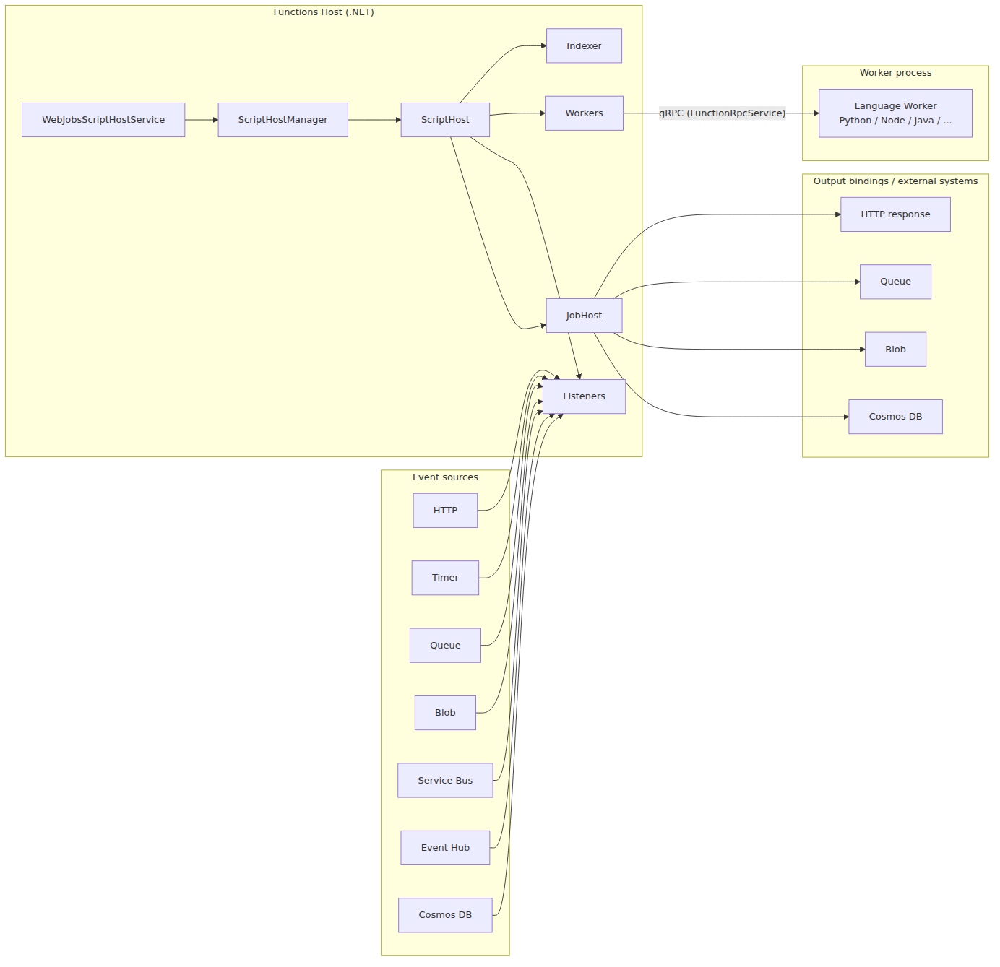
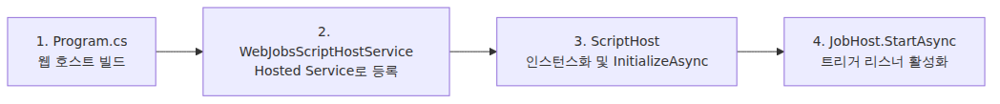
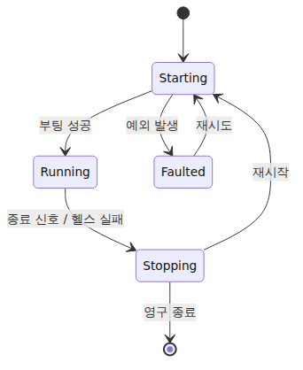

# 호스트 부팅 — `WebJobsScriptHostService`부터 따라가기

> Azure Functions Deep Dive 시리즈 (1/6)

입문 시리즈 3화에서 “Functions는 Host 프로세스(.NET)와 Worker 프로세스(여러분의 언어)를 분리해서 띄우고, 둘은 gRPC로 대화한다”고 적었습니다. 이번 심화 시리즈는 그 문장을 실제 호스트 코드로 확인하는 작업입니다. [`Azure/azure-functions-host`](https://github.com/Azure/azure-functions-host) 저장소를 직접 읽으면서, 호스트 부팅부터 함수 호출, 스케일링, 콜드 스타트까지 순서대로 따라갑니다.

이번 글의 주제는 하나입니다. **Function App 인스턴스가 켜진 직후 무슨 일이 벌어지는가**입니다. 기준 커밋은 `5e59423`입니다. 모든 코드 인용은 이 커밋에 고정합니다.

---

## 전체 그림 — Azure Functions 호스트 한 인스턴스

이 그림이 이번 심화 시리즈 전체의 지도입니다.
뒤의 화들은 아래 박스 하나씩을 확대해서 보는 구조입니다.
먼저 위치를 잡아 두면, 이후의 세부 코드가 훨씬 덜 낯섭니다.

이번 1화는 가운데 Host가 어떻게 부팅되는지를 보고, 2화는 Worker 프로세스, 3화는 둘 사이의 `gRPC (FunctionRpcService)` 채널, 4화는 dispatcher와 invocation, 5화는 스케일링, 6화는 placeholder와 콜드 스타트를 확대합니다.

---

## 큰 그림 — 호스트 부팅의 4단계

복잡해 보여도 호스트 부팅은 결국 다음 4단계로 압축됩니다.

이 글은 이 네 박스를 차례로 깊게 들어갑니다. 4단계가 끝나면 **트리거가 들어오기만 하면 함수가 실행될 준비**가 끝납니다.

---

## 1단계: `WebJobsScriptHostService` 등장

진입점은 `Program.cs`이지만, Functions의 “호스트 라이프사이클”의 진짜 주인공은 `WebJobsScriptHostService`라는 이름의 `IHostedService`입니다. ASP.NET Core의 표준 호스팅 모델 위에 얹혀 있어서, 다른 서비스들과 마찬가지로 `StartAsync` / `StopAsync`로 라이프사이클이 관리됩니다.

핵심 메서드는 `StartAsync`입니다. 여기서 다음 일이 일어납니다.

- 호스트 헬스 모니터(`HostHealthMonitor`) 와이어링
- `ScriptHost` 인스턴스를 만들고 `InitializeAsync` 호출
- 실패 시 재시도 / 재시작 정책 적용
- 부팅 상태 이벤트 publish (Standby → Running 전이 등)

> 코드 위치: [`WebJobsScriptHostService.cs` (commit `5e59423`)](https://github.com/Azure/azure-functions-host/blob/5e59423/src/WebJobs.Script.WebHost/WebJobsScriptHostService.cs)

여기서 중요한 설계 결정 하나. **`WebJobsScriptHostService`는 “호스트 자체”가 아닙니다.** 호스트 라이프사이클을 “관리”하는 외피입니다. 진짜 호스트는 안쪽의 `ScriptHost`입니다. 외피와 알맹이를 분리한 덕분에, 호스트가 죽었을 때 외피가 새 알맹이를 만들어 갈아끼우는 식의 회복이 가능합니다.

---

## 2단계: `ScriptHost.InitializeAsync` — 진짜 부팅이 일어나는 곳

`WebJobsScriptHostService`가 호출하는 `ScriptHost.InitializeAsync` 안에서, Functions가 함수 앱으로 동작하기 위한 준비가 진행됩니다.

여기서 순서가 중요합니다. `ScriptHost.StartAsyncCore()`는 먼저 `InitializeAsync()`를 끝까지 실행한 뒤, 그 다음에 `base.StartAsyncCore()`를 호출합니다. 즉 `JobHost.StartAsync()`에 따른 트리거 리스너 활성화는 `InitializeAsync` 내부가 아니라 **그 다음 단계**입니다. 이번 화에서는 설정 로드와 함수 인덱싱에 집중하고, Worker 채널 준비는 2화로, 실제 호출 경로는 4화로 넘깁니다.

> 코드 위치: [`ScriptHost.cs` (commit `5e59423`)](https://github.com/Azure/azure-functions-host/blob/5e59423/src/WebJobs.Script/Host/ScriptHost.cs)

---

## 3단계: `host.json`은 어디서 어떻게 읽히는가

`host.json`은 Functions의 “단일 진실 공급원”입니다. 동시성, 타임아웃, 로깅, 트리거별 옵션이 전부 여기에 있습니다. 이 파일이 코드 어디서 어떻게 옵션 트리로 변환되는지 따라가 보겠습니다.

진입점은 `HostJsonFileConfigurationSource`입니다. 이 클래스는 host.json을 읽어 .NET의 `IConfiguration` 트리에 넣습니다. 그리고 `WellKnownHostJsonProperties`라는 상수 목록이 이 파일이 “알 만한 키”를 정의합니다. 대표적으로 다음 같은 항목들입니다.

- `concurrency` — 동시 호출 제한
- `extensions.queues` — 큐 트리거 옵션 (배치 크기, 폴링 간격 등)
- `extensions.http` — HTTP 트리거 라우팅 / 동시성
- `functionTimeout` — 단일 호출 타임아웃

> 코드 위치: [`HostJsonFileConfigurationSource.cs`](https://github.com/Azure/azure-functions-host/blob/5e59423/src/WebJobs.Script/Config/HostJsonFileConfigurationSource.cs)

`host.json`의 값은 곧장 옵션 객체로 매핑됩니다. 예를 들어 `functionTimeout`은 `ScriptJobHostOptionsSetup.ConfigureFunctionTimeout`에서 `ScriptJobHostOptions.FunctionTimeout`에 들어갑니다.

> 코드 위치: [`ScriptJobHostOptionsSetup.cs`](https://github.com/Azure/azure-functions-host/blob/5e59423/src/WebJobs.Script/Config/ScriptJobHostOptionsSetup.cs)

이 그림이 `host.json`이 코드로 들어오는 경로입니다. **파일의 한 키 → IConfiguration의 한 노드 → Setup 클래스 → 옵션 객체 한 필드**라는 매핑이 끝까지 유지됩니다.

운영자가 알면 좋은 사실 두 개:

1. **환경변수도 같은 IConfiguration 트리에 들어간다.** 따라서 `host.json`에 적은 값을 환경변수로 덮어쓸 수 있습니다. 예: `AzureFunctionsJobHost__functionTimeout` 환경변수가 host.json의 `functionTimeout`을 이깁니다.
2. **`FUNCTIONS_WORKER_PROCESS_COUNT`** — 한 인스턴스 안에서 띄울 Worker 프로세스 수를 정합니다. 이 옵션은 [PR #4210](https://github.com/Azure/azure-functions-host/pull/4210)에서 도입됐고, 입문편 6화의 “인스턴스 내 동시성” 축에 직접 영향을 주는 노브입니다.

---

## 4단계: 함수 메타데이터 인덱싱

`ScriptHost`는 host.json을 읽고 나서 “이 앱에 어떤 함수들이 있는지”를 인덱싱합니다. 결과는 `FunctionMetadata`의 리스트입니다. 각 메타데이터에는 다음이 들어 있습니다.

- 함수 이름
- 트리거 종류와 트리거 설정
- 입력/출력 바인딩 목록
- 코드 진입점 (Worker가 호출할 핸들러)
- 사용 언어

이 인덱싱이 왜 중요할까요? **이 메타데이터가 모든 후속 동작의 기반**이기 때문입니다.

- Worker는 이 목록을 받아서 “나는 이 함수들을 안다”고 등록 (3화에서 다룰 gRPC `WorkerInitRequest` / `FunctionLoadRequest`)
- 트리거 리스너는 이 목록을 보고 “어떤 큐를 폴링할지, 어떤 라우트에 바인드할지”를 결정 (4화)
- Scale Controller는 이 목록을 보고 “어떤 트리거의 메트릭을 수집할지”를 결정 (5화)

즉, **인덱싱은 Functions 호스트의 “함수 카탈로그”를 만드는 단계**입니다.

---

## 호스트 헬스 모니터

`WebJobsScriptHostService`는 호스트가 살아있는지 주기적으로 점검합니다. 메모리 압박, 연결 실패, 부팅 타임아웃 등을 감지하면 호스트를 다시 시작합니다. 이 메커니즘이 “Functions Host가 자기 자신을 회복하는” 핵심입니다.

- 호스트가 부팅 중 예외를 던지면 → 재시도
- 부팅이 너무 오래 걸리면 → 강제 재시작
- 메모리/CPU 임계치 초과 → 인스턴스 회수 신호

이 상태 머신은 운영 시 “함수가 갑자기 재시작됐다”는 현상의 근원입니다. App Insights에서 “Host started” 로그가 자주 보인다면, 이 상태 머신이 빈번하게 도는 중일 가능성이 큽니다.

---

## 1화 정리 — 다음 화에서

이번 글에서 따라간 흐름을 한 문단으로 압축하면 다음과 같습니다.

> ASP.NET Core 호스트가 부팅하면서 `WebJobsScriptHostService`라는 `IHostedService`를 시작합니다. 그 안에서 `ScriptHost`가 만들어지고 `InitializeAsync`가 먼저 실행되어 host.json과 환경변수에서 옵션을 읽고 함수 메타데이터를 인덱싱합니다. 그 단계가 끝난 뒤에 `JobHost.StartAsync`가 실행되어 트리거 리스너가 활성화됩니다. 호스트 헬스 모니터는 이 전체 과정을 감시하고, 문제가 생기면 호스트를 다시 만듭니다.

다음 화의 주제는 이 그림의 사각지대 하나입니다. **`InitializeAsync` 안에서 “Worker 채널 준비”라고 적힌 박스에서 무슨 일이 벌어지는가.** Node.js·Python·Java 같은 다른 언어 워커 프로세스가 어떻게 띄워지는지, OS의 `Process.Start` 직전까지 따라갑니다.

---

## 시리즈 안에서의 위치

이 글은 Azure Functions Deep Dive 시리즈 1화입니다. 이번 화에서 호스트 부팅 순서를 잡았으니, 2화에서는 같은 인스턴스 옆에서 뜨는 Worker 프로세스로 넘어가고, 3화와 4화에서는 호스트와 워커 사이의 gRPC 채널과 실제 함수 호출 경로를 따라갑니다. 그 뒤로 5화의 스케일링, 6화의 placeholder와 콜드 스타트로 이어집니다.

---

## References

### 1차 출처 (호스트 코드, commit `5e59423`)
- [`WebJobsScriptHostService.cs`](https://github.com/Azure/azure-functions-host/blob/5e59423/src/WebJobs.Script.WebHost/WebJobsScriptHostService.cs)
- [`ScriptHost.cs`](https://github.com/Azure/azure-functions-host/blob/5e59423/src/WebJobs.Script/Host/ScriptHost.cs)
- [`HostJsonFileConfigurationSource.cs`](https://github.com/Azure/azure-functions-host/blob/5e59423/src/WebJobs.Script/Config/HostJsonFileConfigurationSource.cs)
- [`ScriptJobHostOptionsSetup.cs`](https://github.com/Azure/azure-functions-host/blob/5e59423/src/WebJobs.Script/Config/ScriptJobHostOptionsSetup.cs)
- [PR #4210 — `FUNCTIONS_WORKER_PROCESS_COUNT` 도입](https://github.com/Azure/azure-functions-host/pull/4210)

### 2차 출처
- [host.json reference](https://learn.microsoft.com/en-us/azure/azure-functions/functions-host-json)
- [Azure Functions app settings reference](https://learn.microsoft.com/en-us/azure/azure-functions/functions-app-settings)

### 시리즈 다른 화
- [Azure Functions 101 — 입문편](../../azure-functions-101/ko/) (특히 3화 “Host와 Worker”)
