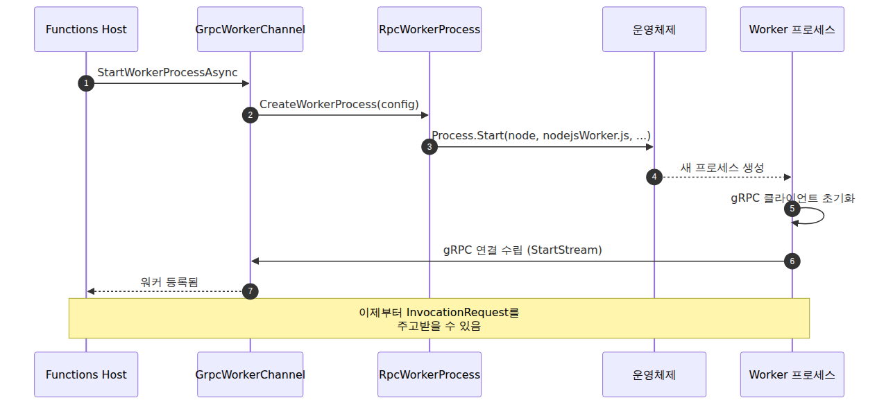
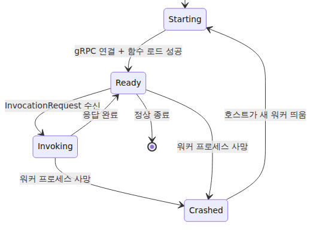

# Worker 프로세스 — 한 호스트에서 여러 언어 런타임이 같이 사는 법

> Azure Functions Deep Dive 시리즈 (2/7)

1화 끝에서 “`InitializeAsync` 안의 Worker 채널 준비 박스에 무슨 일이 일어나는가”라는 질문을 남겼습니다. 이번 화의 주제입니다. .NET으로 작성된 Functions Host가 Node.js, Python, Java, PowerShell Worker 프로세스를 어떻게 띄우고 어떻게 연결하는가. **OS의 `Process.Start`가 호출되기 직전까지** 따라갑니다.

기준 커밋은 1화와 같은 `5e59423`입니다.

---

## 출발점 — `worker.config.json`

여러 언어 런타임을 어떻게 같이 띄우는지의 답은 단순합니다. Host는 “어떤 언어를 어떻게 띄울지”를 직접 하드코딩하지 않습니다. 대신 **각 언어 워커 패키지에 들어 있는 `worker.config.json`**을 읽고 그 설명을 따릅니다. 새 언어를 붙이는 일은 Host 코드를 뜯어고치는 작업이 아니라, 해당 언어 워커 패키지를 추가하는 작업에 가깝습니다.

대표적으로 Node.js 워커의 설정은 다음과 같이 생겼습니다.

```json
{
  "description": {
    "language": "node",
    "extensions": [".js", ".mjs", ".cjs"],
    "defaultExecutablePath": "node",
    "defaultWorkerPath": "dist/src/nodejsWorker.js"
  }
}
```

> 코드 위치: [Node.js worker repo의 `worker.config.json`](https://github.com/Azure/azure-functions-nodejs-worker/blob/v3.x/worker.config.json)

Java 워커의 설정도 비슷한 구조로 별도 파일에 들어 있습니다.

> 코드 위치: [Java worker repo의 `worker.config.json`](https://github.com/Azure/azure-functions-java-worker/blob/dev/worker.config.json)

이 파일들이 Host에게 알려주는 정보는 셋입니다.

- **어떤 실행 파일로 띄울지** (`node`, `java -jar ...`, `python` 등)
- **어떤 진입점 스크립트를 줄지** (`nodejsWorker.js`, `azure-functions-java-worker.jar` 등)
- **어떤 파일 확장자를 다루는지** (`.js`, `.py`, `.java`, ...)

---

## 한 단계 위 — `WorkerConfigFactory`

Host가 부팅할 때 모든 언어의 `worker.config.json`을 모아 통합 카탈로그를 만드는 장치가 `WorkerConfigFactory`입니다. 결과물은 `RpcWorkerConfig` 객체의 리스트로, 각 객체는 “이 언어의 워커를 띄우려면 무엇이 필요한가”를 담고 있습니다.


언어별 워커가 플러그인처럼 붙는 이유가 이 그림에 있습니다. **Host는 워커 구현을 직접 품지 않고, 워커 설정 파일이 설명하는 실행 규칙만 읽습니다.**

---

## Worker 프로세스 띄우기 — `RpcWorkerProcess`

설정이 모이면 다음 단계는 실제 OS 프로세스를 띄우는 일입니다. 이 책임을 지는 클래스가 `RpcWorkerProcess`입니다. 그 안의 `CreateWorkerProcess` 메서드가 worker.config의 `defaultExecutablePath`와 `defaultWorkerPath`를 조립해서 실행 명령을 만듭니다.

> 코드 위치: [`RpcWorkerProcess.cs`](https://github.com/Azure/azure-functions-host/blob/5e59423/src/WebJobs.Script.Grpc/Rpc/RpcWorkerProcess.cs)

조립된 명령은 추상 베이스 클래스 `WorkerProcess`의 `Start()` 메서드로 넘어갑니다. 여기서 일어나는 일은 다음 셋입니다.

1. `System.Diagnostics.Process`로 OS 프로세스를 띄움
2. **stdout/stderr를 가로채서 Host의 로그 파이프라인에 연결**
3. 프로세스가 죽으면 콜백 등록 (`Exited` 이벤트)

> 코드 위치: [`WorkerProcess.cs`](https://github.com/Azure/azure-functions-host/blob/5e59423/src/WebJobs.Script.Grpc/ProcessManagement/WorkerProcess.cs)

stdout/stderr 와이어링이 운영 관점에서 중요합니다. **워커가 표준 출력으로 쓴 모든 글이 Host의 로깅 시스템을 통해 Application Insights로 흘러갑니다.** 입문편 7화에서 본 traces 테이블의 상당수가 사실은 워커가 stdout으로 쓴 줄들입니다. `console.log` 한 줄이 어떻게 클라우드 로그에 들어가는지의 답이 여기에 있습니다.

---

## 한 인스턴스 안의 Worker 라이프사이클

OS 프로세스가 떠 있다고 해서 Worker가 “준비 완료”인 건 아닙니다. 프로세스 부팅과 gRPC 핸드셰이크는 별개입니다. 다음 시퀀스가 한 인스턴스 안에서 한 Worker가 “준비 완료” 상태에 도달하는 전체 과정입니다.


여기서 등장한 `GrpcWorkerChannel`은 “하나의 워커 프로세스에 대응하는 호스트 측 핸들”입니다. 워커가 죽으면 이 채널도 정리되고, 호스트는 새 워커를 띄우면서 새 채널을 만듭니다.

> 코드 위치: [`GrpcWorkerChannel.cs`](https://github.com/Azure/azure-functions-host/blob/5e59423/src/WebJobs.Script.Grpc/Channel/GrpcWorkerChannel.cs)

---

## `FUNCTIONS_WORKER_PROCESS_COUNT` — 한 인스턴스에 워커 여러 개

기본값은 1입니다. 즉 한 Function App 인스턴스 안에 Worker는 한 개입니다. 그런데 환경변수 `FUNCTIONS_WORKER_PROCESS_COUNT`를 N으로 설정하면, 같은 인스턴스 안에 N개의 워커 프로세스가 뜹니다.

이게 의미가 있는 경우는 다음 둘입니다.

- **Node.js / Python처럼 단일 스레드 이벤트 루프 기반 언어** — 한 워커가 CPU 작업으로 블록되면 다른 호출이 못 들어옵니다. 워커를 여럿 띄우면 OS 레벨 멀티프로세스로 병렬화가 됩니다.
- **Java / .NET 등 멀티스레드 언어** — 굳이 워커를 여럿 띄울 필요는 적지만, 메모리 격리나 GC 분리를 원할 때 쓸 수 있습니다.

이 지점에서 두 개념을 분리해서 봐야 합니다.

- **`FUNCTIONS_WORKER_PROCESS_COUNT` / `WorkerProcessCountOptions`**: 한 인스턴스 안에 기본으로 몇 개의 워커 프로세스를 띄울지 정하는 **정적 개수 설정**입니다.
- **`WorkerConcurrencyOptions` / `WorkerConcurrencyManager`**: 런타임이 지연 시간 이력을 보고 워커를 더 붙일지 판단하는 **동적 동시성 제어**입니다.

즉 `FUNCTIONS_WORKER_PROCESS_COUNT=4`는 시작 시점에 워커 4개를 준비하는 설정이고, `WorkerConcurrencyOptions`는 실행 중 상태를 보고 추가 워커를 붙일지 감시하는 쪽입니다. 게다가 동적 동시성은 Node.js, Python, PowerShell 같은 일부 런타임에서만 동작하고, `FUNCTIONS_WORKER_PROCESS_COUNT`가 설정돼 있으면 비활성화됩니다.


---

## 워커가 죽으면 어떻게 되는가

워커 프로세스는 임의의 사용자 코드를 실행합니다. 즉 죽을 가능성이 늘 있습니다. 무한 루프, 메모리 폭주, 처리되지 않은 예외, 알 수 없는 OOM. Host의 회복 전략은 다음과 같습니다.

1. `WorkerProcess`의 `Exited` 이벤트로 사망 감지
2. 해당 워커 채널 정리 (`GrpcWorkerChannel.Dispose`)
3. 새 워커 프로세스 띄우기
4. 진행 중이던 InvocationRequest는 실패로 처리

운영 관점에서 “함수가 가끔 한 번씩 실패하더라도 호스트 자체는 멀쩡하게 살아 있는” 이유가 이 격리 덕분입니다. Host는 자기 프로세스가 아닌 **자식 프로세스**의 죽음을 감지하고 회복하는 모델로 설계돼 있습니다.


---

## 2화 정리 — 다음 화로 넘어가기 전에

이번 화의 그림을 한 문단으로 줄이면 다음과 같습니다.

> 각 언어 워커 패키지가 디스크에 `worker.config.json`을 둔다. Host는 부팅할 때 이 설정들을 모아 카탈로그(`RpcWorkerConfig` 리스트)를 만든다. 워커를 띄울 때가 되면 `RpcWorkerProcess.CreateWorkerProcess`가 설정대로 명령을 조립하고, `WorkerProcess.Start`가 OS의 `Process.Start`를 호출해 실제 프로세스를 띄운다. stdout/stderr는 호스트의 로그 파이프라인으로 묶여 들어간다. 워커는 곧이어 gRPC 클라이언트를 초기화하고 호스트의 `GrpcWorkerChannel`과 연결을 수립한다.

여기까지 오면 워커는 **떠 있고, 호스트와 연결돼 있고, 함수 메타데이터를 받을 준비**가 됐습니다. 다음 화는 그 마지막 “준비”의 정체를 다룹니다. 호스트와 워커가 정확히 어떤 protobuf 메시지를 어떤 순서로 주고받는가. **`FunctionRpc.proto`를 펼치고 EventStream의 메시지 한 종류씩 짚어 봅니다.**

---

## 시리즈 안에서의 위치

이 글은 Azure Functions Deep Dive 시리즈 2화입니다. 1화에서 호스트가 어떻게 올라오는지 봤다면, 이번 화는 그 호스트 옆에서 실제 사용자 코드를 실행할 Worker 프로세스가 어떻게 선택되고 시작되는지를 다룹니다. 다음 3화와 4화에서는 이 워커가 호스트와 어떤 gRPC 메시지를 주고받고, 실제 호출이 어느 경로로 흘러가는지 이어서 봅니다.

---

<!-- toc:begin -->
## 시리즈 목차

- [호스트 부팅 — `WebJobsScriptHostService`부터 따라가기](./01-host-bootstrap.md)
- **Worker 프로세스 — 한 호스트에서 여러 언어 런타임이 같이 사는 법 (현재 글)**
- gRPC 이벤트 스트림 — 호스트와 워커는 무엇을 주고받는가 (예정)
- Dispatcher와 Invocation — 함수 호출이 워커에 도달하기까지 (예정)
- 스케일링 내부 동작 — Scale Controller, ScaleMonitor, 그리고 플랜별 차이 (예정)
- 콜드 스타트와 Placeholder Mode — 새 인스턴스가 만들어질 때 (예정)

<!-- toc:end -->

---

## 참고 자료

**소스코드 (commit `5e59423`)**
- [`RpcWorkerProcess.cs`](https://github.com/Azure/azure-functions-host/blob/5e59423/src/WebJobs.Script.Grpc/Rpc/RpcWorkerProcess.cs)
- [`WorkerProcess.cs`](https://github.com/Azure/azure-functions-host/blob/5e59423/src/WebJobs.Script.Grpc/ProcessManagement/WorkerProcess.cs)
- [`GrpcWorkerChannel.cs`](https://github.com/Azure/azure-functions-host/blob/5e59423/src/WebJobs.Script.Grpc/Channel/GrpcWorkerChannel.cs)
- [PR #4210 — `FUNCTIONS_WORKER_PROCESS_COUNT`](https://github.com/Azure/azure-functions-host/pull/4210)
- [`WorkerProcessCountOptions.cs`](https://github.com/Azure/azure-functions-host/blob/5e59423/src/WebJobs.Script/Workers/WorkerProcessCountOptions.cs)
- [`WorkerConcurrencyOptions.cs`](https://github.com/Azure/azure-functions-host/blob/5e59423/src/WebJobs.Script/Config/WorkerConcurrencyOptions.cs)
- [`WorkerConcurrencyManager.cs`](https://github.com/Azure/azure-functions-host/blob/5e59423/src/WebJobs.Script.Grpc/WorkerConcurrencyManager.cs)

**관련 워커 레포**
- [`Azure/azure-functions-nodejs-worker`의 `worker.config.json`](https://github.com/Azure/azure-functions-nodejs-worker/blob/v3.x/worker.config.json)
- [`Azure/azure-functions-python-worker`](https://github.com/Azure/azure-functions-python-worker)
- [`Azure/azure-functions-java-worker`의 `worker.config.json`](https://github.com/Azure/azure-functions-java-worker/blob/dev/worker.config.json)

Tags: Azure Functions, Serverless, Distributed Systems, gRPC
