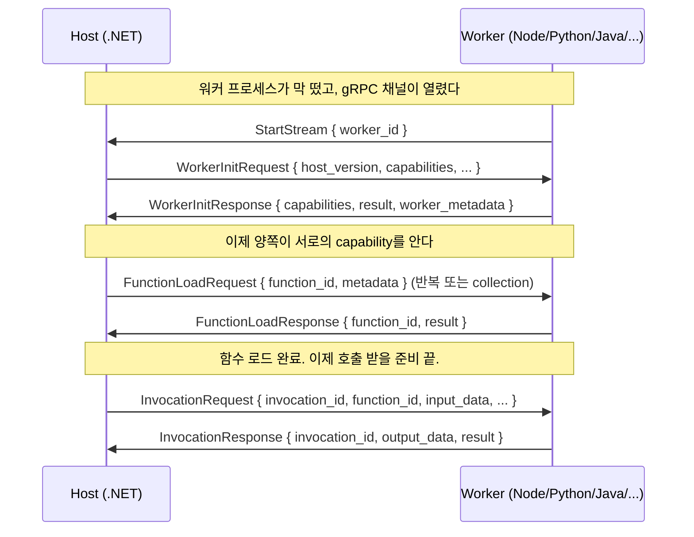
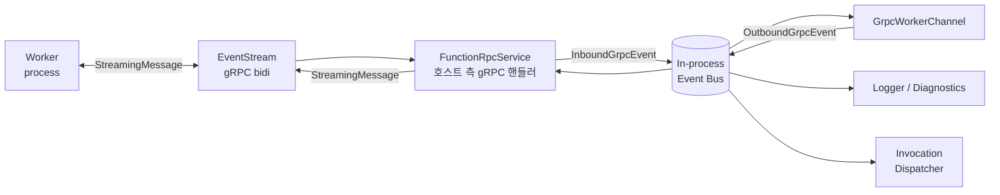

# gRPC 이벤트 스트림 — 호스트와 워커는 무엇을 주고받는가

> Azure Functions Deep Dive 시리즈 (3/7)

2화에서 워커 프로세스가 떠지는 것까지 봤습니다. `RpcWorkerProcess.Start()`가 `Process.Start()`를 호출하면, Node/Python/Java 같은 외부 프로세스가 실행됩니다. 그러나 그것만으로는 아무 일도 일어나지 않습니다. **호스트와 워커가 서로 말을 걸 채널이 필요**합니다.

그 채널은 단 하나의 **양방향 gRPC 스트림**입니다. 이 글에서는 그 스트림이 어떻게 생겼는지, 어떤 메시지가 오가는지, 그리고 호스트 측에서 그것을 어떻게 받고 라우팅하는지를 코드로 따라갑니다.

> 이 글의 모든 코드 인용은 다음 두 저장소를 기준으로 합니다.
> - 호스트: [`Azure/azure-functions-host` @ `5e59423`](https://github.com/Azure/azure-functions-host/tree/5e59423ba45491041d18224c3e72c168a4a5b7f7)
> - 프로토콜: [`Azure/azure-functions-language-worker-protobuf`](https://github.com/Azure/azure-functions-language-worker-protobuf) (호스트 저장소에 git submodule로 포함)

---

## 큰 그림 — 단 하나의 스트림

먼저 결론. Azure Functions의 호스트-워커 통신은 **gRPC 서비스 하나, RPC 하나**로 구성됩니다.

```protobuf
service FunctionRpc {
  rpc EventStream (stream StreamingMessage) returns (stream StreamingMessage) {}
}
```

한 줄입니다. `EventStream` 하나. 양쪽 모두 stream. 즉 호스트와 워커는 **같은 채널을 통해 자유롭게 메시지를 주고받습니다**. 요청-응답 RPC가 아닙니다.

이 한 줄이 갖는 의미는 큽니다. **`StreamingMessage`에 들어갈 수 있는 모든 종류의 메시지**가 곧 Functions 프로토콜의 전부입니다.

---

## `StreamingMessage` — `oneof`로 다중화된 만능 메시지

[`FunctionRpc.proto`의 `StreamingMessage`](https://github.com/Azure/azure-functions-language-worker-protobuf/blob/main/src/proto/FunctionRpc.proto)는 이렇게 생겼습니다.

```protobuf
message StreamingMessage {
  // Used to identify message between host and worker
  string request_id = 1;

  // Payload of the message
  oneof content {
    StartStream start_stream = 20;

    WorkerInitRequest worker_init_request = 17;
    WorkerInitResponse worker_init_response = 16;

    WorkerTerminate worker_terminate = 14;

    WorkerStatusRequest worker_status_request = 12;
    WorkerStatusResponse worker_status_response = 13;

    FileChangeEventRequest file_change_event_request = 6;
    WorkerActionResponse worker_action_response = 7;

    FunctionLoadRequest function_load_request = 8;
    FunctionLoadResponse function_load_response = 9;

    InvocationRequest invocation_request = 4;
    InvocationResponse invocation_response = 5;
    InvocationCancel invocation_cancel = 21;

    RpcLog rpc_log = 2;

    FunctionEnvironmentReloadRequest function_environment_reload_request = 25;
    FunctionEnvironmentReloadResponse function_environment_reload_response = 26;

    CloseSharedMemoryResourcesRequest close_shared_memory_resources_request = 27;
    CloseSharedMemoryResourcesResponse close_shared_memory_resources_response = 28;

    FunctionsMetadataRequest functions_metadata_request = 29;
    FunctionMetadataResponse function_metadata_response = 30;

    FunctionLoadRequestCollection function_load_request_collection = 31;
    FunctionLoadResponseCollection function_load_response_collection = 32;

    WorkerWarmupRequest worker_warmup_request = 33;
    WorkerWarmupResponse worker_warmup_response = 34;
  }
}
```

핵심은 두 가지입니다.

1. `request_id` — 호스트와 워커가 메시지를 짝짓는 데 쓰는 ID. 비동기 응답을 짝지을 때 결정적입니다.
2. `oneof content` — 한 번에 하나의 페이로드만 들어갑니다. 즉 같은 채널에 **수십 종의 메시지가 다중화**됩니다.

이걸 분류해 보면 메시지는 크게 다섯 그룹으로 나뉩니다.

| 그룹 | 메시지 | 누가 보내는가 |
|---|---|---|
| **수명주기** | StartStream, WorkerInitRequest/Response, WorkerTerminate | 양방향 |
| **상태 점검** | WorkerStatusRequest/Response | 호스트 → 워커 |
| **함수 로드** | FunctionLoadRequest/Response, FunctionsMetadataRequest, FunctionMetadataResponse | 호스트 ↔ 워커 |
| **호출** | InvocationRequest/Response, InvocationCancel | 호스트 → 워커 (응답 역방향) |
| **운영** | RpcLog, FileChangeEventRequest, FunctionEnvironmentReloadRequest/Response, WorkerWarmupRequest/Response | 다양 |

이 표가 곧 Functions 프로토콜의 전체 그림입니다.

---

## 핸드셰이크 — 워커가 떠서 호스트와 처음 말을 트는 순간

이 모든 메시지가 다 중요하지만, **가장 처음 일어나는 핸드셰이크**를 이해하면 나머지는 자연스럽게 따라옵니다.

### 1단계 — 워커가 `StartStream`을 보낸다

워커 프로세스가 부팅을 마치면, 먼저 호스트에게 자기소개를 합니다.

```protobuf
message StartStream {
  // id of the worker
  string worker_id = 2;
}
```

워커는 자신의 `worker_id`를 담아 `StartStream`을 호스트로 보냅니다. 이 ID는 2화에서 본 `RpcWorkerConfig` 생성 시 호스트가 워커에게 환경 변수나 명령행 인자로 전달한 것과 동일합니다. 즉 **호스트가 미리 알려준 ID를 워커가 그대로 되돌려주는** 인사입니다. 호스트는 이걸로 "방금 연결한 이 gRPC 클라이언트가 내가 띄운 그 워커"임을 확인합니다.

### 2단계 — 호스트가 `WorkerInitRequest`를 보낸다

워커의 신원이 확인되면, 호스트는 워커를 "초기화"합니다.

```protobuf
message WorkerInitRequest {
  // version of the host sending init request
  string host_version = 1;

  // A map of host supported features/capabilities
  map<string, string> capabilities = 2;

  // inform worker of supported categories and their levels
  map<string, RpcLog.Level> log_categories = 3;

  // Full path of worker.config.json location
  string worker_directory = 4;

  // base directory for function app
  string function_app_directory = 5;
}
```

여기서 가장 중요한 필드는 `capabilities`입니다. **호스트가 자기가 지원하는 기능을 광고**합니다. (예: shared memory data transfer, RPC HTTP body, raw HTTP body bytes 등) 워커는 이걸 보고 "이 호스트랑은 이런 기능까지 쓸 수 있네"를 학습합니다.

### 3단계 — 워커가 `WorkerInitResponse`로 답한다

```protobuf
message WorkerInitResponse {
  // A map of worker supported features/capabilities
  map<string, string> capabilities = 2;

  // Status of the response
  StatusResult result = 3;

  // Worker metadata captured for telemetry purposes
  WorkerMetadata worker_metadata = 4;
}
```

이번엔 반대로 **워커가 자기 capabilities를 광고**합니다. 호스트는 양쪽 capability의 **교집합**을 가지고 이후 통신합니다. (호스트는 shared memory를 지원하는데 워커는 안 한다면, 그 메시지는 안 씁니다.) 또한 `WorkerMetadata`로 런타임 종류, 버전, 비트성 같은 텔레메트리용 메타데이터가 함께 옵니다.

### 4단계 — 호스트가 `FunctionLoadRequest`로 함수를 로드시킨다

핸드셰이크가 끝나면 호스트는 본격적으로 함수를 워커에게 알려줍니다.

```protobuf
message FunctionLoadRequest {
  string function_id = 1;
  RpcFunctionMetadata metadata = 2;
  bool managed_dependency_enabled = 3;
}
```

각 함수마다 하나씩 보내거나, 또는 `FunctionLoadRequestCollection`으로 한 번에 묶어서 보냅니다. 워커는 각각에 대해 `FunctionLoadResponse`로 "성공/실패"를 알려줍니다.

### 한 화면으로



이 시퀀스가 **모든 워커의 일생**입니다. Node 워커도, Python 워커도, Java 워커도 똑같습니다. 언어별로 다른 건 워커 측의 구현 상세이고, **프로토콜은 단일**입니다.

---

## 호스트 측 — `FunctionRpcService`가 EventStream을 받는다

워커는 클라이언트, 호스트는 서버입니다. 호스트 측에서 `EventStream` RPC를 구현하는 건 [`src/WebJobs.Script.Grpc/Server/FunctionRpcService.cs`](https://github.com/Azure/azure-functions-host/blob/5e59423ba45491041d18224c3e72c168a4a5b7f7/src/WebJobs.Script.Grpc/Server/FunctionRpcService.cs)입니다.

이름에서 짐작되듯, `FunctionRpc.FunctionRpcBase`(protoc가 `service FunctionRpc`에서 자동 생성한 base 클래스)를 상속해 `EventStream` 메서드를 override합니다.

`Server/` 디렉토리에는 이 외에도 다음 파일이 있습니다.

- [`AspNetCoreGrpcServer.cs`](https://github.com/Azure/azure-functions-host/blob/5e59423ba45491041d18224c3e72c168a4a5b7f7/src/WebJobs.Script.Grpc/Server/AspNetCoreGrpcServer.cs) — Kestrel + ASP.NET Core gRPC를 호스트 안에 서버로 띄우는 진입점
- [`AspNetCoreGrpcHostBuilder.cs`](https://github.com/Azure/azure-functions-host/blob/5e59423ba45491041d18224c3e72c168a4a5b7f7/src/WebJobs.Script.Grpc/Server/AspNetCoreGrpcHostBuilder.cs) — gRPC 서버용 IHost를 빌드
- [`Startup.cs`](https://github.com/Azure/azure-functions-host/blob/5e59423ba45491041d18224c3e72c168a4a5b7f7/src/WebJobs.Script.Grpc/Server/Startup.cs) — DI 등록 (`MapGrpcService<FunctionRpcService>` 패턴)

즉, **함수 호스트 안에서 ASP.NET Core gRPC 서버가 함께 떠 있고**, 워커 프로세스들은 그 서버에 gRPC 클라이언트로 접속해 `EventStream`을 부릅니다. localhost gRPC 통신입니다.

서버가 듣는 주소(엔드포인트와 포트)는 호스트가 결정하고, 2화에서 본 환경 변수/명령행 인자를 통해 워커에게 알려줍니다. 그래서 워커 측 코드를 보면 거의 모든 언어 워커가 첫 진입점에서 "호스트가 알려준 주소로 gRPC 클라이언트를 만든다"는 동일한 패턴을 보입니다.

---

## `GrpcWorkerChannel` — 호스트가 워커를 다루는 손잡이

서버가 받은 메시지는 결국 누군가가 **읽고 라우팅**해야 합니다. 그 "누군가"가 호스트 측의 워커 핸들 객체, **`GrpcWorkerChannel`**입니다.

[`src/WebJobs.Script.Grpc/Channel/GrpcWorkerChannel.cs`](https://github.com/Azure/azure-functions-host/blob/5e59423ba45491041d18224c3e72c168a4a5b7f7/src/WebJobs.Script.Grpc/Channel/GrpcWorkerChannel.cs)는 호스트가 **하나의 워커 프로세스 = 하나의 인스턴스** 비율로 갖고 있는 객체입니다. 같은 디렉토리의 다른 파일들을 곁에 두고 보면 역할이 분명해집니다.

| 파일 | 역할 |
|---|---|
| `GrpcWorkerChannel.cs` | 워커 1대를 대표하는 손잡이. SendStartStreamMessage, SendWorkerInitRequest, SendInvocationRequest, ReceiveWorkerStatusResponse 등을 보유 |
| [`WorkerChannel.cs`](https://github.com/Azure/azure-functions-host/blob/5e59423ba45491041d18224c3e72c168a4a5b7f7/src/WebJobs.Script.Grpc/Channel/WorkerChannel.cs) | gRPC 위에 있는 공통 베이스 |
| [`GrpcWorkerChannelFactory.cs`](https://github.com/Azure/azure-functions-host/blob/5e59423ba45491041d18224c3e72c168a4a5b7f7/src/WebJobs.Script.Grpc/Channel/GrpcWorkerChannelFactory.cs) | `GrpcWorkerChannel`을 만드는 팩토리 |
| [`GrpcCapabilities.cs`](https://github.com/Azure/azure-functions-host/blob/5e59423ba45491041d18224c3e72c168a4a5b7f7/src/WebJobs.Script.Grpc/Channel/GrpcCapabilities.cs) | capability 키 상수 모음 |
| [`OrderedInvocationMessageDispatcher.cs`](https://github.com/Azure/azure-functions-host/blob/5e59423ba45491041d18224c3e72c168a4a5b7f7/src/WebJobs.Script.Grpc/Channel/OrderedInvocationMessageDispatcher.cs) | invocation 메시지를 함수별로 순서를 지켜 디스패치 |

다음 화(4화)에서 `GrpcWorkerChannel.SendInvocationRequest`와 `OrderedInvocationMessageDispatcher`를 본격적으로 따라갈 겁니다. 여기서는 **이 객체가 EventStream을 양쪽 방향에서 다룬다**는 사실만 기억해 두면 됩니다.

---

## Eventing — gRPC 메시지를 in-process 이벤트 버스로

호스트 안에서는 gRPC 메시지를 **여러 컴포넌트가 동시에 듣고 싶어합니다**. 예를 들어:

- `GrpcWorkerChannel` 자신은 응답을 매칭하기 위해 들어야 함
- 로깅 컴포넌트는 `RpcLog` 메시지를 듣고 싶어함
- 진단 컴포넌트는 워커 상태 변화를 듣고 싶어함

이걸 깔끔하게 풀려고 호스트는 **gRPC 메시지를 in-process 이벤트로 한 번 더 감싸서 이벤트 버스에 흘립니다**. 그게 [`Eventing/`](https://github.com/Azure/azure-functions-host/tree/5e59423ba45491041d18224c3e72c168a4a5b7f7/src/WebJobs.Script.Grpc/Eventing) 디렉토리입니다.

| 파일 | 역할 |
|---|---|
| [`GrpcEvent.cs`](https://github.com/Azure/azure-functions-host/blob/5e59423ba45491041d18224c3e72c168a4a5b7f7/src/WebJobs.Script.Grpc/Eventing/GrpcEvent.cs) | 베이스 이벤트 클래스. `WorkerId`, `Message` (StreamingMessage)를 보유 |
| [`InboundGrpcEvent.cs`](https://github.com/Azure/azure-functions-host/blob/5e59423ba45491041d18224c3e72c168a4a5b7f7/src/WebJobs.Script.Grpc/Eventing/InboundGrpcEvent.cs) | 워커 → 호스트 메시지 |
| [`OutboundGrpcEvent.cs`](https://github.com/Azure/azure-functions-host/blob/5e59423ba45491041d18224c3e72c168a4a5b7f7/src/WebJobs.Script.Grpc/Eventing/OutboundGrpcEvent.cs) | 호스트 → 워커 메시지 |

흐름은 이렇게 됩니다.



핵심: **gRPC가 직접 비즈니스 로직을 호출하지 않는다.** 모든 메시지는 일단 `Inbound/OutboundGrpcEvent`로 변환되어 in-process 이벤트 버스에 떨어지고, 관심 있는 컴포넌트들이 거기서 **자기가 원하는 메시지 종류만 필터링해서** 받습니다.

이 디자인 덕분에 `GrpcWorkerChannel`은 "어떤 종류의 메시지가 왔는지 분기하는 거대한 switch"로 부풀지 않고, **각 메시지 종류별 핸들러를 작은 구독으로 나눠** 가질 수 있습니다. (실제 구현은 Reactive Extensions 기반의 옵저버블 패턴을 사용합니다.)

---

## 그래서 한 호출은 어떤 길을 가는가

지금까지의 모든 걸 한 줄로 줄이면 다음과 같습니다.

> 호스트 안의 `FunctionRpcService`가 워커가 보낸 `StreamingMessage`를 받아 `InboundGrpcEvent`로 만들어 이벤트 버스에 흘리면, `GrpcWorkerChannel`이 그걸 듣고 있다가 자기 워커 ID의 메시지만 골라 처리한다. 반대 방향도 대칭이다.

여기까지가 "통신 인프라"입니다. 다음 화부터는 이 인프라 위에서 실제 함수 호출이 어떻게 흘러가는지 — `InvocationRequest`가 어떻게 만들어지고, 응답이 어떻게 짝지어지고, 함수가 비정상 종료되면 어떻게 복구되는지 — 를 다룹니다.

---

## 다음 화에서

4화에서는 **`FunctionInvocationDispatcher`와 `InvocationRequest`**를 따라갑니다. 트리거가 한 번 발화하면, 그게 어떻게 `InvocationRequest`로 만들어지고, 어느 워커에게 전달되고, 응답이 어떻게 매칭되는지 코드로 봅니다.

---

## 시리즈 목차

| # | 제목 |
|---|---|
| 1 | [호스트 부트스트랩 — `WebJobsScriptHostService`부터 `ScriptHost`까지](./01-host-bootstrap.md) |
| 2 | [워커 프로세스 — `RpcWorkerProcess`와 언어 워커의 시작](./02-worker-process.md) |
| 3 | **gRPC 이벤트 스트림 — 호스트와 워커는 무엇을 주고받는가** ← 현재 글 |
| 4 | [Dispatcher와 Invocation — 함수 호출이 워커에 도달하기까지](./04-dispatcher-and-invocation.md) |
| 5 | [스케일링 내부 — 인스턴스는 어떻게 늘어나는가](./05-scaling-internals.md) |
| 6 | [콜드 스타트와 Placeholder — 첫 호출은 왜 빠를 수 있는가](./06-cold-start-placeholder.md) |
| 7 | [학술적 관점 — Azure Functions를 분석한 논문들](./07-academic-perspective.md) |

---

## References

**프로토콜 (submodule)**
- [FunctionRpc.proto](https://github.com/Azure/azure-functions-language-worker-protobuf/blob/main/src/proto/FunctionRpc.proto) — `service FunctionRpc`, `StreamingMessage`, 모든 메시지 타입

**호스트 코드 (commit `5e59423`)**
- [`Server/FunctionRpcService.cs`](https://github.com/Azure/azure-functions-host/blob/5e59423ba45491041d18224c3e72c168a4a5b7f7/src/WebJobs.Script.Grpc/Server/FunctionRpcService.cs)
- [`Server/AspNetCoreGrpcServer.cs`](https://github.com/Azure/azure-functions-host/blob/5e59423ba45491041d18224c3e72c168a4a5b7f7/src/WebJobs.Script.Grpc/Server/AspNetCoreGrpcServer.cs)
- [`Channel/GrpcWorkerChannel.cs`](https://github.com/Azure/azure-functions-host/blob/5e59423ba45491041d18224c3e72c168a4a5b7f7/src/WebJobs.Script.Grpc/Channel/GrpcWorkerChannel.cs)
- [`Channel/GrpcCapabilities.cs`](https://github.com/Azure/azure-functions-host/blob/5e59423ba45491041d18224c3e72c168a4a5b7f7/src/WebJobs.Script.Grpc/Channel/GrpcCapabilities.cs)
- [`Eventing/InboundGrpcEvent.cs`](https://github.com/Azure/azure-functions-host/blob/5e59423ba45491041d18224c3e72c168a4a5b7f7/src/WebJobs.Script.Grpc/Eventing/InboundGrpcEvent.cs)
- [`Eventing/OutboundGrpcEvent.cs`](https://github.com/Azure/azure-functions-host/blob/5e59423ba45491041d18224c3e72c168a4a5b7f7/src/WebJobs.Script.Grpc/Eventing/OutboundGrpcEvent.cs)

**관련 입문편**
- [Host와 Worker — 함수는 누가 실행하는가 (입문편 3화)](../../azure-functions-101/ko/03-host-and-worker.md)
