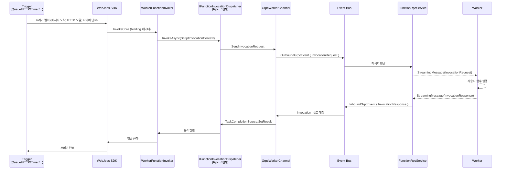
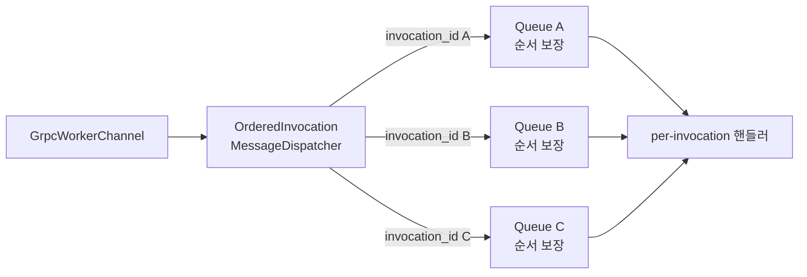

# Dispatcher와 Invocation — 함수 호출이 워커에 도달하기까지

> Azure Functions Deep Dive 시리즈 (4/7)

3화에서 호스트와 워커가 단 하나의 양방향 gRPC 스트림(`EventStream`)으로 `StreamingMessage`를 주고받는다는 것까지 봤습니다. 이제 그 위에서 일어나는 가장 중요한 메시지 종류 — **`InvocationRequest` / `InvocationResponse`** — 의 흐름을 따라갑니다.

질문은 단순합니다.

> 큐에 메시지가 하나 들어오면, 또는 HTTP 요청이 들어오면, 그게 어떻게 워커 프로세스에 있는 사용자 함수까지 닿고, 결과는 어떻게 돌아오는가?

답에는 두 가지 객체가 핵심으로 등장합니다. `IFunctionInvocationDispatcher`와 `WorkerFunctionInvoker`. 이 글은 두 객체의 역할과 그 사이에서 만들어지는 `InvocationRequest`의 일생을 다룹니다.

> 모든 코드 인용은 [`Azure/azure-functions-host` @ `5e59423`](https://github.com/Azure/azure-functions-host/tree/5e59423ba45491041d18224c3e72c168a4a5b7f7) 기준입니다.

---

## 큰 그림 — 트리거에서 워커까지

먼저 한 호출의 전체 경로를 한 화면에 그리고 시작하겠습니다.



이 그림이 4화의 전부입니다. 이제 각 단계를 코드로 봅니다.

---

## 1단계 — 트리거가 발화하면 SDK가 Invoker를 호출한다

Azure Functions 호스트는 **WebJobs SDK 위에 얹혀** 있습니다 (1화에서 본 그대로). 큐에 메시지가 도착하면, HTTP 요청이 들어오면, 타이머가 만료되면 — 모두 WebJobs SDK 안의 트리거 리스너가 감지하고, 그것을 함수 호출로 변환합니다.

WebJobs SDK는 함수마다 **`IFunctionInvoker` 구현체**를 하나씩 갖습니다. 이 인터페이스는 단순합니다. "binding 데이터를 받아서 함수를 한 번 실행하라."

호스트가 워커 프로세스에서 함수를 실행할 때 사용하는 구현체가 [`WorkerFunctionInvoker`](https://github.com/Azure/azure-functions-host/blob/5e59423ba45491041d18224c3e72c168a4a5b7f7/src/WebJobs.Script.Grpc/WorkerFunctionInvoker.cs)입니다. 이 객체의 역할을 한 줄로 줄이면 다음과 같습니다.

> **사용자 코드를 직접 호출하는 대신, `IFunctionInvocationDispatcher`에게 호출을 위임한다.**

즉 in-process 모델(C# in-process)에서는 Invoker가 직접 사용자 메서드를 호출하지만, **out-of-proc 워커 모델**(Node, Python, Java, isolated .NET 등)에서는 Invoker가 호출을 gRPC 너머의 워커에게 던지는 게 일입니다. 그 위임 대상이 Dispatcher입니다.

---

## 2단계 — `IFunctionInvocationDispatcher`라는 추상화

[`IFunctionInvocationDispatcher.cs`](https://github.com/Azure/azure-functions-host/blob/5e59423ba45491041d18224c3e72c168a4a5b7f7/src/WebJobs.Script.Grpc/IFunctionInvocationDispatcher.cs) 인터페이스는 호스트가 "함수 호출을 어딘가에 보내는" 능력을 추상화한 진입점입니다.

같은 디렉토리에는 두 개의 구현체가 있습니다.

| 구현체 | 무엇 |
|---|---|
| **`RpcFunctionInvocationDispatcher`** (별도 파일에 위치) | 모든 비-HTTP 트리거의 기본 경로. gRPC를 통해 워커에 보냄. |
| [`HttpFunctionInvocationDispatcher.cs`](https://github.com/Azure/azure-functions-host/blob/5e59423ba45491041d18224c3e72c168a4a5b7f7/src/WebJobs.Script.Grpc/HttpFunctionInvocationDispatcher.cs) | HTTP 트리거를 위한 **HTTP 프록시 모델**. gRPC가 아니라 HTTP로 워커에 직접 요청. |

[`FunctionInvocationDispatcherFactory.cs`](https://github.com/Azure/azure-functions-host/blob/5e59423ba45491041d18224c3e72c168a4a5b7f7/src/WebJobs.Script.Grpc/FunctionInvocationDispatcherFactory.cs)는 위의 두 구현체 중 어느 것을 쓸지 결정합니다 — 함수의 트리거 타입과 워커 capability에 따라 갈립니다.

핵심 사실 두 가지:

1. **모든 트리거가 같은 `InvocationRequest` 메시지로 평준화됩니다.** 큐 메시지든, 타이머 펄스든, Blob 이벤트든, Dispatcher 입장에서는 똑같이 "한 번 호출하라"는 명령입니다.
2. **HTTP 트리거는 예외적으로 gRPC를 우회할 수 있습니다.** 워커가 "HTTP proxying" capability를 광고하면 호스트는 invocation request 페이로드를 gRPC에 싣지 않고, 대신 워커가 노출한 HTTP 엔드포인트로 직접 프록시합니다. (대용량 HTTP 바디 전송 시 gRPC 페이로드 부담을 피하기 위함)

---

## 3단계 — `ScriptInvocationContext`를 만들고 Dispatcher에 던진다

`WorkerFunctionInvoker`가 Dispatcher에 호출을 넘길 때 들고 가는 객체가 **`ScriptInvocationContext`**입니다. 이 객체에는 다음이 들어 있습니다.

- 함수 메타데이터 (`function_id`, 어느 함수인가)
- 입력 바인딩 데이터 (트리거 페이로드 + 다른 input binding들)
- 트리거 메타데이터 (HTTP 트리거의 헤더, 큐 메시지 ID 등)
- 추적 컨텍스트 (`Activity.Current`로부터 추출한 traceparent, tracestate)
- 재시도 컨텍스트 (현재 시도 횟수)
- 결과를 받을 `TaskCompletionSource<ScriptInvocationResult>`

마지막 항목이 결정적입니다. **Dispatcher는 동기 응답을 기대하지 않습니다.** 호출을 던진 직후 곧바로 `Task`를 반환하고, 워커가 응답을 보내면 그때 비로소 그 `Task`가 완료됩니다. 한 워커에 여러 개의 in-flight 호출이 동시에 있을 수 있고, 그것들은 `invocation_id`로 구별됩니다.

---

## 4단계 — `InvocationRequest` 만들기

3화에서 본 [`FunctionRpc.proto`](https://github.com/Azure/azure-functions-language-worker-protobuf/blob/main/src/proto/FunctionRpc.proto)의 `InvocationRequest`를 다시 봅니다.

```protobuf
message InvocationRequest {
  string invocation_id = 1;
  string function_id = 2;
  repeated ParameterBinding input_data = 3;
  map<string, TypedData> trigger_metadata = 4;
  RpcTraceContext trace_context = 5;
  RetryContext retry_context = 6;
}
```

`ScriptInvocationContext`의 필드를 protobuf 메시지로 변환하는 게 이 단계의 일입니다. 두 가지 비자명한 사실:

**a) 입력 데이터는 `ParameterBinding`의 배열입니다.**

```protobuf
message ParameterBinding {
  string name = 1;
  oneof rpc_data {
    TypedData data = 2;
    RpcSharedMemory rpc_shared_memory = 3;
  }
}
```

각 입력은 이름 + 데이터로 표현되고, 데이터는 직접 `TypedData`(string/json/bytes/http/...)로 들어가거나, 또는 **공유 메모리 영역의 메타데이터**(`RpcSharedMemory`)로만 들어갈 수 있습니다. 후자가 capability 협상의 결과입니다 — "shared memory data transfer"를 양쪽 다 지원하면, 큰 페이로드는 gRPC 메시지에 직접 싣지 않고 공유 메모리에 둔 뒤 그 위치만 알려줍니다. (3화에서 본 capability 교환의 실제 활용)

**b) 트레이스 컨텍스트는 W3C 표준을 그대로 옮깁니다.**

```protobuf
message RpcTraceContext {
  string trace_parent = 1;
  string trace_state = 2;
  map<string, string> attributes = 3;
}
```

호스트의 `Activity.Current?.Id`가 `trace_parent`로, `Activity.Current?.TraceStateString`이 `trace_state`로 들어갑니다. 워커 측 라이브러리(예: Application Insights SDK)는 이걸 받아 자기 컨텍스트를 호스트의 트레이스에 이어 붙입니다. 즉 **분산 트레이싱이 호스트-워커 경계에서 끊어지지 않습니다.**

---

## 5단계 — `GrpcWorkerChannel.SendInvocationRequest`

3화에서 본 [`GrpcWorkerChannel`](https://github.com/Azure/azure-functions-host/blob/5e59423ba45491041d18224c3e72c168a4a5b7f7/src/WebJobs.Script.Grpc/Channel/GrpcWorkerChannel.cs)이 다시 등장합니다. 이번엔 송신 측 역할입니다.

`GrpcWorkerChannel`은 워커 1대를 대표하는 객체입니다. Dispatcher가 "이 워커에 이 호출을 보내라"고 하면, `GrpcWorkerChannel`은 다음 일을 합니다.

1. `ScriptInvocationContext`를 `InvocationRequest`로 변환
2. `StreamingMessage`로 감싼다 (`request_id` = 새로 생성한 GUID, `oneof content` = `invocation_request`)
3. 그 호출의 `TaskCompletionSource`를 **invocation_id 기반 인메모리 사전**에 등록 — 응답이 올 때 짝지을 수 있도록
4. 메시지를 **`OutboundGrpcEvent`** 로 감싸 in-process 이벤트 버스에 발행
5. `FunctionRpcService`가 그 이벤트를 받아 실제 gRPC 스트림에 쓴다

3번이 비동기 응답 매칭의 핵심입니다. `invocation_id` ↔ `TaskCompletionSource`의 사전이 곧 한 워커의 in-flight 호출 목록입니다. 이 사전이 비어 있으면 그 워커는 idle, 가득 차면 busy입니다. (이 정보가 **5화의 워커 동시성 측정**으로 그대로 이어집니다.)

---

## 6단계 — 워커 측에서의 일

워커는 자신의 gRPC 클라이언트로 `EventStream`을 듣고 있다가, `StreamingMessage`의 `oneof content == invocation_request`인 메시지를 발견하면 다음 일을 합니다.

1. `function_id`로 어느 함수인지 식별 (이미 `FunctionLoadRequest`로 로드해 둔 함수)
2. `input_data`를 언어 객체로 변환 (예: Node에서 `TypedData.json` → JS object, `TypedData.bytes` → Buffer)
3. `trigger_metadata`를 사용자 함수의 `context` 객체에 채움
4. 사용자 함수를 호출
5. 반환값을 `TypedData`로 직렬화해 `InvocationResponse.return_value`에 넣음
6. output binding 결과를 `output_data`에 넣음
7. `result.status = Success/Failure/Cancelled` + 예외가 있으면 `result.exception`에 채움
8. `StreamingMessage(invocation_response)`를 호스트로 회신

언어별 워커 구현은 다르지만(Node는 npm `@azure/functions`, Python은 `azure-functions-worker`, Java는 `azure-functions-java-worker` 등), 위의 8단계 자체는 모두 같습니다. **그게 단일 프로토콜의 의미입니다.**

이 글은 호스트 관점이라 워커 측 코드는 짚지 않습니다. 다만 워커 코드도 모두 `Azure/azure-functions-{nodejs|python|java|...}-worker`라는 이름으로 공개돼 있으니, 특정 언어 동작이 궁금하면 해당 저장소를 보면 됩니다.

---

## 7단계 — 응답을 받아 `TaskCompletionSource`를 완료

워커가 보낸 응답은 다음 경로를 거칩니다.

```
gRPC stream
  → FunctionRpcService.EventStream (호스트 측 핸들러)
  → InboundGrpcEvent로 감싸 이벤트 버스에 발행
  → GrpcWorkerChannel이 자기 워커 ID + invocation_response 메시지를 구독
  → invocation_id로 TaskCompletionSource 조회
  → tcs.SetResult(ScriptInvocationResult)
  → Dispatcher가 await하던 Task가 깨어남
  → WorkerFunctionInvoker가 결과를 SDK에 반환
  → SDK가 트리거 처리 완료 (큐 메시지 삭제, HTTP 응답 송신 등)
```

이게 한 호출의 전체 일생입니다.

---

## 동시 호출 — 한 워커가 여러 개를 동시에 처리한다

여기서 중요한 사실 하나. **한 워커 프로세스는 동시에 여러 개의 invocation을 처리할 수 있습니다.**

위의 5단계에서 본 `invocation_id ↔ TaskCompletionSource` 사전이 그걸 가능하게 합니다. 호스트는 워커가 한 번에 몇 개를 처리할 수 있는지(`maxConcurrentRequests` 같은 설정)에 따라 동시 호출을 보냅니다.

하지만 **응답 메시지가 어떤 순서로 돌아올지는 보장되지 않습니다.** 호출 A를 먼저 보내고 B를 나중에 보냈더라도, B가 더 빨리 끝나면 응답 B가 먼저 옵니다. 그건 사전 매칭으로 자연스럽게 처리됩니다.

다만 **logging이나 같은 함수에 대한 일부 메시지 순서**는 지켜져야 할 때가 있습니다. 그래서 [`Channel/OrderedInvocationMessageDispatcher.cs`](https://github.com/Azure/azure-functions-host/blob/5e59423ba45491041d18224c3e72c168a4a5b7f7/src/WebJobs.Script.Grpc/Channel/OrderedInvocationMessageDispatcher.cs)가 존재합니다 — invocation 단위로 메시지 순서를 보장하면서도 invocation 사이의 병렬성은 유지합니다.



같은 `invocation_id`의 메시지들은 도착 순서대로 처리되지만, 서로 다른 `invocation_id`들은 병렬로 처리됩니다.

---

## 워커 동시성 — 호스트가 워커를 얼마나 바쁘게 만들지

[`WorkerConcurrencyManager.cs`](https://github.com/Azure/azure-functions-host/blob/5e59423ba45491041d18224c3e72c168a4a5b7f7/src/WebJobs.Script.Grpc/WorkerConcurrencyManager.cs)는 한 워커가 동시에 받는 invocation 수를 모니터링하고, 필요하면 **워커 추가 생성**을 요청합니다. 즉 같은 함수 앱 안에서도 워커가 여러 개 떠 있을 수 있습니다 — 한 워커 인스턴스 안에 여러 개의 워커 프로세스.

[`WorkerChannelThrottleProvider.cs`](https://github.com/Azure/azure-functions-host/blob/5e59423ba45491041d18224c3e72c168a4a5b7f7/src/WebJobs.Script.Grpc/WorkerChannelThrottleProvider.cs)는 그 반대 방향 — 워커가 너무 바쁘면 호스트 측에서 추가 호출을 throttling합니다. 이 두 객체가 **인스턴스 내부의 호출 처리 능력**을 동적으로 조정합니다.

여기서 중요한 구분: **이건 인스턴스 내부의 워커 프로세스 수 조정**이지, **인스턴스 자체를 늘리는 것**(스케일아웃)이 아닙니다. 후자는 5화에서 다룹니다.

---

## HTTP 프록시 — gRPC를 우회하는 길

[`HttpFunctionInvocationDispatcher.cs`](https://github.com/Azure/azure-functions-host/blob/5e59423ba45491041d18224c3e72c168a4a5b7f7/src/WebJobs.Script.Grpc/HttpFunctionInvocationDispatcher.cs)는 별도의 길입니다. HTTP 트리거 함수에서 워커가 "HTTP proxying" capability를 광고하면, 호스트는 invocation request의 HTTP 본문을 gRPC `TypedData.http`에 직렬화하지 않습니다. 대신:

1. 워커가 자기 프로세스 안에 HTTP 서버를 추가로 띄움
2. 호스트는 워커가 알려준 HTTP 엔드포인트로 **원본 HTTP 요청을 거의 그대로 프록시**
3. 워커는 사용자 함수에 HTTP 요청을 그대로 넘기고, 응답을 호스트에 HTTP 응답으로 돌려보냄

이 길의 장점은 **큰 HTTP 본문(파일 업로드 등)을 protobuf로 직렬화하지 않는다**는 것입니다. 단점은 워커가 자체 HTTP 서버를 들고 있어야 한다는 것이고, 이게 isolated worker 모델에서 일반화되어 있습니다.

호출 흐름은 gRPC 경로와 거의 같지만, 메시지 페이로드 운반만 HTTP로 바뀐 것입니다.

---

## 한 호출의 모든 것을 한 표에

| 단계 | 객체 | 역할 |
|---|---|---|
| 1 | WebJobs SDK 트리거 리스너 | 트리거 발화 감지 |
| 2 | `WorkerFunctionInvoker` | SDK가 사용자 코드를 호출하려 할 때 위임받음 |
| 3 | `IFunctionInvocationDispatcher` 구현체 | 호출을 받아 실제 운반 |
| 4 | `InvocationRequest` 빌더 | `ScriptInvocationContext`를 protobuf로 변환 |
| 5 | `GrpcWorkerChannel` | 워커 1대에 보냄, 응답 매칭용 사전 등록 |
| 6 | `FunctionRpcService` (gRPC) | OutboundGrpcEvent를 실제 스트림에 쓴다 |
| 7 | Worker process | 사용자 함수 실행, `InvocationResponse` 회신 |
| 8 | `FunctionRpcService` (gRPC) | 인바운드 메시지를 InboundGrpcEvent로 |
| 9 | `OrderedInvocationMessageDispatcher` | invocation별 메시지 순서 보장 |
| 10 | `GrpcWorkerChannel` | invocation_id로 TCS 매칭, 결과 완료 |
| 11 | Dispatcher → Invoker → SDK | 결과 전파 |

---

## 다음 화에서

이번 글까지 읽으면, 한 호출이 호스트를 통해 워커에 도달하고 응답이 돌아오는 전체 경로가 명확해졌을 겁니다. 5화는 한 단계 더 위로 올라갑니다.

> 그래서 워커 인스턴스 자체는 어떻게 늘어나는가? 큐 길이가 늘면 누가 그걸 보고, 누가 "워커 1대 더 띄워야겠다"고 결정하는가?

그게 5화의 주제 — `IScaleMonitor`, `ITargetScaler`, 그리고 Flex Consumption의 per-function scaling입니다.

---

## 시리즈 목차

| # | 제목 |
|---|---|
| 1 | [호스트 부트스트랩](./01-host-bootstrap.md) |
| 2 | [워커 프로세스](./02-worker-process.md) |
| 3 | [gRPC 이벤트 스트림](./03-grpc-event-stream.md) |
| 4 | **Dispatcher와 Invocation — 함수 호출이 워커에 도달하기까지** ← 현재 글 |
| 5 | [스케일링 내부 — 인스턴스는 어떻게 늘어나는가](./05-scaling-internals.md) |
| 6 | [콜드 스타트와 Placeholder](./06-cold-start-placeholder.md) |
| 7 | [학술적 관점](./07-academic-perspective.md) |

---

## References

**호스트 코드 (commit `5e59423`)**
- [`IFunctionInvocationDispatcher.cs`](https://github.com/Azure/azure-functions-host/blob/5e59423ba45491041d18224c3e72c168a4a5b7f7/src/WebJobs.Script.Grpc/IFunctionInvocationDispatcher.cs)
- [`IFunctionInvocationDispatcherFactory.cs`](https://github.com/Azure/azure-functions-host/blob/5e59423ba45491041d18224c3e72c168a4a5b7f7/src/WebJobs.Script.Grpc/IFunctionInvocationDispatcherFactory.cs)
- [`FunctionInvocationDispatcherFactory.cs`](https://github.com/Azure/azure-functions-host/blob/5e59423ba45491041d18224c3e72c168a4a5b7f7/src/WebJobs.Script.Grpc/FunctionInvocationDispatcherFactory.cs)
- [`HttpFunctionInvocationDispatcher.cs`](https://github.com/Azure/azure-functions-host/blob/5e59423ba45491041d18224c3e72c168a4a5b7f7/src/WebJobs.Script.Grpc/HttpFunctionInvocationDispatcher.cs)
- [`WorkerFunctionInvoker.cs`](https://github.com/Azure/azure-functions-host/blob/5e59423ba45491041d18224c3e72c168a4a5b7f7/src/WebJobs.Script.Grpc/WorkerFunctionInvoker.cs)
- [`WorkerConcurrencyManager.cs`](https://github.com/Azure/azure-functions-host/blob/5e59423ba45491041d18224c3e72c168a4a5b7f7/src/WebJobs.Script.Grpc/WorkerConcurrencyManager.cs)
- [`WorkerChannelThrottleProvider.cs`](https://github.com/Azure/azure-functions-host/blob/5e59423ba45491041d18224c3e72c168a4a5b7f7/src/WebJobs.Script.Grpc/WorkerChannelThrottleProvider.cs)
- [`Channel/GrpcWorkerChannel.cs`](https://github.com/Azure/azure-functions-host/blob/5e59423ba45491041d18224c3e72c168a4a5b7f7/src/WebJobs.Script.Grpc/Channel/GrpcWorkerChannel.cs)
- [`Channel/OrderedInvocationMessageDispatcher.cs`](https://github.com/Azure/azure-functions-host/blob/5e59423ba45491041d18224c3e72c168a4a5b7f7/src/WebJobs.Script.Grpc/Channel/OrderedInvocationMessageDispatcher.cs)

**프로토콜**
- [`FunctionRpc.proto`](https://github.com/Azure/azure-functions-language-worker-protobuf/blob/main/src/proto/FunctionRpc.proto) — `InvocationRequest`, `InvocationResponse`, `ParameterBinding`, `RpcTraceContext`
