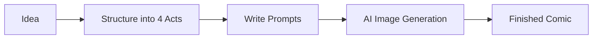

# AI 4-Panel Comic Creation 101 (1/10): Into the World of 4-Panel Comics — Starting Your Story in Four Frames

Ever wanted to create fun visual content for social media but gave up because you can't draw? AI now handles the artwork for you. This is the first article in the AI 4-Panel Comic Creation 101 series.

---



*4-panel comic production flow — five steps from idea to completion*

## Questions to Keep in Mind

- Why exactly four panels? Would three or five work just as well?
- Can someone with zero drawing ability really make comics?
- If you just tell AI "draw me a funny comic," will you get good results?

---

## What Is a 4-Panel Comic?

A 4-panel comic (四コマ漫画, yonkoma) is a comic format that tells a complete story in exactly four panels. Originating in Japan, this format has spread worldwide — from newspaper strips to webcomics.

The key principle is **completing a story within a constrained space**. You don't need dozens of pages like a long-form manga. Four panels deliver humor or emotion to readers efficiently.


*Traditional vertical 4-panel layout — panels flow from top to bottom*

### Why 4-Panel Comics Work

| Advantage | Description |
|-----------|-------------|
| Quick to produce | Only four scenes needed |
| Highly shareable | Perfect size and consumption time for social media |
| Low barrier to entry | No complex backgrounds or action sequences required |
| Immediate reaction | Readers laugh or relate instantly |


*Modern 2×2 grid layout — colorful digital art style*

---

## Ki-Seung-Jeon-Gyeol: The Grammar of Four Panels

The reason 4-panel comics use exactly four panels is their perfect alignment with **Ki-Seung-Jeon-Gyeol** (起承轉結) — the traditional East Asian narrative structure.

| Panel | Name | Role | Example |
|-------|------|------|---------|
| 1 | Ki (起) — Setup | Establish the situation, introduce characters | "Starting my diet today!" |
| 2 | Seung (承) — Development | Progress the situation, build expectation | Carefully preparing a salad |
| 3 | Jeon (轉) — Twist | Reversal, subvert expectations | Discovers fried chicken in the fridge |
| 4 | Gyeol (結) — Conclusion | Punchline, emotional peak | Eating chicken: "Starting tomorrow..." |


*The four stages — each has a clear role in the narrative*

Understanding this structure is the first and most important step in 4-panel comic creation. Before asking AI for images, you need to design what story to tell across your four panels.

### Why Not Three or Five Panels?

It's not impossible. 3-panel comics (setup-delivery structure) and 6+ panel formats exist. But four panels are special:

- **3 panels**: No room for a twist (jeon) before the conclusion — limits surprise
- **5+ panels**: Reader attention disperses, harder to share on social media
- **4 panels**: The setup→development→twist→conclusion rhythm matches human expectation patterns precisely

---

## How AI Changes Comic Creation

Traditionally, creating 4-panel comics required:

1. Drawing skills (characters, backgrounds, expressions)
2. Tool proficiency (pen, tablet)
3. Coloring and finishing techniques

AI image generation replaces all three with **prompt writing ability**. Instead of "drawing" scenes, you "describe" them.

### The Core Tool

This series primarily uses **ChatGPT's image generation** (DALL-E based). You input text prompts, and AI generates images.

```text
Example prompt:
"A 4-panel comic strip in cute chibi style. Panel 1: A cat sitting 
in front of an empty food bowl, looking sad. Panel 2: The cat meows 
loudly at its owner. Panel 3: The owner fills the bowl with food. 
Panel 4: The cat ignores the food and walks away."
```

A single prompt can produce a complete 4-panel comic. But getting good results requires systematic prompt writing — that's what this series teaches.

---

## Two Approaches to AI Comic Creation

There are two main approaches to creating 4-panel comics with AI:

### Approach 1: Generate All 4 Panels at Once

```text
"A 4-panel comic strip showing [entire story]"
```

- Pros: Fast and convenient
- Cons: Limited control over individual panels, inconsistent characters

### Approach 2: Generate Each Panel Individually, Then Combine

```text
Panel 1: "[detailed description of panel 1]"
Panel 2: "[detailed description of panel 2]"
Panel 3: "[detailed description of panel 3]"
Panel 4: "[detailed description of panel 4]"
```

- Pros: Precise control over each panel, higher quality
- Cons: More time-consuming, extra effort for character consistency

This series covers both approaches and helps you choose the right one for each situation.

---

## Your First Attempt: Making a Simple 4-Panel Comic

Let's try it. Enter this prompt in ChatGPT:

```text
Create a 4-panel comic strip in a cute, simple cartoon style.
The story: A person tries to take a selfie with their dog.
Panel 1: Person holds up phone, smiling. Dog sits nicely.
Panel 2: Person says "Stay!" and positions the camera.
Panel 3: Right as they click, the dog jumps up excitedly.
Panel 4: The resulting selfie shows a blurry dog licking the person's face.
Arrange panels in a 2x2 grid with thin black borders between panels.
```

This prompt contains all the essential elements for a 4-panel comic:

1. **Style specification**: "cute, simple cartoon style"
2. **Story summary**: One-line context for the whole story
3. **Per-panel descriptions**: Specific actions in each frame
4. **Layout specification**: "2x2 grid with thin black borders"

---

## Basic Principles for Good Results

Don't expect perfection on your first try. Here are common issues and solutions to keep in mind:

### Common Problems

| Problem | Cause | Solution Direction |
|---------|-------|-------------------|
| Wrong number of panels | Insufficient layout specification | Explicitly state "exactly 4 panels in 2x2 grid" |
| Character looks different in each panel | Lack of appearance description | Add detailed character description |
| Story unclear | Vague panel descriptions | Specify actions concretely |
| Text garbled | AI text generation limitations | Generate without text, add separately |

### Where This Series Takes You

Through this series, you'll learn:

- **Episode 2**: How to structure good stories into four acts
- **Episode 3**: Prompt techniques for consistent character design
- **Episode 4**: How to specify composition and backgrounds effectively
- **Episode 5**: A complete hands-on exercise from start to finish

---

## What You'll Create in This Series

By the end of these 10 episodes, you'll be able to:

1. Turn everyday moments into 4-panel stories
2. Generate consistent characters with AI
3. Control scenes, composition, and lighting through prompts
4. Direct emotional expressions and twist effects
5. Place dialogue and sound effects appropriately
6. Produce publication-ready comics for social media

No prior drawing experience needed. All you need is **an idea** and **the ability to express that idea in words** — prompt engineering.

---

## Answering the Opening Questions

**Why exactly four panels?**

Because they align perfectly with the Ki-Seung-Jeon-Gyeol (setup-development-twist-conclusion) structure. The rhythm of setup→development→twist→conclusion matches human expectation patterns, delivering maximum story in minimum space.

**Can someone with zero drawing ability really make comics?**

Yes. AI image generation tools replace drawing ability with prompt writing ability. If you can describe a scene in text, you can make comics.

**If you just tell AI "draw me a funny comic," will you get good results?**

Almost never. You need to specify style, layout, and per-panel content concretely to approach your desired result. This series teaches that method step by step.

---

<!-- toc:begin -->
- **Into the World of 4-Panel Comics — Starting Your Story in Four Frames (current)**
- Planting Story Seeds — Turning Everyday Moments into 4-Panel Stories (upcoming)
- Breathing Life into Characters — Designing Your Protagonist with AI (upcoming)
- Painting Scenes with Words — Background and Composition Prompts (upcoming)
- Your First 4-Panel Comic — From Idea to Finished Strip (upcoming)
- The Art of Emotion — Expressions, Exaggeration, and Twists (upcoming)
- Dialogue and Effects — Speech Bubbles and Text Techniques (upcoming)
- Expanding into a Series — Serialization and World-Building (upcoming)
- Genre Variations — Comedy, Slice-of-Life, Drama, and Horror (upcoming)
- Production Workflow — From Idea to Social Media Publication (upcoming)
<!-- toc:end -->

## References

- [Yonkoma — Wikipedia](https://en.wikipedia.org/wiki/Yonkoma)
- [Ki-Seung-Jeon-Gyeol Narrative Structure](https://en.wikipedia.org/wiki/Kish%C5%8Dtenketsu)
- [ChatGPT Image Generation](https://openai.com/index/dall-e-3/)

Tags: AI, ChatGPT, 4-Panel Comics, Prompt Engineering, Image Generation
