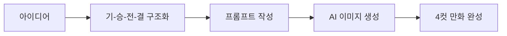

# AI 4컷 만화 만들기 (1/10): 4컷 만화의 세계로 — AI와 함께 시작하는 네 칸의 이야기

SNS에 올릴 재미있는 콘텐츠를 만들고 싶은데 그림 실력이 없어서 포기한 적 있나요? 이제 AI가 그림을 대신 그려줍니다. 이 글은 AI 4컷 만화 만들기 시리즈의 첫 번째 글입니다.

---



*4컷 만화 제작 흐름 — 아이디어에서 완성까지 다섯 단계*

## 먼저 던지는 질문

- 4컷 만화는 왜 딱 네 칸일까요? 세 칸이나 다섯 칸이면 안 되는 걸까요?
- 그림을 전혀 못 그리는 사람도 정말 만화를 만들 수 있을까요?
- AI에게 "재미있는 만화 그려줘"라고만 하면 좋은 결과가 나올까요?

---

## 4컷 만화란 무엇인가

4컷 만화(四コマ漫画, 4-koma)는 정확히 네 개의 칸으로 하나의 이야기를 완결짓는 만화 형식입니다. 일본에서 시작되어 전 세계로 퍼진 이 형식은 신문 연재부터 웹툰까지 폭넓게 사용됩니다.

핵심은 **제한된 공간 안에서 이야기를 완결짓는 것**입니다. 장편 만화처럼 수십 페이지가 필요하지 않고, 네 칸만으로 독자에게 웃음이나 감동을 전달합니다.


*전통적인 세로 배치 4컷 만화 — 네 칸이 위에서 아래로 흐른다*

### 4컷 만화의 매력

| 장점 | 설명 |
|------|------|
| 짧은 제작 시간 | 네 장면만 만들면 완성 |
| 높은 공유성 | SNS에 딱 맞는 크기와 소비 시간 |
| 낮은 진입장벽 | 복잡한 배경이나 액션 장면 불필요 |
| 즉각적 반응 | 독자가 바로 웃거나 공감 |


*현대적인 2×2 그리드 배치 — 컬러풀한 디지털 아트 스타일*

---

## 기-승-전-결: 네 칸의 문법

4컷 만화가 딱 네 칸인 이유는 동양 문학의 전통적 서사 구조인 **기승전결**(起承轉結)과 완벽하게 맞아떨어지기 때문입니다.

| 칸 | 이름 | 역할 | 예시 |
|----|------|------|------|
| 1칸 | 기(起) — 시작 | 상황 설정, 캐릭터 소개 | "오늘 다이어트 시작!" |
| 2칸 | 승(承) — 발전 | 상황 전개, 기대감 형성 | 샐러드를 정성껏 준비하는 모습 |
| 3칸 | 전(轉) — 전환 | 반전, 예상을 뒤집는 사건 | 냉장고에서 치킨 발견 |
| 4칸 | 결(結) — 결말 | 펀치라인, 감정의 정점 | 치킨을 먹으며 "내일부터..." |


*기승전결 4단계 — 각 단계의 역할이 명확하다*

이 구조를 이해하는 것이 4컷 만화 제작의 첫 번째이자 가장 중요한 단계입니다. AI에게 이미지를 요청하기 전에, 네 칸에 어떤 이야기를 담을지 먼저 설계해야 합니다.

### 왜 세 칸이나 다섯 칸은 안 될까?

불가능한 건 아닙니다. 3컷 만화(setup-delivery 구조)나 6컷 이상의 형식도 존재합니다. 하지만 4컷이 특별한 이유가 있습니다:

- **3칸**: 전환(전) 없이 바로 결말로 가므로 반전의 여유가 없음
- **5칸 이상**: 독자의 집중력이 분산되고 SNS 공유에 불리
- **4칸**: 설정→발전→반전→결말의 리듬이 인간의 기대 패턴과 정확히 일치

---

## 4컷 만화의 패널 레이아웃 패턴

실제 4컷 만화에서 자주 쓰이는 레이아웃 패턴들입니다.

### 패턴 1: 세로 배열 (전통 방식)

```
[1칸]
[2칸]
[3칸]
[4칸]
```

일본 신문 연재 방식. 세로로 스크롤하는 모바일에 적합합니다.

### 패턴 2: 2×2 그리드 (현대 방식)

```
[1칸] [2칸]
[3칸] [4칸]
```

SNS 이미지로 올리기 편한 정사각형에 가까운 형태. 좌→우, 위→아래 순서로 읽습니다.

### 패턴 3: 1-1-2 레이아웃

```
[1칸] [2칸]
  [3칸: 가로 전체]
      [4칸]
```

3번째 칸에 드라마틱한 장면을 넣고 싶을 때 사용. 공간의 크기로 장면의 중요도를 표현합니다.

| 레이아웃 | 특징 | 적합한 상황 |
|---------|------|-----------|
| 세로 배열 | 읽기 흐름이 단순 | 스토리 중심 |
| 2×2 그리드 | SNS 최적화 | 공유용 콘텐츠 |
| 1-1-2 | 드라마틱 강조 | 반전이 강한 내용 |

---

## 기승전결 실전 예시 5가지

### 예시 1: 다이어트 (웃음 코드)

| 칸 | 내용 |
|----|------|
| 1칸 (기) | 주인공이 저울에 올라서며 "오늘부터 다이어트!" |
| 2칸 (승) | 샐러드를 열심히 만들고 있음 |
| 3칸 (전) | 냉장고를 열었더니 치킨이 보임 |
| 4칸 (결) | 치킨을 먹으며 "내일부터 진짜로..." |

### 예시 2: 공부 (공감 코드)

| 칸 | 내용 |
|----|------|
| 1칸 (기) | 책상 앞에 앉아 "오늘 5시간 공부할 거야!" |
| 2칸 (승) | 책을 펴고 형광펜을 꺼내는 모습 |
| 3칸 (전) | 어느새 유튜브를 보고 있음 |
| 4칸 (결) | 알람 소리에 깨어보니 새벽 2시 |

### 예시 3: 반려동물 (감동 코드)

| 칸 | 내용 |
|----|------|
| 1칸 (기) | 주인이 외출 준비를 함 |
| 2칸 (승) | 강아지가 슬픈 눈으로 따라다님 |
| 3칸 (전) | "금방 올게" 하고 문을 닫음 |
| 4칸 (결) | 5분 만에 돌아왔는데 강아지가 너무 좋아함 |

### 예시 4: 기술 (풍자 코드)

| 칸 | 내용 |
|----|------|
| 1칸 (기) | 스마트폰 배터리가 20% |
| 2칸 (승) | 황급히 충전기를 찾아다님 |
| 3칸 (전) | 충전기를 꽂았더니 배터리 19% |
| 4칸 (결) | 충전기 뽑고 10%까지 떨어진 후 다시 꽂음 |

### 예시 5: 계절 (서정적 코드)

| 칸 | 내용 |
|----|------|
| 1칸 (기) | 벚꽃 아래 걷는 사람들 |
| 2칸 (승) | 사진을 찍으려고 폰을 꺼냄 |
| 3칸 (전) | 바람이 불어 꽃잎이 떨어짐 |
| 4칸 (결) | 꽃잎에 뒤덮인 채 웃고 있는 사람 |

---

## AI가 바꾸는 만화 제작

전통적으로 4컷 만화를 만들려면 다음 능력이 필요했습니다:

1. 드로잉 스킬 (캐릭터, 배경, 표정)
2. 펜/태블릿 도구 숙련
3. 채색 및 마무리 기술

AI 이미지 생성은 이 세 가지를 모두 **프롬프트 작성 능력**으로 대체합니다. 그림을 "그리는" 대신 "설명하는" 것만으로 만화를 만들 수 있습니다.

### AI 만화 제작의 핵심 도구

이 시리즈에서는 **ChatGPT의 이미지 생성 기능**(DALL-E 기반)을 주로 사용합니다. 프롬프트를 텍스트로 입력하면 AI가 이미지를 생성합니다.

```text
프롬프트 예시:
"A 4-panel comic strip in cute chibi style. Panel 1: A cat sitting
in front of an empty food bowl, looking sad. Panel 2: The cat meows
loudly at its owner. Panel 3: The owner fills the bowl with food.
Panel 4: The cat ignores the food and walks away."
```

위 프롬프트 하나로 완성된 4컷 만화를 얻을 수 있습니다. 하지만 좋은 결과를 얻으려면 프롬프트를 체계적으로 작성해야 합니다 — 그것이 이 시리즈에서 배울 내용입니다.

---

## 4컷 만화 제작의 두 가지 접근법

AI로 4컷 만화를 만드는 방법은 크게 두 가지입니다:

### 접근법 1: 한 번에 4컷 전체 생성

```text
"A 4-panel comic strip showing [전체 스토리]"
```

- 장점: 빠르고 간편
- 단점: 각 칸의 세밀한 제어 어려움, 캐릭터 일관성 떨어짐

### 접근법 2: 컷별로 개별 생성 후 조합

```text
Panel 1: "[1컷 상세 설명]"
Panel 2: "[2컷 상세 설명]"
Panel 3: "[3컷 상세 설명]"
Panel 4: "[4컷 상세 설명]"
```

- 장점: 각 칸을 정밀하게 제어, 높은 품질
- 단점: 시간이 더 걸림, 캐릭터 일관성 유지에 추가 노력 필요

이 시리즈에서는 두 가지 접근법을 모두 다루며, 상황에 맞는 선택법을 안내합니다.

---

## 첫 번째 시도: 간단한 4컷 만화 만들어보기

직접 해봅시다. ChatGPT에 다음 프롬프트를 입력해보세요:

```text
Create a 4-panel comic strip in a cute, simple cartoon style.
The story: A person tries to take a selfie with their dog.
Panel 1: Person holds up phone, smiling. Dog sits nicely.
Panel 2: Person says "Stay!" and positions the camera.
Panel 3: Right as they click, the dog jumps up excitedly.
Panel 4: The resulting selfie shows a blurry dog licking the person's face.
Arrange panels in a 2x2 grid with thin black borders between panels.
```

이 프롬프트에는 4컷 만화를 위한 핵심 요소가 모두 들어있습니다:

1. **스타일 지정**: "cute, simple cartoon style"
2. **스토리 요약**: 전체 맥락을 한 줄로 설명
3. **컷별 상세 설명**: 각 칸에 무엇이 일어나는지 구체적으로
4. **레이아웃 지정**: "2x2 grid with thin black borders"

---

## 좋은 결과를 위한 기본 원칙

첫 시도에서 완벽한 결과를 기대하기는 어렵습니다. AI 이미지 생성에서 자주 발생하는 문제와 해결 방향을 미리 알아둡시다.

### 흔한 문제들

| 문제 | 원인 | 해결 방향 |
|------|------|----------|
| 칸 수가 맞지 않음 | 레이아웃 지정 미흡 | "exactly 4 panels in 2x2 grid" 명시 |
| 캐릭터가 칸마다 다르게 생김 | 외형 설명 부족 | 상세한 캐릭터 설명 추가 |
| 스토리가 불명확 | 각 칸 설명 모호 | 액션을 구체적으로 지정 |
| 글자가 깨짐 | AI 텍스트 생성 한계 | 텍스트 없이 생성 후 별도 추가 |
| 스타일이 통일되지 않음 | 스타일 키워드 미통일 | 하나의 스타일 키워드 유지 |

---

## 스토리텔링 기법: 반전을 만드는 법

4컷 만화에서 3칸의 전환(전)은 가장 중요한 요소입니다. 반전을 만드는 기법들입니다.

### 기법 1: 예상의 역이용

독자가 당연히 일어날 것이라고 예상하는 결과의 반대를 보여줍니다.

예) 열심히 준비하다가 → 막상 되면 안 되거나 / 포기하려다가 → 갑자기 성공

### 기법 2: 규모의 충격

큰 것을 기대했더니 아주 작거나, 작은 것을 기대했더니 너무 큰 결과가 나옵니다.

예) 거대한 선물 상자 → 사탕 하나 / 작은 씨앗 → 집보다 큰 나무

### 기법 3: 시점의 전환

같은 상황을 다른 입장에서 보여줍니다.

예) 주인이 걱정하며 집을 나섰는데 → 강아지 시점: 5분 만에 돌아온 주인에게 환호

### 기법 4: 무관심의 반전

기대했던 반응이 나오지 않습니다.

예) 감동적인 이벤트를 준비했는데 → 상대방이 다른 것에 더 감동

---

## 캐릭터 설계 기초

일관된 4컷 만화를 위해 캐릭터를 미리 설계해야 합니다. (자세한 내용은 3편에서 다룹니다)

**기본 캐릭터 정의서 구조**:

```
캐릭터 이름: [이름]
외형: [헤어스타일], [눈 모양], [체형]
의상: [특징적인 옷]
성격: [성격 특성 2-3가지]
특기: [이 캐릭터만의 행동 패턴]
```

**예시 캐릭터 - 직장인 민준**:
```
캐릭터 이름: 민준
외형: 짧은 검은 머리, 동그란 안경, 평범한 체형
의상: 흰 와이셔츠 + 넥타이 (항상)
성격: 성실한 척 하지만 게으름, 커피 없이 못 삶
특기: 마감 직전에 급하게 일을 끝냄
```

이렇게 캐릭터를 미리 정의해두면, AI에게 이미지를 요청할 때 일관된 설명을 줄 수 있습니다.

---

## 만화 스타일 선택 가이드

4컷 만화의 스타일에 따라 느낌이 크게 달라집니다.

| 스타일 | 키워드 | 어울리는 내용 |
|--------|--------|-------------|
| 귀여운 만화 | cute cartoon, chibi style | 일상, 동물, 어린이 |
| 웹툰 | webtoon style, Korean manhwa | 연애, 직장, 청춘 |
| 클래식 만화 | classic manga, black and white | 액션, 드라마 |
| 수채화 만화 | watercolor comic, soft colors | 감성, 서정적 |
| 미국 만화 | American comic style | 영웅, 코미디 |

---

## 이 시리즈에서 만들 것들

10편의 시리즈를 마치면 다음을 할 수 있게 됩니다:

1. 일상의 소재로 4컷 스토리를 구성
2. 나만의 캐릭터를 AI로 일관되게 생성
3. 장면, 구도, 조명을 프롬프트로 제어
4. 감정 표현과 반전 효과를 연출
5. 대사와 효과음을 적절히 배치
6. SNS에 바로 올릴 수 있는 완성본 제작

그림을 한 번도 그려본 적 없어도 괜찮습니다. 필요한 것은 **아이디어**와 **그 아이디어를 말로 표현하는 능력** — 즉 프롬프트 엔지니어링뿐입니다.

---

## 처음 질문으로 돌아가기

**4컷 만화는 왜 딱 네 칸일까요?**

기-승-전-결의 4단계 서사 구조와 정확히 일치하기 때문입니다. 설정→발전→반전→결말의 리듬이 독자의 기대 패턴에 맞아, 최소한의 칸으로 최대한의 이야기를 전달합니다.

**그림을 전혀 못 그리는 사람도 정말 만화를 만들 수 있을까요?**

네. AI 이미지 생성 도구는 그리기 능력을 프롬프트 작성 능력으로 대체합니다. 원하는 장면을 텍스트로 설명할 수 있다면, 만화를 만들 수 있습니다.

**AI에게 "재미있는 만화 그려줘"라고만 하면 좋은 결과가 나올까요?**

거의 나오지 않습니다. 스타일, 레이아웃, 각 칸의 내용을 구체적으로 지정해야 원하는 결과에 가까워집니다. 이 시리즈에서 그 방법을 단계별로 배웁니다.

---

<!-- toc:begin -->
- **4컷 만화의 세계로 — AI와 함께 시작하는 네 칸의 이야기 (현재 글)**
- 이야기 씨앗 심기 — 일상에서 4컷 스토리 만들기 (예정)
- 캐릭터에 생명을 — AI로 나만의 주인공 만들기 (예정)
- 장면을 그리는 말 — 배경과 구도 프롬프트 (예정)
- 첫 번째 4컷 만들기 — 아이디어에서 완성까지 (예정)
- 감정과 표현의 기술 — 표정, 과장, 반전 (예정)
- 대사와 효과 — 말풍선과 텍스트 연출 (예정)
- 시리즈로 확장하기 — 연재물과 세계관 구축 (예정)
- 장르별 4컷 만화 — 개그, 일상, 감동, 공포 (예정)
- 실전 워크플로우 — 아이디어에서 SNS 발행까지 (예정)
<!-- toc:end -->

## 참고 자료

- [4コマ漫画 — Wikipedia](https://en.wikipedia.org/wiki/Yonkoma)
- [기승전결 서사 구조](https://ko.wikipedia.org/wiki/%EA%B8%B0%EC%8A%B9%EC%A0%84%EA%B2%B0)
- [ChatGPT Image Generation](https://openai.com/index/dall-e-3/)

Tags: AI, ChatGPT, 4컷 만화, 프롬프트 엔지니어링, 이미지 생성
