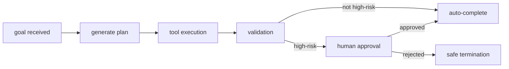

# AI Agent 101 (4/10): Agent Workflow Design

Being able to call tools does not make a good agent. Real automation requires designing the order of information gathering, when to plan, where to validate, and how to recover from failure.

What you need is a workflow—not a simple step list but the agent's control flow. Same tool set, different workflow design → dramatically different cost, latency, and success rates.

This is the 4th post in the AI Agent 101 series. We cover major workflow patterns, when each fits, state management, and the operational tradeoffs of pattern selection.

In production the key tension is between "how much to plan upfront" and "how adaptively to respond to intermediate results." Too reactive means excessive tool calls; too rigid means brittleness to mid-execution surprises.


*Draw the control flow before you tune the prompt*
> A workflow is not just a name for a reasoning style; it is the control structure that decides action order and stopping conditions.

## Questions to Keep in Mind

- What flow should be drawn before prompt tuning when you choose an agent workflow?
- Which failure conditions make ReAct, Plan-and-Execute, or Reflexion a better fit?
- Where should state and validation live inside a workflow if you want it to be operable?

## Why This Matters

Workflow determines cost structure. The same request processed under different patterns has different LLM call counts, tool invocations, and average response times. Workflow is therefore not an implementation detail—it is product unit economics.

Workflow also shapes failure modes. ReAct is flexible but weak on long-range planning; Plan-and-Execute gives clarity but crumbles when the initial plan is wrong; Reflexion adapts but pays heavy retry costs. Without knowing per-pattern tradeoffs, you misattribute problems to model performance.

Above all, workflow is the shared foundation for memory, reliability, and evaluation. You need to know which steps exist and where state is saved to add checkpoints, evaluate trajectories, and decide where to resume after failure.

## Core Concept

Workflow patterns are **control flow patterns**, not personality descriptions of the model. Whether the agent plans first, adapts to observations, or runs a reflection loop after failure determines entirely different execution paths for the same task.

This matters for debugging: when the answer is wrong, you must separate whether reasoning was weak, planning was incorrect, or the reflection criterion was poor. That separation prevents defaulting to "use a bigger model."

In practice, teams rarely commit to one pattern dogmatically—they mix patterns by request type. But before mixing, you need to know exactly what each pattern optimizes.

> Good workflow design does not make the agent more complex; it picks which control flow is most predictable for which class of task.

## Core Patterns

### ReAct Adapts Immediately to Observations

```python
from typing import Dict, Any, List
import openai

def react_agent(user_query: str, tools: List[Dict], max_steps: int = 10) -> str:
    """ReAct pattern: Thought → Action → Observation loop"""

    messages = [
        {"role": "system", "content": """You are an agent that solves problems step-by-step.\n\n        At each step:\n        1. Thought: Think about what to do next\n        2. Action: Use tools to gather information\n        3. Observation: Observe results and plan next step\n\n        When you reach the goal, provide an answer starting with "Final Answer:"."""},
        {"role": "user", "content": user_query}
    ]

    for step in range(max_steps):
        response = openai.chat.completions.create(
            model="gpt-4.1",
            messages=messages,
            tools=tools,
            tool_choice="auto"
        )

        assistant_message = response.choices[0].message

        if assistant_message.content and "Final Answer:" in assistant_message.content:
            return assistant_message.content.replace("Final Answer:", "").strip()

        if assistant_message.tool_calls:
            messages.append(assistant_message)
            for tool_call in assistant_message.tool_calls:
                result = execute_tool(tool_call.function.name, tool_call.function.arguments)
                messages.append({
                    "role": "tool",
                    "tool_call_id": tool_call.id,
                    "content": f"Observation: {result}"
                })
        else:
            messages.append(assistant_message)

    return "Max steps reached without solution."
```

ReAct changes direction easily when observations differ from expectations. The tradeoff: weak upfront planning means longer trial-and-error on complex tasks.

### Plan-and-Execute Locks the Big Picture First

```python
def plan_and_execute_agent(user_query: str, tools: List[Dict]) -> str:
    """Plan-and-Execute pattern: Plan → Execute"""

    # Phase 1: Generate plan
    plan_prompt = f"""
    Task: {user_query}

    Create a step-by-step plan to complete this task.
    Each step should have a clear goal and required tools.

    Format:
    1. [step description] - Tool: [tool name]
    2. [step description] - Tool: [tool name]
    ...
    """

    response = openai.chat.completions.create(
        model="gpt-4.1",
        messages=[{"role": "user", "content": plan_prompt}]
    )

    plan = response.choices[0].message.content

    # Phase 2: Execute plan
    steps = parse_plan(plan)
    results = []
    for idx, step in enumerate(steps):
        tool_result = execute_tool(step["tool"], step["params"])
        results.append({"step": idx + 1, "description": step["description"], "result": tool_result})

    # Phase 3: Synthesize final answer
    summary_prompt = f"""
    Task: {user_query}

    Executed steps and results:
    {format_results(results)}

    Answer the user's question based on the above results.
    """

    final_response = openai.chat.completions.create(
        model="gpt-4.1",
        messages=[{"role": "user", "content": summary_prompt}]
    )

    return final_response.choices[0].message.content
```

This pattern is strong when steps are predictable. The entire plan is reviewable upfront, and parallelizable stages are easy to spot. Downside: if the environment changes mid-execution, replanning is expensive.

### Reflexion Uses Failure as Input to the Next Attempt

```python
def reflexion_agent(user_query: str, tools: List[Dict], max_retries: int = 3) -> str:
    """Reflexion pattern: Execute → Evaluate → Reflect → Retry"""

    reflections = []

    for attempt in range(max_retries):
        context = "\n".join([f"Reflection {i+1}: {r}" for i, r in enumerate(reflections)])

        prompt = f"""
        Task: {user_query}

        Lessons from previous attempts:
        {context if context else "None (first attempt)"}

        Perform the task.
        """

        result = execute_task(prompt, tools)
        evaluation = evaluate_result(result, user_query)

        if evaluation["success"]:
            return result

        reflection_prompt = f"""
        Task: {user_query}
        Attempted method: {result}
        Failure reason: {evaluation['reason']}

        Reflect on what went wrong and how to improve in the next attempt.
        """

        reflection_response = openai.chat.completions.create(
            model="gpt-4.1",
            messages=[{"role": "user", "content": reflection_prompt}]
        )

        reflections.append(reflection_response.choices[0].message.content)

    return "Max retries reached without success."
```

Reflexion is useful when the answer is not immediately obvious. But if the evaluation function is poor, the agent repeats wrong reflections. In this pattern, evaluation criterion quality matters more than reflection quality.

### Build a Verifiable Workflow Skeleton Before Wiring LLM Calls

```python
from dataclasses import dataclass
from typing import Any

@dataclass
class StepResult:
    name: str
    ok: bool
    output: Any
    retryable: bool = False

def fetch_customer(customer_id: str) -> StepResult:
    fake_db = {"C-001": {"name": "Minji", "tier": "pro"}}
    customer = fake_db.get(customer_id)
    if not customer:
        return StepResult("fetch_customer", False, "customer not found")
    return StepResult("fetch_customer", True, customer)

def draft_reply(customer: dict) -> StepResult:
    text = f"Customer {customer['name']} is on the {customer['tier']} plan."
    return StepResult("draft_reply", True, text)

def run_workflow(customer_id: str) -> list[StepResult]:
    results: list[StepResult] = []
    customer_result = fetch_customer(customer_id)
    results.append(customer_result)
    if not customer_result.ok:
        return results
    reply_result = draft_reply(customer_result.output)
    results.append(reply_result)
    return results

for step in run_workflow("C-001"):
    print(step)
```

**Expected output:**

```text
StepResult(name='fetch_customer', ok=True, output={'name': 'Minji', 'tier': 'pro'}, retryable=False)
StepResult(name='draft_reply', ok=True, output='Customer Minji is on the pro plan.', retryable=False)
```

Even this minimal skeleton reveals step ordering, early termination on failure, and downstream input contracts. Running it before adding LLM calls prevents workflow complexity from spiraling.

### Failure Modes Must Be Designed In, Not Discovered Later

- Planner creates oversized steps → failure cause is buried and retry scope is too broad.
- No validator → wrong intermediate results pass through and get packaged into confident-sounding wrong answers.
- No replan condition → both ReAct and Reflexion degrade into expensive loops repeating the same failure.
- No per-step logs → in production the only explanation for failure is "the model was weird."

In practice, each step should record at minimum: input, output, validation criterion, retryable flag. Those four fields alone let you decompose workflow failure into planner vs. tool vs. validator problems.

### Pattern Selection Depends on Variability and Verifiability

- Observations frequently change strategy → ReAct.
- Steps are clear and plan review matters → Plan-and-Execute.
- Trial-and-error improvement is needed → Reflexion.
- In production, hybrids like Plan → ReAct execution → post-check are common.

## Practical Design Reinforcement

### Pin the State Transition Diagram First

The most common workflow design mistake is starting with a node list. In reality, confirm the state transition diagram first: under what conditions does the next node fire, where does failure return to?

```python
from typing import Literal, TypedDict

class WFState(TypedDict):
    goal: str
    evidence: list[str]
    decision: str | None
    retries: int

Next = Literal["plan", "act", "verify", "finish", "fallback"]
```

### LangGraph Branching Example

```python
from langgraph.graph import StateGraph, END

def route_after_verify(state: WFState) -> str:
    if state["decision"] == "done":
        return "finish"
    if state["retries"] >= 2:
        return "fallback"
    return "act"

graph = StateGraph(WFState)
graph.add_node("plan", plan_node)
graph.add_node("act", act_node)
graph.add_node("verify", verify_node)
graph.add_node("finish", finish_node)
graph.add_node("fallback", fallback_node)
graph.set_entry_point("plan")
graph.add_edge("plan", "act")
graph.add_edge("act", "verify")
graph.add_conditional_edges("verify", route_after_verify, {
    "finish": "finish",
    "act": "act",
    "fallback": "fallback",
})
graph.add_edge("finish", END)
graph.add_edge("fallback", END)
```

In this structure, stop reasons are transition rules, not natural language. During incident analysis you can explain "why it stopped" in code.

### Pre-Deploy Workflow with Approval Gate



High-risk actions need an explicit human-approval node. Writing "be careful" in a prompt creates bypass paths in production.

### Workflow Performance Metrics

| Metric | Definition | Improvement hint |
| --- | --- | --- |
| completion_rate | Goal achievement ratio | Check excessive branching / tool failures |
| avg_steps | Average step count | Remove unnecessary loops |
| fallback_rate | Fallback termination ratio | Relax validation or improve tool quality |
| human_gate_rate | Approval gate entry rate | Adjust risk classification policy |

Workflow design quality is driven by state transition clarity, approval policy, and stop conditions—not prompt tricks.

## Operational Notes

### Failure Classification Template

| Axis | Question | Example |
| --- | --- | --- |
| Planning failure | Did it decompose the goal incorrectly? | Unnecessary step repeated 6× |
| Execution failure | Did the tool call itself fail? | timeout, 429, schema mismatch |
| Verification failure | Did it accept a bad observation? | Wrong observation adopted |
| Policy failure | Did it cross a safety boundary? | Attempted external send of sensitive data |

Pin this in your runbook for consistent incident classification.

### Prompt / Tool Version Pinning

```json
{
  "run_id": "run_2026_05_21_001",
  "model": "gpt-4.1-mini",
  "prompt_version": "agent-101-en-v3",
  "tool_schema_version": "tools-v5",
  "policy_version": "policy-2026-05"
}
```

Version fields alone let you immediately narrow a quality regression to model, prompt, or tool schema change.

### Observability Event Example

```python
import json
from datetime import datetime

def emit_event(event_type: str, payload: dict):
    record = {
        "ts": datetime.utcnow().isoformat() + "Z",
        "event_type": event_type,
        "payload": payload,
    }
    print(json.dumps(record, ensure_ascii=False))

emit_event("agent.step", {"step": 2, "tool": "search_docs", "latency_ms": 412})
```

Structured logs first; migrate to OpenTelemetry / ELK / Grafana later with minimal friction.

### Deployment Checklist

- Model API keys separated into env vars / Secret Manager.
- `max_steps`, `timeout_ms`, `retry_budget` defaults verified against production profile.
- Fallback response wording does not convey false confidence to users.
- Alert thresholds (`error_rate`, `p95_latency`, `policy_violation_rate`) consistent between docs and code.

### Cost Control Points

| Item | Description | Recommended default |
| --- | --- | --- |
| max_steps | Max loops per execution | 4–8 |
| max_tool_calls | Tool call ceiling | 3–6 |
| input_token_budget | Input token cap | Service-specific |
| output_token_budget | Output token cap | Service-specific |

Cost control is not a post-optimization add-on. Fix execution budgets from day one.

### CI Quality Gate Example

```bash
python3 scripts/eval_agent.py --dataset eval/agent_core.jsonl --min-success 0.82
python3 scripts/check_tool_schema.py --strict
python3 scripts/check_prompt_version.py --require-changelog
```

## Common Confusion Points

- Workflow patterns feel like model performance comparisons, but they are actually control flow selection problems.
- More steps seem more precise, but excessive decomposition increases both call count and failure surface.
- Plan-and-Execute seems always more systematic, but under high environment variability it becomes rigid.
- Reflexion looks powerful, but without a solid evaluation criterion it is just an expensive retry loop.
- A correct final answer does not prove the workflow is good—step count, latency, and rollback feasibility matter too.

## Key Takeaways

- Workflows are about designing agents to systematically perform complex tasks.
- Various patterns like ReAct, Plan-and-Execute, and Reflexion exist, and you must choose based on task characteristics.
- Task decomposition and state management are the core of workflow design.

<!-- a-grade-example:begin -->

## Checklist

- [ ] Built a one-page comparison of ReAct vs Plan-and-Execute vs Reflexion.
- [ ] Compared two versions of a task split too small vs too large.
- [ ] Wrote a workflow that keeps state in an external store.
- [ ] Applied at least two of: unit tests, simulation, canary rollout.

<!-- a-grade-example:end -->

## Answering the Opening Questions

- **What flow should be drawn before prompt tuning when you choose an agent workflow?**
  - Draw how planning, execution, observation, validation, and replanning connect after the goal arrives. Without that flow, prompt changes are temporary patches.
- **Which failure conditions make ReAct, Plan-and-Execute, or Reflexion a better fit?**
  - ReAct fits iterative tool exploration, Plan-and-Execute fits long multi-step work, and Reflexion fits tasks where failures must be inspected before retrying.
- **Where should state and validation live inside a workflow if you want it to be operable?**
  - State should be the minimal execution record passed between stages, and validation should sit at the boundary that allows the next action or stops the run.

<!-- toc:begin -->
## In this series

- [AI Agent 101 (1/10): What Is an AI Agent?](./01-what-is-an-ai-agent.md)
- [AI Agent 101 (2/10): Context Engineering](./02-context-engineering.md)
- [AI Agent 101 (3/10): Tool Use Fundamentals](./03-tool-use-fundamentals.md)
- **AI Agent 101 (4/10): Agent Workflow Design (current)**
- AI Agent 101 (5/10): Memory and State (upcoming)
- AI Agent 101 (6/10): Multi-Agent Systems (upcoming)
- AI Agent 101 (7/10): Agent Evaluation (upcoming)
- AI Agent 101 (8/10): Error Handling and Reliability (upcoming)
- AI Agent 101 (9/10): Production Operations (upcoming)
- AI Agent 101 (10/10): Building Your First Agent (upcoming)

<!-- toc:end -->

## References

- [ReAct: Synergizing Reasoning and Acting in Language Models](https://arxiv.org/abs/2210.03629)
- [Plan-and-Solve Prompting: Improving Zero-Shot Chain-of-Thought Reasoning by Large Language Models](https://arxiv.org/abs/2305.04091)
- [Reflexion: Language Agents with Verbal Reinforcement Learning](https://arxiv.org/abs/2303.11366)
- [LangGraph overview](https://langchain-ai.github.io/langgraph/)

Tags: AI Agent, LLM, Tool Use, Python
