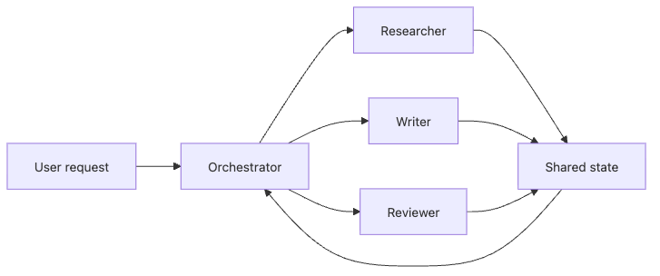

# Multi-Agent Systems

> AI Agent 101 Series (6/10)

Sometimes it's difficult to handle all tasks with a single agent. This happens when tasks span multiple domains, require different expertise at each step, or need parallel processing. In such cases, coordinating multiple agents creates a multi-agent system.

The core of multi-agent systems is coordination and delegation. Patterns include the Orchestrator pattern where one agent coordinates everything, the Peer-to-Peer pattern where multiple agents cooperate as equals, and the Hierarchical pattern that divides work hierarchically.

This is post 6 in the AI Agent 101 series. Here we cover multi-agent patterns, inter-agent communication protocols, delegation strategies, and when to use multi-agent systems.

---
<!-- a-grade-intro:begin -->

## Key Questions

- How do you tell a single-agent task from a real multi-agent task?
- What do Supervisor, Hierarchical, and Swarm patterns actually look like?
- What is the most common failure mode in agent-to-agent protocols?
- Which delegation mistakes blow up cost the fastest?

<!-- a-grade-intro:end -->

## Multi-Agent Patterns

There are several patterns for handling complex tasks through cooperation among multiple agents.


*Multi-agent systems are easier to reason about when you draw them as delegation graphs: who routes work, who writes to shared state, and who is allowed to return the final answer.*

### Orchestrator Pattern (Centralized Coordination)

A single Orchestrator agent coordinates everything and delegates work to specialized Worker agents.

```python
from typing import List, Dict
from openai import OpenAI

class WorkerAgent:
    """A specialized worker agent."""

    def __init__(self, name: str, role: str, api_key: str):
        self.name = name
        self.role = role
        self.client = OpenAI(api_key=api_key)

    def execute(self, task: str) -> str:
        """Execute a task."""
        response = self.client.chat.completions.create(
            model="gpt-4o",
            messages=[
                {"role": "system", "content": f"You are a {self.role}."},
                {"role": "user", "content": task}
            ],
            temperature=0.7
        )
        return response.choices[0].message.content

class OrchestratorAgent:
    """An orchestrator agent that coordinates workers."""

    def __init__(self, api_key: str):
        self.client = OpenAI(api_key=api_key)
        self.workers: Dict[str, WorkerAgent] = {}

    def register_worker(self, worker: WorkerAgent) -> None:
        """Register a worker."""
        self.workers[worker.name] = worker

    def plan(self, request: str) -> List[Dict]:
        """Decompose the request into subtasks."""
        worker_list = "\n".join([
            f"- {name}: {w.role}"
            for name, w in self.workers.items()
        ])
        prompt = f"""Break down the following request into subtasks and assign each to the appropriate worker.

Available workers:
{worker_list}

Request: {request}

Respond in JSON format:
[
  {{"worker": "worker_name", "task": "task description"}},
  ...
]
"""
        response = self.client.chat.completions.create(
            model="gpt-4o",
            messages=[{"role": "user", "content": prompt}],
            temperature=0.3
        )
        import json
        return json.loads(response.choices[0].message.content)

    def handle(self, request: str) -> Dict:
        """Handle the request."""
        subtasks = self.plan(request)
        results = {}
        for subtask in subtasks:
            worker_name = subtask["worker"]
            task = subtask["task"]
            if worker_name in self.workers:
                results[worker_name] = self.workers[worker_name].execute(task)
        return results

# Example usage
orchestrator = OrchestratorAgent(api_key="your-key")

# Register workers
researcher = WorkerAgent("researcher", "research analyst", "your-key")
writer = WorkerAgent("writer", "technical writer", "your-key")
reviewer = WorkerAgent("reviewer", "content reviewer", "your-key")

orchestrator.register_worker(researcher)
orchestrator.register_worker(writer)
orchestrator.register_worker(reviewer)

# Handle a request
result = orchestrator.handle("Write a blog post about Python async programming")
```

The Orchestrator pattern fits cases where tasks have clear stages and central control is needed. The downside is that the Orchestrator becomes a single point of failure.

### Peer-to-Peer Pattern (Equal Collaboration)

Multiple agents cooperate as equals without a central coordinator. Each agent communicates directly with others.

```python
from typing import List, Optional

class PeerAgent:
    """A peer agent."""

    def __init__(self, name: str, role: str, api_key: str):
        self.name = name
        self.role = role
        self.client = OpenAI(api_key=api_key)
        self.peers: List["PeerAgent"] = []
        self.message_history: List[Dict] = []

    def add_peer(self, peer: "PeerAgent") -> None:
        """Add a peer."""
        if peer not in self.peers:
            self.peers.append(peer)

    def send_message(self, recipient: "PeerAgent", message: str) -> str:
        """Send a message to a peer."""
        msg = {
            "from": self.name,
            "to": recipient.name,
            "content": message
        }
        self.message_history.append(msg)
        return recipient.receive_message(self, message)

    def receive_message(self, sender: "PeerAgent", message: str) -> str:
        """Receive a message and respond."""
        prompt = f"""You are {self.name}, a {self.role}.
Message from {sender.name}: {message}

Respond appropriately. If you need help from another peer, mention it."""

        response = self.client.chat.completions.create(
            model="gpt-4o",
            messages=[{"role": "user", "content": prompt}],
            temperature=0.7
        )
        reply = response.choices[0].message.content

        self.message_history.append({
            "from": sender.name,
            "to": self.name,
            "content": message,
            "reply": reply
        })
        return reply

    def collaborate(self, task: str) -> str:
        """Collaborate with peers on a task."""
        # Find a peer that can help
        for peer in self.peers:
            if self._needs_help_from(peer, task):
                return self.send_message(peer, task)
        # Handle alone if no help is needed
        return self._handle_alone(task)

    def _needs_help_from(self, peer: "PeerAgent", task: str) -> bool:
        """Determine whether help from this peer is needed."""
        # Simplified judgment logic
        keywords = {
            "writer": ["write", "draft", "compose"],
            "reviewer": ["review", "check", "feedback"],
            "researcher": ["research", "find", "investigate"]
        }
        for role, kws in keywords.items():
            if role in peer.role.lower():
                if any(kw in task.lower() for kw in kws):
                    return True
        return False

    def _handle_alone(self, task: str) -> str:
        """Handle the task alone."""
        response = self.client.chat.completions.create(
            model="gpt-4o",
            messages=[
                {"role": "system", "content": f"You are {self.name}, a {self.role}."},
                {"role": "user", "content": task}
            ],
            temperature=0.7
        )
        return response.choices[0].message.content

# Example usage
writer = PeerAgent("Writer", "technical writer", "your-key")
reviewer = PeerAgent("Reviewer", "content reviewer", "your-key")

# Register each other as peers
writer.add_peer(reviewer)
reviewer.add_peer(writer)

# Start collaboration
result = writer.collaborate("Write and review a blog post about REST APIs")
# Writer drafts and hands off to Reviewer
# Reviewer gives feedback and Writer revises
```

The Peer-to-Peer pattern fits creative collaboration or peer-review style tasks. The downside is that without protocol design, it can lead to infinite loops or inconsistent outputs.

### Hierarchical Pattern (Tree-shaped Structure)

Agents are arranged in a tree, where parents delegate to children and children report back to parents. Suitable for handling complex tasks across multiple levels.

```python
from typing import List, Optional

class HierarchicalAgent:
    """A hierarchical agent."""

    def __init__(self, name: str, role: str, level: int, api_key: str):
        self.name = name
        self.role = role
        self.level = level  # 0 = top, increases downward
        self.client = OpenAI(api_key=api_key)
        self.parent: Optional["HierarchicalAgent"] = None
        self.children: List["HierarchicalAgent"] = []

    def add_child(self, child: "HierarchicalAgent") -> None:
        """Add a child agent."""
        child.parent = self
        self.children.append(child)

    def execute(self, task: str) -> str:
        """Execute a task."""
        if not self.children:
            # Leaf node: execute directly
            return self._do_work(task)

        # Internal node: split and delegate to children
        subtasks = self._split_task(task)
        results = []
        for child, subtask in zip(self.children, subtasks):
            result = child.execute(subtask)
            results.append(result)

        # Aggregate results
        return self._aggregate_results(task, results)

    def _split_task(self, task: str) -> List[str]:
        """Split the task into subtasks for each child."""
        children_info = "\n".join([
            f"- {child.name}: {child.role}"
            for child in self.children
        ])
        prompt = f"""Split the following task into subtasks for each child agent.

Task: {task}

Child agents:
{children_info}

Respond with one subtask per line, in the same order as the child agents."""

        response = self.client.chat.completions.create(
            model="gpt-4o",
            messages=[{"role": "user", "content": prompt}],
            temperature=0.3
        )
        lines = response.choices[0].message.content.strip().split("\n")
        # Pad with empty strings if fewer lines than children
        while len(lines) < len(self.children):
            lines.append("")
        return lines[:len(self.children)]

    def _do_work(self, task: str) -> str:
        """Execute the task directly (leaf nodes)."""
        response = self.client.chat.completions.create(
            model="gpt-4o",
            messages=[
                {"role": "system", "content": f"You are {self.name}, a {self.role}."},
                {"role": "user", "content": task}
            ],
            temperature=0.7
        )
        return response.choices[0].message.content

    def _aggregate_results(self, task: str, results: List[str]) -> str:
        """Aggregate child results."""
        results_text = "\n\n".join([
            f"Result {i+1}: {r}" for i, r in enumerate(results)
        ])
        prompt = f"""Original task: {task}

Subtask results:
{results_text}

Synthesize the results into a coherent final answer."""

        response = self.client.chat.completions.create(
            model="gpt-4o",
            messages=[{"role": "user", "content": prompt}],
            temperature=0.5
        )
        return response.choices[0].message.content

# Example usage
# Top Manager
ceo = HierarchicalAgent("CEO", "executive director", 0, "your-key")

# Mid-level Managers
eng_manager = HierarchicalAgent("EngManager", "engineering manager", 1, "your-key")
product_manager = HierarchicalAgent("ProductManager", "product manager", 1, "your-key")

# Workers
backend_dev = HierarchicalAgent("BackendDev", "backend developer", 2, "your-key")
frontend_dev = HierarchicalAgent("FrontendDev", "frontend developer", 2, "your-key")
designer = HierarchicalAgent("Designer", "ux designer", 2, "your-key")

# Build the hierarchy
ceo.add_child(eng_manager)
ceo.add_child(product_manager)
eng_manager.add_child(backend_dev)
eng_manager.add_child(frontend_dev)
product_manager.add_child(designer)

# Run a task
result = ceo.execute("Plan a new user dashboard feature")
```

The Hierarchical pattern fits large projects or organizations with clear chains of responsibility. The downside is high communication overhead and slow response times.

## Inter-Agent Communication Protocols

Standardized communication is essential for agents to cooperate. Three protocols are common.

### Message-based Communication

Agents exchange information through structured messages. Each message has a sender, receiver, type, and content.

```python
from dataclasses import dataclass, field
from datetime import datetime
from enum import Enum
from typing import Any, Dict, Optional
import uuid

class MessageType(Enum):
    """Message types."""
    REQUEST = "request"
    RESPONSE = "response"
    NOTIFICATION = "notification"
    ERROR = "error"

@dataclass
class Message:
    """Standard message format."""
    sender: str
    receiver: str
    message_type: MessageType
    content: Any
    correlation_id: str = field(default_factory=lambda: str(uuid.uuid4()))
    timestamp: datetime = field(default_factory=datetime.now)
    metadata: Dict = field(default_factory=dict)

    def to_dict(self) -> Dict:
        """Convert to dictionary."""
        return {
            "sender": self.sender,
            "receiver": self.receiver,
            "type": self.message_type.value,
            "content": self.content,
            "correlation_id": self.correlation_id,
            "timestamp": self.timestamp.isoformat(),
            "metadata": self.metadata
        }

    @classmethod
    def from_dict(cls, data: Dict) -> "Message":
        """Create from a dictionary."""
        return cls(
            sender=data["sender"],
            receiver=data["receiver"],
            message_type=MessageType(data["type"]),
            content=data["content"],
            correlation_id=data["correlation_id"],
            timestamp=datetime.fromisoformat(data["timestamp"]),
            metadata=data.get("metadata", {})
        )

# Example usage
msg = Message(
    sender="AgentA",
    receiver="AgentB",
    message_type=MessageType.REQUEST,
    content={"action": "analyze", "data": "sample.csv"},
    metadata={"priority": "high"}
)

# JSON serialization (for network transport)
import json
serialized = json.dumps(msg.to_dict())

# Deserialize on the receiving end
received = Message.from_dict(json.loads(serialized))
```

A standard message format makes inter-agent communication consistent and tracking easier with `correlation_id`.

### Message Broker Pattern

A central broker handles message routing. Senders only send messages to the broker, and the broker forwards them to recipients.

```python
from collections import defaultdict, deque
from typing import Callable, Dict, List
import threading

class MessageBroker:
    """A message broker."""

    def __init__(self):
        self.queues: Dict[str, deque] = defaultdict(deque)
        self.handlers: Dict[str, Callable] = {}
        self.lock = threading.Lock()
        self.running = False

    def register_agent(self, agent_name: str, handler: Callable) -> None:
        """Register an agent and its message handler."""
        with self.lock:
            self.handlers[agent_name] = handler
            if agent_name not in self.queues:
                self.queues[agent_name] = deque()

    def send(self, message: Message) -> None:
        """Send a message."""
        with self.lock:
            self.queues[message.receiver].append(message)

    def start(self) -> None:
        """Start the broker."""
        self.running = True
        threading.Thread(target=self._dispatch_loop, daemon=True).start()

    def stop(self) -> None:
        """Stop the broker."""
        self.running = False

    def _dispatch_loop(self) -> None:
        """Message dispatch loop."""
        import time
        while self.running:
            with self.lock:
                for agent_name, queue in self.queues.items():
                    if queue and agent_name in self.handlers:
                        message = queue.popleft()
                        try:
                            self.handlers[agent_name](message)
                        except Exception as e:
                            error_msg = Message(
                                sender="broker",
                                receiver=message.sender,
                                message_type=MessageType.ERROR,
                                content=str(e),
                                correlation_id=message.correlation_id
                            )
                            self.queues[message.sender].append(error_msg)
            time.sleep(0.01)

# Example usage
broker = MessageBroker()

def agent_a_handler(msg: Message):
    print(f"AgentA received: {msg.content}")

def agent_b_handler(msg: Message):
    print(f"AgentB received: {msg.content}")

# Register agents
broker.register_agent("AgentA", agent_a_handler)
broker.register_agent("AgentB", agent_b_handler)

# Start broker
broker.start()

# Send messages
broker.send(Message(
    sender="AgentA",
    receiver="AgentB",
    message_type=MessageType.REQUEST,
    content="Please analyze this data"
))

# Wait for processing
import time
time.sleep(1)
broker.stop()
```

The broker pattern decouples agents and supports asynchronous communication. It's also easier to add new agents.

### Shared Memory Communication

Agents share information through shared state. Suitable when many agents need to access the same data.

```python
from threading import RLock
from typing import Any, Dict, List

class SharedMemory:
    """Shared memory."""

    def __init__(self):
        self.data: Dict[str, Any] = {}
        self.lock = RLock()
        self.access_log: List[Dict] = []

    def write(self, key: str, value: Any, agent_name: str) -> None:
        """Write data."""
        with self.lock:
            old_value = self.data.get(key)
            self.data[key] = value
            self.access_log.append({
                "agent": agent_name,
                "operation": "write",
                "key": key,
                "old_value": old_value,
                "new_value": value,
                "timestamp": datetime.now().isoformat()
            })

    def read(self, key: str, agent_name: str) -> Any:
        """Read data."""
        with self.lock:
            value = self.data.get(key)
            self.access_log.append({
                "agent": agent_name,
                "operation": "read",
                "key": key,
                "value": value,
                "timestamp": datetime.now().isoformat()
            })
            return value

    def delete(self, key: str, agent_name: str) -> None:
        """Delete data."""
        with self.lock:
            if key in self.data:
                old_value = self.data[key]
                del self.data[key]
                self.access_log.append({
                    "agent": agent_name,
                    "operation": "delete",
                    "key": key,
                    "old_value": old_value,
                    "timestamp": datetime.now().isoformat()
                })

    def get_history(self, key: str = None) -> List[Dict]:
        """View access history."""
        with self.lock:
            if key:
                return [log for log in self.access_log if log.get("key") == key]
            return list(self.access_log)

# Example usage
shared_mem = SharedMemory()

# AgentA executes a task
shared_mem.write("task_result", {"status": "completed"}, "AgentA")

# AgentB reads AgentA's result and continues work
result = shared_mem.read("task_result", "AgentB")
print(f"AgentB read: {result}")

# View memory access history
history = shared_mem.get_history("task_result")
for log in history:
    print(log)
```

Shared memory is useful but requires synchronization. Without proper locking, it can lead to race conditions or inconsistent state.

## Delegation Strategies

How an agent delegates work to other agents heavily impacts overall system performance.

### Role-based Delegation

Each agent has a clear role, and tasks are delegated based on role matching.

```python
class RoleBasedDelegator:
    """Role-based delegator."""

    def __init__(self):
        self.agents_by_role: Dict[str, List[str]] = defaultdict(list)
        self.agent_capabilities: Dict[str, Dict] = {}

    def register(self, agent_name: str, roles: List[str], capabilities: Dict) -> None:
        """Register an agent."""
        for role in roles:
            self.agents_by_role[role].append(agent_name)
        self.agent_capabilities[agent_name] = capabilities

    def find_agent_for_task(self, task: Dict) -> Optional[str]:
        """Find an appropriate agent for the task."""
        required_role = task.get("required_role")
        if required_role and required_role in self.agents_by_role:
            candidates = self.agents_by_role[required_role]
            # Pick the agent with best capability match
            best_agent = None
            best_score = -1
            for agent in candidates:
                score = self._calculate_match_score(
                    self.agent_capabilities[agent],
                    task.get("requirements", {})
                )
                if score > best_score:
                    best_score = score
                    best_agent = agent
            return best_agent
        return None

    def _calculate_match_score(self, capabilities: Dict, requirements: Dict) -> float:
        """Calculate the capability match score."""
        if not requirements:
            return 1.0
        matches = sum(
            1 for k, v in requirements.items()
            if capabilities.get(k) == v
        )
        return matches / len(requirements)

# Example usage
delegator = RoleBasedDelegator()
delegator.register("DocWriter", ["documentation"], {"language": "ko", "format": "markdown"})
delegator.register("CodeWriter", ["coding"], {"language": "python", "framework": "fastapi"})

task = {
    "required_role": "documentation",
    "requirements": {"language": "ko", "format": "markdown"}
}
selected = delegator.find_agent_for_task(task)
# Identifies "documentation" role → delegates to DocWriter
```

Role-based delegation is intuitive and easy to manage. The downside is that as roles fragment, management overhead grows.

### Capability-based Delegation

Tasks are delegated based on each agent's specific capabilities (skills) rather than roles.

```python
from typing import Set

class CapabilityRegistry:
    """Capability registry."""

    def __init__(self):
        self.agent_capabilities: Dict[str, Dict[str, float]] = {}

    def register(self, agent_name: str, capabilities: Dict[str, float]) -> None:
        """Register an agent's capabilities (capability name → proficiency 0.0-1.0)."""
        self.agent_capabilities[agent_name] = capabilities

    def find_best_agent(
        self,
        required_capabilities: Set[str],
        min_proficiency: float = 0.5
    ) -> Optional[str]:
        """Find the agent best matching the required capabilities."""
        best_agent = None
        best_score = 0.0

        for agent, caps in self.agent_capabilities.items():
            # Calculate average proficiency on required capabilities
            scores = [
                caps.get(cap, 0.0) for cap in required_capabilities
                if caps.get(cap, 0.0) >= min_proficiency
            ]
            if len(scores) == len(required_capabilities):
                avg_score = sum(scores) / len(scores)
                if avg_score > best_score:
                    best_score = avg_score
                    best_agent = agent

        return best_agent

# Example usage
registry = CapabilityRegistry()
registry.register("AgentA", {
    "python": 0.9,
    "machine_learning": 0.7,
    "data_analysis": 0.8
})
registry.register("AgentB", {
    "python": 0.95,
    "machine_learning": 0.9,
    "deep_learning": 0.85
})

required = {"python", "machine_learning"}
best = registry.find_best_agent(required)
# Picks AgentB (python: 0.95, machine_learning: 0.9)
```

Capability-based delegation enables fine-grained task assignment. The downside is the cost of designing and maintaining the capability model.

### Load-based Delegation

Tasks are distributed based on each agent's current workload.

```python
import time

class LoadBalancingDelegator:
    """Load-based delegator."""

    def __init__(self):
        self.agent_loads: Dict[str, int] = {}
        self.agent_max_capacity: Dict[str, int] = {}
        self.lock = threading.Lock()

    def register(self, agent_name: str, max_capacity: int = 10) -> None:
        """Register an agent."""
        with self.lock:
            self.agent_loads[agent_name] = 0
            self.agent_max_capacity[agent_name] = max_capacity

    def assign_task(self, task_id: str) -> Optional[str]:
        """Assign a task to the agent with the lightest load."""
        with self.lock:
            available_agents = [
                (name, load) for name, load in self.agent_loads.items()
                if load < self.agent_max_capacity[name]
            ]
            if not available_agents:
                return None
            # Pick the agent with the lowest load
            selected = min(available_agents, key=lambda x: x[1])[0]
            self.agent_loads[selected] += 1
            return selected

    def complete_task(self, agent_name: str) -> None:
        """Mark a task as completed."""
        with self.lock:
            if agent_name in self.agent_loads and self.agent_loads[agent_name] > 0:
                self.agent_loads[agent_name] -= 1

# Example usage
balancer = LoadBalancingDelegator()
balancer.register("AgentA", max_capacity=5)
balancer.register("AgentB", max_capacity=5)
balancer.register("AgentC", max_capacity=5)

# Process several tasks concurrently
for i in range(10):
    agent = balancer.assign_task(f"task_{i}")
    print(f"Task {i} assigned to {agent}")
    # ... actually run the task ...
    # balancer.complete_task(agent)
```

Load-based delegation maximizes overall system throughput. The downside is harder optimization when agents have different capabilities.

## When to Use Multi-Agent Systems

Multi-agent systems aren't always the right answer. Consider them in the following situations.

### When Different Expertise Is Needed at Each Stage

Use multi-agent when a single task spans several specialty areas.

```python
# Example: writing a project proposal
# - Market research (ResearchAgent)
# - Tech-stack recommendation (TechAgent)
# - Cost estimation (FinanceAgent)
# - Document writing (WriterAgent)
```

A single agent struggles to deliver expertise in all these areas at once. Specialized agents working together produce a better outcome.

### When Parallel Processing Yields Big Gains

Use multi-agent when independent tasks can run in parallel.

```python
# Example: crawl multiple websites simultaneously
# - Agent1: crawls site1.com
# - Agent2: crawls site2.com
# - Agent3: crawls site3.com
# - Orchestrator: merges results
```

Multi-agent systems shine when each agent processes independent tasks in parallel.

### When Mutual Validation Improves Quality

Use multi-agent when one agent's output needs to be reviewed by another.

```python
# Example: a content production pipeline
# 1. Writer: drafts the post
# 2. Reviewer: provides feedback
# 3. Writer: revises
# 4. Editor: final edit
```

Cross-checks among agents help catch errors and improve quality.

### When Continuous Operation Is Required

Use multi-agent when the system must operate 24/7.

```python
# Example: a continuous monitoring system
# - MonitorAgent: watches system health 24/7
# - AlertAgent: notifies on issues
# - AnalysisAgent: analyzes logs and generates reports
```

When agents are split by responsibility, even if one agent fails, the others can keep the system running.

### When NOT to Use Multi-Agent

In the following cases, a single agent is better:

- Simple tasks (e.g., FAQ answering, simple translation)
- When low latency matters most (overhead is high)
- When debugging difficulty matters more (multi-agent issues are hard to track)
- When cost is critical (multiple LLM calls increase cost)

A reasonable approach: start with a single agent and switch to multi-agent only when the limits become clear.

## Common Mistakes

### Mistake 1: Using Multi-Agent Where Not Needed

Some teams introduce multi-agent for trivial tasks, leading to overengineering.

```python
# Bad example
# Using 3 agents for a simple document summary
agent1 = Agent("Reader")     # Reads the doc
agent2 = Agent("Summarizer") # Summarizes
agent3 = Agent("Formatter")  # Formats output
# Overengineered: a single agent is sufficient

# Good example
# A single agent handles it
agent = Agent("DocProcessor")
result = agent.process_document(doc)
```

Multi-agent should only be introduced when truly necessary.

### Mistake 2: Lack of Communication Protocol

When agents communicate without standardized messages, the system becomes hard to maintain.

```python
# Bad example
# Each agent passes free-form messages
agent_a.send("Hey, can you check this?")
agent_b.send({"task": "review", "content": "..."})
agent_c.send("REVIEW_NEEDED:doc123")
# Inconsistent formats make tracking and debugging hard

# Good example
# Use a standard message format
message = Message(
    sender="AgentA",
    receiver="AgentB",
    message_type=MessageType.REQUEST,
    content={"action": "review", "data": "doc123"}
)
broker.send(message)
```

Standardized messages improve communication consistency and observability.

### Mistake 3: No Infinite-Loop Prevention

Without termination conditions, agents can endlessly exchange messages.

```python
# Bad example
# AgentA and AgentB keep sending messages to each other
# AgentA: "I need help" → AgentB
# AgentB: "I need more info" → AgentA
# AgentA: "What info?" → AgentB
# AgentB: "I don't know" → AgentA
# Infinite loop

# Good example
# Limit max iterations and message depth
class LoopProtectedAgent:
    MAX_DEPTH = 5

    def communicate(self, message, depth=0):
        if depth >= self.MAX_DEPTH:
            return "Max depth reached. Terminating."
        # ... handle message ...
```

Always design termination conditions and depth limits.

### Mistake 4: Mixing Roles and Responsibilities

When agent roles overlap, work is duplicated and conflicts arise.

```python
# Bad example
# Orchestrator manages even Worker internals
orchestrator.assign_task(code_agent, "Write a function")
orchestrator.review_code(code_agent.result)  # Should be Reviewer's job
orchestrator.refactor(code_agent.result)     # Removes Worker autonomy

# Good example
# Each agent has clear responsibilities
orchestrator.delegate("write_code", code_agent)  # Orchestrator only says "what" to do
# code_agent decides "how" to do it
review_agent.review(code_agent.result)
refactor_agent.refactor(code_agent.result)
```

Define each agent's responsibilities clearly and respect their autonomy.

### Mistake 5: Missing Failure Handling

When the system halts upon any agent's failure, reliability collapses.

```python
# Bad example
# Whole system stops if any agent fails
def run_pipeline():
    result1 = agent1.execute(task)  # Failure here halts everything
    result2 = agent2.execute(result1)
    return result2

# Good example
# Add retry, fallback, and graceful-degradation logic
def run_pipeline():
    try:
        result1 = agent1.execute(task)
    except AgentError:
        result1 = fallback_agent.execute(task)  # Alternative agent

    try:
        result2 = agent2.execute(result1)
    except AgentError:
        result2 = result1  # Fall back to previous step's result

    return result2
```

Handling individual agent failures explicitly increases system reliability.

## Key Takeaways

- Multi-agent systems exist to solve complex tasks via cooperation; choose patterns based on the situation
- The Orchestrator pattern fits central coordination, Peer-to-Peer fits equal collaboration, and Hierarchical fits tree-shaped task decomposition
- Standardized messages and protocols are essential for stable inter-agent communication
- Pick the delegation strategy (role-based, capability-based, load-based) that fits your task
- Use multi-agent only when truly necessary; a single agent often suffices for simple tasks
- Standard message formats, infinite-loop prevention, and failure handling are mandatory in production

<!-- a-grade-example:begin -->

## Checklist

- [ ] Sorted tasks into single-agent vs multi-agent buckets with explicit criteria.
- [ ] Implemented or sketched a Supervisor-pattern example.
- [ ] Defined an explicit message schema between agents.
- [ ] Tracked agent-to-agent calls and either reproduced or avoided a cost blowup.

<!-- a-grade-example:end -->

<!-- toc:begin -->
## In this series

- [What Is an AI Agent?](./01-what-is-an-ai-agent.md)
- [Context Engineering](./02-context-engineering.md)
- [Tool Use Fundamentals](./03-tool-use-fundamentals.md)
- [Agent Workflow Design](./04-agent-workflow-design.md)
- [Memory and State](./05-memory-and-state.md)
- **Multi-Agent Systems (current)**
- Agent Evaluation (upcoming)
- Error Handling and Reliability (upcoming)
- Production Operations (upcoming)
- Building Your First Agent (upcoming)

<!-- toc:end -->

## References

- [Anthropic - Building effective agents](https://www.anthropic.com/research/building-effective-agents)
- [LangGraph multi-agent workflows](https://langchain-ai.github.io/langgraph/tutorials/multi_agent/)
- [CrewAI documentation](https://docs.crewai.com/)
- [Semantic Kernel agents overview](https://learn.microsoft.com/en-us/semantic-kernel/frameworks/agent/)

Tags: AI Agent, LLM, Tool Use, Python
