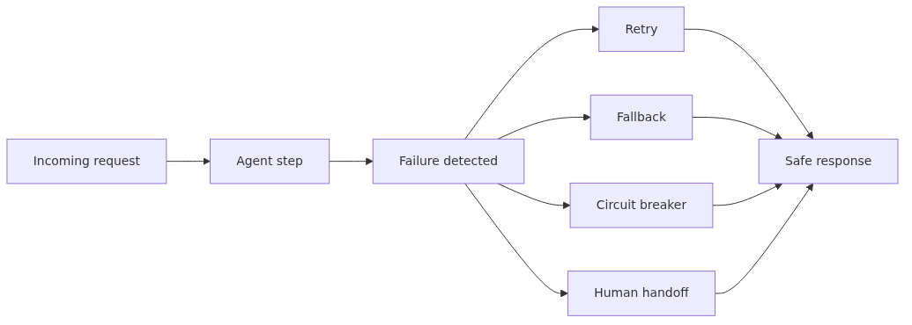

# Error Handling and Reliability

> AI Agent 101 Series (8/10)

Agents can fail because they call external tools, go through networks, and depend on uncertain model judgments. Various failure modes exist: API timeouts, incorrect tool parameters, model hallucinations, unexpected response formats, etc.

To build reliable agents, you must anticipate and respond to these failures. Retry strategies, fallback patterns, timeout handling, and graceful degradation are key.

This is post 8 in the AI Agent 101 series. Here we cover common agent failure modes, retry strategies, fallback patterns, timeout handling methods, and graceful degradation.

---
<!-- a-grade-intro:begin -->

## Key Questions

- How do you classify the errors an agent throws?
- When do you reach for Retry vs Fallback vs Circuit Breaker?
- What guards do you need to run tools safely?
- What does good graceful degradation look like to the user?

<!-- a-grade-intro:end -->

## Error Types in Agents

Agents tangle together LLMs, tools, external APIs, and user input, so error sources are diverse.

### Reliability control loop


### LLM Response Errors

The LLM's own non-determinism, format errors, and hallucinations are the most common error source.

```python
import json
from typing import Optional

class LLMResponseError(Exception):
    """LLM response error."""
    pass

def parse_llm_json(response_text: str) -> dict:
    """Safely parse JSON returned by an LLM."""
    # 1. Strip markdown code fences
    cleaned = response_text.strip()
    if cleaned.startswith("```"):
        # Remove ```json ... ``` or ``` ... ```
        lines = cleaned.split("\n")
        cleaned = "\n".join(lines[1:-1] if lines[-1].strip() == "```" else lines[1:])

    # 2. Try to parse
    try:
        return json.loads(cleaned)
    except json.JSONDecodeError as e:
        raise LLMResponseError(f"JSON parse failed: {e}\nraw: {response_text[:200]}")

# Example usage
response = '```json\n{"action": "search", "query": "Python"}\n```'
try:
    parsed = parse_llm_json(response)
except LLMResponseError as e:
    # Branch into retry logic
    pass
```

Always validate LLM responses and have a fallback path for parse failures.

### Tool Call Errors

These cover tool failures, timeouts, and external API outages.

```python
import requests
from typing import Any

class ToolExecutionError(Exception):
    """Tool execution failed."""
    def __init__(self, tool_name: str, reason: str, recoverable: bool = True):
        self.tool_name = tool_name
        self.reason = reason
        self.recoverable = recoverable
        super().__init__(f"{tool_name} failed: {reason}")

def execute_tool_safely(tool_name: str, tool_fn, **kwargs) -> Any:
    """Run a tool safely."""
    try:
        return tool_fn(**kwargs)
    except requests.Timeout:
        raise ToolExecutionError(tool_name, "timeout", recoverable=True)
    except requests.ConnectionError:
        raise ToolExecutionError(tool_name, "network connection failed", recoverable=True)
    except ValueError as e:
        # Bad arguments — same args won't succeed on retry
        raise ToolExecutionError(tool_name, f"bad argument: {e}", recoverable=False)
    except Exception as e:
        raise ToolExecutionError(tool_name, f"unexpected error: {e}", recoverable=False)
```

The `recoverable` flag tells the upstream caller whether retrying makes sense.

### User Input Errors

Malicious input, ambiguous requests, and context-window overruns all happen.

```python
class UserInputError(Exception):
    pass

def validate_user_input(text: str, max_chars: int = 10000) -> str:
    """Validate user input."""
    if not text or not text.strip():
        raise UserInputError("empty input")
    if len(text) > max_chars:
        raise UserInputError(f"input too long ({len(text)} chars, max {max_chars})")
    return text.strip()
```

Unvalidated input leads to LLM cost bombs and security incidents.

## Retry Pattern

The most basic reliability mechanism. Exponential backoff is the standard.

```python
import time
import random
from typing import Callable, Type, Tuple

def retry_with_backoff(
    fn: Callable,
    max_attempts: int = 3,
    initial_delay: float = 1.0,
    max_delay: float = 30.0,
    exponential_base: float = 2.0,
    jitter: bool = True,
    retryable_exceptions: Tuple[Type[Exception], ...] = (Exception,)
):
    """Retry with exponential backoff."""
    last_exception = None

    for attempt in range(max_attempts):
        try:
            return fn()
        except retryable_exceptions as e:
            last_exception = e
            if attempt == max_attempts - 1:
                break

            delay = min(initial_delay * (exponential_base ** attempt), max_delay)
            if jitter:
                delay = delay * (0.5 + random.random())

            print(f"attempt {attempt + 1} failed: {e}. retrying in {delay:.1f}s")
            time.sleep(delay)

    raise last_exception

# Example usage
def call_flaky_api():
    response = requests.get("https://api.example.com/data", timeout=5)
    response.raise_for_status()
    return response.json()

result = retry_with_backoff(
    call_flaky_api,
    max_attempts=5,
    retryable_exceptions=(requests.Timeout, requests.ConnectionError)
)
```

Caution: retrying `recoverable=False` errors only loads the system without changing the outcome.

## Fallback and Graceful Degradation

Even when the primary path fails, the ability to deliver a partial response shapes user experience.

```python
class FallbackChain:
    """Try fallbacks sequentially."""

    def __init__(self):
        self.handlers = []

    def add(self, handler: Callable, name: str):
        self.handlers.append((name, handler))
        return self

    def execute(self, *args, **kwargs):
        errors = []
        for name, handler in self.handlers:
            try:
                result = handler(*args, **kwargs)
                return {"result": result, "source": name, "fallbacks_tried": errors}
            except Exception as e:
                errors.append({"handler": name, "error": str(e)})
        raise RuntimeError(f"all handlers failed: {errors}")

# Example usage
def primary_search(query):
    return external_search_api(query)

def cached_search(query):
    return cache.get(f"search:{query}") or []

def degraded_search(query):
    return [{"text": f"Search for '{query}' is temporarily unavailable.", "fallback": True}]

chain = (FallbackChain()
    .add(primary_search, "primary")
    .add(cached_search, "cache")
    .add(degraded_search, "degraded"))

result = chain.execute("Python tutorial")
# On primary failure → cache; on cache failure → friendly message
```

Graceful degradation provides "an honest, limited response" instead of "a bad response."

## Circuit Breaker Pattern

When a service keeps failing, temporarily block calls to it to prevent overload of the whole system.

```python
from enum import Enum
import time

class CircuitState(Enum):
    CLOSED = "closed"      # normal
    OPEN = "open"          # blocked
    HALF_OPEN = "half_open"  # trial calls

class CircuitBreaker:
    """Circuit breaker."""

    def __init__(
        self,
        failure_threshold: int = 5,
        recovery_timeout: float = 60.0,
        success_threshold: int = 2
    ):
        self.failure_threshold = failure_threshold
        self.recovery_timeout = recovery_timeout
        self.success_threshold = success_threshold

        self.state = CircuitState.CLOSED
        self.failure_count = 0
        self.success_count = 0
        self.last_failure_time = 0.0

    def call(self, fn: Callable, *args, **kwargs):
        if self.state == CircuitState.OPEN:
            if time.time() - self.last_failure_time > self.recovery_timeout:
                self.state = CircuitState.HALF_OPEN
                self.success_count = 0
            else:
                raise RuntimeError("Circuit breaker OPEN")

        try:
            result = fn(*args, **kwargs)
            self._on_success()
            return result
        except Exception:
            self._on_failure()
            raise

    def _on_success(self):
        if self.state == CircuitState.HALF_OPEN:
            self.success_count += 1
            if self.success_count >= self.success_threshold:
                self.state = CircuitState.CLOSED
                self.failure_count = 0
        elif self.state == CircuitState.CLOSED:
            self.failure_count = 0

    def _on_failure(self):
        self.failure_count += 1
        self.last_failure_time = time.time()
        if self.failure_count >= self.failure_threshold:
            self.state = CircuitState.OPEN

# Example usage
breaker = CircuitBreaker(failure_threshold=3, recovery_timeout=30)

try:
    result = breaker.call(external_api_call, "param")
except RuntimeError as e:
    # Circuit is open, use the fallback
    result = cached_value
```

Circuit breakers are essential for agents with many external API dependencies.

## Safe Tool Execution

Without time and resource limits on tool execution, a single failure can paralyze the whole system.

```python
import signal
from contextlib import contextmanager

class TimeoutError(Exception):
    pass

@contextmanager
def time_limit(seconds: int):
    """Limit function execution time."""
    def signal_handler(signum, frame):
        raise TimeoutError(f"execution exceeded {seconds}s")

    signal.signal(signal.SIGALRM, signal_handler)
    signal.alarm(seconds)
    try:
        yield
    finally:
        signal.alarm(0)

def run_tool_with_limits(tool_fn, *args, timeout: int = 30, **kwargs):
    """Run a tool with timeout and exception handling."""
    try:
        with time_limit(timeout):
            return tool_fn(*args, **kwargs)
    except TimeoutError as e:
        raise ToolExecutionError("tool", str(e), recoverable=True)
    except Exception as e:
        raise ToolExecutionError("tool", str(e), recoverable=False)
```

Set timeouts appropriately per tool.

## Common Mistakes

### Mistake 1: Retrying Every Error

```python
# Bad
for _ in range(5):
    try:
        return call_api(invalid_args)  # Bad args won't succeed on retry
    except Exception:
        time.sleep(1)

# Good
try:
    return call_api(args)
except (Timeout, ConnectionError):
    return retry_with_backoff(lambda: call_api(args))
except ValueError:
    raise  # Not retryable
```

Unrecoverable errors should fail fast.

### Mistake 2: Infinite Retries

```python
# Bad
while True:
    try:
        return call_api()
    except Exception:
        time.sleep(1)  # forever

# Good
return retry_with_backoff(call_api, max_attempts=5)
```

Always cap retry count and total time.

### Mistake 3: Single-Path Dependency Without Fallback

```python
# Bad
def search(query):
    return external_api.search(query)  # If the API dies, everything dies

# Good
def search(query):
    try:
        return external_api.search(query)
    except Exception:
        return cache.get(query) or []  # At least serve cache
```

Always provide fallbacks for critical functionality.

### Mistake 4: Silently Swallowing Errors

```python
# Bad
try:
    result = risky_operation()
except Exception:
    pass  # Hidden — undebuggable

# Good
try:
    result = risky_operation()
except Exception as e:
    logger.error(f"risky_operation failed: {e}", exc_info=True)
    metrics.increment("risky_operation.failures")
    raise
```

Always record errors to logs and metrics.

### Mistake 5: Exposing Raw Errors to Users

```python
# Bad
return {"error": str(exception)}  # Leaks internals and stack traces

# Good
return {
    "error": "Unable to process the request",
    "request_id": req_id,  # for internal tracing
}
# Detailed info stays in server logs only
```

Show users a friendly message; manage internal trace IDs separately.

## Key Takeaways

- Agent errors arise across many layers — LLM responses, tool calls, user input
- Retries should combine exponential backoff with jitter and distinguish recoverable vs. not
- Provide partial responses through fallback and graceful degradation
- Circuit breakers protect the system from repeatedly failing external dependencies
- Tool execution always needs timeouts and resource limits
- Don't swallow errors silently — surface them through logs and metrics

<!-- a-grade-example:begin -->

## Checklist

- [ ] Sorted agent errors into transient / permanent / model-level.
- [ ] Implemented exponential-backoff retry to absorb transient failures.
- [ ] Sketched the circuit-breaker open/half-open/closed transitions.
- [ ] Wrapped a tool call with timeout + sandbox.

<!-- a-grade-example:end -->

<!-- toc:begin -->
## In this series

- [What Is an AI Agent?](./01-what-is-an-ai-agent.md)
- [Context Engineering](./02-context-engineering.md)
- [Tool Use Fundamentals](./03-tool-use-fundamentals.md)
- [Agent Workflow Design](./04-agent-workflow-design.md)
- [Memory and State](./05-memory-and-state.md)
- [Multi-Agent Systems](./06-multi-agent-systems.md)
- [Agent Evaluation](./07-agent-evaluation.md)
- **Error Handling and Reliability (current)**
- Production Operations (upcoming)
- Building Your First Agent (upcoming)

<!-- toc:end -->

## References

- [AWS Builders' Library - Timeouts, retries, and backoff with jitter](https://aws.amazon.com/builders-library/timeouts-retries-and-backoff-with-jitter/)
- [OpenAI production best practices](https://platform.openai.com/docs/guides/production-best-practices)
- [Martin Fowler - Circuit Breaker](https://martinfowler.com/bliki/CircuitBreaker.html)
- [Google SRE Book - Handling Overload](https://sre.google/sre-book/handling-overload/)

Tags: AI Agent, LLM, Tool Use, Python
