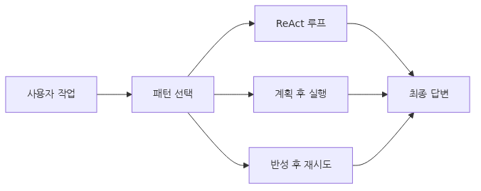
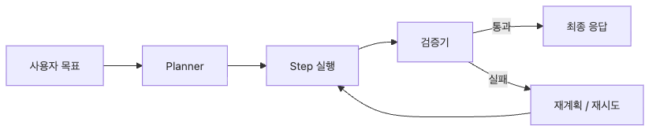

# Agent Workflow 설계

도구를 호출할 수 있다고 해서 곧바로 좋은 agent가 되는 것은 아닙니다. 실제 업무 자동화에서는 어떤 순서로 정보를 모으고, 언제 계획을 세우고, 어느 지점에서 검증하고, 실패 시 어떻게 되돌아갈지를 함께 설계해야 합니다.

이때 필요한 것이 workflow입니다. workflow는 단순한 단계 목록이 아니라 agent의 제어 흐름입니다. 같은 tool set을 갖고 있어도 workflow 설계가 다르면 비용, latency, 성공률이 크게 달라집니다.

현업에서는 특히 "얼마나 미리 계획할 것인가"와 "중간 결과에 얼마나 적응적으로 반응할 것인가" 사이의 균형이 중요합니다. 너무 즉흥적으로 움직이면 반복 호출이 늘고, 너무 고정된 계획으로 움직이면 중간 결과 변화에 약해집니다.

이 글은 AI Agent 101 시리즈의 네 번째 글입니다.

이 글에서는 workflow를 패턴 선택의 문제이자 운영 리스크 관리 문제로 함께 보겠습니다.

## 이 글에서 다룰 문제

- ReAct, Plan-and-Execute, Reflexion은 각각 언제 강점을 보일까요?
- 작업 분해 단위를 너무 작게 혹은 너무 크게 잡으면 어떤 문제가 생길까요?
- workflow 안에서 state는 어디에 두는 편이 안전할까요?
- 중간 검증 지점이 없는 workflow는 왜 production에서 취약할까요?
- 처음 설계한 workflow가 실제 운영에서 틀렸다는 신호는 무엇일까요?

## 왜 이 글이 중요한가

workflow는 agent 시스템의 비용 구조를 좌우합니다. 같은 요청을 어떤 패턴으로 처리하느냐에 따라 LLM 호출 횟수, 도구 호출 수, 평균 응답 시간이 달라집니다. 따라서 workflow는 구현 디테일이 아니라 제품 단가를 결정하는 설계입니다.

또한 workflow는 실패의 모양도 결정합니다. ReAct는 유연하지만 장기 계획이 약할 수 있고, Plan-and-Execute는 전체 그림이 명확하지만 초기 계획이 틀리면 흔들리며, Reflexion은 적응력이 높지만 재시도 비용이 큽니다. 패턴별 trade-off를 모르면 문제를 모델 성능 탓으로 돌리기 쉽습니다.

무엇보다 workflow는 memory, reliability, evaluation의 공통 기반입니다. 어떤 step이 있고 어느 지점에서 state를 저장하는지 알아야 checkpoint를 넣을 수 있고, trajectory를 평가할 수 있으며, 장애 시 어디서 재개할지 결정할 수 있습니다.

## Agent Workflow를 이해하는 가장 좋은 방법: 추론 방식이 아니라 제어 흐름 패턴으로 보는 것입니다

workflow 패턴은 모델의 성격 설명이 아니라 **제어 흐름 패턴**입니다. agent가 계획을 먼저 세울지, 중간 결과를 보며 적응할지, 실패 후 반성 루프를 돌릴지에 따라 같은 작업도 전혀 다른 실행 경로를 가집니다.

이 관점이 중요한 이유는 디버깅 포인트가 명확해지기 때문입니다. 잘못된 답이 나왔을 때 reasoning이 약했는지, planning이 틀렸는지, reflection 기준이 부실했는지 나눠서 볼 수 있어야 합니다. 그래야 무조건 더 큰 모델을 붙이는 방향으로 흐르지 않습니다.

실무에서는 패턴 하나를 교리처럼 고집하기보다 요청 특성에 따라 섞어 쓰는 경우가 많습니다. 다만 그 전에 각 패턴이 무엇을 최적화하는지 정확히 알아야 합니다.

> 좋은 workflow 설계는 agent를 더 복잡하게 만드는 일이 아니라, 어떤 종류의 작업에서 어떤 종류의 제어 흐름이 가장 예측 가능하게 동작하는지 고르는 일입니다.

### 워크플로 패턴 지도


## 핵심 개념

### workflow를 먼저 그림으로 고정하면 설계가 쉬워집니다


*Agent workflow는 목표를 step으로 쪼개고, 실행 결과를 검증한 뒤 필요할 때만 재계획하는 구조로 보는 편이 안전합니다.*

### ReAct는 관찰에 따라 즉시 적응하는 패턴입니다

```python
from typing import Dict, Any, List
import openai

def react_agent(user_query: str, tools: List[Dict], max_steps: int = 10) -> str:
    """ReAct pattern: Thought → Action → Observation loop"""

    messages = [
        {"role": "system", "content": """You are an agent that solves problems step-by-step.\n\n        At each step:\n        1. Thought: Think about what to do next\n        2. Action: Use tools to gather information\n        3. Observation: Observe results and plan next step\n\n        When you reach the goal, provide an answer starting with "Final Answer:"."""},
        {"role": "user", "content": user_query}
    ]

    for step in range(max_steps):
        # Request next action from LLM
        response = openai.chat.completions.create(
            model="gpt-4.1",
            messages=messages,
            tools=tools,
            tool_choice="auto"
        )

        assistant_message = response.choices[0].message

        # If final answer
        if assistant_message.content and "Final Answer:" in assistant_message.content:
            return assistant_message.content.replace("Final Answer:", "").strip()

        # If tool call
        if assistant_message.tool_calls:
            messages.append(assistant_message)

            # Execute each tool
            for tool_call in assistant_message.tool_calls:
                result = execute_tool(tool_call.function.name, tool_call.function.arguments)

                # Add observation
                messages.append({
                    "role": "tool",
                    "tool_call_id": tool_call.id,
                    "content": f"Observation: {result}"
                })
        else:
            # Neither tool call nor final answer
            messages.append(assistant_message)

    return "Max steps reached without solution."
```

ReAct의 장점은 중간 관찰에 따라 방향을 바꾸기 쉽다는 점입니다. 검색 결과가 기대와 다르면 다음 행동을 즉시 바꿀 수 있습니다. 대신 upfront planning이 약해 복잡한 작업에서는 시행착오가 길어질 수 있습니다.

### Plan-and-Execute는 전체 그림을 먼저 고정합니다

```python
def plan_and_execute_agent(user_query: str, tools: List[Dict]) -> str:
    """Plan-and-Execute pattern: Plan → Execute"""

    # Step 1: Create plan
    plan_prompt = f"""
    Task: {user_query}

    Create a step-by-step plan to complete this task.
    Each step should have a clear goal and required tools.

    Format:
    1. [step description] - Tool: [tool name]
    2. [step description] - Tool: [tool name]
    ...
    """

    response = openai.chat.completions.create(
        model="gpt-4.1",
        messages=[{"role": "user", "content": plan_prompt}]
    )

    plan = response.choices[0].message.content
    print(f"Plan:\n{plan}\n")

    # Step 2: Execute plan
    steps = parse_plan(plan)  # "1. step - Tool: name" → structured

    results = []
    for idx, step in enumerate(steps):
        print(f"[Step {idx + 1}] {step['description']}")

        # Execute tool
        tool_result = execute_tool(step["tool"], step["params"])
        results.append({
            "step": idx + 1,
            "description": step["description"],
            "result": tool_result
        })

        print(f"Result: {tool_result}\n")

    # Step 3: Generate final answer
    summary_prompt = f"""
    Task: {user_query}

    Executed steps and results:
    {format_results(results)}

    Answer the user's question based on the above results.
    """

    final_response = openai.chat.completions.create(
        model="gpt-4.1",
        messages=[{"role": "user", "content": summary_prompt}]
    )

    return final_response.choices[0].message.content
```

이 패턴은 단계가 예측 가능한 업무에서 강합니다. 전체 계획을 먼저 검토할 수 있고, 병렬화 가능한 단계도 찾기 쉽습니다. 반면 중간 결과가 예상과 다르면 재계획 비용이 큽니다. 그래서 외부 환경 변화가 많은 업무에는 그대로 쓰기 어렵습니다.

### Reflexion은 실패를 다음 시도의 입력으로 사용합니다

```python
def reflexion_agent(user_query: str, tools: List[Dict], max_retries: int = 3) -> str:
    """Reflexion pattern: Execute → Evaluate → Reflect → Retry"""

    reflections = []

    for attempt in range(max_retries):
        print(f"\n=== Attempt {attempt + 1} ===")

        # Include previous reflections in context
        context = "\n".join([f"Reflection {i+1}: {r}" for i, r in enumerate(reflections)])

        prompt = f"""
        Task: {user_query}

        Lessons from previous attempts:
        {context if context else "None (first attempt)"}

        Perform the task.
        """

        # Execute task
        result = execute_task(prompt, tools)

        # Evaluate result
        evaluation = evaluate_result(result, user_query)

        if evaluation["success"]:
            return result

        # Reflect on failure
        reflection_prompt = f"""
        Task: {user_query}
        Attempted method: {result}
        Failure reason: {evaluation['reason']}

        Reflect on what went wrong and how to improve in the next attempt.
        """

        reflection_response = openai.chat.completions.create(
            model="gpt-4.1",
            messages=[{"role": "user", "content": reflection_prompt}]
        )

        reflection = reflection_response.choices[0].message.content
        reflections.append(reflection)

        print(f"Reflection: {reflection}")

    return "Max retries reached without success."
```

Reflexion은 정답이 즉시 보이지 않는 작업에서 유용합니다. 다만 evaluation 함수가 부실하면 agent가 잘못된 반성을 반복할 수 있습니다. 따라서 이 패턴에서는 reflection 품질보다 평가 기준 품질이 먼저 중요합니다.

### 실행 전에 검증 가능한 workflow 스켈레톤을 만들어 두면 설계가 덜 흔들립니다

아래 예시는 planner가 만든 step 목록을 실행하고, step마다 성공 여부와 재시도 가능 여부를 남기는 가장 작은 workflow 스켈레톤입니다. OpenAI SDK나 LangGraph 없이도 workflow의 뼈대를 먼저 검증할 수 있습니다.

```python
from dataclasses import dataclass
from typing import Any

@dataclass
class StepResult:
    name: str
    ok: bool
    output: Any
    retryable: bool = False

def fetch_customer(customer_id: str) -> StepResult:
    fake_db = {"C-001": {"name": "Minji", "tier": "pro"}}
    customer = fake_db.get(customer_id)
    if not customer:
        return StepResult("fetch_customer", False, "customer not found")
    return StepResult("fetch_customer", True, customer)

def draft_reply(customer: dict) -> StepResult:
    text = f"{customer['name']} 고객은 {customer['tier']} 요금제를 사용 중입니다."
    return StepResult("draft_reply", True, text)

def run_workflow(customer_id: str) -> list[StepResult]:
    results: list[StepResult] = []

    customer_result = fetch_customer(customer_id)
    results.append(customer_result)
    if not customer_result.ok:
        return results

    reply_result = draft_reply(customer_result.output)
    results.append(reply_result)
    return results

for step in run_workflow("C-001"):
    print(step)
```

**예상 출력:**

```text
StepResult(name='fetch_customer', ok=True, output={'name': 'Minji', 'tier': 'pro'}, retryable=False)
StepResult(name='draft_reply', ok=True, output='Minji 고객은 pro 요금제를 사용 중입니다.', retryable=False)
```

이 정도 검증만 해도 step 순서, 실패 시 조기 종료, downstream 입력 계약이 눈에 들어옵니다. 실제 LLM 호출을 붙이기 전에 이런 최소 스켈레톤을 먼저 돌려 보면 workflow가 과하게 복잡해지는 것을 막기 쉽습니다.

### failure mode를 미리 넣지 않으면 workflow는 길어질수록 흔들립니다

- planner가 너무 큰 step을 만들면 실패 원인이 묻히고 재시도 범위도 과하게 넓어집니다.
- 검증기가 없으면 중간 결과가 틀려도 다음 step으로 넘어가서 잘못된 답을 더 그럴듯하게 포장합니다.
- 재계획 조건이 없으면 ReAct와 Reflexion이 모두 같은 실패를 반복하는 비싼 루프로 바뀝니다.
- step별 로그가 없으면 production에서 실패했을 때 "모델이 이상했다"는 말 외에 남는 설명이 없습니다.

실무에서는 step마다 최소한 `입력`, `출력`, `검증 기준`, `재시도 가능 여부` 네 가지를 남겨 두는 편이 안전합니다. 이 네 칸만 있어도 workflow 실패를 planner 문제인지, tool 문제인지, validator 문제인지 더 빠르게 분해할 수 있습니다.

### 패턴 선택은 작업의 변동성과 검증 가능성으로 판단합니다

- 외부 관찰에 따라 전략이 자주 바뀌면 ReAct가 유리합니다.
- 단계가 명확하고 계획 검토가 중요하면 Plan-and-Execute가 적합합니다.
- 시행착오를 통해 개선해야 하는 문제라면 Reflexion을 고려할 수 있습니다.
- 실제 production에서는 Plan → ReAct execution → post-check 같은 혼합형이 자주 쓰입니다.

## 흔히 헷갈리는 지점

- workflow 패턴을 모델 성능 비교로 이해하기 쉽지만, 실제로는 제어 흐름 선택 문제입니다.
- step을 많이 쪼개면 더 정교해질 것 같지만, 과도한 분해는 호출 수와 실패 지점을 함께 늘립니다.
- Plan-and-Execute가 항상 더 체계적이라 생각하기 쉽지만, 환경 변화가 심하면 오히려 경직됩니다.
- Reflexion은 좋아 보이지만 평가 기준이 없으면 비싼 재시도 루프에 그치기 쉽습니다.
- 최종 답만 맞으면 workflow가 좋다고 보기 쉽지만, step 수와 latency와 rollback 가능성도 함께 봐야 합니다.

## 운영 체크리스트

- [ ] 요청 유형별로 어떤 workflow 패턴을 기본값으로 쓸지 정했는가
- [ ] 각 step의 입력, 출력, 검증 조건이 분리되어 있는가
- [ ] 재계획 또는 재시도 지점이 명시되어 있는가
- [ ] 최대 step 수와 최대 retry 수를 별도로 관리하는가
- [ ] trajectory를 남겨 사후 분석할 수 있는가

## 정리

agent workflow 설계는 도구를 나열하는 일이 아니라, 어떤 종류의 작업에서 어떤 제어 흐름을 선택할지 결정하는 일입니다. ReAct, Plan-and-Execute, Reflexion은 모두 유용하지만 최적화하는 대상이 다르므로 상황에 맞게 써야 합니다.

좋은 workflow는 모델을 더 오래 생각하게 만드는 것이 아니라, 필요한 순간에만 계획하고 필요한 순간에만 적응하게 만드는 구조입니다. 그래야 비용과 성공률과 디버깅 가능성이 함께 맞춰집니다.

다음 글에서는 이 workflow를 오래 유지하기 위한 memory와 state를 다룹니다. 루프가 길어질수록 agent는 무엇을 기억하고, 무엇을 버리며, 무엇을 구조화된 상태로 남길지 결정해야 하기 때문입니다.

<!-- toc:begin -->
## 시리즈 목차

- [AI Agent란 무엇인가?](./01-what-is-an-ai-agent.md)
- [컨텍스트 엔지니어링](./02-context-engineering.md)
- [Tool Use 기초](./03-tool-use-fundamentals.md)
- **Agent Workflow 설계 (현재 글)**
- Memory와 State (예정)
- Multi-Agent 시스템 (예정)
- Agent 평가 (예정)
- 에러 처리와 안정성 (예정)
- 운영 (예정)
- 첫 Agent 만들기 (예정)

<!-- toc:end -->

## 참고 자료

### 공식 문서

- [ReAct: Synergizing Reasoning and Acting in Language Models](https://arxiv.org/abs/2210.03629)
- [Plan-and-Solve Prompting](https://arxiv.org/abs/2305.04091)
- [Reflexion: Language Agents with Verbal Reinforcement Learning](https://arxiv.org/abs/2303.11366)
- [Anthropic - Building effective agents](https://www.anthropic.com/research/building-effective-agents)

### 관련 시리즈

- [LangGraph 101 - 상태와 그래프 흐름](../../langgraph-101/ko/02-state-and-checkpoints.md)
- [LangGraph 101 - 멀티 에이전트 시스템](../../langgraph-101/ko/05-multi-agent.md)

Tags: AI Agent, LLM, Tool Use, Python
