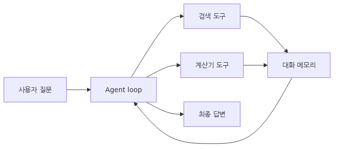

# 첫 Agent 만들기

이제까지 이 시리즈에서는 agent를 이루는 부품을 하나씩 떼어 보았습니다. agent의 정의, 컨텍스트, tool use, workflow, memory, evaluation, operations를 각각 따로 설명했지만, 실제 개발에서는 이 요소들이 한 파일 안에서 동시에 만납니다.

그래서 마지막 글에서는 작은 research assistant agent를 끝까지 묶어 봅니다. 중요한 목표는 기능을 많이 넣는 것이 아니라, 지금까지 다룬 설계 원칙이 실제 코드에서 어떻게 연결되는지 확인하는 것입니다. 작은 예제라도 구조가 분명하면 이후 LangGraph나 CrewAI 같은 프레임워크로 확장하기 쉽습니다.

또한 첫 구현은 학습용이면서 동시에 기준선 역할을 합니다. 어떤 부분이 직접 코드로 충분하고, 어느 시점부터 framework가 유용한지 판단하는 데도 도움이 됩니다. 즉, 이 글은 단순한 튜토리얼이 아니라 아키텍처 감각을 정리하는 마무리 단계입니다.

이 글은 AI Agent 101 시리즈의 마지막 글입니다.

이 글에서는 작은 agent를 직접 구현하면서 개념을 코드 감각으로 바꾸는 데 집중하겠습니다.

## 이 글에서 다룰 문제

- 첫 agent의 책임 범위는 어디까지로 제한하는 편이 좋을까요?
- tool, memory, loop를 어떤 순서로 구현하면 구조가 가장 잘 보일까요?
- raw Python 구현과 framework 도입의 경계는 어디에서 갈릴까요?
- 간단한 agent에도 reliability와 테스트가 왜 필요한가요?
- 이 작은 구현을 이후 production 설계로 확장하려면 무엇을 먼저 바꿔야 할까요?

## 왜 이 글이 중요한가

개념을 이해했다고 해서 곧 구현 감각이 생기지는 않습니다. 실제로는 tool schema를 어디에 두는지, memory를 어떤 형식으로 저장하는지, tool result를 어떻게 다시 모델로 넣는지 같은 세부 구조에서 감각 차이가 크게 납니다. 마지막으로 한 번 직접 묶어 보는 이유가 여기에 있습니다.

또한 첫 구현은 과한 프레임워크 추상화에 가려 본질을 놓치지 않게 해 줍니다. 직접 loop를 돌려 보면 agent가 결국 메시지 배열, tool registry, validation, stop condition 위에 세워진다는 사실이 선명해집니다. 그 다음에 framework를 봐야 추상화가 왜 필요한지 제대로 이해할 수 있습니다.

현업에서도 작은 기준 구현은 중요합니다. 나중에 LangGraph나 multi-agent 구조로 커지더라도, 가장 작은 end-to-end 경로가 있어야 regression test와 architecture review의 기준점이 생깁니다.

## 첫 Agent 만들기를 이해하는 가장 좋은 방법: 기능 구현이 아니라 지금까지의 설계 원칙을 하나로 묶는 연습으로 보는 것입니다

이 글의 목표는 가장 화려한 agent를 만드는 것이 아닙니다. 오히려 작지만 읽기 쉬운 구조로 agent의 핵심 계층을 한 번에 연결하는 것이 중요합니다. tool 정의, memory, loop, error handling이 각각 어디에 들어가는지 보이게 만들어야 합니다.

이 관점이 있으면 구현 순서도 자연스럽습니다. 먼저 책임이 작은 tool을 만들고, 그 tool을 노출할 schema와 registry를 정의하고, 현재 대화를 담을 memory를 만들고, 마지막으로 LLM-tool loop를 연결합니다. 이렇게 쌓아야 디버깅도 쉽습니다.

실무에서는 프레임워크보다 먼저 이 구조를 이해하는 팀이 훨씬 빨리 안정화합니다. framework가 숨겨 주는 부분을 알아야 문제가 생겼을 때 벗겨 볼 수 있기 때문입니다.

> 첫 agent 구현의 핵심은 많은 기능이 아니라, tool·memory·loop·검증이 어떤 경계로 연결되는지 코드에서 선명하게 드러내는 것입니다.

### end-to-end 구현 지도


## 핵심 개념

### 먼저 작은 도구 집합을 정의합니다

```python
from typing import Any
from pydantic import BaseModel, Field
import json

class SearchInput(BaseModel):
    """Input schema for the search tool."""
    query: str = Field(..., description="Search query")
    top_k: int = Field(3, description="Number of results to return")

class CalculatorInput(BaseModel):
    """Input schema for the calculator tool."""
    expression: str = Field(..., description="Python arithmetic expression")

def tool_search(query: str, top_k: int = 3) -> list[dict[str, str]]:
    """Fake search tool. In production this would call an external API."""
    fake_db = [
        {"title": "FastAPI Official Docs", "snippet": "FastAPI is a modern, fast Python web framework."},
        {"title": "FastAPI Performance Benchmarks", "snippet": "FastAPI delivers performance comparable to Node.js and Go."},
        {"title": "FastAPI vs Flask", "snippet": "FastAPI beats Flask in async support and automatic documentation."},
    ]
    return fake_db[:top_k]

def tool_calculator(expression: str) -> float:
    """Safe arithmetic. Plain eval is dangerous, so we use a restricted environment."""
    allowed = set("0123456789+-*/(). ")
    if not set(expression) <= allowed:
        raise ValueError(f"Disallowed characters in expression: {expression}")
    return eval(expression, {"__builtins__": {}}, {})
```

첫 구현에서 tool은 적을수록 좋습니다. 검색과 계산처럼 역할이 분명한 두 개 정도면 충분합니다. 중요한 것은 tool 자체보다 입력 스키마와 실패 조건을 함께 설계하는 습관입니다.

### tool registry는 모델과 코드 사이의 계약입니다

```python
TOOLS = {
    "search": {
        "function": tool_search,
        "schema": SearchInput,
        "description": "Search for material by keyword.",
    },
    "calculator": {
        "function": tool_calculator,
        "schema": CalculatorInput,
        "description": "Evaluate an arithmetic expression.",
    },
}

def tools_to_openai_format() -> list[dict[str, Any]]:
    """Convert the registry to OpenAI Function Calling format."""
    result = []
    for name, info in TOOLS.items():
        result.append({
            "type": "function",
            "function": {
                "name": name,
                "description": info["description"],
                "parameters": info["schema"].model_json_schema(),
            },
        })
    return result
```

registry를 분리해 두면 나중에 tool을 추가하거나 교체할 때 영향 범위를 줄일 수 있습니다. 또한 evaluation에서 어떤 tool이 등록되어 있었는지 버전 기준을 맞추기 쉽습니다.

### memory는 단순하게 시작하되 길이 제한을 둡니다

```python
class ConversationMemory:
    """Sliding window conversation memory."""

    def __init__(self, system_prompt: str, max_messages: int = 20):
        self.system_prompt = system_prompt
        self.max_messages = max_messages
        self.messages: list[dict[str, Any]] = []

    def add(self, role: str, content: str, **extra: Any) -> None:
        """Append a message."""
        msg = {"role": role, "content": content, **extra}
        self.messages.append(msg)
        if len(self.messages) > self.max_messages:
            self.messages = self.messages[-self.max_messages:]

    def to_openai(self) -> list[dict[str, Any]]:
        """Return messages in OpenAI Chat Completions format."""
        return [{"role": "system", "content": self.system_prompt}] + self.messages
```

첫 구현에서는 long-term memory보다 short-term memory를 안정적으로 만드는 것이 먼저입니다. history가 끝없이 커지지 않도록 상한을 두고, 메시지 형식을 LLM API가 바로 소비할 수 있게 맞추는 편이 좋습니다.

### agent loop가 모든 개념을 연결합니다

```python
from openai import OpenAI
import os
from dotenv import load_dotenv

load_dotenv()
client = OpenAI(api_key=os.getenv("OPENAI_API_KEY"))

SYSTEM_PROMPT = """You are a research assistant.
Use the search and calculator tools to answer user questions.
Synthesize tool results into accurate, concise answers.
Say you do not know when you do not."""

class ResearchAgent:
    """Research assistant agent."""

    def __init__(self, model: str = "gpt-4o-mini", max_iterations: int = 5):
        self.model = model
        self.max_iterations = max_iterations
        self.memory = ConversationMemory(SYSTEM_PROMPT)

    def run(self, user_input: str) -> str:
        """Process a user question and return an answer."""
        self.memory.add("user", user_input)

        for iteration in range(self.max_iterations):
            response = client.chat.completions.create(
                model=self.model,
                messages=self.memory.to_openai(),
                tools=tools_to_openai_format(),
                tool_choice="auto",
            )
            msg = response.choices[0].message

            if not msg.tool_calls:
                self.memory.add("assistant", msg.content or "")
                return msg.content or ""

            self.memory.add(
                "assistant",
                msg.content or "",
                tool_calls=[tc.model_dump() for tc in msg.tool_calls],
            )

            for tool_call in msg.tool_calls:
                result = self._execute_tool(tool_call)
                self.memory.add(
                    "tool",
                    json.dumps(result, ensure_ascii=False),
                    tool_call_id=tool_call.id,
                )

        return "Max iterations reached without producing an answer."

    def _execute_tool(self, tool_call: Any) -> Any:
        """Execute a tool safely."""
        name = tool_call.function.name
        try:
            args = json.loads(tool_call.function.arguments)
            tool = TOOLS.get(name)
            if not tool:
                return {"error": f"Unknown tool: {name}"}
            validated = tool["schema"](**args)
            result = tool["function"](**validated.model_dump())
            return {"result": result}
        except Exception as exc:
            return {"error": str(exc)}
```

이 루프 안에 지금까지의 개념이 거의 모두 들어 있습니다. context는 `SYSTEM_PROMPT`와 memory에, tool use는 registry와 `_execute_tool`에, reliability는 validation과 max_iterations에, 운영 포인트는 iteration 수와 에러 반환 형태에 들어 있습니다.

### 작은 테스트와 운영 습관까지 같이 시작합니다

첫 구현이라도 아래 항목은 같이 확인하는 편이 좋습니다.

- 정상 질문, 계산 질문, tool error 질문을 각각 한 번씩 돌려 봅니다.
- tool result가 memory에 어떤 형태로 저장되는지 확인합니다.
- iteration이 과하게 늘어나는 요청을 일부러 넣어 봅니다.
- unknown tool과 bad argument가 사용자에게 어떻게 보이는지 봅니다.
- request당 token과 latency를 대략이라도 기록합니다.

## 흔히 헷갈리는 지점

- 첫 agent부터 framework를 반드시 써야 한다고 생각하기 쉽지만, 작은 기준 구현은 raw code가 더 교육적입니다.
- tool이 많을수록 agent가 좋아질 것 같지만, 초반에는 오히려 라우팅 난이도만 올라갑니다.
- memory를 길게 유지하면 더 똑똑해질 것 같지만, 작은 구현에서는 상한을 두는 편이 안전합니다.
- error handling은 나중에 붙여도 된다고 보기 쉽지만, unknown tool과 invalid args 처리는 첫날부터 필요합니다.
- 데모가 한 번 잘 되면 구현이 끝났다고 생각하기 쉽지만, 반복 수 제한과 기본 테스트가 없으면 쉽게 무너집니다.

## 운영 체크리스트

- [ ] tool schema와 registry가 분리되어 있는가
- [ ] memory 길이 제한과 max iteration 제한이 있는가
- [ ] tool 실행 전에 입력 검증을 수행하는가
- [ ] unknown tool과 execution error를 구조화된 형태로 반환하는가
- [ ] 최소한의 정상/실패 테스트와 비용 기록 경로가 있는가

## 정리

첫 agent 만들기의 핵심은 많은 기능을 한 번에 넣는 것이 아닙니다. 작은 구조 안에서 tool, memory, loop, reliability를 어떻게 연결하는지 눈으로 확인하는 데 있습니다. 이 감각이 있어야 이후의 프레임워크와 고급 패턴이 제대로 보입니다.

좋은 기준 구현은 작지만 설명 가능합니다. 어떤 도구가 있고, 어떤 입력을 받고, 어떻게 validation하고, 언제 멈추고, 실패하면 어떤 형태로 돌아오는지 한 번에 읽혀야 합니다. 이 선명함이 나중 확장의 기반이 됩니다.

이 시리즈는 여기서 마무리되지만 실제 작업은 여기서 시작됩니다. 다음 단계에서는 이 작은 agent를 LangGraph 같은 workflow 프레임워크로 옮겨 보거나, 더 정교한 evaluation과 observability를 붙이며 production-grade 구조로 확장해 보면 좋습니다.

<!-- toc:begin -->
## 시리즈 목차

- [AI Agent란 무엇인가?](./01-what-is-an-ai-agent.md)
- [컨텍스트 엔지니어링](./02-context-engineering.md)
- [Tool Use 기초](./03-tool-use-fundamentals.md)
- [Agent Workflow 설계](./04-agent-workflow-design.md)
- [Memory와 State](./05-memory-and-state.md)
- [Multi-Agent 시스템](./06-multi-agent-systems.md)
- [Agent 평가](./07-agent-evaluation.md)
- [에러 처리와 안정성](./08-error-handling-reliability.md)
- [운영](./09-production-operations.md)
- **첫 Agent 만들기 (현재 글)**

<!-- toc:end -->

## 참고 자료

### 공식 문서

- [OpenAI Platform - Function calling guide](https://platform.openai.com/docs/guides/function-calling)
- [Pydantic documentation](https://docs.pydantic.dev/)
- [LangGraph documentation](https://langchain-ai.github.io/langgraph/)
- [CrewAI documentation](https://docs.crewai.com/)

### 관련 시리즈

- [LangGraph 101](../../langgraph-101/ko/01-graph-basics.md)
- [AI Evaluation 101](../../ai-evaluation-101/ko/01-why-evaluate-llm-apps.md)

Tags: AI Agent, LLM, Tool Use, Python
