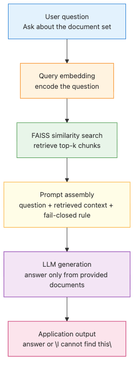
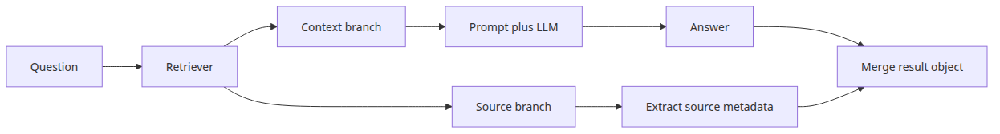
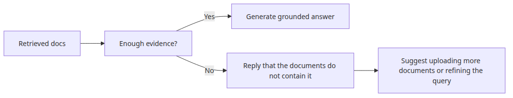
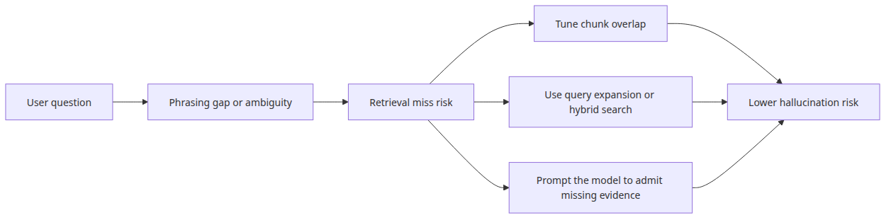

# RAG Q&A pattern — document-based question answering

RAG is easier to reason about when you stop treating it as a smarter model and start treating it as a retrieval pipeline. Answer quality depends less on model mystique and more on whether the right chunks are found and injected at the right moment.

This is post 2 in the AI App Patterns 101 series. Here we build the smallest useful RAG Q&A pipeline and walk through how retrieval and generation fit together.

## Questions this post answers

- How should a minimal RAG pipeline connect chunking, embedding, retrieval, and answer generation?
- Can a small FAISS-based example return answer text together with evidence snippets?
- Where do you design against hallucination when the answer is not in the documents?

> RAG is not a model that memorizes answers; it is a pipeline that injects retrieved documents into the prompt before generation.


*Questions this post answers*
> AI App Patterns 101 (2/6)

Example code: [github.com/yeongseon-books/ai-app-patterns-101](https://github.com/yeongseon-books/ai-app-patterns-101/tree/main/en/02-rag-qa-pattern)

RAG (Retrieval-Augmented Generation) addresses two persistent LLM limitations. First, LLMs do not know about events after their training cutoff. Second, they have no access to private or proprietary data. RAG patches both gaps by retrieving relevant documents at query time and injecting them into the prompt.

This post builds a complete RAG Q&A pipeline step by step.

Topics:

- the two phases of RAG: indexing and retrieval
- a complete RAG Q&A chain
- prompt design for better answer quality
- returning answers with source attribution
- when RAG fails and how to respond

---

## The two phases of RAG

### Offline indexing pipeline


*Offline indexing pipeline*
**Indexing** (offline): split documents into chunks, embed them, store in a vector index.

**Retrieval** (online): embed the query, find similar chunks, inject them into the prompt.

```text
indexing:  documents → chunking → embedding → FAISS
retrieval: query → embedding → FAISS search → prompt injection → LLM → answer
```

---

## Complete RAG Q&A implementation

### Online question answering flow



*Online question answering flow*
```python
import os

from langchain_community.embeddings import HuggingFaceEmbeddings
from langchain_community.vectorstores import FAISS
from langchain_core.output_parsers import StrOutputParser
from langchain_core.prompts import ChatPromptTemplate
from langchain_core.runnables import RunnablePassthrough
from langchain_groq import ChatGroq
from langchain_text_splitters import RecursiveCharacterTextSplitter

embedding_model = HuggingFaceEmbeddings(
    model_name="sentence-transformers/all-MiniLM-L6-v2",
    model_kwargs={"device": "cpu"},
    encode_kwargs={"normalize_embeddings": True},
)

documents = [
    """
Python is a high-level programming language created by Guido van Rossum in 1991.
It uses indentation to delimit code blocks, which is unusual among mainstream languages.
Python supports dynamic typing and automatic memory management.
It is widely used in web development, data science, and artificial intelligence.
""",
    """
Python's primary strength is readability.
It was designed to read like English prose.
Python has a large standard library and a vast third-party package ecosystem.
Hundreds of thousands of packages can be installed with the pip package manager.
""",
    """
One of Python's main weaknesses is execution speed.
As an interpreted language, it is slower than C or Java for CPU-bound tasks.
The GIL (Global Interpreter Lock) limits multi-threaded performance.
Python is rarely used for mobile application development.
""",
    """
Python version history: Python 2 was released in 2000, Python 3 in 2008.
Python 2 reached its official end of life in January 2020.
Python 3.10 or later is recommended for new projects.
A new minor version is released each October.
""",
]

splitter = RecursiveCharacterTextSplitter(chunk_size=200, chunk_overlap=20)
chunks = []
for doc in documents:
    chunks.extend(splitter.split_text(doc))

vectorstore = FAISS.from_texts(texts=chunks, embedding=embedding_model)
retriever = vectorstore.as_retriever(search_kwargs={"k": 3})

llm = ChatGroq(
    model="llama-3.1-8b-instant",
    api_key=os.environ["GROQ_API_KEY"],
)

prompt = ChatPromptTemplate.from_messages([
    (
        "system",
        "Answer the question using only the reference documents below.\n"
        "If the answer is not in the documents, say 'I cannot find this in the provided documents'.\n"
        "Do not speculate.\n\n"
        "Reference documents:\n{context}",
    ),
    ("human", "{question}"),
])

def format_docs(docs: list) -> str:
    return "\n\n".join(doc.page_content for doc in docs)

rag_chain = (
    {
        "context": retriever | format_docs,
        "question": RunnablePassthrough(),
    }
    | prompt
    | llm
    | StrOutputParser()
)

test_questions = [
    "Who created Python?",
    "What are Python's weaknesses?",
    "When did Python 2 reach end of life?",
    "Can you build iOS apps with Python?",
    "What are the features of the Rust language?",  # not in documents
]

for question in test_questions:
    print(f"\nquestion: {question}")
    answer = rag_chain.invoke(question)
    print(f"answer: {answer}")
```

The point of this example is not just that the chain works when the answer exists. It also forces one operational rule into the prompt: **if the evidence is missing, fail closed instead of filling the gap with model confidence**. That is the difference between a demo that looks plausible and a retrieval pipeline you can debug.

---

## Inspect retrieval before blaming generation

### Retrieval inspection with scores and chunk metadata


*Online question answering flow*
Before tuning the prompt, inspect what the retriever is actually returning. If the wrong chunk ranks first, generation quality is already capped.

```python
from langchain_core.documents import Document

docs = [
    Document(
        page_content="Python was created by Guido van Rossum in 1991.",
        metadata={"source": "python_intro.txt", "section": "history"},
    ),
    Document(
        page_content="Python's primary strength is readability and its broad package ecosystem.",
        metadata={"source": "python_features.txt", "section": "strengths"},
    ),
    Document(
        page_content="Python is slower than C for CPU-bound work and the GIL limits some threaded workloads.",
        metadata={"source": "python_limits.txt", "section": "weaknesses"},
    ),
]

vectorstore = FAISS.from_documents(docs, embedding_model)

def inspect_retrieval(query: str, top_k: int = 3) -> None:
    matches = vectorstore.similarity_search_with_relevance_scores(query, k=top_k)
    print(f"query: {query}")
    for rank, (doc, score) in enumerate(matches, start=1):
        print(
            f"  {rank}. score={score:.3f} "
            f"source={doc.metadata['source']} "
            f"section={doc.metadata['section']}"
        )
        print(f"     {doc.page_content}")

inspect_retrieval("Why is Python sometimes slow?")
inspect_retrieval("Who created Python?")
```

**Expected output:**

```text
query: Why is Python sometimes slow?
  1. score=0.91 source=python_limits.txt section=weaknesses
     Python is slower than C for CPU-bound work and the GIL limits some threaded workloads.

query: Who created Python?
  1. score=0.94 source=python_intro.txt section=history
     Python was created by Guido van Rossum in 1991.
```

If the best match is wrong, do not start with prompt rewrites. Check chunk boundaries, metadata quality, and whether the embedding model captures the way your users phrase the question.

---

## Returning answers with source attribution

### Answer and source return structure



*Answer and source return structure*
Showing which document supported the answer improves user trust.

```python
import os

from langchain_community.embeddings import HuggingFaceEmbeddings
from langchain_community.vectorstores import FAISS
from langchain_core.output_parsers import StrOutputParser
from langchain_core.prompts import ChatPromptTemplate
from langchain_core.runnables import RunnableParallel, RunnablePassthrough
from langchain_groq import ChatGroq

embedding_model = HuggingFaceEmbeddings(
    model_name="sentence-transformers/all-MiniLM-L6-v2",
    model_kwargs={"device": "cpu"},
    encode_kwargs={"normalize_embeddings": True},
)

documents_with_metadata = [
    ("Python is a high-level language created by Guido van Rossum in 1991.", {"source": "python_intro.txt", "page": 1}),
    ("Python's primary strength is readability.", {"source": "python_features.txt", "page": 1}),
    ("One of Python's main weaknesses is execution speed.", {"source": "python_cons.txt", "page": 1}),
]

texts = [text for text, _ in documents_with_metadata]
metadatas = [meta for _, meta in documents_with_metadata]

vectorstore = FAISS.from_texts(
    texts=texts,
    embedding=embedding_model,
    metadatas=metadatas,
)
retriever = vectorstore.as_retriever(search_kwargs={"k": 2})

llm = ChatGroq(
    model="llama-3.1-8b-instant",
    api_key=os.environ["GROQ_API_KEY"],
)

prompt = ChatPromptTemplate.from_messages([
    ("system", "Answer the question using only the documents below:\n{context}"),
    ("human", "{question}"),
])

def format_docs(docs: list) -> str:
    return "\n\n".join(doc.page_content for doc in docs)

def get_sources(docs: list) -> list[str]:
    return [doc.metadata.get("source", "unknown") for doc in docs]

rag_with_sources = RunnableParallel(
    answer=(
        {"context": retriever | format_docs, "question": RunnablePassthrough()}
        | prompt
        | llm
        | StrOutputParser()
    ),
    sources=retriever | get_sources,
)

result = rag_with_sources.invoke("Who created Python?")
print(f"answer: {result['answer']}")
print(f"sources: {result['sources']}")
```

---

## Guard the answer path when evidence is weak

### Fallback branch driven by minimum relevance



*Fallback branch for missing evidence*
The prompt alone is not enough. In production, add an application-side guard that checks whether retrieval produced evidence strong enough to justify generation.

```python
from langchain_core.documents import Document

MIN_RELEVANCE = 0.80

docs = [
    Document(page_content=text, metadata=meta)
    for text, meta in documents_with_metadata
]
vectorstore = FAISS.from_documents(docs, embedding_model)

def answer_with_guard(question: str) -> dict:
    matches = vectorstore.similarity_search_with_relevance_scores(question, k=3)

    if not matches or matches[0][1] < MIN_RELEVANCE:
        return {
            "route": "fallback_no_evidence",
            "answer": "I cannot find this in the indexed documents.",
            "sources": [],
        }

    selected_docs = [doc for doc, _ in matches]
    context = format_docs(selected_docs)
    answer = (prompt | llm | StrOutputParser()).invoke({
        "context": context,
        "question": question,
    })

    return {
        "route": "answer_from_documents",
        "answer": answer,
        "sources": get_sources(selected_docs),
    }

print(answer_with_guard("Who created Python?"))
print(answer_with_guard("What are the main features of Rust?"))
```

**Expected output:**

```text
{'route': 'answer_from_documents', 'answer': 'Python was created by Guido van Rossum in 1991.', 'sources': ['python_intro.txt']}
{'route': 'fallback_no_evidence', 'answer': 'I cannot find this in the indexed documents.', 'sources': []}
```

This is the point where many RAG systems become safer. You stop asking the model to self-police retrieval quality and instead let the application decide when evidence is insufficient.

---

## When RAG fails

### Defense layers against retrieval misses



*Defense layers against retrieval misses*
### Fallback branch for missing evidence


*Fallback branch for missing evidence*
**The relevant chunk was not retrieved.** If the query does not match any stored chunk, the LLM falls back on its internal knowledge and may hallucinate. The prompt instruction "say you don't know if it's not in the documents" is the first line of defense.

**Information splits across chunk boundaries.** Important context that spans two chunks may not appear complete in any single retrieved result. Sufficient `chunk_overlap` reduces this risk.

**Query and document phrasing diverge too much.** A casual query like "is python slow?" may not match a chunk containing "interpreted language execution performance". Query expansion or hybrid search helps here.

### First checks when answers look wrong

When a RAG answer looks weak, inspect in this order:

1. **retrieval ranking** — did the right chunk appear in the top-k at all?
2. **chunk shape** — was the evidence split too aggressively or mixed with unrelated text?
3. **fallback threshold** — did the app allow generation even though the evidence quality was low?
4. **prompt contract** — does the answer prompt clearly forbid speculation and require evidence-only answers?

---

## What to notice in this code

- `main.py` uses `RecursiveCharacterTextSplitter` for chunking and `FAISS.from_texts()` for immediate indexing.
- The script keeps the retrieved `Document` objects around so it can print both the answer and the supporting sources.
- The prompt explicitly says to answer only from context and admit when the documents do not contain the answer.

---

## Where engineers get confused

- Many teams blame the generator first, but chunking strategy and retriever settings are often the real source of poor RAG quality.
- The embedding model and the answer-generation model solve different problems; they do not need to match.
- Increasing top-k is not automatically better because extra noisy chunks can dilute the useful context.

---

## Checklist

- [ ] Documents are split into chunks before indexing
- [ ] The retriever runs before answer generation
- [ ] The final output includes source file names
- [ ] The prompt constrains the model to admit when the documents do not contain the answer

---

## Conclusion

RAG Q&A is the most practical pattern for giving an LLM access to knowledge it was not trained on. The prompt instruction to say "I don't know" when information is absent is the simplest hallucination guard.

The next post covers the document assistant pattern: summarization, information extraction, and classification applied to structured document processing tasks.

<!-- toc:begin -->
## In this series

- [Chatbot pattern — managing conversation history and state](./01-chatbot-pattern.md)
- **RAG Q&A pattern — document-based question answering (current)**
- Document assistant — summarization, extraction, classification (upcoming)
- Agent and tool pattern — autonomous tool selection (upcoming)
- Workflow automation — designing multi-step chains (upcoming)
- Human-in-the-loop — designing for human intervention (upcoming)

<!-- toc:end -->

---

## References

- [LangChain RAG tutorial](https://python.langchain.com/docs/use_cases/question_answering/)
- [RAG paper (Lewis et al., 2020)](https://arxiv.org/abs/2005.11401)
- [FAISS VectorStore](https://python.langchain.com/docs/integrations/vectorstores/faiss/)

Tags: LLM, RAG, Agent, Python
