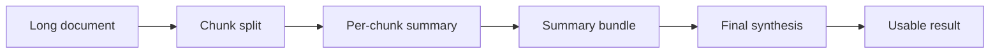

# Document assistant — summarization, extraction, classification

## Questions this post answers

- What chain structure keeps summarization stable when a document is too long for one prompt?
- How should chunk-level processing and final synthesis be separated in a summarization pipeline?
- Why does the document assistant pattern fit batch processing better than a chatbot?

> A document assistant is not a conversational system; it is a transformer that turns long input into short, task-shaped output.



> AI App Patterns 101 (3/6)

Example code: [github.com/yeongseon-books/ai-app-patterns-101](https://github.com/yeongseon-books/ai-app-patterns-101/tree/main/en/03-document-assistant)

The document assistant pattern takes a document as input and performs a specific processing task on it. Unlike a chatbot or RAG pipeline, there is no ongoing conversation: the document is the input, and a structured or condensed result is the output. LLMs handle summarization, information extraction, and classification well because all three reduce to the same operation — read the document, apply a rule, return structured text.

Topics:

- summarization with style and audience control
- Map-Reduce for documents that exceed the context window
- structured information extraction with JSON output
- multi-class document classification

---

<!-- ebook-only:start -->

**The key idea**: a document assistant turns long text into short structure. Summarization, extraction, and classification are all variations on the same Prompt-LLM pipe.

## Where this chapter fits

This is chapter 3 of 6 in the series.
The previous chapter covered **RAG Q&A pattern — document-based question answering**.
After this chapter, the next one moves on to **Agent and tool pattern — autonomous tool selection**.
<!-- ebook-only:end -->

## Document summarization

For short documents, pass the full text directly and request a summary. Parameterizing style, length, and audience lets the same chain serve different consumers.

```python
import os

from langchain_core.output_parsers import StrOutputParser
from langchain_core.prompts import ChatPromptTemplate
from langchain_groq import ChatGroq

llm = ChatGroq(
    model="llama-3.1-8b-instant",
    api_key=os.environ["GROQ_API_KEY"],
)

summarize_prompt = ChatPromptTemplate.from_messages([
    (
        "system",
        "Summarize the following document in a {style} style.\n"
        "Length: {length}\n"
        "Audience: {audience}",
    ),
    ("human", "Document:\n{document}"),
])

chain = summarize_prompt | llm | StrOutputParser()

document = """
A 2024 Python developer survey found Python ranked as the most popular programming
language for the fifth consecutive year. Sixty-seven percent of respondents use Python
as their primary language; of those, 45 percent apply it to data science and machine
learning workloads. Web development accounts for 28 percent of use cases, and
automation scripting for 18 percent.

Python 3.12 delivered a 25 percent performance improvement over the prior version
and strengthened type hint support. Eighty-nine percent of respondents run Python 3.x;
only 2 percent still use Python 2.x.

The most-used frameworks are FastAPI (52 percent), Django (38 percent), and Flask
(34 percent). In the data science domain, pandas (78 percent), numpy (72 percent),
and scikit-learn (65 percent) dominate.
"""

exec_summary = chain.invoke({
    "document": document,
    "style": "business-focused",
    "length": "three sentences or fewer",
    "audience": "non-technical executives",
})
print("=== Executive summary ===")
print(exec_summary)

dev_summary = chain.invoke({
    "document": document,
    "style": "technical",
    "length": "five bullet points",
    "audience": "senior engineers",
})
print("\n=== Developer summary ===")
print(dev_summary)
```

---

## Long document summarization — Map-Reduce

When a document exceeds the context window it cannot be processed in one call. Map-Reduce splits the document into chunks, summarizes each independently (Map), then merges those summaries into a single coherent result (Reduce).

```python
import os

from langchain_core.output_parsers import StrOutputParser
from langchain_core.prompts import ChatPromptTemplate
from langchain_groq import ChatGroq
from langchain_text_splitters import RecursiveCharacterTextSplitter

llm = ChatGroq(
    model="llama-3.1-8b-instant",
    api_key=os.environ["GROQ_API_KEY"],
)

map_prompt = ChatPromptTemplate.from_messages([
    ("system", "Summarize the following text segment in two to three sentences, keeping only the key points."),
    ("human", "{chunk}"),
])

reduce_prompt = ChatPromptTemplate.from_messages([
    (
        "system",
        "You have received summaries of multiple document segments.\n"
        "Merge them into a single coherent summary.\n"
        "Remove duplicates and preserve logical flow.",
    ),
    ("human", "Segment summaries:\n{summaries}"),
])

map_chain = map_prompt | llm | StrOutputParser()
reduce_chain = reduce_prompt | llm | StrOutputParser()

def map_reduce_summarize(long_document: str) -> str:
    splitter = RecursiveCharacterTextSplitter(chunk_size=500, chunk_overlap=50)
    chunks = splitter.split_text(long_document)
    print(f"  chunks: {len(chunks)}")

    # Map: summarize each chunk independently
    chunk_summaries = []
    for i, chunk in enumerate(chunks):
        summary = map_chain.invoke({"chunk": chunk})
        chunk_summaries.append(summary)
        print(f"  chunk {i + 1}/{len(chunks)} summarized")

    # Reduce: merge all summaries
    combined = "\n\n".join(
        f"[Segment {i + 1}] {s}" for i, s in enumerate(chunk_summaries)
    )
    return reduce_chain.invoke({"summaries": combined})

long_doc = """
Artificial intelligence (AI) is the field of computer science dedicated to simulating
human cognitive ability in machines. Alan Turing posed the foundational question —
"Can machines think?" — in the 1950s, and the field has since gone through multiple
cycles of enthusiasm and disillusionment.

Machine learning is a subfield of AI in which computers learn rules from data rather
than executing explicitly programmed instructions. Decision trees, random forests, and
support vector machines are representative algorithms.

Deep learning is a branch of machine learning that uses artificial neural networks
modeled on the human brain. The field gained widespread attention after a deep learning
model dominated the 2012 ImageNet competition by a large margin. It has since driven
breakthroughs in image recognition, speech recognition, and natural language processing.

Large language models (LLMs) are deep learning models trained on massive text corpora.
GPT, BERT, and LLaMA are prominent examples. They handle text generation, summarization,
translation, and code writing, among other tasks. ChatGPT's release in late 2022 brought
LLMs into mainstream public awareness.

The future of AI is promising but comes with substantial challenges. Explainability,
bias, privacy, energy consumption, and labor displacement require coordinated social
responses. At the same time, AI is expected to play a central role in addressing
pressing problems in medicine, climate change, and education.
"""

print("Starting Map-Reduce summarization...")
final = map_reduce_summarize(long_doc)
print(f"\n=== Final summary ===\n{final}")
```

---

## Information extraction

Unstructured text often contains structured data that downstream systems need. Prompt the LLM to extract specific fields and return them as JSON, then parse the output with `JsonOutputParser`.

```python
import os

from langchain_core.output_parsers import JsonOutputParser
from langchain_core.prompts import ChatPromptTemplate
from langchain_groq import ChatGroq

llm = ChatGroq(
    model="llama-3.1-8b-instant",
    api_key=os.environ["GROQ_API_KEY"],
)

extract_prompt = ChatPromptTemplate.from_messages([
    (
        "system",
        "Extract information from the text below and return it as JSON only. "
        "Do not include any other text.\n\n"
        "Fields to extract:\n{schema}",
    ),
    ("human", "Text:\n{text}"),
])

chain = extract_prompt | llm | JsonOutputParser()

job_schema = """
{
  "company": "company name",
  "position": "job title",
  "location": "location",
  "salary_range": "salary range (null if not mentioned)",
  "required_skills": ["list of required skills"],
  "experience_years": "years of experience as a number (null if not mentioned)",
  "employment_type": "full-time / contract / freelance"
}"""

job_postings = [
    """
    ABCTech is hiring a senior backend engineer in Gangnam, Seoul.
    Salary range 80M-120M KRW. Five or more years with Python/Django required.
    AWS and Docker experience a plus. Full-time position.
    """,
    """
    Startup XYZ is looking for a full-stack developer. Remote work available.
    Proficiency in React, Node.js, and PostgreSQL required. Three or more years.
    Contract role with potential conversion to full-time.
    """,
]

for i, posting in enumerate(job_postings, start=1):
    print(f"\n=== Job posting {i} ===")
    result = chain.invoke({"text": posting, "schema": job_schema})
    for key, value in result.items():
        print(f"  {key}: {value}")
```

---

## Document classification

Classifying documents into categories is a common preprocessing step in content pipelines, support ticket routing, and compliance workflows.

```python
import os

from langchain_core.output_parsers import JsonOutputParser
from langchain_core.prompts import ChatPromptTemplate
from langchain_groq import ChatGroq

llm = ChatGroq(
    model="llama-3.1-8b-instant",
    api_key=os.environ["GROQ_API_KEY"],
)

classify_prompt = ChatPromptTemplate.from_messages([
    (
        "system",
        "Classify the following text. Return JSON only.\n\n"
        "Available categories: {categories}\n\n"
        'Format: {{"category": "category name", "confidence": 0 to 1, "reason": "brief reason"}}',
    ),
    ("human", "Text:\n{text}"),
])

chain = classify_prompt | llm | JsonOutputParser()

categories = "Technology/IT, Business/Finance, Health/Medicine, Sports, Entertainment, Other"

texts = [
    "Python 3.12 significantly improved generic type handling speed, reducing overhead by 25 percent.",
    "Operating profit for Q3 rose 15 percent year-over-year, driven by expansion into overseas markets.",
    "A new study reports that regular aerobic exercise reduces cardiovascular disease risk by 30 percent.",
    "Real Madrid defeated Manchester City 2-1 in the Champions League final to claim the title.",
]

for text in texts:
    result = chain.invoke({"text": text, "categories": categories})
    print(f"text: {text[:60]}...")
    print(f"  category: {result.get('category')}, confidence: {result.get('confidence'):.2f}")
    print(f"  reason: {result.get('reason')}\n")
```

---

## What to notice in this code

- `main.py` separates the map and reduce phases explicitly so a long document can be processed across multiple model calls.
- Printing each intermediate chunk summary makes it easier to debug where information was lost.
- The same pattern generalizes from summarization to extraction or classification batches.

---

## Where engineers get confused

- Teams often reach for a larger model first, but chunk size and overlap usually matter more to summary quality.
- Map-Reduce parallelizes well, but it weakens cross-chunk global context, which makes the reduce prompt critical.
- Document summarization and document Q&A may look similar at the input layer, but they optimize for different production metrics.

---

## Checklist

- [ ] The long document is split into multiple chunks
- [ ] Each chunk is summarized independently
- [ ] Those partial summaries are merged into one final summary
- [ ] The final synthesis prompt is responsible for deduplication and coherence

---

## Conclusion

Summarization, extraction, and classification cover the majority of document processing use cases. Keep each chain focused on one task: mixing summarization with extraction in a single prompt reliably degrades output quality. For long documents, Map-Reduce is the standard approach — chunk, map independently, reduce once.

The next post covers the Agent and Tool pattern, where the LLM autonomously selects and calls tools to answer questions it cannot handle from context alone.

<!-- blog-only:start -->
Next: [Agent and tool pattern — autonomous tool selection](./04-agent-tool-pattern.md)
<!-- blog-only:end -->

<!-- toc:begin -->
## In this series

- [Chatbot pattern — managing conversation history and state](./01-chatbot-pattern.md)
- [RAG Q&A pattern — document-based question answering](./02-rag-qa-pattern.md)
- **Document assistant — summarization, extraction, classification (current)**
- Agent and tool pattern — autonomous tool selection (upcoming)
- Workflow automation — designing multi-step chains (upcoming)
- Human-in-the-loop — designing for human intervention (upcoming)

<!-- toc:end -->

---

## References

- [LangChain summarization guide](https://python.langchain.com/docs/use_cases/summarization/)
- [JsonOutputParser](https://python.langchain.com/docs/modules/model_io/output_parsers/json/)
- [Map-Reduce pattern](https://python.langchain.com/docs/use_cases/summarization/#option-2-map-reduce)

Tags: LLM, RAG, Agent, Python
