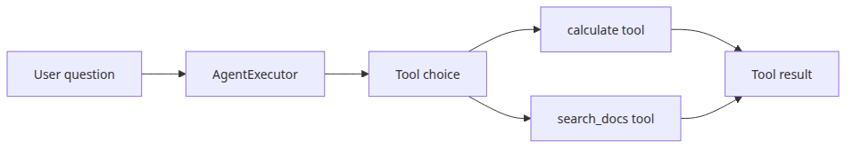
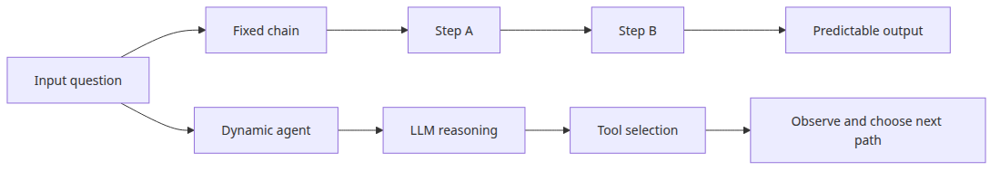
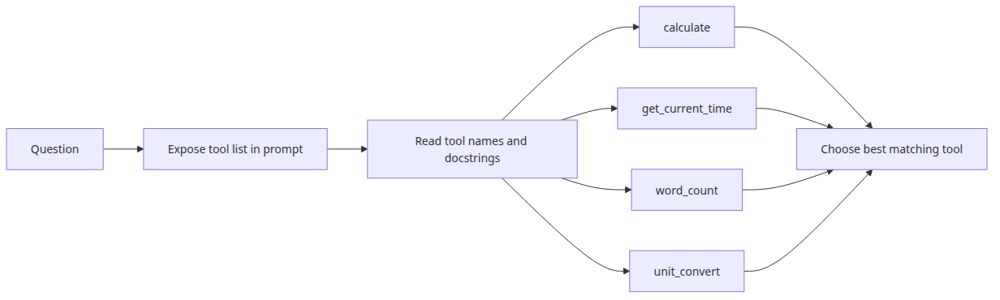
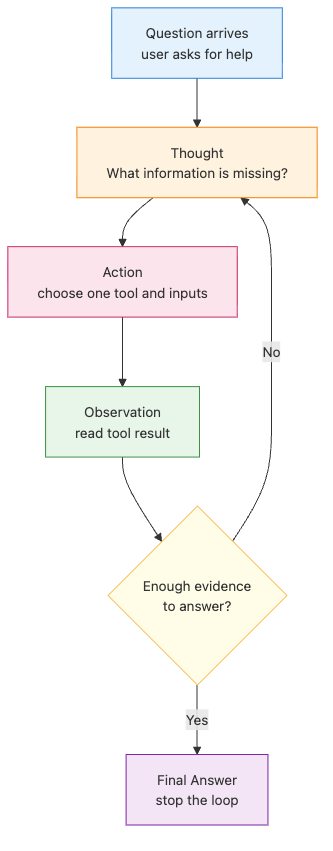
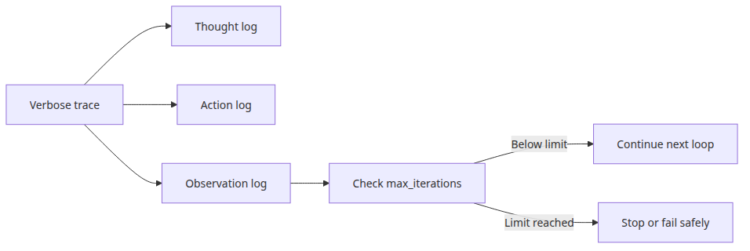
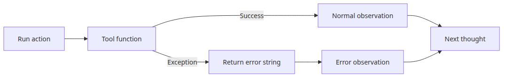

# Agent and tool pattern — autonomous tool selection

Some problems stop fitting a fixed chain the moment the next step depends on what the model discovers during execution. At that point, the real design question is not whether agents are powerful, but how narrowly you can define the tool choices and the control loop around them.

This is post 4 in the AI App Patterns 101 series. Here we examine when the agent-and-tool pattern is justified and how to make tool selection observable and debuggable.

## Questions this post answers

- When does it make sense to use `AgentExecutor` instead of a fixed chain?
- How should tool descriptions be written so the LLM can choose correctly between a calculator and a search tool?
- What execution traces matter when debugging a tool-selecting agent?

> An agent is a controller that lets the model choose tool-call paths at runtime instead of hardcoding every step ahead of time.



*Questions this post answers*
> AI App Patterns 101 (4/6)

Example code: [github.com/yeongseon-books/ai-app-patterns-101](https://github.com/yeongseon-books/ai-app-patterns-101/tree/main/en/04-agent-tool-pattern)

Every chain built so far has a fixed execution path: input enters, steps run in order, output exits. The agent pattern changes this. The LLM decides which tool to call, inspects the result, and then decides what to do next — including whether to call another tool or produce a final answer.

Topics:

- agent vs chain — what changes and why
- defining and registering tools
- building a ReAct agent
- composing multiple tools

---

## Agent vs chain

### Fixed chain versus dynamic agent



*Fixed chain versus dynamic agent*
**Chain**: input → step A → step B → output. The execution path is determined at design time.

**Agent**: input → LLM reasons → selects tool → executes tool → observes result → repeats if needed → final answer. The execution path is determined at runtime.

Agents use the ReAct (Reason + Act) loop: Thought → Action → Observation, repeated until the LLM determines it has enough information to answer. The LLM writes its reasoning, names a tool, supplies its arguments, reads the tool output, and then reasons again.

---

## Defining tools

### Tool registry and selection surface



*Tool registry and selection surface*
In LangChain, a tool is a Python function decorated with `@tool`. The docstring becomes the description the LLM reads when deciding which tool to use. Write it precisely — a vague docstring leads to wrong tool selection.

```python
import math
import os
from datetime import datetime

from langchain_core.tools import tool

@tool
def calculate(expression: str) -> str:
    """
    Evaluate a mathematical expression and return the result.
    Examples: '2 + 3 * 4', 'sqrt(16)', 'pow(2, 10)'
    Uses Python expression syntax. Only math functions are allowed.
    """
    try:
        allowed = {
            "sqrt": math.sqrt,
            "pow": math.pow,
            "abs": abs,
            "round": round,
            "pi": math.pi,
            "e": math.e,
        }
        result = eval(expression, {"__builtins__": {}}, allowed)
        return str(result)
    except Exception as exc:
        return f"calculation error: {exc}"

@tool
def get_current_time(timezone: str = "Asia/Seoul") -> str:
    """
    Return the current date and time.
    The timezone parameter accepts a timezone name (default: Asia/Seoul).
    """
    now = datetime.now()
    return f"current time: {now.strftime('%Y-%m-%d %H:%M')} ({timezone})"

@tool
def word_count(text: str) -> str:
    """
    Return the word count and character count of the given text.
    """
    words = len(text.split())
    chars = len(text)
    chars_no_space = len(text.replace(" ", ""))
    return f"words: {words}, characters: {chars} (excluding spaces: {chars_no_space})"

@tool
def unit_convert(value: float, from_unit: str, to_unit: str) -> str:
    """
    Convert a value between units.
    Supported conversions: km/mile, kg/lb, celsius/fahrenheit, m/ft.
    Example: value=100, from_unit='km', to_unit='mile'
    """
    conversions = {
        ("km", "mile"): lambda x: x * 0.621371,
        ("mile", "km"): lambda x: x * 1.60934,
        ("kg", "lb"): lambda x: x * 2.20462,
        ("lb", "kg"): lambda x: x * 0.453592,
        ("celsius", "fahrenheit"): lambda x: x * 9 / 5 + 32,
        ("fahrenheit", "celsius"): lambda x: (x - 32) * 5 / 9,
        ("m", "ft"): lambda x: x * 3.28084,
        ("ft", "m"): lambda x: x * 0.3048,
    }
    key = (from_unit.lower(), to_unit.lower())
    if key not in conversions:
        return f"unsupported conversion: {from_unit} to {to_unit}"
    result = conversions[key](value)
    return f"{value} {from_unit} = {result:.4f} {to_unit}"
```

---

## Building a ReAct agent

### Thought action observation loop



*Thought action observation loop*
```python
import os

from langchain.agents import AgentExecutor, create_react_agent
from langchain_core.prompts import PromptTemplate
from langchain_groq import ChatGroq

llm = ChatGroq(
    model="llama-3.1-8b-instant",
    api_key=os.environ["GROQ_API_KEY"],
)

tools = [calculate, get_current_time, word_count, unit_convert]

# ReAct prompt — instructs the LLM to follow the Thought/Action/Observation loop
react_prompt = PromptTemplate.from_template("""
You are an AI assistant that answers questions using the tools available to you.

Available tools:
{tools}

Tool names: {tool_names}

You MUST follow this exact format:

Question: the question to answer
Thought: think about how to approach the question
Action: the name of the tool to use (must be one from the tool names list)
Action Input: the input to pass to the tool
Observation: the result returned by the tool
... (repeat Thought/Action/Action Input/Observation as needed)
Thought: I now know the final answer
Final Answer: the final answer to the question

Begin!

Question: {input}
Thought: {agent_scratchpad}
""")

agent = create_react_agent(llm=llm, tools=tools, prompt=react_prompt)
agent_executor = AgentExecutor(
    agent=agent,
    tools=tools,
    verbose=True,
    max_iterations=5,
    handle_parsing_errors=True,
)

questions = [
    "What is 2 to the power of 10?",
    "What time is it now?",
    "How many miles is 100 kilometers?",
    "Count the words in this text, then multiply by 2: 'The quick brown fox jumps over the lazy dog'",
]

for question in questions:
    print(f"\n{'=' * 60}")
    print(f"question: {question}")
    result = agent_executor.invoke({"input": question})
    print(f"final answer: {result['output']}")
```

---

## Observing the agent's reasoning

### Execution trace and stopping conditions



*Execution trace and stopping conditions*
With `verbose=True`, the console prints every Thought, Action, Action Input, and Observation. For a simple question, the agent usually completes in one round. For a two-step question — count words, then multiply — it completes in two rounds, using the output of the first tool as input to the next computation.

`max_iterations` prevents infinite loops. Five to ten iterations cover most practical tasks.

---

## Handling tool errors gracefully

### Returning tool errors as observations



*Returning tool errors as observations*
If a tool raises an unhandled exception, the agent stops. Catching exceptions inside the tool and returning a descriptive error string keeps the agent running. The error string becomes the Observation, and the LLM can decide to try a different approach or explain the failure.

```python
@tool
def safe_divide(a: float, b: float) -> str:
    """Divide a by b. Returns an error message if b is zero."""
    if b == 0:
        return "error: cannot divide by zero"
    return str(a / b)
```

---

## What to notice in this code

- `main.py` splits the `AgentExecutor` demo into a calculator executor and a search executor to show the smallest reliable tool-selection pattern.
- Each tool uses `@tool(return_direct=True)` so the selected tool result comes back directly.
- Short prompts and narrow tool descriptions reduce function-calling failure modes.

---

## Where engineers get confused

- Agents are not automatically smarter; they trade predictability for runtime flexibility.
- If the tools are weak, the agent is weak. The bottleneck is often the tool interface, not the LLM.
- A search tool and RAG can look similar from far away, but one is tool invocation and the other is prompt-context injection.

---

## Checklist

- [ ] Each tool has a clear description and input shape
- [ ] The AgentExecutor invokes the calculator tool once
- [ ] The AgentExecutor invokes the search tool once
- [ ] The selected tool result is returned directly to the caller

---

## Conclusion

The agent pattern extends chain-based LLM apps into systems that can reason across multiple steps and tools. The docstring is the only signal the LLM has for tool selection — treat it as a contract, not a comment. Keep tools narrow and focused: one clear responsibility each, error messages instead of exceptions, and deterministic behavior for the same input.

The next post covers workflow automation: designing multi-step chains where each stage transforms data and passes it to the next.

<!-- toc:begin -->
## In this series

- [Chatbot pattern — managing conversation history and state](./01-chatbot-pattern.md)
- [RAG Q&A pattern — document-based question answering](./02-rag-qa-pattern.md)
- [Document assistant — summarization, extraction, classification](./03-document-assistant.md)
- **Agent and tool pattern — autonomous tool selection (current)**
- Workflow automation — designing multi-step chains (upcoming)
- Human-in-the-loop — designing for human intervention (upcoming)

<!-- toc:end -->

---

## References

- [LangChain agents overview](https://python.langchain.com/docs/modules/agents/)
- [ReAct paper (Yao et al., 2022)](https://arxiv.org/abs/2210.03629)
- [LangChain tool definition](https://python.langchain.com/docs/modules/tools/)

Tags: LLM, RAG, Agent, Python
