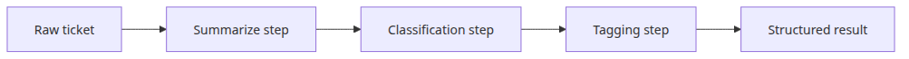

# Workflow automation — designing multi-step chains

## Questions this post answers

- How should intermediate outputs be structured when several LLM stages are chained together?
- Where should a summary → classification → tagging workflow detect and surface failure?
- In what situations is a fixed workflow better than an agent?

> Workflow automation removes model choice and replaces it with a pipeline that follows human-defined stages and data contracts.


> AI App Patterns 101 (5/6)

Example code: [github.com/yeongseon-books/ai-app-patterns-101](https://github.com/yeongseon-books/ai-app-patterns-101/tree/main/en/05-workflow-automation)

Some tasks resist a single LLM call. Receiving a customer inquiry, classifying it, applying category-specific logic, then generating a response is one example. Workflow automation connects these stages into a coherent pipeline using LangChain LCEL.

Topics:

- building sequential chains
- routing — branching based on intermediate output
- a practical multi-stage code review pipeline
- passing each stage's output cleanly to the next

---

## Sequential chains

LCEL's `|` operator connects stages: the left stage's output becomes the right stage's input.

```python
import os

from langchain_core.output_parsers import StrOutputParser
from langchain_core.prompts import ChatPromptTemplate
from langchain_groq import ChatGroq

llm = ChatGroq(
    model="llama-3.1-8b-instant",
    api_key=os.environ["GROQ_API_KEY"],
)

translate_prompt = ChatPromptTemplate.from_messages([
    ("system", "Translate the following text to {target_language}. Return only the translation."),
    ("human", "{text}"),
])

summarize_prompt = ChatPromptTemplate.from_messages([
    ("system", "Summarize the following text in two sentences."),
    ("human", "{text}"),
])

title_prompt = ChatPromptTemplate.from_messages([
    ("system", "Generate a one-line title for the following text."),
    ("human", "{text}"),
])

str_parser = StrOutputParser()

def make_pipeline(target_language: str):
    """Return translate → summarize → title functions for the given language."""

    def translate(inputs: dict) -> dict:
        translated = (translate_prompt | llm | str_parser).invoke({
            "text": inputs["text"],
            "target_language": target_language,
        })
        return {"text": translated}

    def summarize(inputs: dict) -> dict:
        summary = (summarize_prompt | llm | str_parser).invoke(inputs)
        return {"text": summary}

    def make_title(inputs: dict) -> str:
        return (title_prompt | llm | str_parser).invoke(inputs)

    return translate, summarize, make_title

article = """
Artificial intelligence is transforming the way businesses operate.
Companies across industries are adopting AI tools to automate repetitive tasks,
improve decision-making, and personalize customer experiences.
The healthcare sector uses AI to assist in diagnosis and drug discovery.
In finance, AI powers fraud detection and algorithmic trading.
As AI becomes more capable, organizations must also address ethical considerations
such as bias, transparency, and data privacy.
"""

translate_fn, summarize_fn, title_fn = make_pipeline("Korean")

step1 = translate_fn({"text": article})
print(f"translation:\n{step1['text']}\n")

step2 = summarize_fn(step1)
print(f"summary:\n{step2['text']}\n")

step3 = title_fn(step2)
print(f"title: {step3}")
```

~~~
Output
translation:
인공지능은 기업들이 운영 방식에 변화를 불러오고 있다.
가장 다양한 산업에 걸쳐 있는 기업들이 반복적인 임무를 자동화하고, 
결정을 개선하고, 고객 경험을 개인화하기 위해 인공지능 도구를 채택하고 있다.
건강 관리 분야에서는 인공지능이 진단에 도움을 주고, 의약품 개발에 협력한다.
금융 분야에서는 인공지능이 사기 탐지와 알고리즘 거래를 가능하게 한다.
인공지능이 더 강해질수록, 기관들은 편견, 투명성, 데이터 사생활과 같은 윤리적 고려를 해결해야 한다.

summary:
기업들이 인공지능 도구를 채택하여 반복적인 임무를 자동화하고, 고객 경험을 개선하는 등 운영 방식에 변화를 가져오고 있다. 그러나 인공지능이 더 강해질수록, 기관들은 윤리적 고려를 해결해야 하는 데에 도전을 받게 되며, 편견, 투명성, 데이터 사생활과 같은 문제를 해결해야 한다.

title: "인공지능의 성장과 함께 부정향한 문제들: 편견, 투명성, 데이터 사생활을 비롯한 윤리적 고려"
~~~

---

## Routing — branching based on classification

Classify the input first, then route it to the appropriate chain. The classifier's output is the only dependency between the two stages.

```python
import os

from langchain_core.output_parsers import StrOutputParser
from langchain_core.prompts import ChatPromptTemplate
from langchain_groq import ChatGroq

llm = ChatGroq(
    model="llama-3.1-8b-instant",
    api_key=os.environ["GROQ_API_KEY"],
)
str_parser = StrOutputParser()

classify_prompt = ChatPromptTemplate.from_messages([
    (
        "system",
        "Classify the following customer inquiry.\n"
        "Categories: BILLING, TECHNICAL, GENERAL\n"
        "Return the category name only. No other text.",
    ),
    ("human", "{inquiry}"),
])
classify_chain = classify_prompt | llm | str_parser

billing_prompt = ChatPromptTemplate.from_messages([
    (
        "system",
        "You are a billing specialist.\n"
        "Handle refunds, invoices, and charge-related inquiries.\n"
        "Be accurate and reassuring.",
    ),
    ("human", "{inquiry}"),
])

technical_prompt = ChatPromptTemplate.from_messages([
    (
        "system",
        "You are a technical support engineer.\n"
        "Handle bugs, errors, and how-to questions.\n"
        "Guide users step by step.",
    ),
    ("human", "{inquiry}"),
])

general_prompt = ChatPromptTemplate.from_messages([
    (
        "system",
        "You are a customer service representative.\n"
        "Handle general inquiries politely and helpfully.",
    ),
    ("human", "{inquiry}"),
])

billing_chain = billing_prompt | llm | str_parser
technical_chain = technical_prompt | llm | str_parser
general_chain = general_prompt | llm | str_parser

def route_and_respond(inquiry: str) -> dict:
    """Classify → route → generate specialist response."""
    category = classify_chain.invoke({"inquiry": inquiry}).strip().upper()

    chains = {
        "BILLING": billing_chain,
        "TECHNICAL": technical_chain,
        "GENERAL": general_chain,
    }
    chain = chains.get(category, general_chain)
    response = chain.invoke({"inquiry": inquiry})

    return {"category": category, "response": response}

test_inquiries = [
    "My bill doubled this month without any explanation. Please check.",
    "The app keeps crashing when I open it. What should I do?",
    "What are your business hours?",
]

for inquiry in test_inquiries:
    print(f"\ninquiry: {inquiry}")
    result = route_and_respond(inquiry)
    print(f"category: {result['category']}")
    print(f"response: {result['response']}")
```

~~~
Output

inquiry: My bill doubled this month without any explanation. Please check.
category: BILLING
response: I'd be happy to assist you with reviewing your bill. Can you please provide me with some information so I can look into this further? 

1. Your account number or customer ID (if you have it)
2. The date and amount of the original invoice
3. The new invoice date and amount that you received
4. Any additional services or features you've added or changed recently

I'll review your account details and check for any possible explanations for the increase. If there's an issue, I'll work with you to resolve it promptly.

Also, just to let you know, if there was an error or discrepancy in your account, we'll take corrective action to ensure you're only charged for the correct services. Your satisfaction is our top priority, and we appreciate your patience and understanding as we investigate this matter.

inquiry: The app keeps crashing when I open it. What should I do?
category: TECHNICAL
response: Sorry to hear that the app is crashing. Let's go through some troubleshooting steps to resolve the issue.

**Step 1: Close and Restart the App**

1. Try closing the app by swiping up and holding on your device (for iOS) or by long-pressing on the app icon and dragging it to the "Close all apps" button (for Android).
2. Wait for a few seconds, then restart the app.
3. Check if the app is still crashing.

**Step 2: Check for Updates**

1. Make sure your device is connected to the internet.
2. Open the App Store (for iOS) or Google Play Store (for Android).
3. Check for updates to the app. If an update is available, download and install it.
4. Restart the app and check if the issue is resolved.

**Step 3: Clear Cache and Data**

1. Go to your device's settings.
2. Find the app in the "Apps" or "Applications" section.
3. Select the app and look for the "Storage" or "Clear Cache" option.
4. Clear the cache and data associated with the app.
5. Restart the app and check if the issue is resolved.

**Step 4: Reinstall the App**

1. Delete the app from your device by holding on the app icon and dragging it to the "Uninstall" button (for iOS) or by long-pressing on the app icon and selecting "Uninstall" (for Android).
2. Go to the App Store (for iOS) or Google Play Store (for Android) and reinstall the app.
3. Launch the app and check if the issue is resolved.

If none of these steps resolve the issue, please provide more details about your device, the app version, and the error message you're encountering. I'll be happy to assist you further.

inquiry: What are your business hours?
category: GENERAL
response: Our business hours are from Monday to Friday, 8:00 AM to 6:00 PM, and Saturday, 9:00 AM to 5:00 PM. We are closed on Sundays and all major holidays. 

If you need assistance outside of our regular business hours, you can reach us through our automated phone system or send us an email. We will respond to your inquiry as soon as possible. 

Would you like to know more about our services or is there something specific I can help you with?
~~~

---

## Multi-stage data transformation pipeline

Each stage transforms the previous stage's output. The code review pipeline below shows three chained transformations: analysis → suggestions → report.

```python
import os

from langchain_core.output_parsers import JsonOutputParser, StrOutputParser
from langchain_core.prompts import ChatPromptTemplate
from langchain_groq import ChatGroq

llm = ChatGroq(
    model="llama-3.1-8b-instant",
    api_key=os.environ["GROQ_API_KEY"],
)

analyze_prompt = ChatPromptTemplate.from_messages([
    (
        "system",
        "Analyze the following code and return JSON only.\n"
        'Format: {{"language": "lang", "purpose": "purpose", "issues": ["issue list"], "score": 1-10}}',
    ),
    ("human", "Code:\n{code}"),
])

suggest_prompt = ChatPromptTemplate.from_messages([
    (
        "system",
        "Based on the code analysis, provide specific improvements.\n"
        "Include corrected code examples for each issue.",
    ),
    ("human", "Analysis:\n{analysis}\n\nOriginal code:\n{code}"),
])

report_prompt = ChatPromptTemplate.from_messages([
    (
        "system",
        "Summarize the code review into a concise report.\n"
        "Structure: overall assessment, key improvements, recommended actions.",
    ),
    ("human", "Analysis:\n{analysis}\n\nSuggestions:\n{suggestions}"),
])

analyze_chain = analyze_prompt | llm | JsonOutputParser()
suggest_chain = suggest_prompt | llm | StrOutputParser()
report_chain = report_prompt | llm | StrOutputParser()

def code_review_pipeline(code: str) -> dict:
    """Code analysis → suggestions → report."""
    analysis = analyze_chain.invoke({"code": code})
    print(f"  analysis done: score {analysis.get('score')}/10, {len(analysis.get('issues', []))} issues")

    suggestions = suggest_chain.invoke({
        "analysis": str(analysis),
        "code": code,
    })
    print("  suggestions done")

    report = report_chain.invoke({
        "analysis": str(analysis),
        "suggestions": suggestions,
    })
    print("  report done")

    return {"analysis": analysis, "suggestions": suggestions, "report": report}

sample_code = """
def get_user(id):
    import sqlite3
    conn = sqlite3.connect('users.db')
    cursor = conn.cursor()
    cursor.execute(f"SELECT * FROM users WHERE id = {id}")
    result = cursor.fetchone()
    conn.close()
    return result
"""

print("running code review pipeline...")
result = code_review_pipeline(sample_code)
print(f"\n=== final report ===\n{result['report']}")
```

~~~
Output
running code review pipeline...
  analysis done: score 4/10, 4 issues
  suggestions done
  report done

=== final report ===
**Code Review Report**

**Overall Assessment:** The original code has several issues that need to be addressed to improve its security, reliability, and maintainability. The corrected code addresses these issues and provides a more robust and secure solution.

**Key Improvements:**

1. **Prevent SQL Injection Vulnerability:** The corrected code uses parameterized queries to prevent SQL injection attacks.
2. **Properly Handle Database Connection Errors:** The corrected code handles `sqlite3.Error` exceptions and provides meaningful error messages.
3. **Close Cursor and Database Connection:** The corrected code uses `with` statements to automatically close the cursor and database connection.
4. **Handle Non-Existent Users or Database Errors:** The corrected code checks for `None` results and returns meaningful error messages.

**Recommended Actions:**

1. Implement the corrected code to prevent SQL injection vulnerabilities.
2. Handle database connection errors properly by catching `sqlite3.Error` exceptions.
3. Use `with` statements to close resources and ensure they are properly cleaned up.
4. Return meaningful error messages in case of non-existent users or database errors.

**Score:** 5/5 (The corrected code addresses all issues and provides a robust and secure solution.)
~~~python
def get_user(id):
    try:
        import sqlite3
        conn = sqlite3.connect('users.db')
        cursor = conn.cursor()
        
        # Validate the user ID
        if not isinstance(id, int) or id < 1:
            raise ValueError("Invalid user ID")
        
        cursor.execute("SELECT * FROM users WHERE id = ?", (id,))
        result = cursor.fetchone()
    except sqlite3.Error as e:
        # Handle the SQLite error
        print(f"Error: {e}")
    except ValueError as e:
        # Handle the invalid user ID
        print(f"Error: {e}")
    except Exception as e:
        # Handle any other exceptions
        print(f"Error: {e}")
    finally:
        # Close the database connection
        if conn:
            conn.close()
    return result
```
```

---

## What to notice in this code

- `main.py` breaks the same support ticket into three sequential stages: summarization, category classification, and tag suggestion.
- Every stage returns a `dict`, which makes intermediate outputs easy to log, inspect, or persist.
- This structure is friendly to operational controls such as approval, routing, and retry policies.

---

## Where engineers get confused

- More stages are not automatically better; every extra call adds cost, latency, and another failure surface.
- Passing only raw strings between stages makes later validation and branching harder than passing structured dictionaries.
- The real line between a workflow and an agent is not tool usage but whether the execution path changes at runtime.

---

## Checklist

- [ ] The summary output feeds the next stage
- [ ] The classifier returns one value from a limited category set
- [ ] The tagging step uses earlier stage results, not only the raw text
- [ ] The final output is a structured object that still contains intermediate artifacts

---

## Conclusion

Keep each stage focused on one responsibility. A stage that does too much is hard to test, hard to debug, and hard to replace. When a stage's output is ambiguous — a free-form string where structured data was expected — the next stage often fails silently. Define the output format for every stage, validate it, and only then pass it forward.

The final post covers human-in-the-loop design: inserting human review and approval gates into otherwise automated pipelines.

<!-- toc:begin -->
## In this series

- [Chatbot pattern — managing conversation history and state](./01-chatbot-pattern.md)
- [RAG Q&A pattern — document-based question answering](./02-rag-qa-pattern.md)
- [Document assistant — summarization, extraction, classification](./03-document-assistant.md)
- [Agent and tool pattern — autonomous tool selection](./04-agent-tool-pattern.md)
- **Workflow automation — designing multi-step chains (current)**
- Human-in-the-loop — designing for human intervention (upcoming)

<!-- toc:end -->

---

## References

- [LangChain LCEL](https://python.langchain.com/docs/expression_language/)
- [LangChain routing](https://python.langchain.com/docs/expression_language/how_to/routing/)
- [RunnableParallel](https://python.langchain.com/docs/expression_language/primitives/parallel/)

Tags: LLM, RAG, Agent, Python
