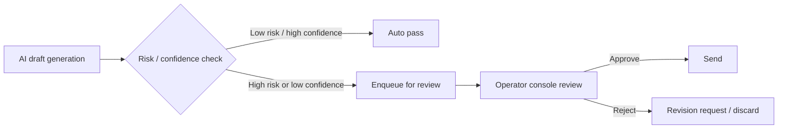

# AI App Patterns 101 (6/6): Human-in-the-loop — designing for human intervention

Better automation does not remove the need for human review; it makes the review boundary more important. Once an AI system can draft, classify, or trigger actions at scale, the real engineering work is deciding which outcomes can flow through untouched and which ones must stop for approval.

This is the final post in the AI App Patterns 101 series. Here we cover how to place human judgment inside an automated pipeline without turning the whole system back into manual work.


*Human review by risk level*
> Human-in-the-loop does not abandon automation; it inserts human judgment only at the points where automation is risky.

## Questions to Keep in Mind

- Is human-in-the-loop a fallback for weak models, or part of product design?
- When should you use an approval gate versus a confidence-based branch?
- What should be logged so human decisions can be audited later?

## When HITL is the right choice

### Human review by risk level

HITL adds latency and cost. Use it when the cost of an unchecked error is high.

**High-stakes decisions**: money transfers, contract generation, personal data processing — anything where a mistake is expensive or irreversible.

**Low model confidence**: route uncertain outputs to a human rather than sending a guess downstream.

**Regulatory requirements**: some industries prohibit fully autonomous AI decisions.

**Trust-building phase**: start with full human review when deploying a new system; reduce the human review rate as confidence in the model accumulates.

---

## Basic approval gate

### Draft generation with approval gate


*Draft generation with approval gate*
The simplest HITL pattern is a blocking prompt that waits for human input before the pipeline continues.

```python
import os

from langchain_core.output_parsers import StrOutputParser
from langchain_core.prompts import ChatPromptTemplate
from langchain_groq import ChatGroq

llm = ChatGroq(
    model="llama-3.1-8b-instant",
    api_key=os.environ["GROQ_API_KEY"],
)

draft_prompt = ChatPromptTemplate.from_messages([
    (
        "system",
        "You are a customer service representative.\n"
        "Write a draft response to the customer inquiry below.\n"
        "Be polite and professional.",
    ),
    ("human", "Customer inquiry:\n{inquiry}"),
])

draft_chain = draft_prompt | llm | StrOutputParser()

refine_prompt = ChatPromptTemplate.from_messages([
    (
        "system",
        "Revise the draft response based on the reviewer's feedback.\n"
        "Apply the feedback faithfully while maintaining a professional tone.",
    ),
    ("human", "Draft:\n{draft}\n\nFeedback:\n{feedback}"),
])

refine_chain = refine_prompt | llm | StrOutputParser()

def draft_with_human_review(inquiry: str) -> str:
    """Generate draft → human review → optional refinement → final response."""
    draft = draft_chain.invoke({"inquiry": inquiry})
    print(f"\n=== generated draft ===\n{draft}\n")

    print("reviewer options:")
    print("  [1] approve — use the draft as-is")
    print("  [2] revise — provide feedback to improve the draft")
    print("  [3] reject — discard this response")

    choice = input("choice (1/2/3): ").strip()

    if choice == "1":
        return draft
    elif choice == "2":
        feedback = input("enter feedback: ").strip()
        refined = refine_chain.invoke({"draft": draft, "feedback": feedback})
        print(f"\n=== revised response ===\n{refined}")
        return refined
    else:
        print("response rejected")
        return ""

inquiry = "I ordered three weeks ago and my package still hasn't arrived. What happened?"
final_response = draft_with_human_review(inquiry)
if final_response:
    print(f"\n=== final response sent ===\n{final_response}")
```

---

## Confidence-based branching

### Confidence threshold routing


*Confidence threshold routing*
Ask the LLM to return a confidence score alongside its output. Route low-confidence results to a human reviewer automatically.

```python
import os

from langchain_core.output_parsers import JsonOutputParser
from langchain_core.prompts import ChatPromptTemplate
from langchain_groq import ChatGroq

llm = ChatGroq(
    model="llama-3.1-8b-instant",
    api_key=os.environ["GROQ_API_KEY"],
)

classify_prompt = ChatPromptTemplate.from_messages([
    (
        "system",
        "Classify the following text and rate your confidence.\n"
        "Return JSON only.\n"
        'Format: {{"category": "category name", "confidence": 0.0-1.0, "reason": "brief reason"}}',
    ),
    ("human", "{text}"),
])

chain = classify_prompt | llm | JsonOutputParser()

CONFIDENCE_THRESHOLD = 0.85

def classify_with_hitl(text: str) -> dict:
    """Route to human review when model confidence is below threshold."""
    result = chain.invoke({"text": text})
    confidence = result.get("confidence", 0.0)

    if confidence >= CONFIDENCE_THRESHOLD:
        result["reviewed_by"] = "auto"
        print(f"auto-classified: {result['category']} (confidence {confidence:.2f})")
    else:
        print(f"low confidence ({confidence:.2f}) — manual review required")
        print(f"AI suggested category: {result['category']}")
        print(f"reason: {result['reason']}")
        human_category = input("enter correct category: ").strip()
        result["category"] = human_category
        result["reviewed_by"] = "human"

    return result

texts = [
    "Q3 2024 revenue increased 23 percent year-over-year.",  # clear case
    "The product was kind of different from what I expected.",  # ambiguous
]

for text in texts:
    print(f"\ntext: {text}")
    result = classify_with_hitl(text)
    print(f"result: {result}")
```

---

## Audit logging

### Review decisions with audit events


*Review decisions with audit events*
HITL systems require a record of who reviewed what and when. The audit log also becomes training data for improving the model over time.

```python
import json
import os
from datetime import datetime
from pathlib import Path

from langchain_core.output_parsers import StrOutputParser
from langchain_core.prompts import ChatPromptTemplate
from langchain_groq import ChatGroq

LOG_FILE = Path("audit_log.jsonl")

llm = ChatGroq(
    model="llama-3.1-8b-instant",
    api_key=os.environ["GROQ_API_KEY"],
)

generate_prompt = ChatPromptTemplate.from_messages([
    ("system", "Draft a contract clause for the following request."),
    ("human", "{request}"),
])

generate_chain = generate_prompt | llm | StrOutputParser()

def log_event(event_type: str, data: dict) -> None:
    """Append an audit event to the JSONL log file."""
    entry = {
        "timestamp": datetime.now().isoformat(),
        "event_type": event_type,
        **data,
    }
    with LOG_FILE.open("a", encoding="utf-8") as f:
        f.write(json.dumps(entry, ensure_ascii=False) + "\n")

def contract_clause_with_audit(request: str, reviewer_id: str) -> dict:
    """Generate clause draft → audit log → human approval."""
    draft = generate_chain.invoke({"request": request})
    log_event("draft_generated", {"request": request, "draft": draft})

    print(f"\ndraft:\n{draft}\n")
    approved = input("approve? (y/n): ").strip().lower() == "y"

    if approved:
        log_event("approved", {
            "reviewer_id": reviewer_id,
            "request": request,
            "draft": draft,
        })
        return {"status": "approved", "content": draft}
    else:
        reason = input("rejection reason: ").strip()
        log_event("rejected", {
            "reviewer_id": reviewer_id,
            "request": request,
            "draft": draft,
            "reason": reason,
        })
        return {"status": "rejected", "reason": reason}

result = contract_clause_with_audit(
    request="full refund within 30 days of cancellation",
    reviewer_id="reviewer_001",
)
print(f"\nresult: {result['status']}")
print(f"audit log: {LOG_FILE}")
```

---

## What to notice in this code

- `main.py` scores the generated draft, then routes low-confidence cases into an `input()`-style review step.
- For automated verification, the script can simulate reviewer choices from the `HITL_DECISIONS` environment variable.
- In a real application, that same boundary becomes an approval queue and an operator console.

---

## Where engineers get confused

### Human feedback back into policy loop


*Human feedback back into policy loop*
- HITL does not always sit at the very end; human review can appear before classification, before sending, or before money moves.
- A confidence score is only a routing hint, not an objective truth signal. Review thresholds still require policy decisions.
- Adding human review improves control but reduces throughput, so staffing and SLA impact must be designed alongside quality.

---

## Checklist

- [ ] Low-risk requests can finish through auto-approval
- [ ] High-risk or low-confidence requests are routed to human review
- [ ] The reviewer decision changes the final output
- [ ] Automated runs can still reproduce reviewer choices through environment variables

---

## Production HITL: review queue and UI flow

### Review queue API and state transitions

Console `input()` works for concept demonstrations, but production services need a review queue. Below is a FastAPI sketch separating item creation, retrieval, and approval/rejection.

```python
from fastapi import FastAPI, HTTPException
from pydantic import BaseModel

app = FastAPI()
review_queue: dict[str, dict] = {}

class ReviewItemCreate(BaseModel):
    request_id: str
    draft: str
    risk_level: str
    confidence: float

class ReviewDecision(BaseModel):
    reviewer_id: str
    decision: str  # approve | reject
    reason: str | None = None

@app.post('/reviews')
def create_review(item: ReviewItemCreate):
    review_queue[item.request_id] = {
        'status': 'pending',
        'draft': item.draft,
        'risk_level': item.risk_level,
        'confidence': item.confidence,
    }
    return {'request_id': item.request_id, 'status': 'pending'}

@app.get('/reviews/{request_id}')
def get_review(request_id: str):
    if request_id not in review_queue:
        raise HTTPException(status_code=404, detail='not found')
    return review_queue[request_id]

@app.post('/reviews/{request_id}/decision')
def decide_review(request_id: str, decision: ReviewDecision):
    if request_id not in review_queue:
        raise HTTPException(status_code=404, detail='not found')

    record = review_queue[request_id]
    record['status'] = 'approved' if decision.decision == 'approve' else 'rejected'
    record['reviewer_id'] = decision.reviewer_id
    record['reason'] = decision.reason
    return {'request_id': request_id, 'status': record['status']}
```

### Operator UI flow



*Risk-and-confidence-based HITL UI flow*

### Feeding human feedback back into policy

HITL is not just an approval ceremony. Its purpose is to collect rejection reasons and use them to tune thresholds, prompts, and routing rules. For example, if rejection logs cluster around "legal language overstated," the team adds a banned-phrases rule to the generation prompt and promotes that request category to mandatory review.

```text
feedback_tag=legal_risk_overclaim
action_1=system_prompt_rule_add("no definitive legal assertions")
action_2=threshold_update(risk=legal, confidence_cutoff=0.92)
action_3=mandatory_human_review(category=contract_clause)
```

This loop turns HITL from a cost center into a learning system whose automation quality improves over time.

## Review UX and SLA design

HITL is not complete with backend logic alone. Reviewers need a screen that lets them decide quickly. At minimum, a single view must show:

- Original input in full
- Model-suggested output
- Risk level / confidence score and the routing reason
- Past similar cases (approved/rejected)
- Approve/reject buttons with reason templates

### Review screen data contract

```json
{
  "request_id": "req-2026-05-21-119",
  "input": "Draft a full-refund-within-30-days cancellation clause",
  "draft": "...",
  "risk_level": "high",
  "confidence": 0.71,
  "route_reason": "confidence_below_threshold",
  "history": [
    {"decision": "rejected", "reason": "definitive legal assertion"}
  ]
}
```

When reviewers lack context, approval time stretches and automation benefits evaporate. In HITL, UX is a performance factor, not a nice-to-have.

### Webhook-based approval with Flask

```python
from flask import Flask, request, jsonify

app = Flask(__name__)
state: dict[str, str] = {}

@app.post('/webhook/review-decision')
def review_decision_webhook():
    payload = request.json
    request_id = payload['request_id']
    decision = payload['decision']

    if decision == 'approve':
        state[request_id] = 'approved'
    else:
        state[request_id] = 'rejected'

    return jsonify({'request_id': request_id, 'status': state[request_id]})
```

### SLA rules for HITL operations

Adding a human review step requires redefining SLAs. Separate auto-response SLA from review-response SLA; otherwise operational metrics become misleading.

```text
auto_path_sla: respond within 5 seconds
human_review_sla: first verdict within 30 minutes
escalation_rule: if 30 minutes exceeded, page on-call reviewer
```

Codifying these rules keeps HITL quality improvements within a manageable latency envelope.

## Codifying policy decisions

Consistent HITL requires routing decisions encoded in code, not left to individual judgment. This eliminates variance across teams.

```python
def should_require_human_review(risk_level: str, confidence: float, category: str) -> tuple[bool, str]:
    mandatory_categories = {'contract_clause', 'payment_refund', 'account_suspension'}

    if category in mandatory_categories:
        return True, 'mandatory_category'
    if risk_level == 'high':
        return True, 'high_risk'
    if confidence < 0.85:
        return True, 'low_confidence'
    return False, 'auto_pass'
```

### Reviewer role separation

```text
role=reviewer_level1: general inquiry approve/reject
role=reviewer_level2: legal/financial/account-suspension final approval
role=auditor: log access, policy compliance checks
```

Separating responsibilities reduces both approval bottlenecks and accountability gaps.

### Extended audit log schema

```json
{
  "event_type": "review_decision",
  "request_id": "req-119",
  "route_reason": "mandatory_category",
  "reviewer_id": "legal_reviewer_02",
  "decision": "approved",
  "decision_latency_sec": 412,
  "policy_version": "hitl-policy-v3"
}
```

Recording the policy version in the log makes it possible to explain why the same input produced different outcomes at different times. In HITL systems, explainability is a baseline requirement.

## Review quality metrics

HITL does not improve automatically by adding more reviewers. Review consistency must be measured to drive policy improvements.

- `review_overturn_rate`: fraction of AI suggestions overridden by humans
- `inter_reviewer_agreement`: agreement rate between reviewers on the same item
- `escalation_rate`: fraction escalated to a second-level reviewer
- `false_auto_pass_rate`: fraction auto-approved then later reversed

```python
def compute_overturn_rate(items: list[dict]) -> float:
    if not items:
        return 0.0
    overturned = sum(1 for i in items if i['ai_decision'] != i['human_decision'])
    return overturned / len(items)
```

Reviewing these metrics weekly reveals whether thresholds are too low or the model is consistently shaky on specific categories.

### Review queue priority rules

```text
priority=P1: financial/legal impact + confidence < 0.9
priority=P2: account/permission change + confidence < 0.85
priority=P3: general inquiry + confidence < 0.75
```

Without priority rules, the queue cannot distinguish stale requests from urgent ones and SLA violations follow.

### Policy experimentation

When changing thresholds, do not apply to all traffic immediately. Run an A/B test on a subset, comparing review wait time, rejection rate, and post-hoc error rate before promoting a new policy. This limits operational blast radius.

---

## Conclusion

HITL does not mean abandoning automation. High-confidence outputs flow through automatically; low-confidence or high-risk outputs pause for human review. The ratio shifts toward automation as the model proves itself on real traffic. Audit logs close the loop: every human correction is evidence for the next round of fine-tuning or threshold adjustment.

This series covered six core LLM application patterns — chatbot, RAG Q&A, document assistant, agent with tools, workflow automation, and human-in-the-loop. Each pattern stands alone or composes with the others to form more complex systems.

## Answering the Opening Questions

- **Is human-in-the-loop a fallback for weak models, or part of product design?**
  HITL is a product design choice for decisions with risk and accountability, not just a patch for weak models.

- **When should you use an approval gate versus a confidence-based branch?**
  Use an approval gate for explicit approval decisions such as deploy, refund, or permission changes; use confidence-based branching when only some cases need review.

- **What should be logged so human decisions can be audited later?**
  Log original input, model suggestion, confidence, branch reason, reviewer, timestamp, and final decision.

<!-- toc:begin -->
## In this series

- [AI App Patterns 101 (1/6): Chatbot pattern — managing conversation history and state](./01-chatbot-pattern.md)
- [AI App Patterns 101 (2/6): RAG Q&A pattern — document-based question answering](./02-rag-qa-pattern.md)
- [AI App Patterns 101 (3/6): Document assistant — summarization, extraction, classification](./03-document-assistant.md)
- [AI App Patterns 101 (4/6): Agent and tool pattern — autonomous tool selection](./04-agent-tool-pattern.md)
- [AI App Patterns 101 (5/6): Workflow automation — designing multi-step chains](./05-workflow-automation.md)
- **AI App Patterns 101 (6/6): Human-in-the-loop — designing for human intervention (current)**

<!-- toc:end -->

---

## References

- [LangGraph human-in-the-loop guide](https://langchain-ai.github.io/langgraph/how-tos/human_in_the_loop/)
- [NIST AI Risk Management Framework](https://www.nist.gov/itl/ai-risk-management-framework)
- [Python `json` module documentation](https://docs.python.org/3/library/json.html)

Tags: LLM, RAG, Agent, Python
