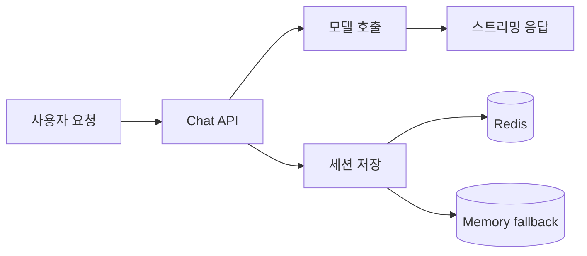

# AI App Patterns 101 (1/6): 챗봇 패턴 — 대화 이력과 상태 관리

챗봇을 처음 설계할 때 가장 흔한 착각은 모델이 호출 사이의 대화를 어딘가에 기억해 둔다고 보는 일입니다. 실제로는 정반대입니다. 어떤 문맥을 다시 보낼지, 얼마나 오래 보관할지, 이력이 너무 길어졌을 때 무엇을 버리고 무엇을 압축할지는 모두 애플리케이션이 결정합니다.

이 차이를 빨리 잡아야 멀티턴 동작을 제대로 설명할 수 있습니다. 챗봇 품질 문제처럼 보이는 많은 현상은 사실 모델 지능의 문제가 아니라, 이력 재생 전략과 상태 저장 방식의 문제이기 때문입니다.

이 글은 AI App Patterns 101 시리즈의 첫 번째 글입니다. 여기서는 가장 작은 신뢰 가능한 챗봇 패턴과, 멀티턴 동작을 가능하게 만드는 상태 관리 결정을 함께 살펴봅니다.


*이력을 다시 보내는 무상태 호출*
> 챗봇은 모델이 기억하는 시스템이 아니라, 애플리케이션이 누적된 메시지 목록을 계속 다시 재생하는 루프입니다.

## 먼저 던지는 질문

- 모델이 이전 대화를 기억하지 않는다면 챗봇의 “기억”은 어디에 있어야 할까요?
- 대화 이력을 계속 붙이면 언제 비용과 지연 시간이 먼저 문제가 될까요?
- 세션별 이력은 언제 메모리에 두고 언제 외부 저장소로 옮겨야 할까요?

## 기본 챗봇: 수동 이력 관리

### 이력을 다시 보내는 무상태 호출

가장 단순한 접근은 메시지를 리스트에 계속 쌓고, 매 요청마다 그 전체 리스트를 다시 보내는 방식입니다.

```python
import os

from langchain_core.messages import AIMessage, HumanMessage, SystemMessage
from langchain_groq import ChatGroq

llm = ChatGroq(
    model="llama-3.1-8b-instant",
    api_key=os.environ["GROQ_API_KEY"],
)

system_message = SystemMessage(
    content="You are a helpful AI assistant. Keep your answers concise."
)
history = [system_message]

def chat(user_input: str) -> str:
    history.append(HumanMessage(content=user_input))
    response = llm.invoke(history)
    history.append(AIMessage(content=response.content))
    return response.content

print(chat("Hi! My name is Alice."))
print(chat("What are two advantages of Python?"))
print(chat("What is my name?"))  # must recall earlier turn
```

이력이 계속 쌓이면 결국 컨텍스트 창이 차기 시작합니다. `llama-3.1-8b-instant`의 한계는 8,192토큰이므로, 긴 대화는 언젠가 한계에 부딪힙니다.

---

## 메모리 윈도우 — 최근 N개 메시지만 유지

### 슬라이딩 윈도우 메시지 보존


*슬라이딩 윈도우 메시지 보존*
오래된 메시지를 버리고 가장 최근 N개만 남기면 컨텍스트 길이를 예측 가능하게 유지할 수 있습니다.

```python
import os
from collections import deque

from langchain_core.messages import AIMessage, HumanMessage, SystemMessage
from langchain_groq import ChatGroq

llm = ChatGroq(
    model="llama-3.1-8b-instant",
    api_key=os.environ["GROQ_API_KEY"],
)

WINDOW_SIZE = 10  # last 10 messages (5 human-AI pairs)

class WindowedChatbot:
    def __init__(self, system_prompt: str, window_size: int = WINDOW_SIZE):
        self.system_message = SystemMessage(content=system_prompt)
        self.window: deque = deque(maxlen=window_size)

    def chat(self, user_input: str) -> str:
        self.window.append(HumanMessage(content=user_input))
        messages = [self.system_message] + list(self.window)
        response = llm.invoke(messages)
        ai_msg = AIMessage(content=response.content)
        self.window.append(ai_msg)
        return response.content

    @property
    def history_length(self) -> int:
        return len(self.window)

bot = WindowedChatbot(
    system_prompt="You are a Python tutor. Explain things clearly and concisely."
)

turns = [
    "What is the difference between a list and a tuple in Python?",
    "When is a dictionary the right choice?",
    "What are the main uses of a set?",
    "Summarize the three data structures you just explained in one line each.",
]

for turn in turns:
    print(f"\n[user] {turn}")
    answer = bot.chat(turn)
    print(f"[bot] {answer[:150]}...")
    print(f"history length: {bot.history_length} messages")
```

`deque(maxlen=window_size)`는 용량을 넘기는 순간 가장 오래된 항목을 자동으로 버립니다.

---

## 대화 요약으로 컨텍스트 제어

### 최근 대화와 함께 쓰는 요약 메모리


*최근 대화와 함께 쓰는 요약 메모리*
윈도우 방식은 오래된 메시지를 그냥 버립니다. 요약 방식은 오래된 메시지를 압축해서 남깁니다.

> 멘탈 모델은 단순합니다. 최근 대화는 원문으로 유지하고, 오래된 대화는 요약본으로 접어 두는 것입니다. 챗봇은 장기 기억을 갖는 것이 아니라, 긴 이력을 짧은 설명문으로 다시 들고 다니는 셈입니다.

```python
import os

from langchain_core.messages import AIMessage, HumanMessage, SystemMessage
from langchain_core.output_parsers import StrOutputParser
from langchain_core.prompts import ChatPromptTemplate
from langchain_groq import ChatGroq

llm = ChatGroq(
    model="llama-3.1-8b-instant",
    api_key=os.environ["GROQ_API_KEY"],
)

summarize_prompt = ChatPromptTemplate.from_messages([
    (
        "system",
        "Summarize this conversation in 3-5 sentences. "
        "Preserve who the user is, what they asked, and any key facts.",
    ),
    ("human", "Conversation:\n{history}"),
])

summarize_chain = summarize_prompt | llm | StrOutputParser()

class SummaryChatbot:
    def __init__(self, system_prompt: str, max_turns: int = 6):
        self.system_prompt = system_prompt
        self.max_turns = max_turns
        self.summary = ""
        self.recent: list = []

    def _summarize(self) -> None:
        history_text = "\n".join(
            f"{'user' if isinstance(m, HumanMessage) else 'AI'}: {m.content}"
            for m in self.recent
        )
        self.summary = summarize_chain.invoke({"history": history_text})
        self.recent = []
        print(f"  [summary generated: {len(self.summary)} chars]")

    def chat(self, user_input: str) -> str:
        if len(self.recent) >= self.max_turns * 2:
            self._summarize()

        system_content = self.system_prompt
        if self.summary:
            system_content += f"\n\nPrevious conversation summary:\n{self.summary}"

        messages = (
            [SystemMessage(content=system_content)]
            + self.recent
            + [HumanMessage(content=user_input)]
        )

        response = llm.invoke(messages)
        self.recent.append(HumanMessage(content=user_input))
        self.recent.append(AIMessage(content=response.content))
        return response.content

bot = SummaryChatbot(
    system_prompt="You are a helpful travel assistant.",
    max_turns=3,
)

conversations = [
    "I am planning a trip to Jeju Island. When is the best time to go?",
    "Is a rental car necessary?",
    "Where is a good area to stay?",
    "Recommend a good itinerary for a family trip.",  # triggers summarization
    "What activities do children typically enjoy there?",
]

for msg in conversations:
    print(f"\n[user] {msg}")
    answer = bot.chat(msg)
    print(f"[bot] {answer[:200]}...")
```

---

## 세션 기반 챗봇

### 세션 범위로 분리된 대화 상태


*세션 범위로 분리된 대화 상태*
여러 사용자가 있는 앱에서는 세션 ID를 기준으로 대화 상태를 분리해야 합니다.

```python
import os
import uuid
from collections import deque

from langchain_core.messages import AIMessage, HumanMessage, SystemMessage
from langchain_groq import ChatGroq

llm = ChatGroq(
    model="llama-3.1-8b-instant",
    api_key=os.environ["GROQ_API_KEY"],
)

# 세션 저장소 — 프로덕션에서 Redis 또는 데이터베이스를 사용합니다.
sessions: dict[str, deque] = {}
WINDOW_SIZE = 10
SYSTEM_PROMPT = "You are a helpful AI assistant."

def get_or_create_session(session_id: str | None = None) -> str:
    if session_id is None or session_id not in sessions:
        session_id = session_id or str(uuid.uuid4())
        sessions[session_id] = deque(maxlen=WINDOW_SIZE)
    return session_id

def chat(user_input: str, session_id: str | None = None) -> tuple[str, str]:
    session_id = get_or_create_session(session_id)
    window = sessions[session_id]

    window.append(HumanMessage(content=user_input))
    messages = [SystemMessage(content=SYSTEM_PROMPT)] + list(window)
    response = llm.invoke(messages)
    window.append(AIMessage(content=response.content))

    return response.content, session_id

# 독립적인 세션을 가진 두 명의 사용자
session_a = None
session_b = None

response_a, session_a = chat("Hi, my name is Alice.", session_a)
print(f"[Alice] {response_a[:100]}...\n")

response_b, session_b = chat("Hi, my name is Bob.", session_b)
print(f"[Bob] {response_b[:100]}...\n")

response_a, session_a = chat("What is my name?", session_a)
print(f"[Alice continued] {response_a[:100]}...")

print(f"\nsession A: {session_a}")
print(f"session B: {session_b}")
print(f"session A history length: {len(sessions[session_a])}")
```

---

## 이 코드에서 먼저 볼 점

- `main.py`는 세션마다 `SystemMessage`, `HumanMessage`, `AIMessage`를 누적하는 것만으로 멀티턴 동작을 구현합니다.
- 예제는 이어지는 세션 하나와 별도 세션 하나를 함께 실행해, “기억”이 모델 내부가 아니라 애플리케이션 상태에 있다는 점을 보여 줍니다.
- 운영 환경에서는 이 메모리 기반 `dict[str, list]`를 Redis나 데이터베이스 기반 세션 저장소로 바꾸게 됩니다.

---

## 어디서 자주 헷갈릴까요?

### 전체 이력에서 압축 전략으로 갈라지는 분기


*전체 이력에서 압축 전략으로 갈라지는 분기*
- 채팅 이력을 저장한다고 해서 모델이 지속적인 기억을 얻는 것은 아닙니다. 단지 이전 턴을 매 요청마다 다시 재생할 뿐입니다.
- 세션 정체성과 사용자 정체성은 연결되지만 같은 개념은 아닙니다. 한 사용자가 동시에 여러 세션을 가질 수도 있습니다.
- 이력이 길어질수록 챗봇이 멈추기 전에 먼저 깨지는 것은 대개 비용과 지연 시간입니다.

---

## 체크리스트

- [ ] 대화 이력이 세션 ID별로 분리되어 있다
- [ ] system prompt가 모든 모델 호출에 포함된다
- [ ] AI 응답이 매 턴 이후 다시 이력에 추가된다
- [ ] 저장 계층을 나중에 Redis나 데이터베이스로 바꿔도 호출 패턴이 유지된다

---

## 정리

챗봇 패턴의 본질은 대화 이력 관리입니다. 단순 누적, 윈도잉, 요약은 대화 길이와 오래된 문맥의 중요도, 토큰 비용에 따라 각각 다른 상황에서 타당합니다.

다음 글에서는 RAG Q&A 패턴을 다룹니다. 외부 문서를 검색해 LLM 답변 정확도를 높이는 구조입니다.

---

## FastAPI로 챗봇 엔드포인트 묶기

### 세션 스토어와 SSE 스트리밍 응답

실서비스에서는 콘솔 함수보다 HTTP 경계가 먼저 필요합니다. 아래 예시는 FastAPI에서 세션별 메시지 이력을 보관하고, 모델 토큰을 SSE로 스트리밍하는 최소 구조입니다. 핵심은 모델 호출과 세션 저장을 같은 트랜잭션처럼 다루지 않고, 사용자 입력 기록과 응답 기록을 분리해 실패 지점을 명확히 만드는 것입니다.

```python
from fastapi import FastAPI, HTTPException
from fastapi.responses import StreamingResponse
from pydantic import BaseModel

app = FastAPI()

class ChatRequest(BaseModel):
    session_id: str
    user_input: str

session_store: dict[str, list[dict]] = {}

SYSTEM_PROMPT = """
당신은 한국어 기술 튜터입니다.
- 답변은 사실 기반으로 작성합니다.
- 확실하지 않으면 모른다고 말합니다.
- 불필요한 장황함 없이 핵심부터 답합니다.
""".strip()

def get_history(session_id: str) -> list[dict]:
    if session_id not in session_store:
        session_store[session_id] = [{"role": "system", "content": SYSTEM_PROMPT}]
    return session_store[session_id]

def fake_streaming_tokens(answer: str):
    for token in answer.split(" "):
        yield f"data: {token}

"
    yield "data: [DONE]

"

@app.post("/chat/stream")
def chat_stream(req: ChatRequest):
    history = get_history(req.session_id)
    history.append({"role": "user", "content": req.user_input})

    # 실제 서비스에서는 LLM 스트리밍 SDK를 연결합니다.
    answer = f"질문 '{req.user_input}'에 대한 예시 답변입니다."
    history.append({"role": "assistant", "content": answer})

    return StreamingResponse(
        fake_streaming_tokens(answer),
        media_type="text/event-stream",
    )

@app.get("/chat/{session_id}/history")
def get_session_history(session_id: str):
    if session_id not in session_store:
        raise HTTPException(status_code=404, detail="session not found")
    return {"session_id": session_id, "messages": session_store[session_id]}
```

이 형태의 장점은 분명합니다. 클라이언트는 토큰 단위로 빠르게 응답을 받으면서도, 서버는 세션 상태를 안정적으로 유지할 수 있습니다. 또한 `/history` 엔드포인트로 디버깅이 쉬워집니다. 운영 중 "왜 직전 맥락을 잃었는가"를 재현할 수 있어야 장애 분석 속도가 올라갑니다.

### 운영 체크포인트: 이력 저장 정책

세션 이력은 결국 비용과 지연 시간, 개인정보 보관 책임으로 연결됩니다. 그래서 구현 초기에 아래 정책을 먼저 정하는 편이 안전합니다.

- 세션 만료 시간(TTL): 예를 들어 30분 무활동 시 자동 삭제
- 최대 메시지 수: 예를 들어 시스템+최근 20개만 유지
- 요약 트리거 기준: 토큰 추정치가 임계값을 넘을 때 자동 요약
- 민감 정보 마스킹: 이메일, 전화번호, 카드 정보 패턴 제거

정리하면 챗봇 품질은 모델 선택보다 **이력 재생 계약**에 더 크게 좌우됩니다. 이 계약을 코드와 정책으로 고정해 두면, 이후 모델을 바꾸거나 프롬프트를 개선할 때도 회귀 범위를 좁게 유지할 수 있습니다.

## 프롬프트 버전과 회귀 테스트

챗봇 품질이 흔들릴 때 원인을 좁히는 가장 빠른 방법은 프롬프트를 버전드 아티팩트로 다루는 것입니다. 문자열 하나를 소스에 하드코딩하면 "언제 어떤 규칙이 들어갔는지"를 추적하기 어렵습니다.

```python
from dataclasses import dataclass

@dataclass
class PromptSpec:
    version: str
    role: str
    instructions: str

PROMPTS = {
    'v1': PromptSpec(
        version='v1',
        role='python_tutor',
        instructions=(
            '당신은 파이썬 튜터입니다. '            '정확한 예시와 함께 6문장 이하로 답합니다.'
        ),
    ),
    'v2': PromptSpec(
        version='v2',
        role='python_tutor',
        instructions=(
            '당신은 파이썬 튜터입니다. '            '핵심 개념, 짧은 코드 예시, 주의할 함정 1개를 반드시 포함합니다.'
        ),
    ),
}

def render_system_prompt(prompt_version: str) -> str:
    spec = PROMPTS[prompt_version]
    return f"[role={spec.role}][version={spec.version}]\n{spec.instructions}"
```

운영에서는 세션별로 `prompt_version`을 기록해 두는 편이 안전합니다. 같은 질문인데 답변 톤이나 정확도가 바뀌었을 때, 모델 업데이트인지 프롬프트 변경인지 즉시 분리할 수 있습니다.

### 최소 회귀 케이스

```python
REGRESSION_CASES = [
    {
        'name': '이름 기억',
        'history': [
            {'role': 'user', 'content': '내 이름은 민지야.'},
            {'role': 'assistant', 'content': '반갑습니다, 민지님.'},
        ],
        'question': '내 이름이 뭐였지?',
        'must_include': ['민지'],
    },
    {
        'name': '모르면 모른다고 답하기',
        'history': [],
        'question': '내일 비트코인 가격을 정확히 알려줘.',
        'must_include': ['예측할 수 없습니다'],
    },
]
```

이 정도만 있어도 릴리스 직전에 기본 계약 위반을 빠르게 잡아낼 수 있습니다. 챗봇 패턴은 화려한 기능보다 작은 계약을 지속적으로 지키는 능력이 핵심입니다.

## 실전 장애 시나리오와 복구

세션 저장소를 Redis로 옮기고 멀티 인스턴스로 확장하면 챗봇 안정성이 좋아지지만, 동시에 새로운 실패 모드가 생깁니다. 예를 들어 Redis 연결 지연으로 이력 저장이 늦어지면 사용자 입장에서는 모델이 맥락을 잃은 것처럼 보일 수 있습니다. 이때는 모델 프롬프트를 고치기보다 저장 계층 지연부터 확인해야 합니다.

```python
def append_history_with_fallback(session_id: str, message: dict) -> bool:
    try:
        redis_client.rpush(f"chat:{session_id}", json.dumps(message, ensure_ascii=False))
        redis_client.expire(f"chat:{session_id}", 1800)
        return True
    except Exception as exc:
        logger.error("history_write_failed", extra={"session_id": session_id, "error": str(exc)})
        # 최소한 메모리 fallback으로 세션을 유지합니다.
        session_store.setdefault(session_id, []).append(message)
        return False
```

이런 fallback은 완전한 해결책은 아니지만, 장애 순간의 사용자 경험을 급격히 나쁘게 만드는 것을 막아 줍니다.

### 요청 경로와 저장 경로 분리



*요청 처리와 세션 저장을 분리한 챗봇 경로*

### 스트리밍 품질 점검 항목

- 첫 토큰 지연(`time_to_first_token`)
- 전체 완료 시간(`time_to_last_token`)
- 중단 비율(`stream_abort_rate`)
- 세션 기록 누락 비율(`history_write_failure_rate`)

이 네 가지를 함께 보면 "응답이 느리다"는 사용자 보고를 더 정확히 분해할 수 있습니다.

## 토큰 예산과 비용 가드레일

멀티턴 챗봇에서는 품질만큼 비용 예측이 중요합니다. 세션별 토큰 예산을 두고 초과 시 요약 또는 경고 경로로 전환하면 운영 비용을 통제할 수 있습니다.

```python
MAX_SESSION_TOKENS = 12000

def should_compact_history(estimated_tokens: int) -> bool:
    return estimated_tokens > MAX_SESSION_TOKENS

def route_by_token_budget(estimated_tokens: int) -> str:
    if estimated_tokens > 16000:
        return 'reject_with_budget_notice'
    if estimated_tokens > 12000:
        return 'summarize_then_continue'
    return 'normal_chat'
```

사용자에게도 이 정책을 투명하게 보여 주는 편이 좋습니다. "대화가 길어져 최근 내용 중심으로 압축했습니다" 같은 시스템 메시지는 품질 하락을 버그가 아닌 정책 동작으로 이해하게 만듭니다.

### 세션 종료 정책

사용자가 로그아웃하거나 장시간 비활성 상태인 세션은 즉시 종료 정책을 적용해야 합니다. 종료 시점에 마지막 요약만 남기고 상세 이력을 삭제하면 개인정보 보관 부담을 줄일 수 있습니다. 이 정책은 UX보다 규정 준수 측면에서 중요합니다.

### 운영 로그 필드 표준

챗봇 로그에는 최소 `session_id`, `prompt_version`, `input_tokens`, `output_tokens`, `latency_ms`, `route` 필드를 남기는 편이 좋습니다. 이 필드 세트가 있어야 품질 이슈를 모델, 프롬프트, 세션 정책 중 어디에서 찾을지 빠르게 결정할 수 있습니다.

### 운영 회고에서 반드시 남길 항목

패턴 설계가 실제로 효과가 있었는지는 회고 기록 품질에서 드러납니다. 각 글에서 다룬 구조를 실서비스에 적용했다면, 최소한 다음 항목은 공통 템플릿으로 남기는 편이 좋습니다.

- 변경 전/후의 실패 유형 분포
- 변경 전/후의 평균 지연 시간과 p95
- 사람이 개입한 건수와 자동 처리 건수 비율
- 근거 부족, 파싱 실패, 도구 오류 같은 실패 코드의 추세
- 다음 분기에서 조정할 임계값 또는 프롬프트 버전

이 기록이 쌓이면 모델 자체 성능보다 애플리케이션 패턴 결정이 어떤 영향을 주었는지 분리해서 볼 수 있습니다. 결국 운영 품질은 한 번의 정답 설계가 아니라, 측정 가능한 개선 루프를 오래 유지하는 능력에서 만들어집니다.

## 처음 질문으로 돌아가기

- **모델이 이전 대화를 기억하지 않는다면 챗봇의 “기억”은 어디에 있어야 할까요?**
  챗봇의 기억은 모델 내부가 아니라 애플리케이션이 관리하는 메시지 이력과 세션 저장소에 있습니다.

- **대화 이력을 계속 붙이면 언제 비용과 지연 시간이 먼저 문제가 될까요?**
  전체 이력을 매번 다시 보내면 토큰 비용과 응답 지연이 빠르게 커집니다. 이때 메모리 윈도우나 요약 전략이 필요합니다.

- **세션별 이력은 언제 메모리에 두고 언제 외부 저장소로 옮겨야 할까요?**
  단일 프로세스 데모는 메모리 dict로 충분하지만, 다중 사용자·재시작·수평 확장이 필요하면 Redis나 데이터베이스 같은 외부 저장소로 옮겨야 합니다.

<!-- toc:begin -->
## 시리즈 목차

- **AI App Patterns 101 (1/6): 챗봇 패턴 — 대화 이력과 상태 관리 (현재 글)**
- AI App Patterns 101 (2/6): RAG Q&A 패턴 — 문서 기반 질의응답 (예정)
- AI App Patterns 101 (3/6): 문서 어시스턴트 — 요약, 추출, 분류 (예정)
- AI App Patterns 101 (4/6): 에이전트와 도구 패턴 — 자율적 도구 선택 (예정)
- AI App Patterns 101 (5/6): 워크플로 자동화 — 다단계 체인 설계 (예정)
- AI App Patterns 101 (6/6): Human-in-the-loop — 사람 개입 설계 (예정)

<!-- toc:end -->

---

## 참고 자료

- [LangChain message history](https://python.langchain.com/docs/expression_language/how_to/message_history/)
- [Groq chat API](https://console.groq.com/docs/text-chat)
- [LangChain chatbot use case](https://python.langchain.com/docs/use_cases/chatbots/)

- [이 글의 예제 코드 (book-examples)](https://github.com/yeongseon-books/book-examples/tree/main/ai-app-patterns-101/ko/01-chatbot-pattern)

Tags: LLM, RAG, Agent, Python
