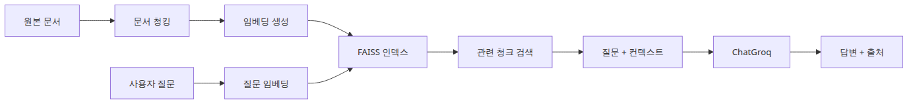
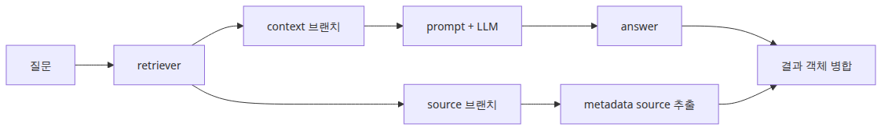
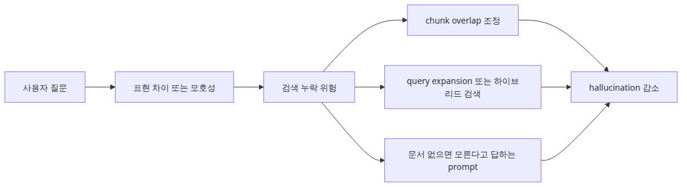
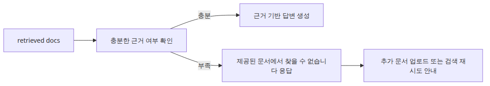

# RAG Q&A 패턴 — 문서 기반 질의응답

RAG를 더 똑똑한 모델이라고 생각하면 설계가 흐려집니다. RAG는 모델을 바꾸는 기술이라기보다, 적절한 문서를 적절한 시점에 찾아 프롬프트에 주입하는 검색 파이프라인입니다. 답변 품질도 모델의 신비로움보다 어떤 청크를 찾았는지, 그리고 그 청크를 어떻게 넣었는지에 더 크게 좌우됩니다.

LLM이 모르는 최신 정보, 사내 문서, 비공개 지식이 필요한 순간부터 이 관점이 중요해집니다. 환각을 줄이는 핵심도 결국 생성 전에 검색을 어떻게 붙였는지에서 시작합니다.

이 글은 AI App Patterns 101 시리즈의 2번째 글입니다. 여기서는 가장 작은 실용적인 RAG Q&A 파이프라인을 만들고, 검색과 생성이 어떻게 맞물리는지 차례로 정리합니다.

## 이 글에서 다룰 문제

- 최소한의 RAG 파이프라인에서는 청킹, 임베딩, 검색, 답변 생성을 어떻게 연결해야 할까요?
- 작은 FAISS 기반 예제로도 답변 텍스트와 근거 스니펫을 함께 반환할 수 있을까요?
- 답이 문서 안에 없을 때 환각을 막는 설계는 어디에서 넣어야 할까요?

> RAG는 답을 외우는 모델이 아니라, 검색된 문서를 생성 전에 프롬프트에 주입하는 파이프라인입니다.



*이 글에서 답할 질문*
> AI App Patterns 101 (2/6)

예제 코드: [github.com/yeongseon-books/ai-app-patterns-101](https://github.com/yeongseon-books/ai-app-patterns-101/tree/main/en/02-rag-qa-pattern)

RAG(Retrieval-Augmented Generation)는 LLM의 두 가지 고질적 한계를 보완합니다. 첫째, 모델은 학습 시점 이후의 사건을 알지 못합니다. 둘째, 비공개 데이터나 사내 데이터에는 기본적으로 접근할 수 없습니다. RAG는 질의 시점에 관련 문서를 검색해 프롬프트에 주입함으로써 이 두 공백을 메웁니다.

이 글에서는 완전한 RAG Q&A 파이프라인을 단계별로 구성합니다.

다룰 주제는 다음과 같습니다.

- 인덱싱과 검색이라는 RAG의 두 단계
- 완전한 RAG Q&A 체인
- 더 나은 답변 품질을 위한 프롬프트 설계
- 출처를 함께 돌려주는 응답 구조
- RAG가 실패하는 지점과 대응 방식

---

## RAG의 두 단계

### 오프라인 인덱싱 파이프라인


*오프라인 인덱싱 파이프라인*
인덱싱(오프라인)은 문서를 청크로 나누고, 임베딩을 만들고, 벡터 인덱스에 저장하는 단계입니다.

검색(온라인)은 질의를 임베딩하고, 비슷한 청크를 찾고, 그 청크를 프롬프트에 주입하는 단계입니다.

```text
indexing:  documents → chunking → embedding → FAISS
retrieval: query → embedding → FAISS search → prompt injection → LLM → answer
```

---

## 완전한 RAG Q&A 구현

### 온라인 질의응답 흐름


*온라인 질의응답 흐름*
```python
import os

from langchain_community.embeddings import HuggingFaceEmbeddings
from langchain_community.vectorstores import FAISS
from langchain_core.output_parsers import StrOutputParser
from langchain_core.prompts import ChatPromptTemplate
from langchain_core.runnables import RunnablePassthrough
from langchain_groq import ChatGroq
from langchain_text_splitters import RecursiveCharacterTextSplitter

embedding_model = HuggingFaceEmbeddings(
    model_name="sentence-transformers/all-MiniLM-L6-v2",
    model_kwargs={"device": "cpu"},
    encode_kwargs={"normalize_embeddings": True},
)

documents = [
    """
Python is a high-level programming language created by Guido van Rossum in 1991.
It uses indentation to delimit code blocks, which is unusual among mainstream languages.
Python supports dynamic typing and automatic memory management.
It is widely used in web development, data science, and artificial intelligence.
""",
    """
Python's primary strength is readability.
It was designed to read like English prose.
Python has a large standard library and a vast third-party package ecosystem.
Hundreds of thousands of packages can be installed with the pip package manager.
""",
    """
One of Python's main weaknesses is execution speed.
As an interpreted language, it is slower than C or Java for CPU-bound tasks.
The GIL (Global Interpreter Lock) limits multi-threaded performance.
Python is rarely used for mobile application development.
""",
    """
Python version history: Python 2 was released in 2000, Python 3 in 2008.
Python 2 reached its official end of life in January 2020.
Python 3.10 or later is recommended for new projects.
A new minor version is released each October.
""",
]

splitter = RecursiveCharacterTextSplitter(chunk_size=200, chunk_overlap=20)
chunks = []
for doc in documents:
    chunks.extend(splitter.split_text(doc))

vectorstore = FAISS.from_texts(texts=chunks, embedding=embedding_model)
retriever = vectorstore.as_retriever(search_kwargs={"k": 3})

llm = ChatGroq(
    model="llama-3.1-8b-instant",
    api_key=os.environ["GROQ_API_KEY"],
)

prompt = ChatPromptTemplate.from_messages([
    (
        "system",
        "Answer the question using only the reference documents below.\n"
        "If the answer is not in the documents, say 'I cannot find this in the provided documents'.\n"
        "Do not speculate.\n\n"
        "Reference documents:\n{context}",
    ),
    ("human", "{question}"),
])

def format_docs(docs: list) -> str:
    return "\n\n".join(doc.page_content for doc in docs)

rag_chain = (
    {
        "context": retriever | format_docs,
        "question": RunnablePassthrough(),
    }
    | prompt
    | llm
    | StrOutputParser()
)

test_questions = [
    "Who created Python?",
    "What are Python's weaknesses?",
    "When did Python 2 reach end of life?",
    "Can you build iOS apps with Python?",
    "What are the features of the Rust language?",  # not in documents
]

for question in test_questions:
    print(f"\nquestion: {question}")
    answer = rag_chain.invoke(question)
    print(f"answer: {answer}")
```

---

## 출처를 함께 반환하는 응답

### 답변과 출처를 함께 돌려주는 구조



*답변과 출처를 함께 돌려주는 구조*
어떤 문서가 답변의 근거였는지 함께 보여 주면 사용자 신뢰가 크게 좋아집니다.

```python
import os

from langchain_community.embeddings import HuggingFaceEmbeddings
from langchain_community.vectorstores import FAISS
from langchain_core.output_parsers import StrOutputParser
from langchain_core.prompts import ChatPromptTemplate
from langchain_core.runnables import RunnableParallel, RunnablePassthrough
from langchain_groq import ChatGroq

embedding_model = HuggingFaceEmbeddings(
    model_name="sentence-transformers/all-MiniLM-L6-v2",
    model_kwargs={"device": "cpu"},
    encode_kwargs={"normalize_embeddings": True},
)

documents_with_metadata = [
    ("Python is a high-level language created by Guido van Rossum in 1991.", {"source": "python_intro.txt", "page": 1}),
    ("Python's primary strength is readability.", {"source": "python_features.txt", "page": 1}),
    ("One of Python's main weaknesses is execution speed.", {"source": "python_cons.txt", "page": 1}),
]

texts = [text for text, _ in documents_with_metadata]
metadatas = [meta for _, meta in documents_with_metadata]

vectorstore = FAISS.from_texts(
    texts=texts,
    embedding=embedding_model,
    metadatas=metadatas,
)
retriever = vectorstore.as_retriever(search_kwargs={"k": 2})

llm = ChatGroq(
    model="llama-3.1-8b-instant",
    api_key=os.environ["GROQ_API_KEY"],
)

prompt = ChatPromptTemplate.from_messages([
    ("system", "Answer the question using only the documents below:\n{context}"),
    ("human", "{question}"),
])

def format_docs(docs: list) -> str:
    return "\n\n".join(doc.page_content for doc in docs)

def get_sources(docs: list) -> list[str]:
    return [doc.metadata.get("source", "unknown") for doc in docs]

rag_with_sources = RunnableParallel(
    answer=(
        {"context": retriever | format_docs, "question": RunnablePassthrough()}
        | prompt
        | llm
        | StrOutputParser()
    ),
    sources=retriever | get_sources,
)

result = rag_with_sources.invoke("Who created Python?")
print(f"answer: {result['answer']}")
print(f"sources: {result['sources']}")
```

---

## RAG가 실패하는 순간

### 검색 누락에 대한 방어 계층



*검색 누락에 대한 방어 계층*
### 근거가 없을 때의 폴백 분기



*근거가 없을 때의 폴백 분기*
**관련 청크가 검색되지 않은 경우입니다.** 질의와 맞는 청크를 찾지 못하면 LLM은 내부 지식으로 메우려 하고, 그 과정에서 환각할 수 있습니다. “문서에 없으면 모른다고 말하라”는 프롬프트 지시는 첫 번째 방어선입니다.

**정보가 청크 경계에서 갈라지는 경우입니다.** 중요한 맥락이 두 청크에 걸치면 검색된 단일 결과 어느 쪽에서도 정보가 완전하지 않을 수 있습니다. 충분한 `chunk_overlap`이 이 위험을 줄입니다.

**질의 표현과 문서 표현이 너무 다른 경우입니다.** 예를 들어 “is python slow?” 같은 구어체 질의는 “interpreted language execution performance”를 담은 청크와 잘 매칭되지 않을 수 있습니다. 이때는 query expansion이나 hybrid search가 도움이 됩니다.

> 멘탈 모델은 검색 품질이 생성 품질의 상한선을 만든다는 것입니다. 생성 모델은 검색이 가져온 근거 위에서만 안전하게 답할 수 있습니다.

---

## 이 코드에서 먼저 볼 점

- `main.py`는 `RecursiveCharacterTextSplitter`로 청킹하고, `FAISS.from_documents()`로 즉시 인덱싱하는 흐름을 보여 줍니다.
- 스크립트는 검색된 `Document` 객체를 유지해 답변과 근거 출처를 함께 출력할 수 있게 합니다.
- 프롬프트는 문맥 안의 정보만 쓰고, 답이 없으면 없다고 말하라고 명시합니다.

---

## 어디서 자주 헷갈릴까요?

- 많은 팀이 먼저 생성 모델을 탓하지만, 실제로 RAG 품질을 망치는 원인은 청킹 전략과 retriever 설정인 경우가 더 많습니다.
- 임베딩 모델과 답변 생성 모델은 서로 다른 문제를 푸는 구성 요소입니다. 둘이 같을 필요는 없습니다.
- top-k를 키운다고 자동으로 좋아지지 않습니다. 잡음 청크가 늘어나면 오히려 유용한 문맥이 희석될 수 있습니다.

---

## 체크리스트

- [ ] 문서가 인덱싱 전에 청크로 분할된다
- [ ] 답변 생성 전에 retriever가 먼저 실행된다
- [ ] 최종 출력에 출처 파일명이 포함된다
- [ ] 문서에 답이 없을 때 인정하도록 프롬프트가 모델을 제한한다

---

## 정리

RAG Q&A는 LLM이 학습하지 않은 지식에 접근하게 만드는 가장 실용적인 패턴입니다. 정보가 없을 때 “모른다”고 말하게 하는 프롬프트 지시는 가장 단순하면서도 중요한 환각 방지 장치입니다.

다음 글에서는 문서 어시스턴트 패턴을 다룹니다. 요약, 정보 추출, 분류처럼 구조화된 문서 처리 작업에 집중하는 패턴입니다.

<!-- toc:begin -->
## 시리즈 목차

- [챗봇 패턴 — 대화 이력과 상태 관리](./01-chatbot-pattern.md)
- **RAG Q&A 패턴 — 문서 기반 질의응답 (현재 글)**
- 문서 어시스턴트 — 요약, 추출, 분류 (예정)
- 에이전트와 도구 패턴 — 자율적 도구 선택 (예정)
- 워크플로 자동화 — 다단계 체인 설계 (예정)
- Human-in-the-loop — 사람 개입 설계 (예정)

<!-- toc:end -->

---

## 참고 자료

- [LangChain RAG tutorial](https://python.langchain.com/docs/use_cases/question_answering/)
- [RAG paper (Lewis et al., 2020)](https://arxiv.org/abs/2005.11401)
- [FAISS VectorStore](https://python.langchain.com/docs/integrations/vectorstores/faiss/)

Tags: LLM, RAG, Agent, Python
